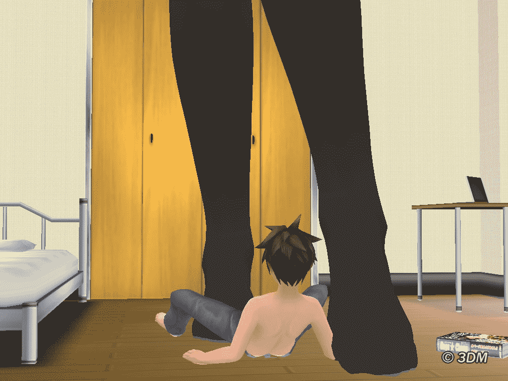
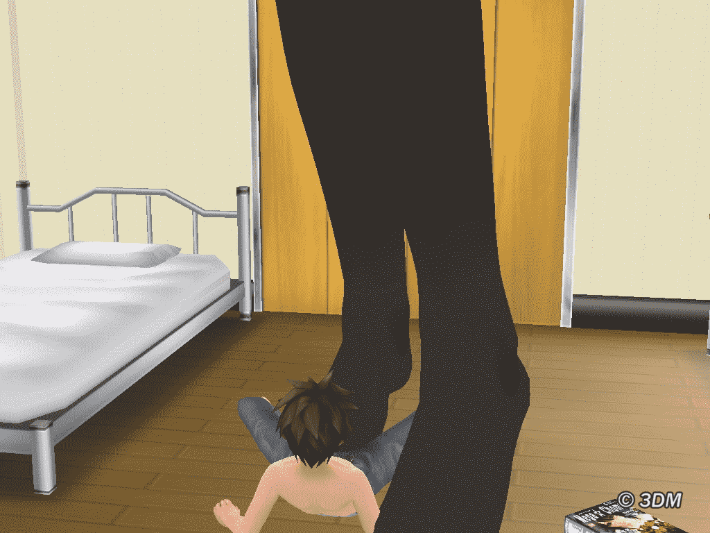
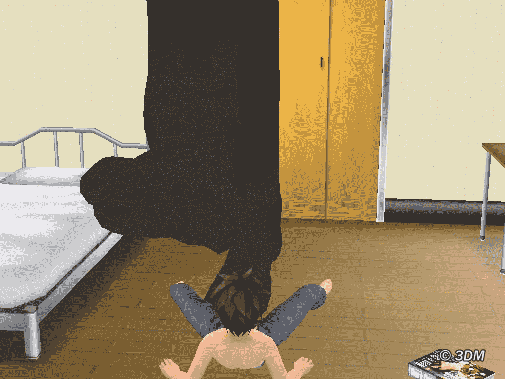
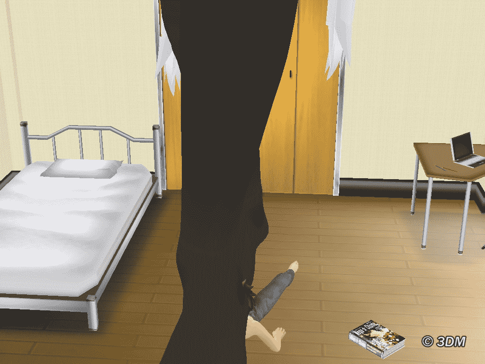
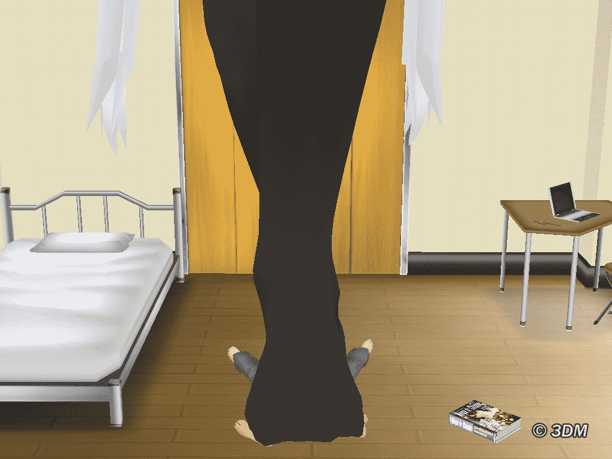
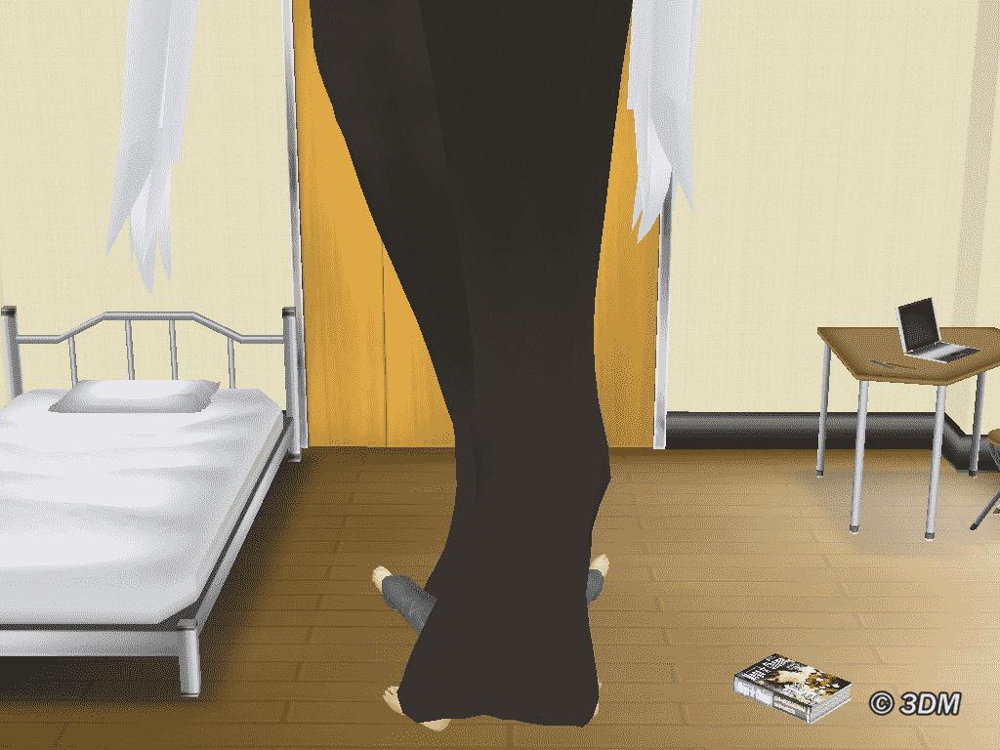
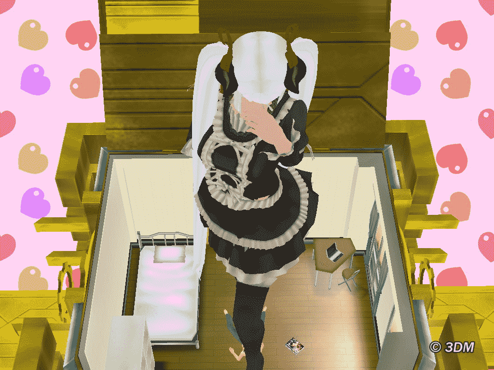
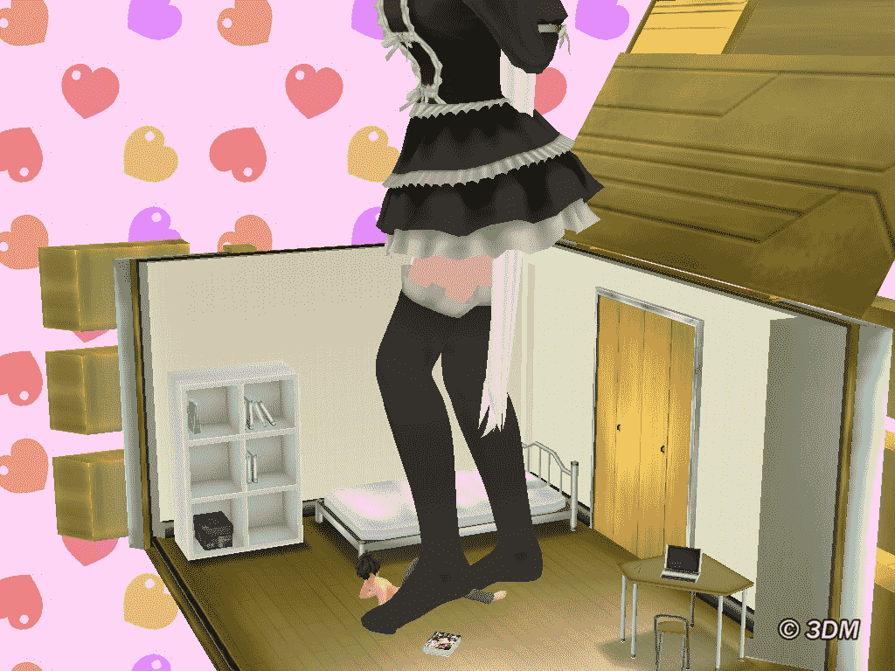

# 自製箱娘圖

作者：小劍

TID：6459

 

# 1

今天努力試了試，終於成功將箱娘GTS化了，原來以前我搞錯PP文件了。。。。。而且箱娘修改好麻烦，不止要从百多个XX文件里找正确的文件就很麻烦，更何况找对了也有十几二十个文件要改，比数码勇者难太多了，简直和记试验数据一样

總的結論是，箱娘單就H遊戲而言比勇者戰魔王有快感，但是自由度不夠，這也是因為我沒有下到箱娘特典的原因吧。。。。。。

那麼，放上成品圖，博人一笑繼續中。。。。

最後，誰能傳個箱娘特典給我？好像現在都下不到呢

[ *本帖最後由 sword0198 於 2010-1-28 13:29 編輯* ] 

# 2

<ignore_js_op>[1.JPG](forum.php?mod=attachment&aid=MTY3Nzd8ZmJmZGE3ZmR8MTYwMzg4MDk4NnwxODIzMHw2NDU5&nothumb=yes) *(132.59 KB, 下載次數: 6)*

[下載附件](forum.php?mod=attachment&aid=MTY3Nzd8ZmJmZGE3ZmR8MTYwMzg4MDk4NnwxODIzMHw2NDU5&nothumb=yes)

2010-1-28 13:24 上傳  

</ignore_js_op> <ignore_js_op>[2.JPG](forum.php?mod=attachment&aid=MTY3Nzh8NTM2M2E4ZWV8MTYwMzg4MDk4NnwxODIzMHw2NDU5&nothumb=yes) *(128.74 KB, 下載次數: 5)*

[下載附件](forum.php?mod=attachment&aid=MTY3Nzh8NTM2M2E4ZWV8MTYwMzg4MDk4NnwxODIzMHw2NDU5&nothumb=yes)

2010-1-28 13:24 上傳  

</ignore_js_op> <ignore_js_op>[3.JPG](forum.php?mod=attachment&aid=MTY3Nzl8NTZlMWI4OGZ8MTYwMzg4MDk4NnwxODIzMHw2NDU5&nothumb=yes) *(124.24 KB, 下載次數: 4)*

[下載附件](forum.php?mod=attachment&aid=MTY3Nzl8NTZlMWI4OGZ8MTYwMzg4MDk4NnwxODIzMHw2NDU5&nothumb=yes)

2010-1-28 13:24 上傳  

</ignore_js_op> <ignore_js_op>[4.JPG](forum.php?mod=attachment&aid=MTY3ODB8ZGQxN2NmNDV8MTYwMzg4MDk4NnwxODIzMHw2NDU5&nothumb=yes) *(124.06 KB, 下載次數: 3)*

[下載附件](forum.php?mod=attachment&aid=MTY3ODB8ZGQxN2NmNDV8MTYwMzg4MDk4NnwxODIzMHw2NDU5&nothumb=yes)

2010-1-28 13:24 上傳  

</ignore_js_op> <ignore_js_op>[5.JPG](forum.php?mod=attachment&aid=MTY3ODF8NDdiYjNjMGF8MTYwMzg4MDk4NnwxODIzMHw2NDU5&nothumb=yes) *(124.75 KB, 下載次數: 4)*

[下載附件](forum.php?mod=attachment&aid=MTY3ODF8NDdiYjNjMGF8MTYwMzg4MDk4NnwxODIzMHw2NDU5&nothumb=yes)

2010-1-28 13:24 上傳  

</ignore_js_op> <ignore_js_op>[6.JPG](forum.php?mod=attachment&aid=MTY3ODJ8NThlMTFkNGN8MTYwMzg4MDk4NnwxODIzMHw2NDU5&nothumb=yes) *(122.87 KB, 下載次數: 5)*

[下載附件](forum.php?mod=attachment&aid=MTY3ODJ8NThlMTFkNGN8MTYwMzg4MDk4NnwxODIzMHw2NDU5&nothumb=yes)

2010-1-28 13:24 上傳  

</ignore_js_op> <ignore_js_op>[7.JPG](forum.php?mod=attachment&aid=MTY3ODN8MzM1MzIxNzF8MTYwMzg4MDk4NnwxODIzMHw2NDU5&nothumb=yes) *(169.93 KB, 下載次數: 3)*

[下載附件](forum.php?mod=attachment&aid=MTY3ODN8MzM1MzIxNzF8MTYwMzg4MDk4NnwxODIzMHw2NDU5&nothumb=yes)

2010-1-28 13:24 上傳  

</ignore_js_op> <ignore_js_op>[8.JPG](forum.php?mod=attachment&aid=MTY3ODR8NDhjN2Y5YmF8MTYwMzg4MDk4NnwxODIzMHw2NDU5&nothumb=yes) *(157.14 KB, 下載次數: 3)*

[下載附件](forum.php?mod=attachment&aid=MTY3ODR8NDhjN2Y5YmF8MTYwMzg4MDk4NnwxODIzMHw2NDU5&nothumb=yes)

2010-1-28 13:24 上傳  

</ignore_js_op> <ignore_js_op>[9.JPG](forum.php?mod=attachment&aid=MTY3ODV8MjNjYzhiYjZ8MTYwMzg4MDk4NnwxODIzMHw2NDU5&nothumb=yes) *(154.34 KB, 下載次數: 3)*

[下載附件](forum.php?mod=attachment&aid=MTY3ODV8MjNjYzhiYjZ8MTYwMzg4MDk4NnwxODIzMHw2NDU5&nothumb=yes)

2010-1-28 13:24 上傳  

</ignore_js_op>  

# 3

> 原帖由 *wjd1985* 於 2010-1-28 18:54 發表 

>   其實某是3DM AB組的一員，雖然不負責發佈。

> 在這裡傳一下小道消息：3DM漢化組雖然解散了，但是遊戲漢化不會停止，因為以3DM漢化組太過於招搖，反而變成各個小的依附於3DM的漢化組，比如某所在的“Angelical Beauty”

失敬失敬，原来我觉得兄是3DM的黑手之一啊！长期以来承蒙照顾了

特典已经尝试，似乎不能多角色同场出现，GTS梦幻灭

还是去摆弄勇者们吧！ 

# 4

雙修真談不上，我家祖傳的沒有藝術細菌。。。。只是抛磚引玉，推廣好的工具而已