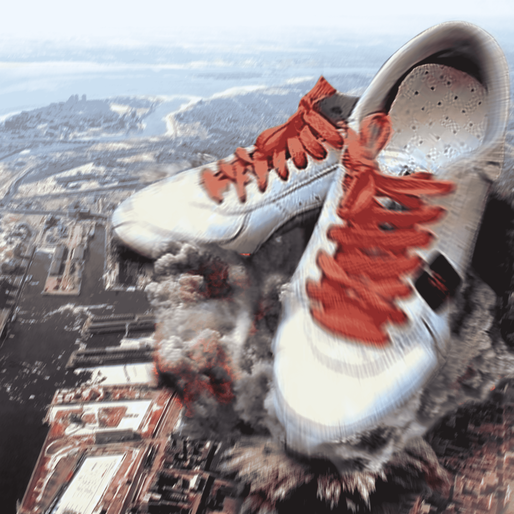

# 至尊女神静儿

作者：秋水残月

TID：18063

<title>1</title> <link href="../Styles/Style.css" type="text/css" rel="stylesheet">

# 1

*本帖最後由 秋水残月 於 2014-11-9 17:54 編輯*

伟大的至尊女神静静静静静静 不定期更新哟<title>2</title> <link href="../Styles/Style.css" type="text/css" rel="stylesheet">

# 2

 <ignore_js_op>[静儿005-2.jpg](forum.php?mod=attachment&aid=NDgyNTd8MTg2YTkzNmJ8MTYwMzg1NjYxMnwxODIzMHwxODA2Mw%3D%3D&nothumb=yes) *(2.19 MB, 下載次數: 98)*

[下載附件](forum.php?mod=attachment&aid=NDgyNTd8MTg2YTkzNmJ8MTYwMzg1NjYxMnwxODIzMHwxODA2Mw%3D%3D&nothumb=yes)

2014-11-7 21:31 上傳  

</ignore_js_op> <ignore_js_op>[静儿001-1.jpg](forum.php?mod=attachment&aid=NDgyNTh8NDcwMjQ1Nzd8MTYwMzg1NjYxMnwxODIzMHwxODA2Mw%3D%3D&nothumb=yes) *(964.32 KB, 下載次數: 32)*

[下載附件](forum.php?mod=attachment&aid=NDgyNTh8NDcwMjQ1Nzd8MTYwMzg1NjYxMnwxODIzMHwxODA2Mw%3D%3D&nothumb=yes)

2014-11-7 21:31 上傳  

</ignore_js_op> <ignore_js_op>[静儿001-3.jpg](forum.php?mod=attachment&aid=NDgyNTl8MTFlODY2YmF8MTYwMzg1NjYxMnwxODIzMHwxODA2Mw%3D%3D&nothumb=yes) *(1.12 MB, 下載次數: 18)*

[下載附件](forum.php?mod=attachment&aid=NDgyNTl8MTFlODY2YmF8MTYwMzg1NjYxMnwxODIzMHwxODA2Mw%3D%3D&nothumb=yes)

2014-11-7 21:31 上傳  

</ignore_js_op> <ignore_js_op>[静儿002.jpg](forum.php?mod=attachment&aid=NDgyNjB8OTM5ZTA5MWR8MTYwMzg1NjYxMnwxODIzMHwxODA2Mw%3D%3D&nothumb=yes) *(187.74 KB, 下載次數: 28)*

[下載附件](forum.php?mod=attachment&aid=NDgyNjB8OTM5ZTA5MWR8MTYwMzg1NjYxMnwxODIzMHwxODA2Mw%3D%3D&nothumb=yes)

2014-11-7 21:31 上傳  

</ignore_js_op> <ignore_js_op>[静儿003-1.jpg](forum.php?mod=attachment&aid=NDgyNjF8OWJlMDM5ZGJ8MTYwMzg1NjYxMnwxODIzMHwxODA2Mw%3D%3D&nothumb=yes) *(542.94 KB, 下載次數: 13)*

[下載附件](forum.php?mod=attachment&aid=NDgyNjF8OWJlMDM5ZGJ8MTYwMzg1NjYxMnwxODIzMHwxODA2Mw%3D%3D&nothumb=yes)

2014-11-7 21:31 上傳  

</ignore_js_op> <ignore_js_op>[静儿003-2 .jpg](forum.php?mod=attachment&aid=NDgyNjJ8ZmY4OTEzYjZ8MTYwMzg1NjYxMnwxODIzMHwxODA2Mw%3D%3D&nothumb=yes) *(1.61 MB, 下載次數: 9)*

[下載附件](forum.php?mod=attachment&aid=NDgyNjJ8ZmY4OTEzYjZ8MTYwMzg1NjYxMnwxODIzMHwxODA2Mw%3D%3D&nothumb=yes)

2014-11-7 21:31 上傳  

</ignore_js_op> <ignore_js_op>[静儿003-3.jpg](forum.php?mod=attachment&aid=NDgyNjN8M2FkMTgwZjR8MTYwMzg1NjYxMnwxODIzMHwxODA2Mw%3D%3D&nothumb=yes) *(1.6 MB, 下載次數: 4)*

[下載附件](forum.php?mod=attachment&aid=NDgyNjN8M2FkMTgwZjR8MTYwMzg1NjYxMnwxODIzMHwxODA2Mw%3D%3D&nothumb=yes)

2014-11-7 21:31 上傳  

</ignore_js_op> <ignore_js_op>[静儿004.jpg](forum.php?mod=attachment&aid=NDgyNjR8YzNlNDJiMzd8MTYwMzg1NjYxMnwxODIzMHwxODA2Mw%3D%3D&nothumb=yes) *(4.09 MB, 下載次數: 19)*

[下載附件](forum.php?mod=attachment&aid=NDgyNjR8YzNlNDJiMzd8MTYwMzg1NjYxMnwxODIzMHwxODA2Mw%3D%3D&nothumb=yes)

2014-11-7 21:32 上傳  

</ignore_js_op> <title>3</title> <link href="../Styles/Style.css" type="text/css" rel="stylesheet">

# 3

> [东皇太一 發表於 2014-11-7 21:56](https://giantessnight.com/gnforum2012/forum.php?mod=redirect&goto=findpost&pid=238240&ptid=18063)
> 最近这一股崇拜风是怎么飘起来的

嘻嘻 就是崇拜静儿 为了女神 膜拜吧 帅哥
<title>4</title> <link href="../Styles/Style.css" type="text/css" rel="stylesheet">

# 4

> [xnr 發表於 2014-11-7 22:16](https://giantessnight.com/gnforum2012/forum.php?mod=redirect&goto=findpost&pid=238243&ptid=18063)
> 我关心的是，直接把本人照片贴出来有经过许可吗？

这个无需担心 已经经过静儿的许可拉<title>5</title> <link href="../Styles/Style.css" type="text/css" rel="stylesheet">

# 5

> [awkeygen 發表於 2014-11-7 22:18](https://giantessnight.com/gnforum2012/forum.php?mod=redirect&goto=findpost&pid=238244&ptid=18063)
> 这不是静儿群空间的么？不知道制作者是谁，静儿自己么？

无名的大p神 因为他本人不想露面 所以就不透露拉<title>6</title> <link href="../Styles/Style.css" type="text/css" rel="stylesheet">

# 6

> [静儿_ 發表於 2014-11-7 22:20](https://giantessnight.com/gnforum2012/forum.php?mod=redirect&goto=findpost&pid=238246&ptid=18063)
> 经过授权的，你们可以放心，嗯。

女神大人亲自降临了啊 膜拜一下下<title>7</title> <link href="../Styles/Style.css" type="text/css" rel="stylesheet">

# 7

> [中文之許. 發表於 2014-11-7 22:43](https://giantessnight.com/gnforum2012/forum.php?mod=redirect&goto=findpost&pid=238252&ptid=18063)
> 看來最近又吹起一股女神風了啊~
> 
> giantess nights論壇果然是量產女神最多的地方XD ...

是这样子吗。。。还真是不知道呢 涨知识了
<title>8</title> <link href="../Styles/Style.css" type="text/css" rel="stylesheet">

# 8

> [秋兴八首 發表於 2014-11-8 14:31](https://giantessnight.com/gnforum2012/forum.php?mod=redirect&goto=findpost&pid=238293&ptid=18063)
> 楼主真有头脑，这都能想到
> 见到女神大人就想跪的路过

想到了什么。。。为什么我木理解的说。。。<title>9</title> <link href="../Styles/Style.css" type="text/css" rel="stylesheet">

# 9

> [gtshaha 發表於 2014-11-8 21:53](https://giantessnight.com/gnforum2012/forum.php?mod=redirect&goto=findpost&pid=238333&ptid=18063)
> 真没想到是真人出镜呢，拜楼主所赐，我也有幸一睹妹子芳容呢～

嘻嘻，喜欢就好，喜欢的人多女神也会高兴的哟<title>10</title> <link href="../Styles/Style.css" type="text/css" rel="stylesheet">

# 10

伟大的至尊女神静儿给大家撒福利了 感受至高无上的力量吧<title>11</title> <link href="../Styles/Style.css" type="text/css" rel="stylesheet">

# 11

 <ignore_js_op>[静儿完美玉足.JPG](forum.php?mod=attachment&aid=NDgzNTV8ZWQ2ZjhhM2N8MTYwMzg1NjYxMnwxODIzMHwxODA2Mw%3D%3D&nothumb=yes) *(468.77 KB, 下載次數: 9)*

[下載附件](forum.php?mod=attachment&aid=NDgzNTV8ZWQ2ZjhhM2N8MTYwMzg1NjYxMnwxODIzMHwxODA2Mw%3D%3D&nothumb=yes)

2014-11-9 17:29 上傳  

</ignore_js_op> <title>12</title> <link href="../Styles/Style.css" type="text/css" rel="stylesheet">

# 12

> [c1043283464 發表於 2014-11-9 22:21](https://giantessnight.com/gnforum2012/forum.php?mod=redirect&goto=findpost&pid=238418&ptid=18063)
> 跟媛媛一样的想法吗？~

大概吧 不过 主人会很"温柔"的哟 具体嘛 还是问主人比较靠谱<title>13</title> <link href="../Styles/Style.css" type="text/css" rel="stylesheet">

# 13

> [gtshaha 發表於 2014-11-8 21:53](https://giantessnight.com/gnforum2012/forum.php?mod=redirect&goto=findpost&pid=238333&ptid=18063)
> 真没想到是真人出镜呢，拜楼主所赐，我也有幸一睹妹子芳容呢～

阿拉阿拉 不要这样夸我嘛 都是主人的英明才得以一睹为快的啦<title>14</title> <link href="../Styles/Style.css" type="text/css" rel="stylesheet">

# 14

我来了 这次的表情恩 很给力的<title>15</title> <link href="../Styles/Style.css" type="text/css" rel="stylesheet">

# 15

这次是脸庞哟 表情无视掉吧<title>16</title> <link href="../Styles/Style.css" type="text/css" rel="stylesheet">

# 16

 <ignore_js_op>[静儿与日.jpg](forum.php?mod=attachment&aid=NDgzNjF8NGQxMTg5MDJ8MTYwMzg1NjY3N3wxODIzMHwxODA2Mw%3D%3D&nothumb=yes) *(96.33 KB, 下載次數: 4)*

[下載附件](forum.php?mod=attachment&aid=NDgzNjF8NGQxMTg5MDJ8MTYwMzg1NjY3N3wxODIzMHwxODA2Mw%3D%3D&nothumb=yes)

2014-11-10 15:53 上傳  

</ignore_js_op> <title>17</title> <link href="../Styles/Style.css" type="text/css" rel="stylesheet">

# 17

> [秋水残月 發表於 2014-11-10 15:53](https://giantessnight.com/gnforum2012/forum.php?mod=redirect&goto=findpost&pid=238460&ptid=18063)
> 我来了 这次的表情恩 很给力的

楼主很高兴 各位大大喜欢就好 嘻嘻嘻
<title>18</title> <link href="../Styles/Style.css" type="text/css" rel="stylesheet">

# 18

双十一没人陪楼主 楼主来给各位大大更新好了。。。<title>19</title> <link href="../Styles/Style.css" type="text/css" rel="stylesheet">

# 19

 <ignore_js_op>[静儿004-1.jpg](forum.php?mod=attachment&aid=NDg0MDB8YTNhNzc0MmF8MTYwMzg1NjY3N3wxODIzMHwxODA2Mw%3D%3D&nothumb=yes) *(1.56 MB, 下載次數: 57)*

[下載附件](forum.php?mod=attachment&aid=NDg0MDB8YTNhNzc0MmF8MTYwMzg1NjY3N3wxODIzMHwxODA2Mw%3D%3D&nothumb=yes)

2014-11-11 15:28 上傳  

</ignore_js_op> <title>20</title> <link href="../Styles/Style.css" type="text/css" rel="stylesheet">

# 20

> [htk 發表於 2014-11-11 16:58](https://giantessnight.com/gnforum2012/forum.php?mod=redirect&goto=findpost&pid=238518&ptid=18063)
> mega 級 :) 支持樓主!!

阿拉阿拉，有人回复就有动力，不过，想要更新还要看我们的p神和女神大人的心情啊，也不是楼主一个人说了算的哟[@静儿_](https://giantessnight.com/gnforum2012/home.php?mod=space&uid=12955)