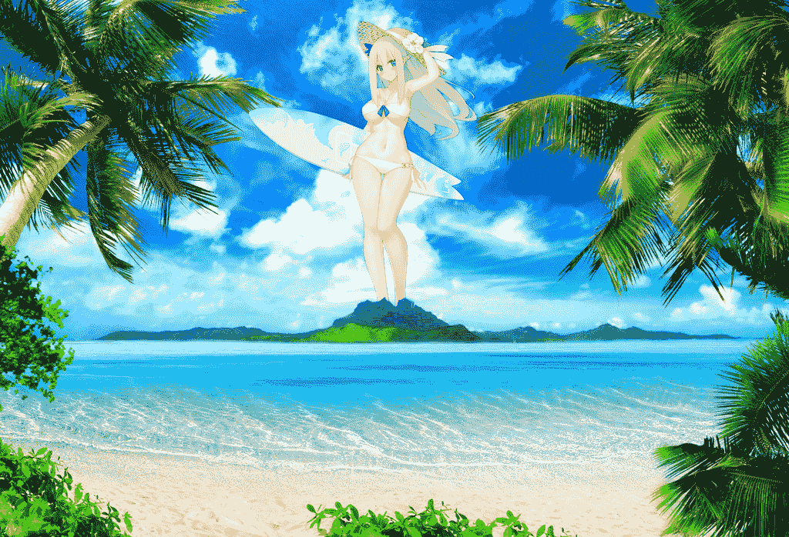
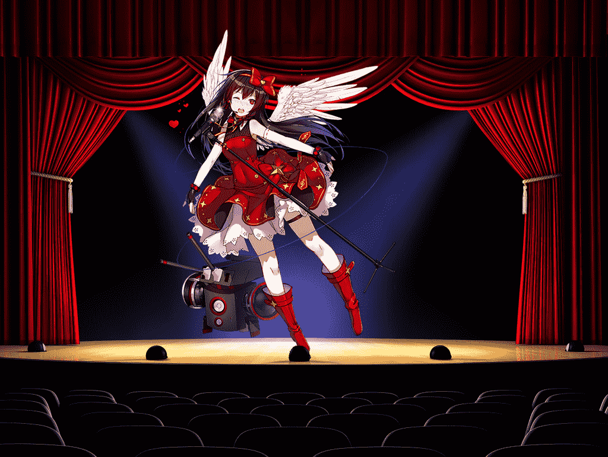

# 舰R-可能会持续更新？（已更新青叶——红白偶像战mini系）

作者：猫头咕咕鹰

TID：21340

<title>1</title> <link href="../Styles/Style.css" type="text/css" rel="stylesheet">

# 1

*本帖最後由 max 於 2016-7-6 23:28 編輯*

        呃……之前在文章区的翻译帖里提到过关于战舰少女巨大化的事情，然后一激动就P出了这个……附上我的翻译的连接（[http://giantessnight.com/gnforum ... iewthread&tid=21324](http://giantessnight.com/gnforum2012/forum.php?mod=viewthread&tid=21324)）

       超巨大的泳装列克太太的想法我觉得还是不错的啦，而且不论是水乌（污）龟老师的立绘还是作为背景的风景图都相当赞啊，只是希望我没有毁掉这上好的素材啊……
       希望能有有爱的大神能试着用舰R的妹子们做主角来进行创作呢，舰R虽然有黑历史时期，但她也不是一成不变的在抄袭舰C，目前制作团队正在努力解决历史问题，同时也在寻求创。另外希望舰C的玩家们不要把她当成是一个普通的用来赚快钱的抄袭之作，她的制作团队对她还是很上心的，只是请给他们一点时间，好吗？拜托了。orz
       另外也请别给我扣什么帽子，我头上的帽子已经够多了，比如写着萌卫兵的，写着虫群的等等，配套的袖章我也有，如果有新款的话，拿过来我自己会戴。       说得好像太多了，希望不要引战就好，实在看不惯的话直接右上角，或者联系版主让他帮着删一下帖就行，请务必不要争吵。
       总之这图就先凑合着看吧……
<ignore_js_op>

**29列克星敦_Strap_bikini_副本.png** *(1.64 MB, 下載次數: 29)*

[下載附件](forum.php?mod=attachment&aid=NjIwODl8OGFlMGVmOTF8MTYwMzg2MTM3M3wxODIzMHwyMTM0MA%3D%3D&nothumb=yes)

2016-7-6 00:08 上傳

<ignore_js_op>

**L_NORMAL_133_1_副本.png** *(830.79 KB, 下載次數: 5)*

[下載附件](forum.php?mod=attachment&aid=NjIxMDV8YmU1YTNjZDJ8MTYwMzg2MTM3M3wxODIzMHwyMTM0MA%3D%3D&nothumb=yes)

2016-7-6 23:27 上傳

<title>2</title> <link href="../Styles/Style.css" type="text/css" rel="stylesheet">

# 2

> tiancai9200789 發表於 2016-7-6 09:49
> 就是因为黑历史！我的在渠道的欧洲号没了！

嗯？看来这里隐藏的舰R指挥官意外的多啊？<title>3</title> <link href="../Styles/Style.css" type="text/css" rel="stylesheet">

# 3

> [haobinghehe 發表於 2016-7-6 14:53](https://giantessnight.com/gnforum2012/forum.php?mod=redirect&goto=findpost&pid=298940&ptid=21340)
> 我是非常讨厌这次出的一堆泳装的。这种肉我不吃。

讨厌泳装的话请和hm联系吧，这个泳装又不是我出的，我只是个兴趣使然的爱好者而已，你跟我说也没用啊。
<title>4</title> <link href="../Styles/Style.css" type="text/css" rel="stylesheet">

# 4

> [WQ23 發表於 2016-7-6 19:26](https://giantessnight.com/gnforum2012/forum.php?mod=redirect&goto=findpost&pid=298961&ptid=21340)
> GJ！不过这好像太大了点个人来说，还是更喜欢和舰船长度1：1的舰娘 ...

其实一开始我有想着控制比例的，但是没办法，毕竟是后期合成的，大小比例不是很好控制，所以干脆就直接让列克太太超巨大化好了。<title>5</title> <link href="../Styles/Style.css" type="text/css" rel="stylesheet">

# 5

更新了个青叶的mini级GTS“红白偶像战”……效果……唉算了，当抛砖引玉了。<title>6</title> <link href="../Styles/Style.css" type="text/css" rel="stylesheet">

# 6

> [neroskl 發表於 2016-7-7 01:20](https://giantessnight.com/gnforum2012/forum.php?mod=redirect&goto=findpost&pid=299013&ptid=21340)
> 我跟铃兰老相识了，可惜那阵子撕逼我实在看不下去就退坑了。从开服那天zero服玩到舰R出来，把号送 ...

呃…我是该说是没想到虫群数量那么多呢…还是该说没想到GTS控那么多呢…</ignore_js_op></ignore_js_op>