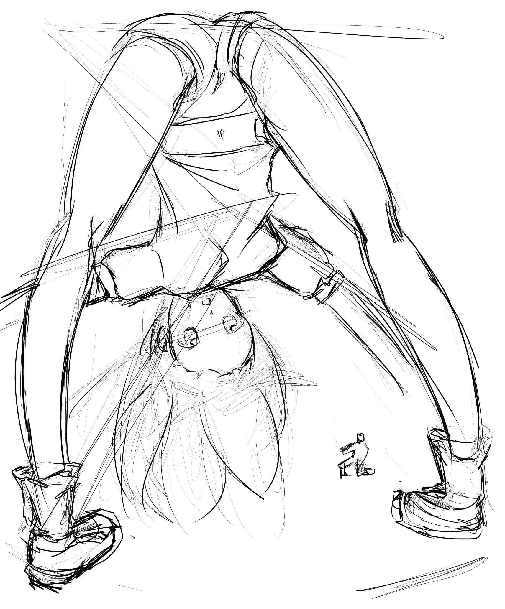
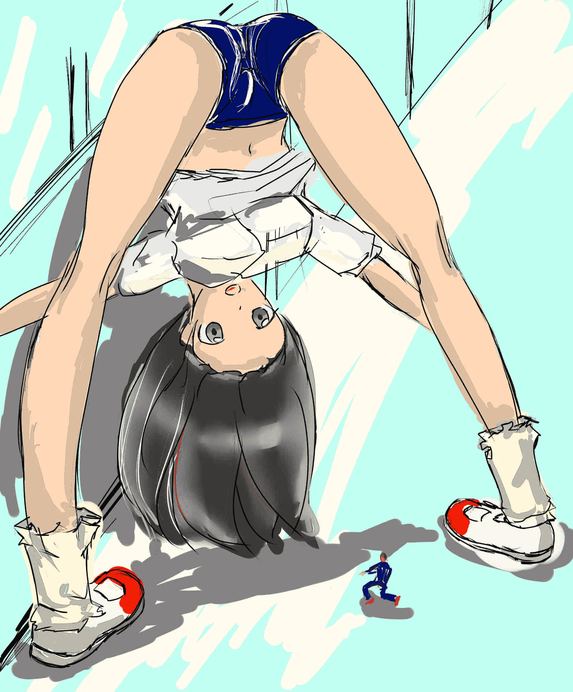

# 草稿，问一下透视会错吗？

作者：maker13

TID：19234

<title>1</title> <link href="../Styles/Style.css" type="text/css" rel="stylesheet">

# 1

第一次画这种角度，求一些透视比较好的图，稿子是我自己的
<title>2</title> <link href="../Styles/Style.css" type="text/css" rel="stylesheet">

# 2

 <ignore_js_op>[新建图像.jpg](forum.php?mod=attachment&aid=NTI1NDh8OTU5NzNhNzB8MTYwMzg2NDIzMXwxODIzMHwxOTIzNA%3D%3D&nothumb=yes) *(503.53 KB, 下載次數: 26)*

[下載附件](forum.php?mod=attachment&aid=NTI1NDh8OTU5NzNhNzB8MTYwMzg2NDIzMXwxODIzMHwxOTIzNA%3D%3D&nothumb=yes)

2015-6-19 23:46 上傳  

</ignore_js_op> <title>3</title> <link href="../Styles/Style.css" type="text/css" rel="stylesheet">

# 3

第一次画，别笑我QAQ，而且我是上色白痴QAQ<title>4</title> <link href="../Styles/Style.css" type="text/css" rel="stylesheet">

# 4

> [xxdo123 發表於 2015-6-20 00:07](https://giantessnight.com/gnforum2012/forum.php?mod=redirect&goto=findpost&pid=258551&ptid=19234)
> 怎么说呢....
> 这个角度太棒了！！(ง •̀_•́)ง
> 完美戳中了我的萌点！

谢谢支持，我会尽快画出成品
<title>5</title> <link href="../Styles/Style.css" type="text/css" rel="stylesheet">

# 5

> [tjjsir 發表於 2015-6-20 06:30](https://giantessnight.com/gnforum2012/forum.php?mod=redirect&goto=findpost&pid=258571&ptid=19234)
> lz告诉你最简单看这种有没画错的方法
> 去镜子前摆同样姿势 然后对比下

身体韧性不好。。真的很不好。。
<title>6</title> <link href="../Styles/Style.css" type="text/css" rel="stylesheet">

# 6

> [z19950625 發表於 2015-6-20 02:13](https://giantessnight.com/gnforum2012/forum.php?mod=redirect&goto=findpost&pid=258567&ptid=19234)
> 骨骼基本是骨折了，不要太在意透视。要把握骨骼特点肌肉走向。然后在关注透视空间等问题 ...

恩，谢谢提醒，我会尽快改好的
<title>7</title> <link href="../Styles/Style.css" type="text/css" rel="stylesheet">

# 7

> [Euphoria 發表於 2015-6-20 00:21](https://giantessnight.com/gnforum2012/forum.php?mod=redirect&goto=findpost&pid=258556&ptid=19234)
> 作为草稿这已经极棒了。比例拿捏得也很合适，小人的位置往中间挪一挪吧。瞧瞧这个能给你灵感吗？
> ...

谢谢！！非常有feel！！感激不尽！！
<title>8</title> <link href="../Styles/Style.css" type="text/css" rel="stylesheet">

# 8

> [abc148865 發表於 2015-6-20 17:20](https://giantessnight.com/gnforum2012/forum.php?mod=redirect&goto=findpost&pid=258643&ptid=19234)
> 虽然身体有些不协调，但画的真心很萌很好啊，希望楼主继续努力

谢谢~~，我会加油的~~
<title>9</title> <link href="../Styles/Style.css" type="text/css" rel="stylesheet">

# 9

修改了一下下加上很渣的上色。。。下次我会画的跟好些的。。前提是我学会上色。。。
<title>10</title> <link href="../Styles/Style.css" type="text/css" rel="stylesheet">

# 10

 <ignore_js_op>[新建图像.jpg](forum.php?mod=attachment&aid=NTI1NzV8YWI3MWU4YTl8MTYwMzg2NDIzMXwxODIzMHwxOTIzNA%3D%3D&nothumb=yes) *(291.17 KB, 下載次數: 0)*

[下載附件](forum.php?mod=attachment&aid=NTI1NzV8YWI3MWU4YTl8MTYwMzg2NDIzMXwxODIzMHwxOTIzNA%3D%3D&nothumb=yes)

2015-6-21 00:59 上傳  

</ignore_js_op> <title>11</title> <link href="../Styles/Style.css" type="text/css" rel="stylesheet">

# 11

> [源青之绅 發表於 2015-6-21 02:19](https://giantessnight.com/gnforum2012/forum.php?mod=redirect&goto=findpost&pid=258695&ptid=19234)
> 透视没看出来……不知道你要透什么，不过骨骼肌肉是有点错o(￣ε￣*)

嘛~慢慢来吧，本来我就没学过画漫画，画这种角度的结构透视也是第一次。。也是第一次在电脑上画画。。