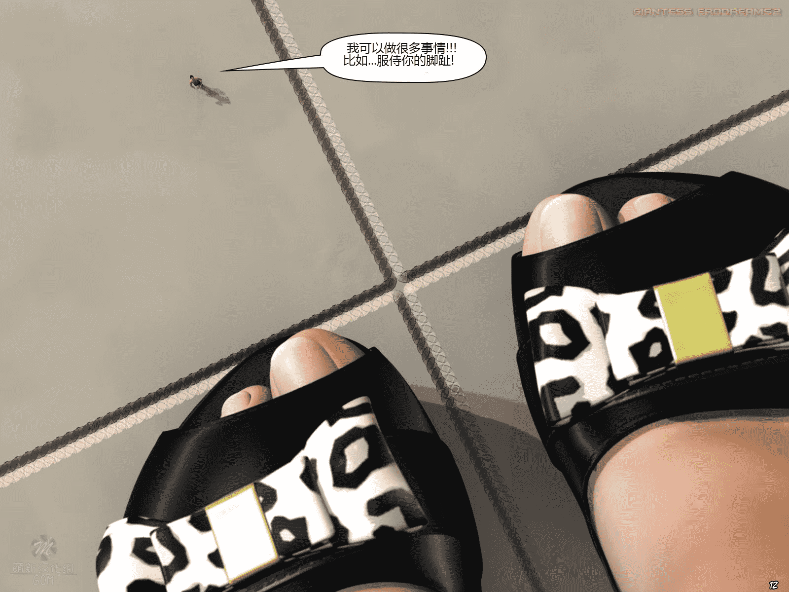

# 萌新汉化组 缩小后的世界（办公版）汉化分享

作者：wyh9284908

TID：21446

 

# 1

*本帖最後由 wyh9284908 於 2016-7-28 00:17 編輯*

大家好，我是萌新汉化组的成员，这是我们最新汉化的漫画“缩小后的世界”

这次漫画汉化的成员有：9284908 小灰狠 Key LXL旺

<ignore_js_op>

**12.jpg** *(402.05 KB, 下載次數: 0)*

[下載附件](forum.php?mod=attachment&aid=NjI1MDh8NzY4MjdiMTN8MTYwMzg1NDM2MHwxODIzMHwyMTQ0Ng%3D%3D&nothumb=yes)

2016-7-28 00:13 上傳

<ignore_js_op>

**23.jpg** *(356.35 KB, 下載次數: 0)*

[下載附件](forum.php?mod=attachment&aid=NjI1MDl8NWEzZWY1YjN8MTYwMzg1NDM2MHwxODIzMHwyMTQ0Ng%3D%3D&nothumb=yes)

2016-7-28 00:13 上傳

<ignore_js_op>

**48.jpg** *(447.24 KB, 下載次數: 0)*

[下載附件](forum.php?mod=attachment&aid=NjI1MTB8MjQ3ODViZjh8MTYwMzg1NDM2MHwxODIzMHwyMTQ0Ng%3D%3D&nothumb=yes)

2016-7-28 00:14 上傳

<ignore_js_op>

**70.jpg** *(422.03 KB, 下載次數: 0)*

[下載附件](forum.php?mod=attachment&aid=NjI1MTF8ODJlNjk2ZGR8MTYwMzg1NDM2MHwxODIzMHwyMTQ0Ng%3D%3D&nothumb=yes)

2016-7-28 00:14 上傳

最后，我们招收一波汉化组的成员。我们需要擅长英语或日语，精通Photoshop操作的人员加入。

如果你有意向，可以加入“580402820”QQ群，经过考核，就可以一起汉化漫画了！

汉化组成员可以免费得到所有最新漫画资源，可以申请汉化自己喜欢的漫画。

甚至有机会与gts界的大触tiny mk，寺田落子，uru接触合作的机会。

<ignore_js_op>

**81.jpg** *(227.6 KB, 下載次數: 0)*

[下載附件](forum.php?mod=attachment&aid=NjI1MTJ8ZGM0ZWVjYWJ8MTYwMzg1NDM2MHwxODIzMHwyMTQ0Ng%3D%3D&nothumb=yes)

2016-7-28 00:14 上傳

如果感兴趣，就来和我们一起汉化漫画吧！

我们所有汉化的漫画，都会免费分享给所有gts界的广大朋友们！

 

# 2

<ignore_js_op>

[缩小后的世界（办公版）.zip](forum.php?mod=attachment&aid=NjI1MDd8NDAxZWU1M2R8MTYwMzg1NDM2MHwxODIzMHwyMTQ0Ng%3D%3D)

2016-7-28 00:13 上傳

點擊文件名下載附件

33.35 MB, 下載次數: 65439

漫画压缩文件</ignore_js_op>  

# 3

谢谢大家的支持与鼓励。

你们的支持就是我们汉化下去的最大动力！ 

# 4

> [jack369605 發表於 2016-8-2 11:51](https://giantessnight.com/gnforum2012/forum.php?mod=redirect&goto=findpost&pid=301990&ptid=21446)

> 话说这个汉化组认识的人好多。。。

你好Jack，我是贴吧的9284908。我们汉化组的大部分成员都是以前的贴吧用户，所以很多人都是你见过的。</ignore_js_op></ignore_js_op></ignore_js_op></ignore_js_op></ignore_js_op>