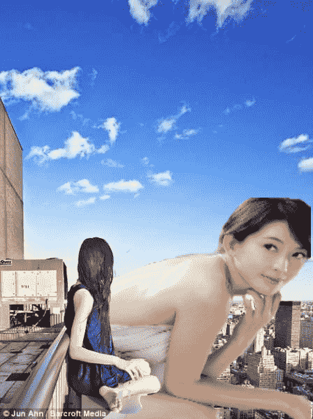

# 萌新第一次尝试PS

作者：黑鸦

TID：22756

<title>1</title> <link href="../Styles/Style.css" type="text/css" rel="stylesheet">

# 1

<ignore_js_op>

**ONE.jpg** *(43.24 KB, 下載次數: 0)*

[下載附件](forum.php?mod=attachment&aid=NjcxOTd8YWIzODZlMWJ8MTYwMzg1NzgzN3wxODIzMHwyMjc1Ng%3D%3D&nothumb=yes)

2017-3-14 08:55 上傳

嗯，起初是打算用那种踩城市的图 想了想  还要加入爆炸和烟雾效果
o(╯□╰)o，果然还是无法应用到位，而且对我来说还相当麻烦（我没下载ps软件，用的是在线精简版，好像精简的有点过分了，百度上说的功能各种没有）
那么作为第一次试水，只能感觉到这水好浊，不过在浊也比写作和漫画的水清澈。
下次试试复杂点的，虽然喜欢真人的，果然这种成果还不是我想要的。</ignore_js_op>