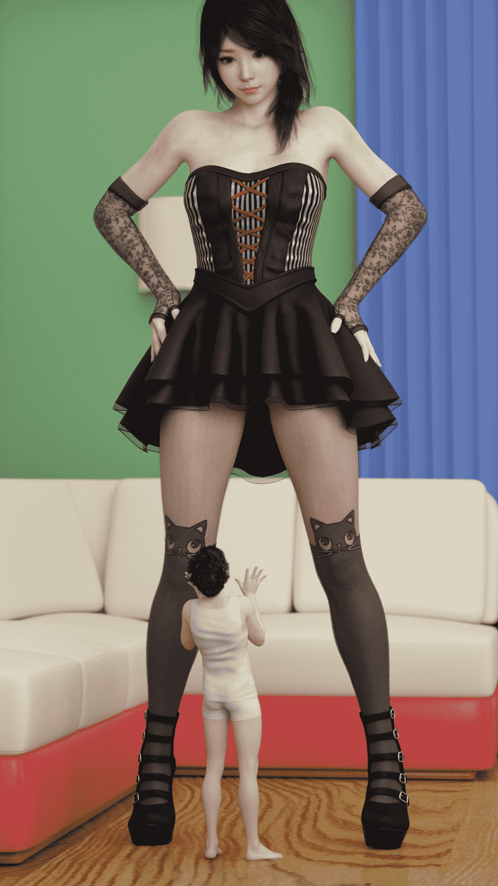
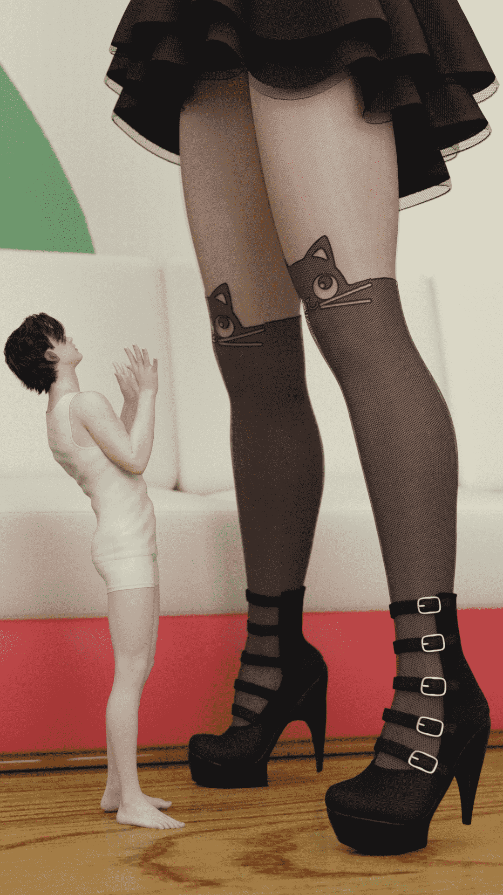
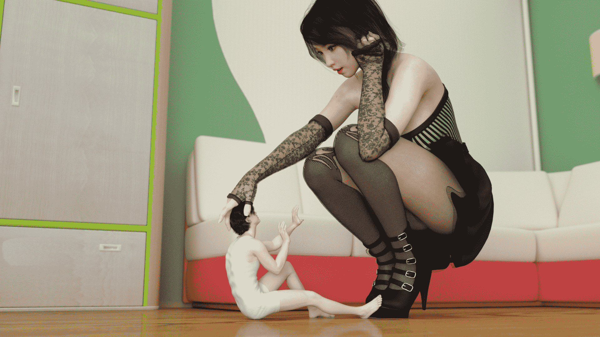
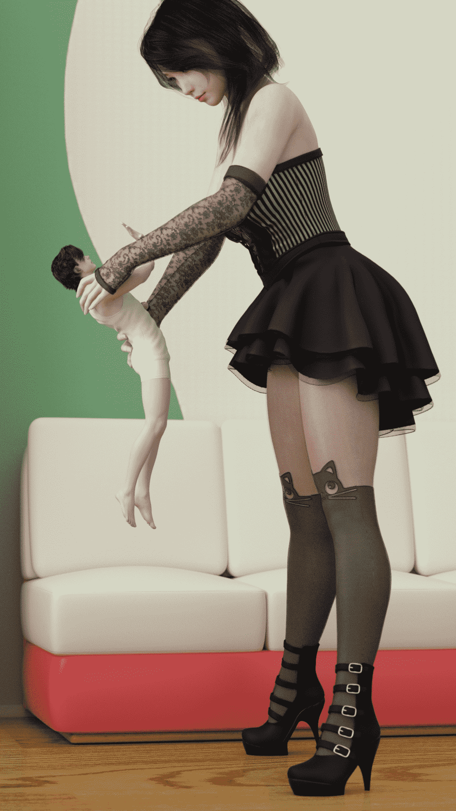

# 萝莉服Mini-Gts

作者：小狐狸桑

TID：24191

<title>1</title> <link href="../Styles/Style.css" type="text/css" rel="stylesheet">

# 1

*本帖最後由 小狐狸桑 於 2017-12-29 10:39 編輯*

狐狸桑来发发福利，希望大家喜欢，daz3d现在真的挺好用的，自带iray渲染，我笔记本i7 7700+ 1060显卡，一张图大概10分钟，就是凹造型太累人，人物模型什么的去论坛或者淘宝上花个30块钱就全都有了，希望有更多的同好来试试daz3d啊
<ignore_js_op>

**IMG_8081.JPG** *(596.65 KB, 下載次數: 49)*

[下載附件](forum.php?mod=attachment&aid=NzAxMzV8OTBmMzVmZTB8MTYwMzgyNzk4NHwxODIzMHwyNDE5MQ%3D%3D&nothumb=yes)

2017-12-29 10:31 上傳

<ignore_js_op>

**IMG_8080.JPG** *(711.28 KB, 下載次數: 47)*

[下載附件](forum.php?mod=attachment&aid=NzAxMzd8ZWE5YWEzNGN8MTYwMzgyNzk4NHwxODIzMHwyNDE5MQ%3D%3D&nothumb=yes)

2017-12-29 10:38 上傳

<ignore_js_op>

**IMG_8082.JPG** *(617.37 KB, 下載次數: 62)*

[下載附件](forum.php?mod=attachment&aid=NzAxMzh8NGRiMGM3NmJ8MTYwMzgyNzk4NHwxODIzMHwyNDE5MQ%3D%3D&nothumb=yes)

2017-12-29 10:38 上傳

<ignore_js_op>

**IMG_8060.JPG** *(1.07 MB, 下載次數: 43)*

[下載附件](forum.php?mod=attachment&aid=NzAxMzl8MDJmMzg0NGZ8MTYwMzgyNzk4NHwxODIzMHwyNDE5MQ%3D%3D&nothumb=yes)

2017-12-29 10:38 上傳

<ignore_js_op>

**IMG_8083.JPG** *(543.28 KB, 下載次數: 38)*

[下載附件](forum.php?mod=attachment&aid=NzAxNDB8OTYyOWIwZTN8MTYwMzgyNzk4NHwxODIzMHwyNDE5MQ%3D%3D&nothumb=yes)

2017-12-29 10:38 上傳

<title>2</title> <link href="../Styles/Style.css" type="text/css" rel="stylesheet">

# 2

为什么图片都只有几十K，压缩的好厉害 我可都是1080p 以上的图呀！<title>3</title> <link href="../Styles/Style.css" type="text/css" rel="stylesheet">

# 3

> [winnerlyh 發表於 2017-12-30 00:27](https://giantessnight.com/gnforum2012/forum.php?mod=redirect&goto=findpost&pid=353262&ptid=24191)
> 我的笔记本i7 960m估计带不起来吧

完全能带起来，渲染多个5分钟，主要吃cpu
<title>4</title> <link href="../Styles/Style.css" type="text/css" rel="stylesheet">

# 4

> [awkeygen 發表於 2018-1-1 12:32](https://giantessnight.com/gnforum2012/forum.php?mod=redirect&goto=findpost&pid=353607&ptid=24191)
> iray渲染速度是个大问题，降噪太慢，基本复杂点的场景渲染时间就要超过2小时，我是用1080Ti渲染的，最近仔 ...

是的，复杂场景特别是封闭的室内，照明全靠灯光的话太慢了，我基本都是拆掉两面墙壁和天花板，用iray自带的环境光和一盏射灯来渲染，这样可以控制在10min 而且质量个人已经挺满意的了<title>5</title> <link href="../Styles/Style.css" type="text/css" rel="stylesheet">

# 5

> 大海 發表於 2017-12-29 23:18
> 请问有下载链接吗？也想去试试哦。

你百度daz3d 软件直接可以下载</ignore_js_op></ignore_js_op></ignore_js_op></ignore_js_op></ignore_js_op>