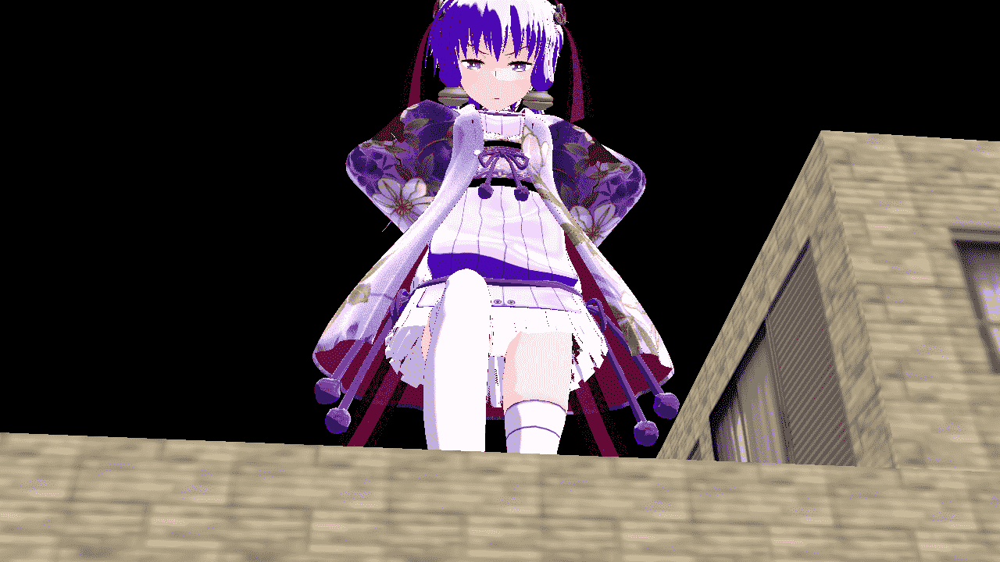

# 试做图，求点评指导

作者：hyow

TID：16586

 

# 1

今天转战MMM了，发现是比MMD好用多了，但小本用的略卡(# ‵ ′)，而且好多地方都不熟悉，也不知如何弄出清晰的图像，制作中总感觉很模糊，背景也不会.

弄来弄去做好东西和动作却发现模糊的看不清，只好删了╮(╯-╰)╭，最好只得弄成这最简单的动作...导出图片也是一堆模式不懂...反正用了个ニコニコワイド倍精度120fps才感觉好点。唯一的好处就是模型终于可以随意放大放小了，但一放大好像视距关系？远处的物体消失了Σ( ° △ °|||)︴还想做完试做图做视频呢，看来又要完蛋/(ㄒoㄒ)/~~

顺便求些特效，方便做出好视频"o((>ω< ))o"

图片还是很大，诶嘿嘿(￣▽￣")

<ignore_js_op>

**1.bmp** *(3.52 MB, 下載次數: 36)*

[下載附件](forum.php?mod=attachment&aid=NDE5ODN8ZDY4ZWU2NTd8MTYwMzg3MDY0NXwxODIzMHwxNjU4Ng%3D%3D&nothumb=yes)

2014-3-31 20:46 上傳

 

# 2

> [ckw 發表於 2014-4-15 22:23](https://giantessnight.com/gnforum2012/forum.php?mod=redirect&goto=findpost&pid=220297&ptid=16586)

> 背景...是指天空吧？載名字.x的檔案

> 由於MMM初設定鏡頭視深(視距)是8000，距離超過8000後會消失

> 特效目前待 ...

我貌似没那东西啊............好麻烦！

 

# 3

> [ckw 發表於 2014-4-16 18:40](https://giantessnight.com/gnforum2012/forum.php?mod=redirect&goto=findpost&pid=220336&ptid=16586)

> http://giantessnight.com/gnforum2012/forum.php?mod=viewthread&tid=14743

> 怎可能，以前明明有天空

> ...

那是MMD做的，这是MMM做的= =

 

# 4

> [ckw 發表於 2014-4-16 18:46](https://giantessnight.com/gnforum2012/forum.php?mod=redirect&goto=findpost&pid=220339&ptid=16586)

> 模型和x文件是通用的

通用的话我会做不出来吗，我用的銀匙町的天空背景，只能顯示出一半

 

# 5

> [ckw 發表於 2014-4-16 21:52](https://giantessnight.com/gnforum2012/forum.php?mod=redirect&goto=findpost&pid=220357&ptid=16586)

> 是時候換一個新的啦

问题是不知道去哪找新的哦=-=</ignore_js_op>