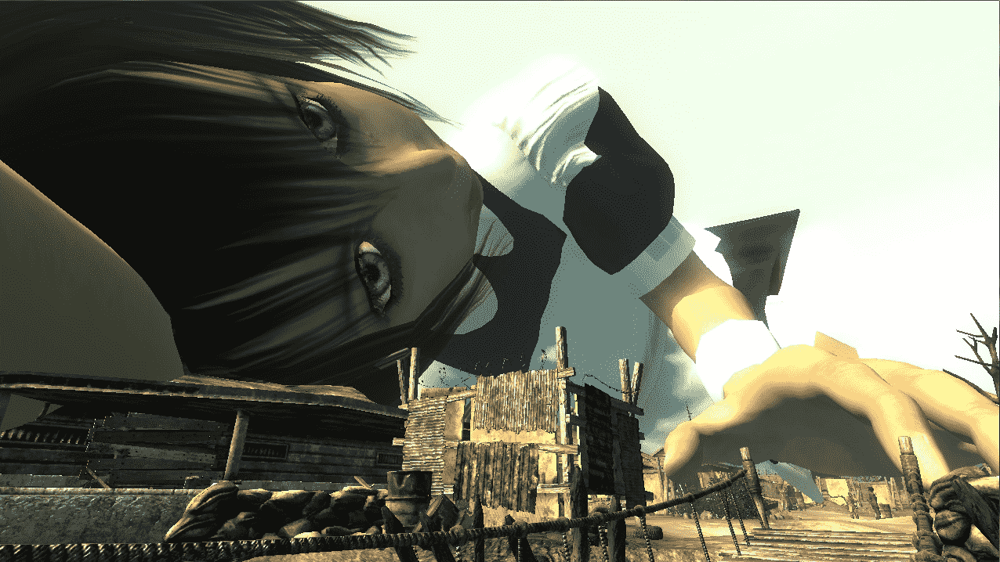
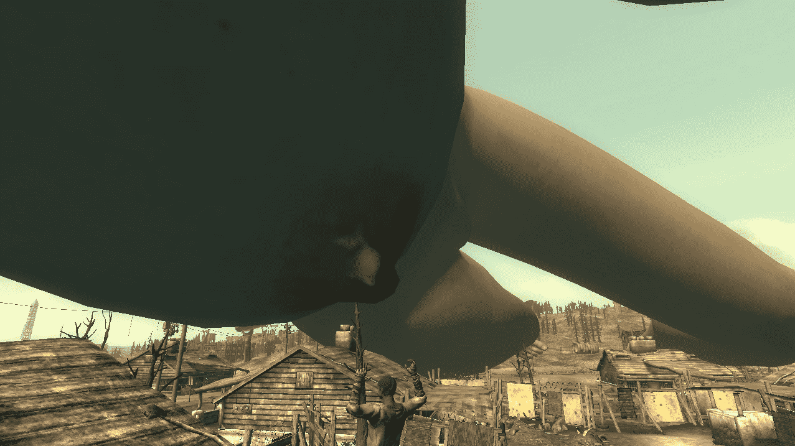
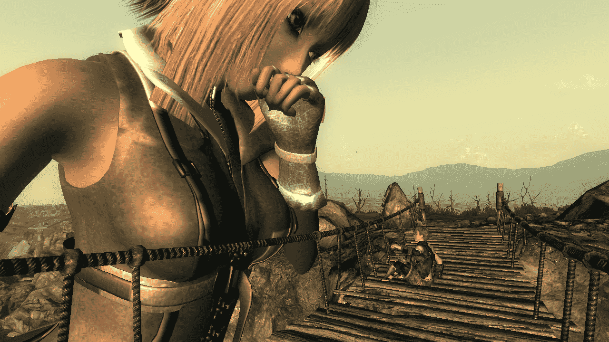

# 辐射3 截图 [10／18更新]

作者：cat

TID：19803

 

# 1

*本帖最後由 cat 於 2015-10-18 02:29 編輯*

我知道这是老游戏了，但是老游戏也阻止不了GTS！

和老滚一样，可以使用控制台调整大小，限制为0.01-10，如果修改MOD就可以超出这个上限。

用的是帝国兵MOD，好处是好看，坏处是……每次召唤是随机的，不知道会弄出来哪个。而且这个MOD的作者居然还搞超贫乳、贫乳、普通和巨乳四个版本，我目前召唤出一个超贫乳，两个贫乳…… 通过读档才搞出一个巨乳的。

还有一个不方便的，就是巨大化的人物身体无法承重（例如：不能让人物站在手上），我要查一查有没有办法解决，或者至少有没有办法关掉重力。

先发几张上来给大家鉴赏一下，如果反响好就继续发好了。

宁静港：这几张实在宁静港里面拍摄的，所以是黑白。通过废土挚友我将Betty带了出来（在某一个档里），想看Betty的可以留言，我会去截。（提醒，Betty无法突破10倍限制）

<ignore_js_op>

**Tranquility Lane 1.jpg** *(391.69 KB, 下載次數: 0)*

[下載附件](forum.php?mod=attachment&aid=NTQzNTV8NjIyZjIyZDN8MTYwMzg2MTQ5OHwxODIzMHwxOTgwMw%3D%3D&nothumb=yes)

2015-9-14 19:01 上傳

<ignore_js_op>

**Tranquility Lane 2.jpg** *(141.31 KB, 下載次數: 0)*

[下載附件](forum.php?mod=attachment&aid=NTQzNTZ8MzczNjk4NjV8MTYwMzg2MTQ5OHwxODIzMHwxOTgwMw%3D%3D&nothumb=yes)

2015-9-14 19:01 上傳

<ignore_js_op>

**Tranquility Lane 3.jpg** *(179.73 KB, 下載次數: 0)*

[下載附件](forum.php?mod=attachment&aid=NTQzNTd8ZGIwZDhjNWV8MTYwMzg2MTQ5OHwxODIzMHwxOTgwMw%3D%3D&nothumb=yes)

2015-9-14 19:01 上傳

<ignore_js_op>

**Tranquility Lane 4.jpg** *(240.88 KB, 下載次數: 0)*

[下載附件](forum.php?mod=attachment&aid=NTQzNTh8MzAxODQ5NmR8MTYwMzg2MTQ5OHwxODIzMHwxOTgwMw%3D%3D&nothumb=yes)

2015-9-14 19:01 上傳

大镇

<ignore_js_op>

**Big town_Gustave 1.jpg** *(215.93 KB, 下載次數: 1)*

[下載附件](forum.php?mod=attachment&aid=NTQzNjB8MDQ3NzY5MDF8MTYwMzg2MTQ5OHwxODIzMHwxOTgwMw%3D%3D&nothumb=yes)

2015-9-14 19:03 上傳

<ignore_js_op>

**Big town_Gustave 2.jpg** *(513.79 KB, 下載次數: 1)*

[下載附件](forum.php?mod=attachment&aid=NTQzNTl8YTBiZWE3N2Z8MTYwMzg2MTQ5OHwxODIzMHwxOTgwMw%3D%3D&nothumb=yes)

2015-9-14 19:03 上傳

9/19

<ignore_js_op>

**Big town_Elva 1.jpg** *(294.6 KB, 下載次數: 0)*

[下載附件](forum.php?mod=attachment&aid=NTQ0Nzd8YTNhM2MyNjZ8MTYwMzg2MTQ5OHwxODIzMHwxOTgwMw%3D%3D&nothumb=yes)

2015-9-20 02:48 上傳

<ignore_js_op>

**Big town_Elva 2.jpg** *(381.27 KB, 下載次數: 0)*

[下載附件](forum.php?mod=attachment&aid=NTQ0Nzh8OGFmMDIyYjh8MTYwMzg2MTQ5OHwxODIzMHwxOTgwMw%3D%3D&nothumb=yes)

2015-9-20 02:48 上傳

<ignore_js_op>

**Big town_Elva 3.jpg** *(249.29 KB, 下載次數: 0)*

[下載附件](forum.php?mod=attachment&aid=NTQ0Nzl8OWI1MWIzMGN8MTYwMzg2MTQ5OHwxODIzMHwxOTgwMw%3D%3D&nothumb=yes)

2015-9-20 02:48 上傳

<ignore_js_op>

**Big town_Gustave 3.jpg** *(250.79 KB, 下載次數: 0)*

[下載附件](forum.php?mod=attachment&aid=NTQ0ODB8ZWZiZGZiNTl8MTYwMzg2MTQ5OHwxODIzMHwxOTgwMw%3D%3D&nothumb=yes)

2015-9-20 02:48 上傳

<ignore_js_op>

**Big town_Gustave 4.jpg** *(197.88 KB, 下載次數: 0)*

[下載附件](forum.php?mod=attachment&aid=NTQ0ODF8Mzk5NTQ0MmZ8MTYwMzg2MTQ5OHwxODIzMHwxOTgwMw%3D%3D&nothumb=yes)

2015-9-20 02:48 上傳

来点H

<ignore_js_op>

**Big town_Gustave 5.jpg** *(256.93 KB, 下載次數: 0)*

[下載附件](forum.php?mod=attachment&aid=NTQ0ODJ8MGJlNjZkNjh8MTYwMzg2MTQ5OHwxODIzMHwxOTgwMw%3D%3D&nothumb=yes)

2015-9-20 02:48 上傳

<ignore_js_op>

**Big town_Gustave 6.jpg** *(194.01 KB, 下載次數: 0)*

[下載附件](forum.php?mod=attachment&aid=NTQ0ODN8MTRkNjNlNzR8MTYwMzg2MTQ5OHwxODIzMHwxOTgwMw%3D%3D&nothumb=yes)

2015-9-20 02:48 上傳

<ignore_js_op>

**Bridge_Gustave 1.jpg** *(229.36 KB, 下載次數: 0)*

[下載附件](forum.php?mod=attachment&aid=NTQ3MDl8ZmNkNmMwYzJ8MTYwMzg2MTQ5OHwxODIzMHwxOTgwMw%3D%3D&nothumb=yes)

2015-10-3 21:57 上傳

<ignore_js_op>

**Bridge_Gustave 2.jpg** *(119.58 KB, 下載次數: 0)*

[下載附件](forum.php?mod=attachment&aid=NTQ3MTB8MGQ4MjE4OGF8MTYwMzg2MTQ5OHwxODIzMHwxOTgwMw%3D%3D&nothumb=yes)

2015-10-3 21:57 上傳

<ignore_js_op>

**Bridge_Gustave 3.jpg** *(241.44 KB, 下載次數: 0)*

[下載附件](forum.php?mod=attachment&aid=NTQ3MTF8YTMwOTQ4OTR8MTYwMzg2MTQ5OHwxODIzMHwxOTgwMw%3D%3D&nothumb=yes)

2015-10-3 21:57 上傳

<ignore_js_op>

**Bridge_Gustave 4.jpg** *(197.54 KB, 下載次數: 0)*

[下載附件](forum.php?mod=attachment&aid=NTQ3MTJ8OWJkZTJlZGN8MTYwMzg2MTQ5OHwxODIzMHwxOTgwMw%3D%3D&nothumb=yes)

2015-10-3 21:57 上傳

<ignore_js_op>

**Bridge_Gustave 5.jpg** *(120.24 KB, 下載次數: 0)*

[下載附件](forum.php?mod=attachment&aid=NTQ3MTN8ZjY1ZTNkZGZ8MTYwMzg2MTQ5OHwxODIzMHwxOTgwMw%3D%3D&nothumb=yes)

2015-10-3 21:57 上傳

<ignore_js_op>

**Tower_Heloise 1.jpg** *(175.63 KB, 下載次數: 0)*

[下載附件](forum.php?mod=attachment&aid=NTQ3MTR8ZjNiYTc0ZDh8MTYwMzg2MTQ5OHwxODIzMHwxOTgwMw%3D%3D&nothumb=yes)

2015-10-3 21:57 上傳

<ignore_js_op>

**Tower_Heloise 2.jpg** *(237.24 KB, 下載次數: 0)*

[下載附件](forum.php?mod=attachment&aid=NTQ3MTV8ZDcyZDcwNDR8MTYwMzg2MTQ5OHwxODIzMHwxOTgwMw%3D%3D&nothumb=yes)

2015-10-3 21:57 上傳

<ignore_js_op>

**Galaxy_Meroy 1.jpg** *(145.97 KB, 下載次數: 0)*

[下載附件](forum.php?mod=attachment&aid=NTQ3OTZ8N2EwOGQxZWR8MTYwMzg2MTQ5OHwxODIzMHwxOTgwMw%3D%3D&nothumb=yes)

2015-10-10 01:50 上傳

<ignore_js_op>

**Galaxy_Heloise 1.jpg** *(333.84 KB, 下載次數: 0)*

[下載附件](forum.php?mod=attachment&aid=NTQ3OTB8YjRjYjE1OTN8MTYwMzg2MTQ5OHwxODIzMHwxOTgwMw%3D%3D&nothumb=yes)

2015-10-10 01:50 上傳

<ignore_js_op>

**Galaxy_Heloise 2.jpg** *(267.53 KB, 下載次數: 0)*

[下載附件](forum.php?mod=attachment&aid=NTQ3OTF8OWFmOGYwY2R8MTYwMzg2MTQ5OHwxODIzMHwxOTgwMw%3D%3D&nothumb=yes)

2015-10-10 01:50 上傳

<ignore_js_op>

**Galaxy_Heloise 3.jpg** *(242.67 KB, 下載次數: 0)*

[下載附件](forum.php?mod=attachment&aid=NTQ3OTJ8ZWRjZDFhNWR8MTYwMzg2MTQ5OHwxODIzMHwxOTgwMw%3D%3D&nothumb=yes)

2015-10-10 01:50 上傳

<ignore_js_op>

**Galaxy_Heloise 4.jpg** *(96.53 KB, 下載次數: 0)*

[下載附件](forum.php?mod=attachment&aid=NTQ3OTN8NGMxYjEzN2F8MTYwMzg2MTQ5OHwxODIzMHwxOTgwMw%3D%3D&nothumb=yes)

2015-10-10 01:50 上傳

<ignore_js_op>

**Galaxy_Heloise 5.jpg** *(169.26 KB, 下載次數: 0)*

[下載附件](forum.php?mod=attachment&aid=NTQ3OTR8ZjI3ZDFmOWN8MTYwMzg2MTQ5OHwxODIzMHwxOTgwMw%3D%3D&nothumb=yes)

2015-10-10 01:50 上傳

<ignore_js_op>

**Galaxy_Heloise&amp;Meroy.jpg** *(155.52 KB, 下載次數: 0)*

[下載附件](forum.php?mod=attachment&aid=NTQ3OTV8NDJiZTQ4NGR8MTYwMzg2MTQ5OHwxODIzMHwxOTgwMw%3D%3D&nothumb=yes)

2015-10-10 01:50 上傳

剩下的以后再传

谢谢观赏，希望各位能够留下自己的意见！

 

# 2

> [a8071504 發表於 2015-9-20 14:57](https://giantessnight.com/gnforum2012/forum.php?mod=redirect&goto=findpost&pid=268830&ptid=19803)

> 这个很久之前就有人玩过，B社的两大扛鼎之作，辐射和老滚（其实也就这两款），都可以这样玩的，但我没弄过 ...

怎么说呢，游戏的设置是人物会在交流时进行目光交流，也就是说如果玩家站在NPC面前，NPC会根据双方的身高差确定头部的角度。前提条件是玩家处于NPC的交流范围，而交流范围貌似并不是从脸部开始计算的，而应该是从身体中某一部分，因此一旦放大到一定程度，这个功能就没用了…… 换句话说，只能放大了看Pose 

另外，虽然Geck可以设置重量，但是这并不会导致人被踩碎…… 我本来想弄点血迹，就射了那NPC一下，结果他立马就变成了敌对，还拿枪打我…… 我只好读档重来……

 

# 3

> [xingren 發表於 2015-9-20 22:20](https://giantessnight.com/gnforum2012/forum.php?mod=redirect&goto=findpost&pid=268860&ptid=19803)

> 图很赞，但是还是喜欢有点情节的。

请看 17楼

1 Ducat不过分吧……

<ignore_js_op> [Nemunoki_Suspension Bridge.7z](forum.php?mod=attachment&aid=NTQ5NDB8MWE2ZDRkNWR8MTYwMzg2MTQ5OHwxODIzMHwxOTgwMw%3D%3D) *(42.14 MB, 下載次數: 16)* 2015-10-18 01:42 上傳點擊文件名下載附件

预览图：

<ignore_js_op>

**09.bmp** *(2.64 MB, 下載次數: 0)*

[下載附件](forum.php?mod=attachment&aid=NTQ5Mzl8MTVlM2I4NTJ8MTYwMzg2MTQ5OHwxODIzMHwxOTgwMw%3D%3D&nothumb=yes)

2015-10-18 01:40 上傳</ignore_js_op></ignore_js_op></ignore_js_op></ignore_js_op></ignore_js_op></ignore_js_op></ignore_js_op></ignore_js_op></ignore_js_op></ignore_js_op></ignore_js_op></ignore_js_op></ignore_js_op></ignore_js_op></ignore_js_op></ignore_js_op></ignore_js_op></ignore_js_op></ignore_js_op></ignore_js_op></ignore_js_op></ignore_js_op></ignore_js_op></ignore_js_op></ignore_js_op></ignore_js_op></ignore_js_op></ignore_js_op></ignore_js_op>