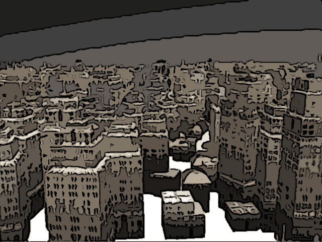
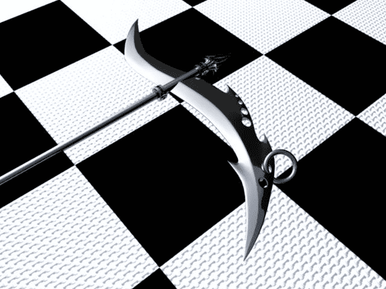
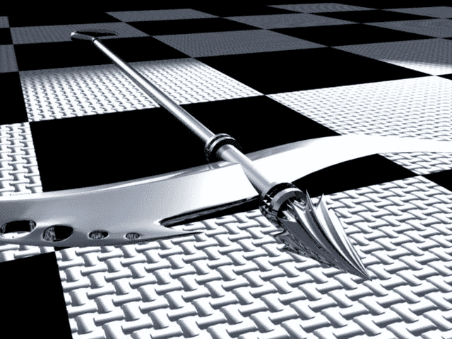
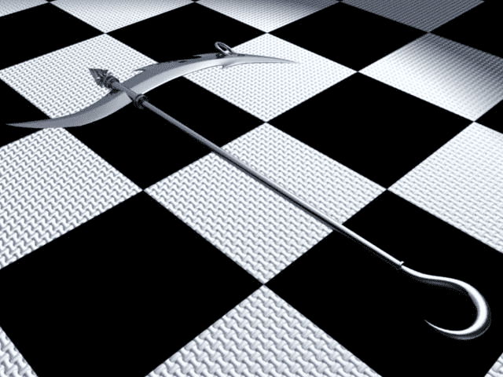

# 關於和K合作城市的建模，成功了一半，殘念啊。

作者：無間道

TID：6162

<title>1</title> <link href="../Styles/Style.css" type="text/css" rel="stylesheet">

# 1

下了一個插件，研究了半天- -不過.....  沒法用
看來是我，年代久遠，已經忘記如何使用了？
在網上搜尋沒有答案。
只得作罷。
於是乎，只能用maya自帶的..... 效果嘛- -
<ignore_js_op>

**4.jpg** *(259.82 KB, 下載次數: 3)*

[下載附件](forum.php?mod=attachment&aid=MTU4OTl8OTE1NTg1Y2Z8MTYwMzg4MTE0MHwxODIzMHw2MTYy&nothumb=yes)

2010-1-1 23:02 上傳

請無視那個灰色的天空 真正作圖的時候會改過來的。
看了到時候需要調節一下大小，讓城市更真一些。
  大不了手動建模...............反正當做背景的城市也要求不高。

——————————————————————————————————————
看了K大的武器設定   瞬間感覺到了差距...........
  感覺自己的東西就.......... /捂臉
於是乎，用MAYA建一個出來唬唬人。
這就是薩博拉斯手裏面拿著的東西，
<ignore_js_op>

**01.jpg** *(48.62 KB, 下載次數: 0)*

[下載附件](forum.php?mod=attachment&aid=MTU5MDB8ZjE4ZDk5YzB8MTYwMzg4MTE0MHwxODIzMHw2MTYy&nothumb=yes)

2010-1-1 23:02 上傳

<ignore_js_op>

**02.jpg** *(57.59 KB, 下載次數: 0)*

[下載附件](forum.php?mod=attachment&aid=MTU5MDF8NTQyOTIxODF8MTYwMzg4MTE0MHwxODIzMHw2MTYy&nothumb=yes)

2010-1-1 23:02 上傳

<ignore_js_op>

**03.jpg** *(47.82 KB, 下載次數: 0)*

[下載附件](forum.php?mod=attachment&aid=MTU5MDJ8OTQ4YmFlOTJ8MTYwMzg4MTE0MHwxODIzMHw2MTYy&nothumb=yes)

2010-1-1 23:02 上傳

話說 如果真有人用這樣的東西當武器，會傷到自己吧？<title>2</title> <link href="../Styles/Style.css" type="text/css" rel="stylesheet">

# 2

小的地方全部可以糊弄~~
尤其是城市鸟瞰图.......   
不过比较细的嘛..................................
  我相信我的 偷懒功夫。</ignore_js_op></ignore_js_op></ignore_js_op></ignore_js_op>