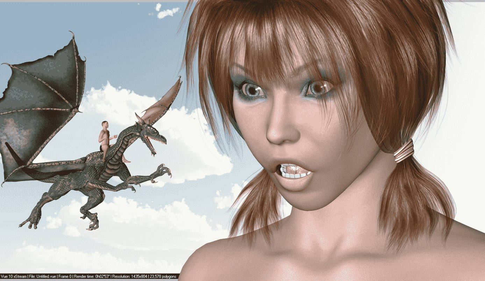
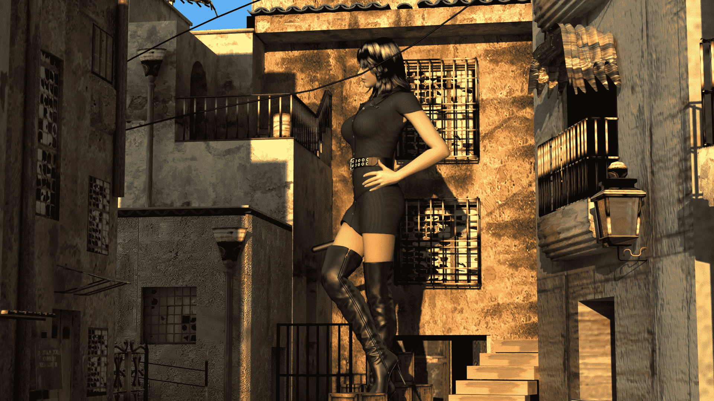
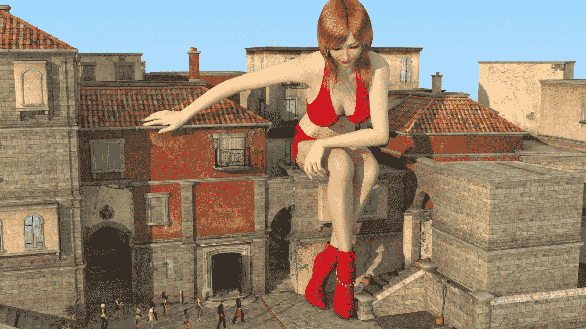
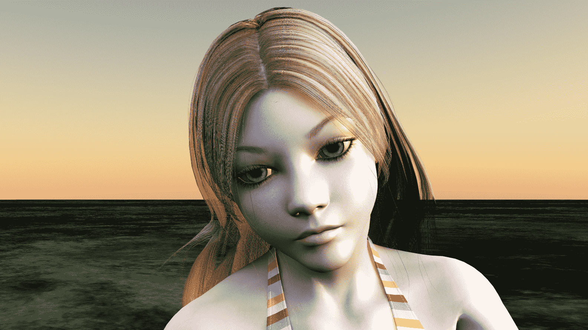
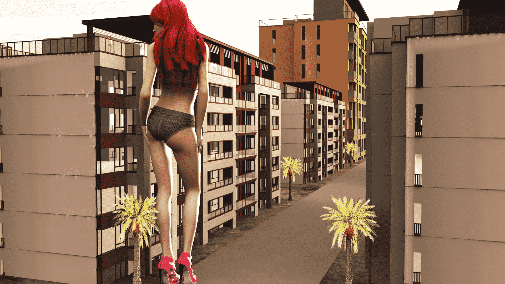
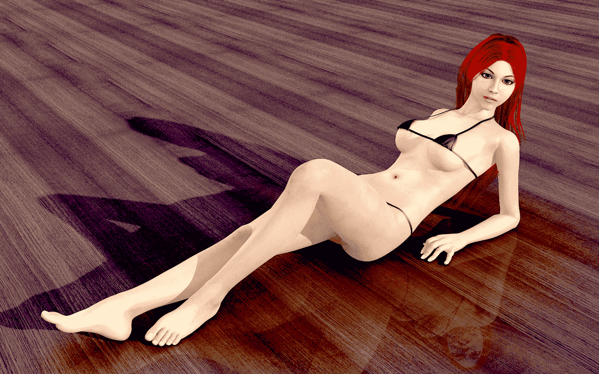
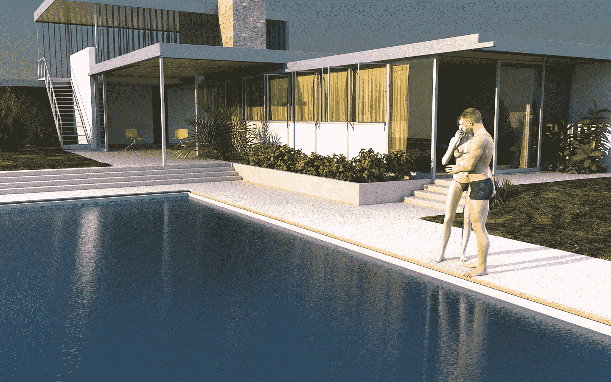
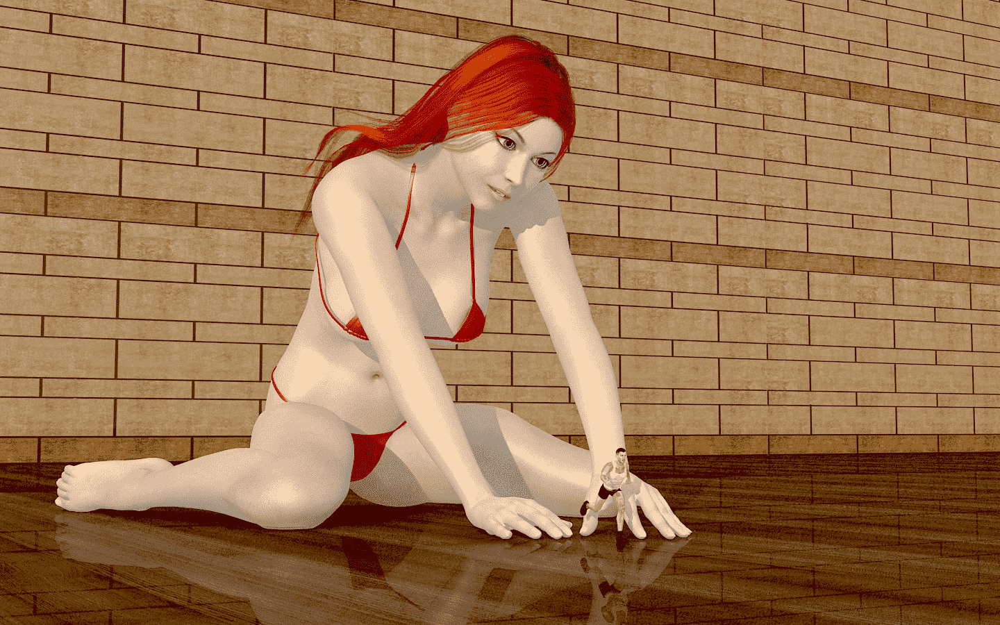
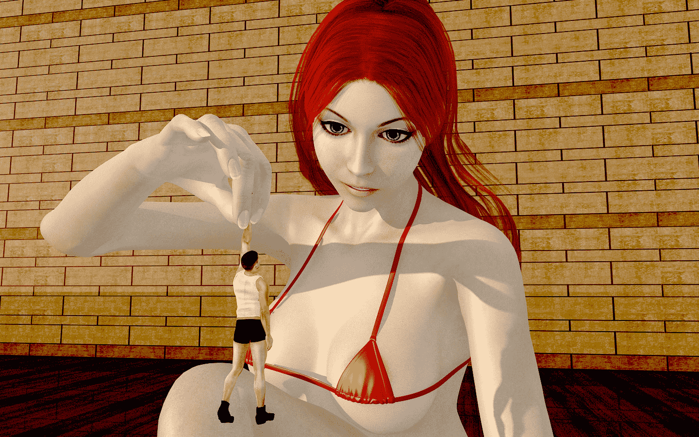

# 随机渲染6.30更新

作者：qyj1213

TID：14495

<title>1</title> <link href="../Styles/Style.css" type="text/css" rel="stylesheet">

# 1

*本文章最後由 qyj1213 於 2013-6-30 22:52 編輯*

最近没事在玩玩3D了<title>2</title> <link href="../Styles/Style.css" type="text/css" rel="stylesheet">

# 2

 <ignore_js_op>[eve1.jpg](forum.php?mod=attachment&aid=MzQ2MjZ8MmE0ZGM1YWR8MTYwMzg3MzczNHwxODIzMHwxNDQ5NQ%3D%3D&nothumb=yes) *(632.38 KB, 下載次數: 2)*

[下載附件](forum.php?mod=attachment&aid=MzQ2MjZ8MmE0ZGM1YWR8MTYwMzg3MzczNHwxODIzMHwxNDQ5NQ%3D%3D&nothumb=yes)

2013-6-2 01:40 上傳  

</ignore_js_op> <ignore_js_op>[d1.jpg](forum.php?mod=attachment&aid=MzQ2Mjd8MTM0YmExZTN8MTYwMzg3MzczNHwxODIzMHwxNDQ5NQ%3D%3D&nothumb=yes) *(1.37 MB, 下載次數: 2)*

[下載附件](forum.php?mod=attachment&aid=MzQ2Mjd8MTM0YmExZTN8MTYwMzg3MzczNHwxODIzMHwxNDQ5NQ%3D%3D&nothumb=yes)

2013-6-2 01:41 上傳  

</ignore_js_op> <ignore_js_op>[j2.jpg](forum.php?mod=attachment&aid=MzQ2Mjh8MzBhZTgzYWV8MTYwMzg3MzczNHwxODIzMHwxNDQ5NQ%3D%3D&nothumb=yes) *(870.63 KB, 下載次數: 1)*

[下載附件](forum.php?mod=attachment&aid=MzQ2Mjh8MzBhZTgzYWV8MTYwMzg3MzczNHwxODIzMHwxNDQ5NQ%3D%3D&nothumb=yes)

2013-6-2 01:41 上傳  

</ignore_js_op> <ignore_js_op>[j3.jpg](forum.php?mod=attachment&aid=MzQ2Mjl8OTA4MzEzYzh8MTYwMzg3MzczNHwxODIzMHwxNDQ5NQ%3D%3D&nothumb=yes) *(1.32 MB, 下載次數: 2)*

[下載附件](forum.php?mod=attachment&aid=MzQ2Mjl8OTA4MzEzYzh8MTYwMzg3MzczNHwxODIzMHwxNDQ5NQ%3D%3D&nothumb=yes)

2013-6-2 01:41 上傳  

</ignore_js_op> <ignore_js_op>[May1.png](forum.php?mod=attachment&aid=MzQ5NzB8YWVkZDMxMTN8MTYwMzg3MzczNHwxODIzMHwxNDQ5NQ%3D%3D&nothumb=yes) *(1.61 MB, 下載次數: 0)*

[下載附件](forum.php?mod=attachment&aid=MzQ5NzB8YWVkZDMxMTN8MTYwMzg3MzczNHwxODIzMHwxNDQ5NQ%3D%3D&nothumb=yes)

2013-6-30 22:41 上傳  

</ignore_js_op> <ignore_js_op>[May2.png](forum.php?mod=attachment&aid=MzQ5NzF8YTc0YTkyYzh8MTYwMzg3MzczNHwxODIzMHwxNDQ5NQ%3D%3D&nothumb=yes) *(1.91 MB, 下載次數: 1)*

[下載附件](forum.php?mod=attachment&aid=MzQ5NzF8YTc0YTkyYzh8MTYwMzg3MzczNHwxODIzMHwxNDQ5NQ%3D%3D&nothumb=yes)

2013-6-30 22:41 上傳  

</ignore_js_op> <ignore_js_op>[May8.png](forum.php?mod=attachment&aid=MzQ5NzJ8ODQxOTc0NWN8MTYwMzg3MzczNHwxODIzMHwxNDQ5NQ%3D%3D&nothumb=yes) *(6.28 MB, 下載次數: 0)*

[下載附件](forum.php?mod=attachment&aid=MzQ5NzJ8ODQxOTc0NWN8MTYwMzg3MzczNHwxODIzMHwxNDQ5NQ%3D%3D&nothumb=yes)

2013-6-30 22:42 上傳  

</ignore_js_op> <ignore_js_op>[May9 拷贝.jpg](forum.php?mod=attachment&aid=MzQ5NzR8ZWVlNjQxNDF8MTYwMzg3MzczNHwxODIzMHwxNDQ5NQ%3D%3D&nothumb=yes) *(529.67 KB, 下載次數: 0)*

[下載附件](forum.php?mod=attachment&aid=MzQ5NzR8ZWVlNjQxNDF8MTYwMzg3MzczNHwxODIzMHwxNDQ5NQ%3D%3D&nothumb=yes)

2013-6-30 22:49 上傳  

</ignore_js_op> <ignore_js_op>[May10 拷贝.jpg](forum.php?mod=attachment&aid=MzQ5NzV8MjE5ZWUwYjd8MTYwMzg3MzczNHwxODIzMHwxNDQ5NQ%3D%3D&nothumb=yes) *(538.75 KB, 下載次數: 0)*

[下載附件](forum.php?mod=attachment&aid=MzQ5NzV8MjE5ZWUwYjd8MTYwMzg3MzczNHwxODIzMHwxNDQ5NQ%3D%3D&nothumb=yes)

2013-6-30 22:49 上傳  

</ignore_js_op> <ignore_js_op>[May11 拷贝.jpg](forum.php?mod=attachment&aid=MzQ5NzZ8OTU0NzRjMmJ8MTYwMzg3MzczNHwxODIzMHwxNDQ5NQ%3D%3D&nothumb=yes) *(628.62 KB, 下載次數: 0)*

[下載附件](forum.php?mod=attachment&aid=MzQ5NzZ8OTU0NzRjMmJ8MTYwMzg3MzczNHwxODIzMHwxNDQ5NQ%3D%3D&nothumb=yes)

2013-6-30 22:50 上傳  

</ignore_js_op> <ignore_js_op>[May12 拷贝.jpg](forum.php?mod=attachment&aid=MzQ5Nzd8ZDIyMjZmOGZ8MTYwMzg3MzczNHwxODIzMHwxNDQ5NQ%3D%3D&nothumb=yes) *(379.26 KB, 下載次數: 0)*

[下載附件](forum.php?mod=attachment&aid=MzQ5Nzd8ZDIyMjZmOGZ8MTYwMzg3MzczNHwxODIzMHwxNDQ5NQ%3D%3D&nothumb=yes)

2013-6-30 22:50 上傳  

</ignore_js_op> <title>3</title> <link href="../Styles/Style.css" type="text/css" rel="stylesheet">

# 3

这个不是上古卷轴5，是poser的角色，由3DMAX的Vray渲染。这个模型也是基本的，我也是只会皮毛而已，我介绍个poser网站bbs.cguse.com，你们可以去那里搞模型。