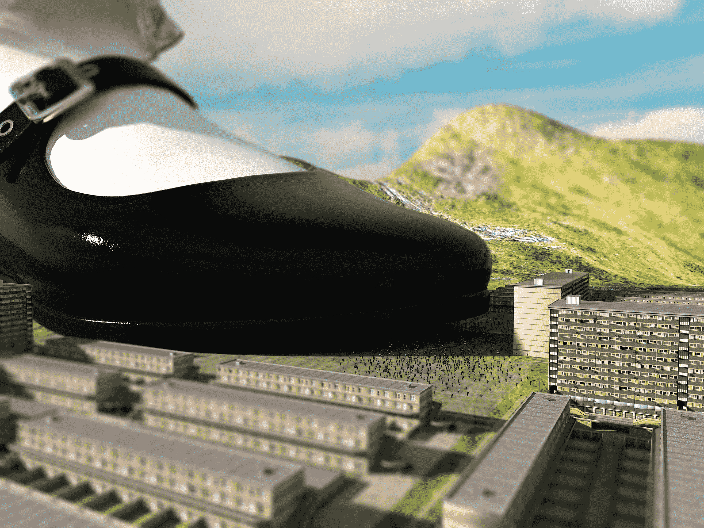

# 鞋子與城鎮

作者：kevinsky05

TID：29280

 

# 1

試玩了一下移軸效果

<ignore_js_op>

**Shoe1.jpg** *(2.55 MB, 下載次數: 13)*

[下載附件](forum.php?mod=attachment&aid=ODQ2MzZ8ZDk1ZmE0MmJ8MTYwMzgyNjQzMXwxODIzMHwyOTI4MA%3D%3D&nothumb=yes)

2020-8-15 12:27 上傳

 

# 2

> [nhbnfn 發表於 2020-8-15 16:23](https://giantessnight.com/gnforum2012/forum.php?mod=redirect&goto=findpost&pid=445137&ptid=29280)

> 好看!!求问旁边模糊效果是怎么做出来的!!实在渲染里还是在相机里面调?

我直接跟著網頁做XD

[http://blog.e-happy.com.tw/photo ... %E6%95%88%E6%9E%9C/](http://blog.e-happy.com.tw/photoshop-cc-%E6%89%93%E9%80%A0%E7%8E%A9%E5%85%B7%E6%A8%A1%E5%9E%8B%E7%9A%84%E7%A7%BB%E8%BB%B8%E6%94%9D%E5%BD%B1%E6%95%88%E6%9E%9C/)

 

# 3

> [王正念 發表於 2020-8-15 23:58](https://giantessnight.com/gnforum2012/forum.php?mod=redirect&goto=findpost&pid=445178&ptid=29280)

> K大，這張圖會不會代表有新系列作品要出現了。

想多了 再開新坑我應該會死XD

不過感覺應該會像野史中巨人和小人對比吧(應該</ignore_js_op>