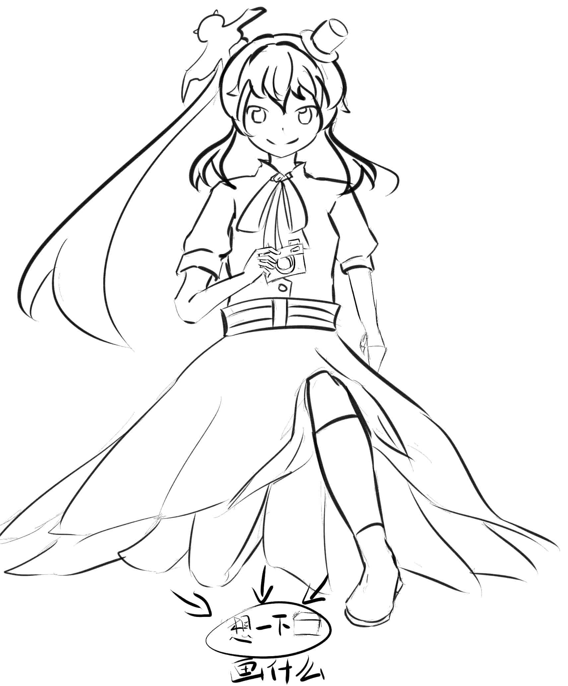

# 骗分，献丑，未完成，求讨论求色彩教程系列（7.9更新新...

作者：maker13

TID：19355

 

# 1

*本帖最後由 maker13 於 2015-7-9 23:32 編輯*

你们觉得上什么色好，在圈圈内画什么好？画的太烂角度太差什么的就别在意了~~~~

更新，重新小修了一下，加上你们要的，画的太烂当娱乐坑就好，小人的画的太烂没脸见人，顺道求上色教程，sai的，刚用这东西两星期。。

画了个灵梦，你们觉得加什么好？继续等上色教程~~

 

# 2

<ignore_js_op>[图像.jpg](forum.php?mod=attachment&aid=NTI5OTR8YzM0NDNhMmZ8MTYwMzg1MzQ1MnwxODIzMHwxOTM1NQ%3D%3D&nothumb=yes) *(164.57 KB, 下載次數: 9)*

[下載附件](forum.php?mod=attachment&aid=NTI5OTR8YzM0NDNhMmZ8MTYwMzg1MzQ1MnwxODIzMHwxOTM1NQ%3D%3D&nothumb=yes)

2015-7-6 22:51 上傳  

</ignore_js_op> <ignore_js_op>[图像2.jpg](forum.php?mod=attachment&aid=NTMwMDB8MjA5NTU2NDR8MTYwMzg1MzQ1MnwxODIzMHwxOTM1NQ%3D%3D&nothumb=yes) *(170.22 KB, 下載次數: 2)*

[下載附件](forum.php?mod=attachment&aid=NTMwMDB8MjA5NTU2NDR8MTYwMzg1MzQ1MnwxODIzMHwxOTM1NQ%3D%3D&nothumb=yes)

2015-7-7 22:50 上傳  

</ignore_js_op> <ignore_js_op>[图像3.jpg](forum.php?mod=attachment&aid=NTMwMDF8ODM1ODkxMDV8MTYwMzg1MzQ1MnwxODIzMHwxOTM1NQ%3D%3D&nothumb=yes) *(178.77 KB, 下載次數: 0)*

[下載附件](forum.php?mod=attachment&aid=NTMwMDF8ODM1ODkxMDV8MTYwMzg1MzQ1MnwxODIzMHwxOTM1NQ%3D%3D&nothumb=yes)

2015-7-7 22:50 上傳  

</ignore_js_op> <ignore_js_op>[新563.jpg](forum.php?mod=attachment&aid=NTMwMjR8YmY4ODc0MDF8MTYwMzg1MzQ1MnwxODIzMHwxOTM1NQ%3D%3D&nothumb=yes) *(538.56 KB, 下載次數: 0)*

[下載附件](forum.php?mod=attachment&aid=NTMwMjR8YmY4ODc0MDF8MTYwMzg1MzQ1MnwxODIzMHwxOTM1NQ%3D%3D&nothumb=yes)

2015-7-9 23:31 上傳  

</ignore_js_op>  

# 3

缩小镇挺有难度的吗，我去试试看 

# 4

> RMB战士 發表於 2015-7-6 23:21

> 城市啊！giga什么的最有爱了

这个我需要挑战一下试试看了 

# 5

> [taroxd 發表於 2015-7-7 11:11](https://giantessnight.com/gnforum2012/forum.php?mod=redirect&goto=findpost&pid=260702&ptid=19355)

> 像这样的？（笑

我今晚试试看看~~，好像挺有趣的~~

 

# 6

继续骗分，更新了，看看大伙有什么新意见~~ 

# 7

> [源青之绅 發表於 2015-7-8 20:20](https://giantessnight.com/gnforum2012/forum.php?mod=redirect&goto=findpost&pid=260860&ptid=19355)

> 不差也不是很好，楼主再接再厉(๑•̀ㅂ•́)و✧

嘛~本来就是骗分加交流的，绘画新手，很多还要问。。

 

# 8

7.9更新~~等大伙来讨论~~ 

# 9

> [asd0251314 發表於 2015-7-9 17:34](https://giantessnight.com/gnforum2012/forum.php?mod=redirect&goto=findpost&pid=260930&ptid=19355)

> 什么意思没看懂

娱乐和交流绘画的方法之类的~~