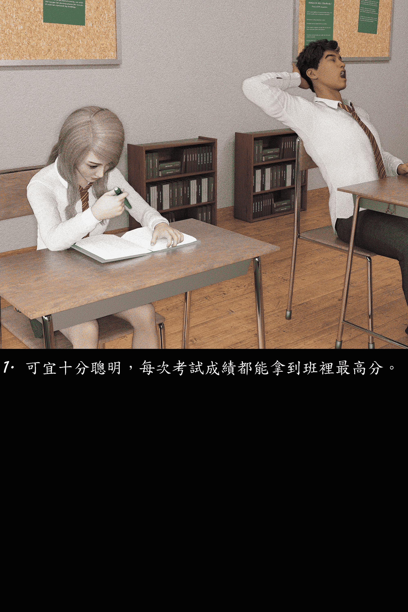

# 高中女皇 (Mini, 身高互換)

作者：kevinsky05

TID：25305

<title>1</title> <link href="../Styles/Style.css" type="text/css" rel="stylesheet">

# 1

別人訂做的一篇mini 身高互換的小短篇，純粹刷自己的存在感(?)
我開通了新的DA網站:[https://harafung.deviantart.com/](https://harafung.deviantart.com/) 大家有空可以去支持一下

链接：[https://pan.baidu.com/s/1FPGDuFf0-vVNTmNCP8YQUA](https://pan.baidu.com/s/1FPGDuFf0-vVNTmNCP8YQUA) 密码：j3cv
[http://www.mediafire.com/file/dc ... %259A%2587.rar/file](http://www.mediafire.com/file/dcnzc0hfcwhcc78/%25E9%25AB%2598%25E4%25B8%25AD%25E5%25A5%25B3%25E7%259A%2587.rar/file)
[https://mega.nz/#!Aw9nDRya!NEZxt ... k4hu2sKgROiRfSPTRUw](https://mega.nz/#!Aw9nDRya!NEZxtn6lYOSF000Byq9I-FQWk4hu2sKgROiRfSPTRUw)

放上預覽圖: (限制限量太坑了)
<ignore_js_op>

**1-min.jpg** *(1.37 MB, 下載次數: 2)*

[下載附件](forum.php?mod=attachment&aid=NzI3NTR8MzQ0ZjQyYmF8MTYwMzg0NjYwNXwxODIzMHwyNTMwNQ%3D%3D&nothumb=yes)

2018-6-7 21:32 上傳

<title>2</title> <link href="../Styles/Style.css" type="text/css" rel="stylesheet">

# 2

> [zyh1983914 發表於 2018-6-7 22:11](https://giantessnight.com/gnforum2012/forum.php?mod=redirect&goto=findpost&pid=377727&ptid=25305)
> 大佬的新图片网站已收藏,随时会去捧场,话说大佬最近对MINI身高类型的来兴趣了?看多了GIGA类型的身高,回过头 ...

其實我一開始進GTS圈是迷MINI啊
<title>3</title> <link href="../Styles/Style.css" type="text/css" rel="stylesheet">

# 3

> [吳港雪風 發表於 2018-6-7 23:00](https://giantessnight.com/gnforum2012/forum.php?mod=redirect&goto=findpost&pid=377736&ptid=25305)
> 感谢K大，想问问K大之后还有啥图集想要创作的吗？想给K大配上文字

我另外有在做一篇mini 的故事，等這周發完被縮小了 會發在這裡。到時候你看看有沒有興趣碼字？
不然我是建議你給我 你想要的故事大綱再大家研究情節？
<title>4</title> <link href="../Styles/Style.css" type="text/css" rel="stylesheet">

# 4

> [街篮SD 發表於 2018-6-9 01:11](https://giantessnight.com/gnforum2012/forum.php?mod=redirect&goto=findpost&pid=377913&ptid=25305)
> 想问K大几个软件的问题，K大用的是什么软件？素材好找么，有没有相关的论坛推荐一下
> 最重要的是，捏人可以 ...

我用的是daz studio, 模型尚算好找，可以給你幾個網頁下載(外國的)
但我覺得用daz studio最大挑戰是電腦配套，如果不夠力的話可能乾脆放棄比較快(舉例來說，如果連MMD運行也有困難 DAZ應該很大可能跑不動了)</ignore_js_op>