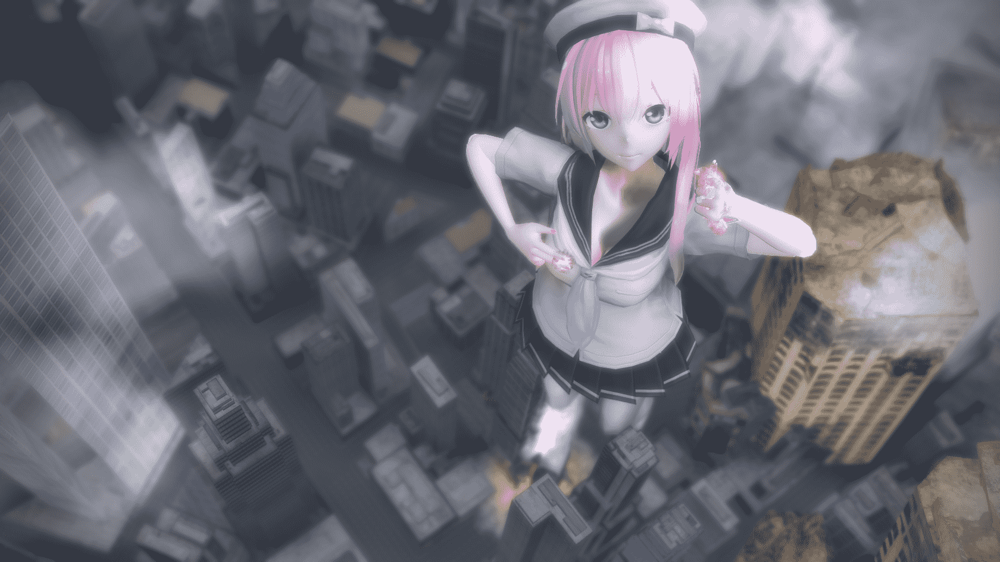

# 鼓起勇氣試做一下MMD..（9／11）

作者：weiwenjiao

TID：20687

 

# 1

*本帖最後由 weiwenjiao 於 2016-9-11 10:33 編輯*

跟幾個大大學了一下之後，竟敢自己偷偷就試做了起來OTL

777試做就算了，竟有勇氣發到GN來。嘛..就一張..沒起名..學藝不精..做得不好..見諒.. <ignore_js_op> 

**123.bmp** *(3 MB, 下載次數: 76)*

[下載附件](forum.php?mod=attachment&aid=NTk2NzV8MDI0ZGNjNzh8MTYwMzg1MjY4NnwxODIzMHwyMDY4Nw%3D%3D&nothumb=yes)

123456677

2016-2-28 20:30 上傳

 

# 2

> [karas 發表於 2016-2-29 06:48](https://giantessnight.com/gnforum2012/forum.php?mod=redirect&goto=findpost&pid=285803&ptid=20687)

> 有分辨率高一些的吗

我輸出的分辨率是1024*768的..分辨率太高了加載還慢OTL下次嘗試一下高分辨率就是33

 

# 3

> [jiachufan1 發表於 2016-2-29 23:38](https://giantessnight.com/gnforum2012/forum.php?mod=redirect&goto=findpost&pid=285897&ptid=20687)

> 哈哈

> 我第一次做的时候没人教

> 自己瞎弄的

我一開始也是無頭蒼蠅了一段時間，沒模型，各種不會，到處去問去求的說orz

最後還是問到了一些不嫌麻煩的大大們，要相信世界還是有好人的，多問吧，一起加油XD

 

# 4

<ignore_js_op>

**1R}8CA)7((`QP_R$E(7KMTC.png** *(535.1 KB, 下載次數: 8)*

[下載附件](forum.php?mod=attachment&aid=NTk3MDR8MzcxZWEyZjh8MTYwMzg1MjY4NnwxODIzMHwyMDY4Nw%3D%3D&nothumb=yes)

123

2016-3-2 00:21 上傳

感覺技術不到家，就不出圖了，截個圖看看效果...

 

# 5

光影是一個很大的難題。。。（分辨率調高了果然要上傳好久OTL）

<ignore_js_op>

**12345.bmp** *(10.55 MB, 下載次數: 0)*

[下載附件](forum.php?mod=attachment&aid=NTk3MDZ8ZjE3YmFkNTZ8MTYwMzg1MjY4NnwxODIzMHwyMDY4Nw%3D%3D&nothumb=yes)

123

2016-3-2 17:12 上傳

<ignore_js_op>

**1234.bmp** *(10.55 MB, 下載次數: 0)*

[下載附件](forum.php?mod=attachment&aid=NTk3MDd8OGM1ZGUwOWZ8MTYwMzg1MjY4NnwxODIzMHwyMDY4Nw%3D%3D&nothumb=yes)

2016-3-2 17:14 上傳

 

# 6

> [shendanxiaogui 發表於 2016-3-3 22:37](https://giantessnight.com/gnforum2012/forum.php?mod=redirect&goto=findpost&pid=286101&ptid=20687)

> 整整20MB啊(＃°Д°)20啊！TWENTY！！！！【意义不明

> 不过光影的效果确实不太好，有种把星空图片直接覆盖 ...

 反正我當時也覺得不太滿意，又說不出為什麼的感覺。

我兩個星空的圖層這樣一放，調整焦距太近就會變得中空，改了描繪順序也沒辦法解決，本來我是想把地球佔滿圖片最下方的。

角度也不大讓我滿意，雖說也有時間的限制就是，但我以後會盡量弄得再仔細一些。

PS：漸變的MME是哪個？我沒有，也好像沒看到過就是，大大有的話趕快傳我OTL

 

# 7

> [phiref91 發表於 2016-3-6 15:04](https://giantessnight.com/gnforum2012/forum.php?mod=redirect&goto=findpost&pid=286302&ptid=20687)

> 只有一张么？。。。。。。

点击只看楼主就会发现还有两张。。不过最近上班有些忙，没办法抽空出来练习就是。。多谢回复

 

# 8

繼續練習一下，就一張。這次的分辨率沒那麼大。

繼續破壞系列~XD：“人家只是想試一下感覺啦~XP” PS：不敢太暴露

<ignore_js_op>

**123.jpg** *(8.08 MB, 下載次數: 9)*

[下載附件](forum.php?mod=attachment&aid=NTk4MTh8NDkxNDAyMWR8MTYwMzg1MjY4NnwxODIzMHwyMDY4Nw%3D%3D&nothumb=yes)

2016-3-8 10:40 上傳

 

# 9

> [cty156054 發表於 2016-3-6 16:20](https://giantessnight.com/gnforum2012/forum.php?mod=redirect&goto=findpost&pid=286308&ptid=20687)

> 已经很好了 虽然外行人不懂什么才叫新手

謝謝支持，我會努力的XD

 

# 10

忙到以為自己要脫圈了ORZ。。。

<ignore_js_op>

**123124.png** *(1.38 MB, 下載次數: 1)*

[下載附件](forum.php?mod=attachment&aid=NjA5NDZ8NWE3ZjcwNzh8MTYwMzg1MjY4NnwxODIzMHwyMDY4Nw%3D%3D&nothumb=yes)

2016-4-27 17:59 上傳

 

# 11

一轉眼已經快五個月了....因為工作閒置了很長時間...最近稍微不那麼忙了，，又跑出來作死orzzzz

雖然每一張圖都有很努力很認真在做orzzz這些是早期時候留下來的拙物就是

<ignore_js_op>

**222.jpg** *(6.06 MB, 下載次數: 2)*

[下載附件](forum.php?mod=attachment&aid=NjQwMzJ8MTA4MDc4NmN8MTYwMzg1MjcyNXwxODIzMHwyMDY4Nw%3D%3D&nothumb=yes)

2016-9-10 14:32 上傳

<ignore_js_op>

**1234.jpg** *(2.44 MB, 下載次數: 1)*

[下載附件](forum.php?mod=attachment&aid=NjQwMzN8YzIwNmQ5ZDN8MTYwMzg1MjcyNXwxODIzMHwyMDY4Nw%3D%3D&nothumb=yes)

2016-9-10 14:33 上傳

<ignore_js_op>

**123333.png** *(743.36 KB, 下載次數: 0)*

[下載附件](forum.php?mod=attachment&aid=NjQwMzR8YzU2Y2IxZWJ8MTYwMzg1MjcyNXwxODIzMHwyMDY4Nw%3D%3D&nothumb=yes)

2016-9-10 14:34 上傳

<ignore_js_op>

**1234545555.jpg** *(1.23 MB, 下載次數: 0)*

[下載附件](forum.php?mod=attachment&aid=NjQwMzV8MmEwNmVjYzZ8MTYwMzg1MjcyNXwxODIzMHwyMDY4Nw%3D%3D&nothumb=yes)

2016-9-10 14:34 上傳

 

# 12

<ignore_js_op>

**123.jpg** *(3.3 MB, 下載次數: 0)*

[下載附件](forum.php?mod=attachment&aid=NjQwNTh8YTk3ZmNkYmF8MTYwMzg1MjcyNXwxODIzMHwyMDY4Nw%3D%3D&nothumb=yes)

2016-9-11 10:30 上傳

<ignore_js_op>

**sadasdas.jpg** *(277.01 KB, 下載次數: 1)*

[下載附件](forum.php?mod=attachment&aid=NjQwNTl8ZjQ1OThmNTB8MTYwMzg1MjcyNXwxODIzMHwyMDY4Nw%3D%3D&nothumb=yes)

2016-9-11 10:30 上傳

 

# 13

很久没发帖子了，今天也是最后一次发帖。

重新再开一帖未免有层热度之嫌，就在自己帖子里说一说。

从08年到现在，过了10年了，错过了圈子最鼎盛的时期，正好来到没落初期。

而今物是人非，人也变老了，很佩服能把它事业的人比如V姐。

不得不承认华人圈子风气属很差的那种，在世界范围内混了很久感觉得出来。

非常感谢为了圈子而努力的人，看到很多对国内心灰意冷而转投国外gts圈子的厉害作者，为了圈子迸发创作热情。

非常感谢能帮助我的人，还有那些我为了创作而得罪过的朋友，感谢支持过我的朋友。

本来打算说很多，想来感觉再说下去就好像不是退圈了，到此为止吧。

最后声明一点：推特上的@kevinsky05是本人，并不是KevinlcK大，说这些是想声明一下**上面所做的东西仅代表我个人的风格偏好，并不代表K大的风格**，希望不会误导到同好们，谢谢。

再见。</ignore_js_op></ignore_js_op></ignore_js_op></ignore_js_op></ignore_js_op></ignore_js_op></ignore_js_op></ignore_js_op></ignore_js_op></ignore_js_op></ignore_js_op></ignore_js_op>