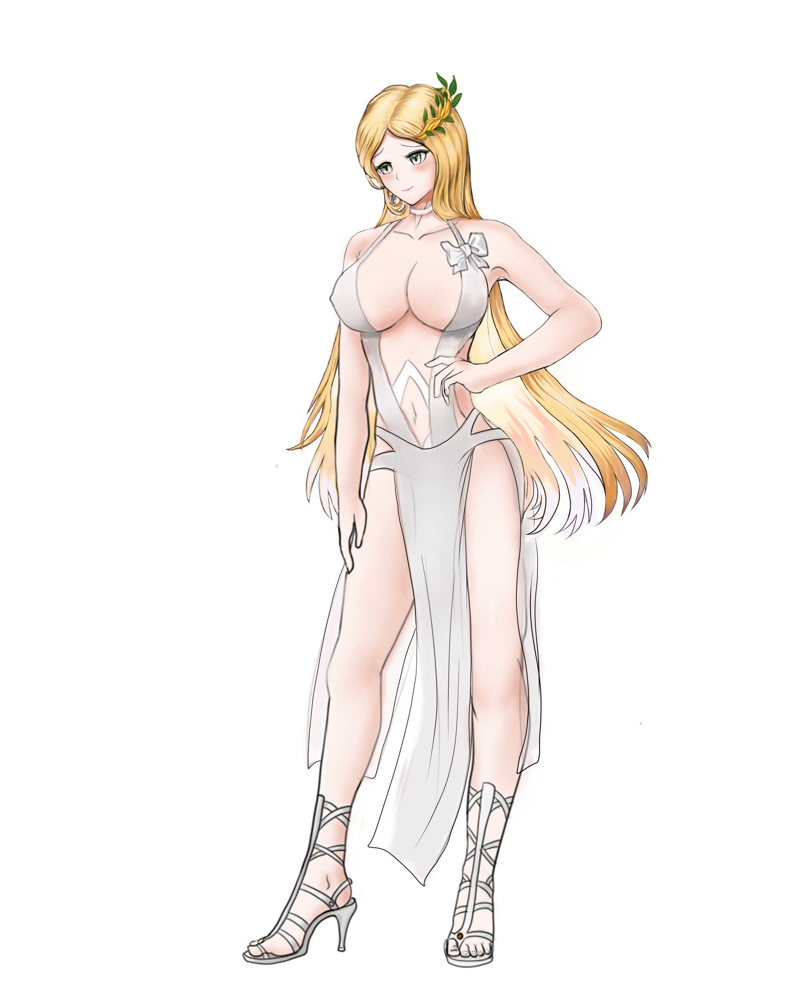
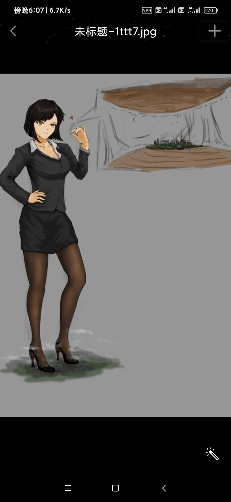
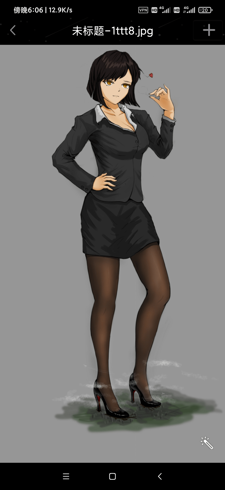
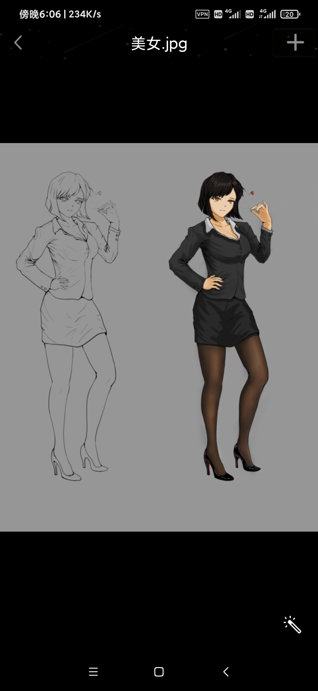

# 《H星人》出场角色人设暂定集（不定期更新）

作者：焦冥小虫xxx

TID：29728

 

# 1

还是给自己的角色画了些所谓的设定图。此贴以后会逐渐更新些《H星人》系列的世界观设定和一些角色的人物设定。有的角色可能会跟各位脑海中的不太一样，各位看看热闹就行。

 

# 2

*本帖最後由 焦冥小虫xxx 於 2020-10-27 19:37 編輯*

女神方：艾丽丝。（未完成，后面会加上一个小特写和对白。在宿舍人太多不方便写，，） 

# 3

[ailisii.jpg](forum.php?mod=attachment&aid=ODU3NjN8MTkzMjIxNDl8MTYzMjE4MjYwOXwxODIzMHwyOTcyOA%3D%3D&nothumb=yes) *(1.36 MB, 下載次數: 11)*

[下載附件](forum.php?mod=attachment&aid=ODU3NjN8MTkzMjIxNDl8MTYzMjE4MjYwOXwxODIzMHwyOTcyOA%3D%3D&nothumb=yes)

2020-10-27 19:36 上傳  

</ignore_js_op>  

# 4

H星人方：（从左到右分别为，k先生（解放形态）、苏红、暴徒）（原图太大只能截图上传了……）

 

# 5

[~_Q{0F_RJKXSP`FF`84YMWM.png](forum.php?mod=attachment&aid=ODU3Njl8OWQzNjMxZTF8MTYzMjE4MjYwOXwxODIzMHwyOTcyOA%3D%3D&nothumb=yes) *(1.11 MB, 下載次數: 13)*

[下載附件](forum.php?mod=attachment&aid=ODU3Njl8OWQzNjMxZTF8MTYzMjE4MjYwOXwxODIzMHwyOTcyOA%3D%3D&nothumb=yes)

2020-10-28 13:33 上傳  

</ignore_js_op>  

# 6

*本帖最後由 焦冥小虫xxx 於 2021-5-30 16:02 編輯*

H星人士兵设定一号——

（面具的设定灵感是蚊子的口器，装甲属于H星人身体组织，平时封闭的面部可阻挡过滤掉超大型gts和究极巨大行型gts的生殖器荷尔蒙（也就是淫秽的气味，对于小人来说杀伤性极强，轻则失去理智，重则暴血而死）与敌方发生肉搏时可张开撕咬，任何有机物都可以被H星人消化掉）

此设定为H星人基础兵种之一，其他型号将会在以后更新

 

# 7

[Z$%ZZ4DA_WWO5_B0X8VJW]7(1).png](forum.php?mod=attachment&aid=ODg1MDV8OWY2MjE0ZDV8MTYzMjE4MjYwOXwxODIzMHwyOTcyOA%3D%3D&nothumb=yes) *(364.47 KB, 下載次數: 0)*

[下載附件](forum.php?mod=attachment&aid=ODg1MDV8OWY2MjE0ZDV8MTYzMjE4MjYwOXwxODIzMHwyOTcyOA%3D%3D&nothumb=yes)

2021-4-24 17:56 上傳  

[![Z$%ZZ4DA_WWO5_B0X8VJW]7(1).png](img/94a10aedf7beb644bb82f296cc6d07c5.png "Z$%ZZ4DA_WWO5_B0X8VJW]7(1).png")](javascript:;)</ignore_js_op>  

# 8

D姐（本名维拉。）人设图。身高184cm。生物制药科技公司的一名高级研究员，私下里是一个幻想着能变成巨人的gts控。（图片太大只能放截图了……）

 

# 9

[Screenshot_2021-04-24-18-07-08-281_com.tencent.mobileqq.jpg](forum.php?mod=attachment&aid=ODg1MDh8YzQ3NWRhOWV8MTYzMjE4MjYwOXwxODIzMHwyOTcyOA%3D%3D&nothumb=yes) *(294.82 KB, 下載次數: 3)*

[下載附件](forum.php?mod=attachment&aid=ODg1MDh8YzQ3NWRhOWV8MTYzMjE4MjYwOXwxODIzMHwyOTcyOA%3D%3D&nothumb=yes)

2021-4-24 18:07 上傳  

</ignore_js_op> [Screenshot_2021-04-24-18-06-55-413_com.tencent.mobileqq.jpg](forum.php?mod=attachment&aid=ODg1MDd8OTRjZTI2NmR8MTYzMjE4MjYwOXwxODIzMHwyOTcyOA%3D%3D&nothumb=yes) *(339.68 KB, 下載次數: 2)*

[下載附件](forum.php?mod=attachment&aid=ODg1MDd8OTRjZTI2NmR8MTYzMjE4MjYwOXwxODIzMHwyOTcyOA%3D%3D&nothumb=yes)

2021-4-24 18:07 上傳  

</ignore_js_op> [Screenshot_2021-04-24-18-06-36-400_com.tencent.mobileqq.jpg](forum.php?mod=attachment&aid=ODg1MDZ8M2I2NmRiZWZ8MTYzMjE4MjYwOXwxODIzMHwyOTcyOA%3D%3D&nothumb=yes) *(227.61 KB, 下載次數: 3)*

[下載附件](forum.php?mod=attachment&aid=ODg1MDZ8M2I2NmRiZWZ8MTYzMjE4MjYwOXwxODIzMHwyOTcyOA%3D%3D&nothumb=yes)

2021-4-24 18:07 上傳  

</ignore_js_op>  

# 10

> [呵呵呵还07 發表於 2021-4-25 19:06](https://giantessnight.com/gnforum2012/forum.php?mod=redirect&goto=findpost&pid=466255&ptid=29728)

> 顶顶顶，每张都感觉非常不错的啊，同时期待h星人的诞生更新

谢谢(*°∀°)=3外传最近也会补上的，