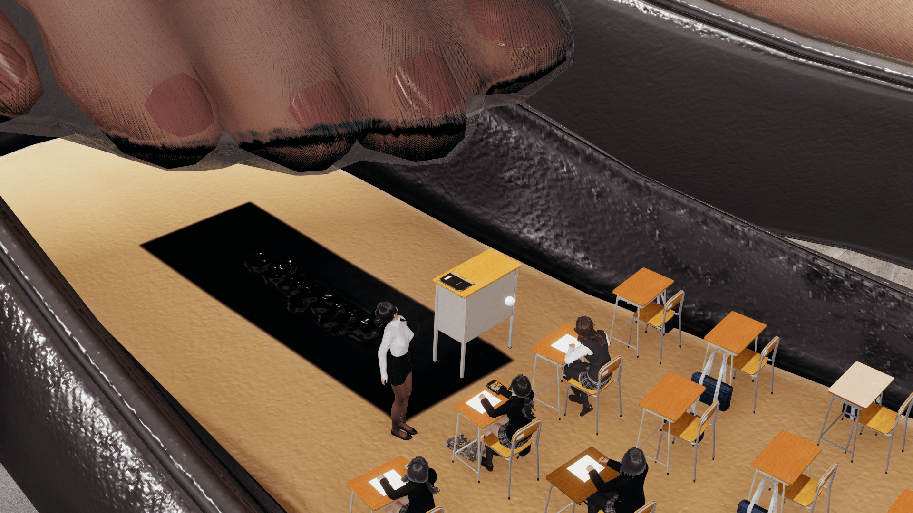
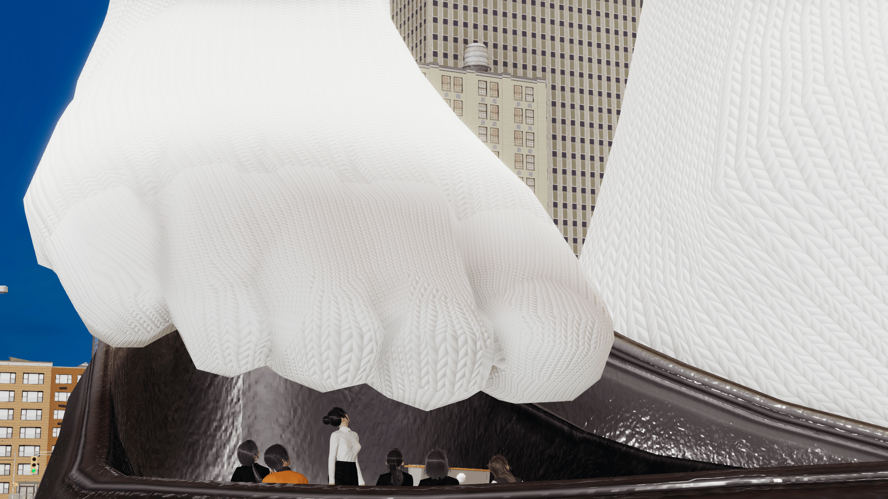
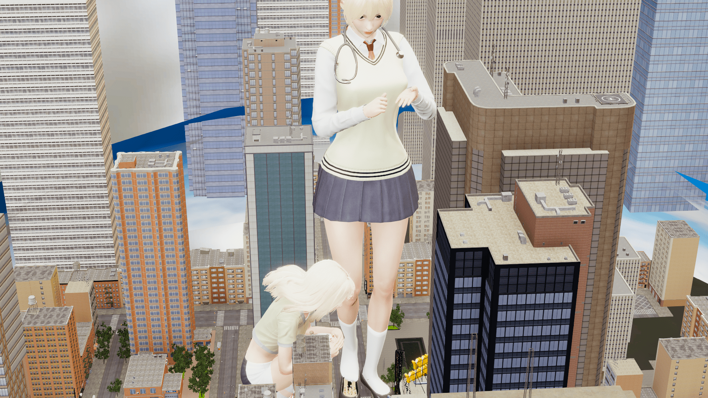

# HS2 随意作图 多重大小

作者：sdidy

TID：30338

<title>1</title> <link href="../Styles/Style.css" type="text/css" rel="stylesheet">

# 1

*本帖最後由 sdidy 於 2021-2-13 03:22 編輯*

原图在Patreon，希望大家支持
之前一直在研究DAZ3D，素材超级多，奈何笔记本硬件差太多，一张图渲染四个小时以上……
暂时只能用HS2来满足自己的创作欲了
[https://www.patreon.com/sdidy](https://www.patreon.com/sdidy)
希望大家支持，只想买个好点的显卡，毕竟DAZ3D的素材要多得多
准备做一长篇故事系列，已有两章放出，三章存货，设定的每十天发一章，每章50页，欢迎各位老板二楼里面请~
（有同好说没有海外信用卡，那就来这里吧，因为冲呀没办法设置延迟发布，我怕以后会忘了按时更新，欢迎催更，大家的支持就是我坚持下去的动力）[https://www.chongya.com/@sdidy](https://www.chongya.com/@sdidy)

<ignore_js_op>

**HS2_2021-02-09-20-55-40-684.png** *(2.86 MB, 下載次數: 6)*

[下載附件](forum.php?mod=attachment&aid=ODc0MzF8ZDc5MWU3ZTd8MTYzMjE4NDA3N3wxODIzMHwzMDMzOA%3D%3D&nothumb=yes)

2021-2-11 05:51 上傳

<ignore_js_op>

**HS2_2021-02-09-21-13-51-762.png** *(2.62 MB, 下載次數: 6)*

[下載附件](forum.php?mod=attachment&aid=ODc0MzJ8MTBiZGNiY2V8MTYzMjE4NDA3N3wxODIzMHwzMDMzOA%3D%3D&nothumb=yes)

2021-2-11 05:51 上傳

<ignore_js_op>

**HS2_2021-02-09-21-14-37-501.png** *(3.2 MB, 下載次數: 6)*

[下載附件](forum.php?mod=attachment&aid=ODc0MzN8ODRhNGQ4ZjJ8MTYzMjE4NDA3N3wxODIzMHwzMDMzOA%3D%3D&nothumb=yes)

2021-2-11 05:51 上傳

<title>2</title> <link href="../Styles/Style.css" type="text/css" rel="stylesheet">

# 2

> [择一鞋终老 發表於 2021-2-11 11:41](https://giantessnight.com/gnforum2012/forum.php?mod=redirect&goto=findpost&pid=459626&ptid=30338)
> 3d+多重大小简直妙极！是我喜爱的类型
> 3美金已交，支持一下，希望楼主创作更多的图。

哇，感谢支持！
我用的软件是Honey select 2，都是自己摸索，但是资源主要是来自 [https://discord.com/channels/446 ... /715932300382044170](https://discord.com/channels/446784086539763712/715932300382044170)
从里面找需要的素材，包括map，人物卡，物品，灯光预设等等

有些场景预设可以直接用，调整一下人物就行，我是从这里找的 [https://yuki-portal.com/uploader/honeyselect2/category/scene/](https://yuki-portal.com/uploader/honeyselect2/category/scene/)

<title>3</title> <link href="../Styles/Style.css" type="text/css" rel="stylesheet">

# 3

> [Solexight 發表於 2021-2-11 22:32](https://giantessnight.com/gnforum2012/forum.php?mod=redirect&goto=findpost&pid=459665&ptid=30338)
> 厲害了 這題材很棒 我直接訂閱20$~

谢谢！为了不负您的支持，我也会坚持下去的！<title>4</title> <link href="../Styles/Style.css" type="text/css" rel="stylesheet">

# 4

> [camellia 發表於 2021-2-14 15:44](https://giantessnight.com/gnforum2012/forum.php?mod=redirect&goto=findpost&pid=459952&ptid=30338)
> 多重大小太赞了，就喜欢这种的，但是喜欢带剧情的，散图不太喜欢的样子

哈哈，没仔细看吧，我的Patreon里面有带剧情的正篇啊<title>5</title> <link href="../Styles/Style.css" type="text/css" rel="stylesheet">

# 5

> [czl 發表於 2021-2-16 18:58](https://giantessnight.com/gnforum2012/forum.php?mod=redirect&goto=findpost&pid=460138&ptid=30338)
> 催更啦催更啦，冲呀里要记得更啊

哈哈，好的，要是看到Patreon更了，冲呀没更，随时来催哈，Patreon那边还有四章是定时发布
<title>6</title> <link href="../Styles/Style.css" type="text/css" rel="stylesheet">

# 6

> [czl 發表於 2021-2-16 19:10](https://giantessnight.com/gnforum2012/forum.php?mod=redirect&goto=findpost&pid=460140&ptid=30338)
> 已经3美元支持了，加油啊楼主……

感谢支持，我会努力坚持下去的！！！
<title>7</title> <link href="../Styles/Style.css" type="text/css" rel="stylesheet">

# 7

> [676767lql 發表於 2021-2-19 13:44](https://giantessnight.com/gnforum2012/forum.php?mod=redirect&goto=findpost&pid=460456&ptid=30338)
> 请问一下有没有具体的设定？比如说人物比例，是怎么变成各个尺寸的人群之类的？ ...

之前写过一个文章，作图设定想的是文章的千年之后，新人类和旧人类的比例
<title>8</title> <link href="../Styles/Style.css" type="text/css" rel="stylesheet">

# 8

> [czl 發表於 2021-2-20 13:04](https://giantessnight.com/gnforum2012/forum.php?mod=redirect&goto=findpost&pid=460574&ptid=30338)
> 楼主你patreon上好像更新啦，记得更下冲呀，谢啦

好咧，看官里面请~ ~~
已经更新啦
<title>9</title> <link href="../Styles/Style.css" type="text/css" rel="stylesheet">

# 9

> [czl 發表於 2021-3-20 23:23](https://giantessnight.com/gnforum2012/forum.php?mod=redirect&goto=findpost&pid=463302&ptid=30338)
> 太棒了，这种情节简直太对我胃口了

嘿嘿，足袜+多重+女女，爽点拉满！</ignore_js_op></ignore_js_op></ignore_js_op>