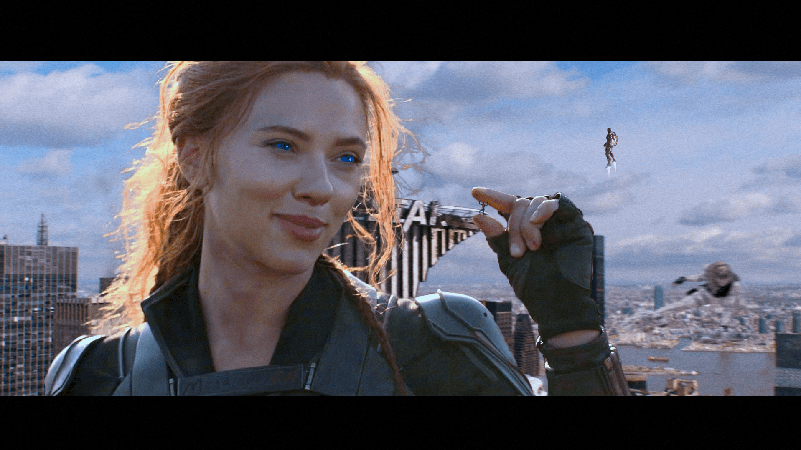

# MegaloverCN的图片贴（8.11继续蹭热度更新）

作者：MegaloverCN

TID：29340

<title>1</title> <link href="../Styles/Style.css" type="text/css" rel="stylesheet">

# 1

*本帖最後由 MegaloverCN 於 2021-8-11 15:31 編輯*

大家好我是MegaloverCN，一个会点儿p图的gts爱好者。
我会在这里发一下这些图片（当然也会即时更新的）顺便说一说我做每张图的想法，素材来源，还有图片里的故事（这部分希望交给大家，我一直希望有大佬能根据我的图写文（哪怕就一小段！））
发图方式是挂deviantart的链接，因为我的图都很大，好多都是一张就20M起步，所以不得不用这种方式。

有想交（给）流（我）想（资）法（源）的，可以加我QQ（白嫖怪发言）：1994486128 （钢铁少（简称gts））

=================

好，就这样，欢迎来到MegaloverCN的gts世界！
<title>2</title> <link href="../Styles/Style.css" type="text/css" rel="stylesheet">

# 2

先把之前我觉得好看不火的几张翻出来说说
首先是这两张
[https://www.deviantart.com/megalovercn/art/Nana-Ou-yang-802993593](https://www.deviantart.com/megalovercn/art/Nana-Ou-yang-802993593)
[https://www.deviantart.com/megalovercn/art/Dilraba-9-804191893](https://www.deviantart.com/megalovercn/art/Dilraba-9-804191893)
一张欧阳娜娜一张迪丽热巴的，原本是很普通的两张，然后在我年初二次翻新的时候突然灵光一现，给做成了新闻的模式，感觉瞬间就真实了许多
<title>3</title> <link href="../Styles/Style.css" type="text/css" rel="stylesheet">

# 3

*本帖最後由 MegaloverCN 於 2020-8-23 19:58 編輯*

接下来是电影海报系列
《我不是药神》[https://www.deviantart.com/megalovercn/art/Tan-Zhuo-802992648](https://www.deviantart.com/megalovercn/art/Tan-Zhuo-802992648)
《战狼3》[https://www.deviantart.com/megalovercn/art/Celina-Jade-803119226](https://www.deviantart.com/megalovercn/art/Celina-Jade-803119226)
《哥斯拉》[https://www.deviantart.com/megalovercn/art/Godzvera-3-808337329](https://www.deviantart.com/megalovercn/art/Godzvera-3-808337329)
《花木兰》（略血腥）[https://www.deviantart.com/megalovercn/art/Liu-Yifei-4-829497254](https://www.deviantart.com/megalovercn/art/Liu-Yifei-4-829497254)
《西虹市首富》[https://www.deviantart.com/megalovercn/art/Vivian-Sung-803122520](https://www.deviantart.com/megalovercn/art/Vivian-Sung-803122520)
《流浪地球》[https://www.deviantart.com/megalovercn/art/The-Wandering-Earth-803256882](https://www.deviantart.com/megalovercn/art/The-Wandering-Earth-803256882)
《复仇者联盟4》[https://www.deviantart.com/megalovercn/art/Captain-Marvel2-803258249](https://www.deviantart.com/megalovercn/art/Captain-Marvel2-803258249)
《第九区》[https://www.deviantart.com/megalovercn/art/He-Sui-803260185](https://www.deviantart.com/megalovercn/art/He-Sui-803260185)
《我不是潘金莲》[https://www.deviantart.com/megalovercn/art/Fan-Bingbing3-802991766](https://www.deviantart.com/megalovercn/art/Fan-Bingbing3-802991766)
《大话西游之大圣娶亲》[https://www.deviantart.com/megalovercn/art/Athena-Chu-and-Karen-Mok-803259127](https://www.deviantart.com/megalovercn/art/Athena-Chu-and-Karen-Mok-803259127)
《国风美少年》（综艺海报也是海报啊）[https://www.deviantart.com/megalovercn/art/kiku3-803258840](https://www.deviantart.com/megalovercn/art/kiku3-803258840)
<title>4</title> <link href="../Styles/Style.css" type="text/css" rel="stylesheet">

# 4

然后是成品图超出预期效果的几张
星球级别的柳岩，左手的恒星光效很棒
[https://www.deviantart.com/megalovercn/art/Ada-Liu-2-803263546](https://www.deviantart.com/megalovercn/art/Ada-Liu-2-803263546)

江疏影 上海，朦胧的感觉正是我想要的
[https://www.deviantart.com/megalovercn/art/Jiang-Shuying2-804187477](https://www.deviantart.com/megalovercn/art/Jiang-Shuying2-804187477)

章子怡和航母，这是我几张老照片风格里最成功的一张
[https://www.deviantart.com/megalovercn/art/Zhang-Ziyi-810943476](https://www.deviantart.com/megalovercn/art/Zhang-Ziyi-810943476)

第一次尝试古画风格，效果很好，比之后金晨的那张古画效果好
[https://www.deviantart.com/megalovercn/art/Jiang-Shuying-803260595](https://www.deviantart.com/megalovercn/art/Jiang-Shuying-803260595)

这张不能说效果好但是我很喜欢 漫画风格的李冰冰对战avengers
[https://www.deviantart.com/megalovercn/art/Li-Bingbing-2-822047837](https://www.deviantart.com/megalovercn/art/Li-Bingbing-2-822047837)

赖雨濛的两张，烟雾处理极其到位
[https://www.deviantart.com/megalovercn/art/Lai-Yumeng-2-825899387](https://www.deviantart.com/megalovercn/art/Lai-Yumeng-2-825899387)
[https://www.deviantart.com/megalovercn/art/Lai-Yumeng-825899286](https://www.deviantart.com/megalovercn/art/Lai-Yumeng-825899286)

陈数这张和背景色调很搭，后面认真踩踏的刘亦菲却处理的不太好
[https://www.deviantart.com/megalovercn/art/Chen-Shu-and-Liu-Yifei-828030472](https://www.deviantart.com/megalovercn/art/Chen-Shu-and-Liu-Yifei-828030472)

碧梨的这张素材被不少人用过，两侧模糊一下感觉很真
[https://www.deviantart.com/megalovercn/art/Billie-Eilish-830993802](https://www.deviantart.com/megalovercn/art/Billie-Eilish-830993802)

哇！泫雅的这几张素材和想法我藏了好久的！好不容易有了一栋全玻璃的大楼，结果因为又要反射又要让窗户边缘显示出来，在这上面下了很大的功夫
[https://www.deviantart.com/megalovercn/art/Kim-Hyun-A-2-843794781](https://www.deviantart.com/megalovercn/art/Kim-Hyun-A-2-843794781)

魔都 未来战士 张俪
[https://www.deviantart.com/megalovercn/art/Zhang-Li-2-847417642](https://www.deviantart.com/megalovercn/art/Zhang-Li-2-847417642)

接上一张，去过未来接着又回到过去的战士
[https://www.deviantart.com/megalovercn/art/Zhang-Li-3-849425645](https://www.deviantart.com/megalovercn/art/Zhang-Li-3-849425645)
<title>5</title> <link href="../Styles/Style.css" type="text/css" rel="stylesheet">

# 5

*本帖最後由 MegaloverCN 於 2020-8-25 20:45 編輯*

刚才跟位同好聊了一会，忽然想到了可以整理一个系列——彩蛋系列。我在好多图里都埋了彩蛋，有的明显有的不明显。我的原则就是：有没有设彩蛋是我的事，看不看得出来是你的事。如果没看出来也不影响，如果看出来了就会有一点小小成就感也不错所以今天给各位挖一下我图里的彩蛋。
哥斯拉2女主Vera Farmiga这张，是不是光注意前面的小哥斯拉了，有没有人看到被穿在鞋跟上的魔斯拉呢
[https://www.deviantart.com/megalovercn/art/Godzvera-3-808337329](https://www.deviantart.com/megalovercn/art/Godzvera-3-808337329)

都看到了后面的giantess，不知道有多少人注意到前面的shrunken woman
[https://www.deviantart.com/megalovercn/art/Playground-808337803](https://www.deviantart.com/megalovercn/art/Playground-808337803)

李冰冰vsAvengers的大场面，冰冰嘴里漏出来的半条腿是巨大化的蚁人的。同样把自己变大（相对）的还有黄蜂女。还有蓝色的眼睛代表被控制了心灵，参见复联1洛基控制鹰眼
[https://www.deviantart.com/megalovercn/art/Li-Bingbing-2-822047837](https://www.deviantart.com/megalovercn/art/Li-Bingbing-2-822047837)

倒塌楼房下伸出一只女人的胳膊有没有人注意到呢，仿佛是在求救。跟正常人比起来好像是个巨人，但和更巨大的还会魔法的女巨人比起来就啥也不是了。至于机车刘涛为什么摆在那？我不知道，我就看左边空荡荡的就给填上了。。。
[https://www.deviantart.com/megalovercn/art/Liang-Tian-and-Liu-Tao-844003051](https://www.deviantart.com/megalovercn/art/Liang-Tian-and-Liu-Tao-844003051)

结婚的时候新娘怎么能没有戒指呢？注意左边，有一架直升机吊着一枚戒指在向新娘飞来哦。可是在刚要接近的时候新娘又变大了，看来新郎又要重新打造一枚更大的戒指了
[https://www.deviantart.com/megalovercn/art/giantess-wedding-807540131](https://www.deviantart.com/megalovercn/art/giantess-wedding-807540131)
[https://www.deviantart.com/megalovercn/art/giantess-wedding-2-807541152](https://www.deviantart.com/megalovercn/art/giantess-wedding-2-807541152)

女科学家不仅缩小了城市，旁边还有颗复制的缩小地球，地上还有被踩死的缩小人的痕迹
[https://www.deviantart.com/megalovercn/art/Miffy-Liu-803263091](https://www.deviantart.com/megalovercn/art/Miffy-Liu-803263091)

秦岚这张缩小城市是我比较自豪的一张。除了手边飞过的小飞机之外，这里面有个没人能看出来的彩蛋：城市是北京，其中有两处看上去像是被一指头压扁的地方，如果对照地图可以发现，一个是北影，一个是中戏
“留着你们干吗？以后抢我饭碗吗？！”
[https://www.deviantart.com/megalovercn/art/Qin-Lan-3-803262862](https://www.deviantart.com/megalovercn/art/Qin-Lan-3-803262862)

彩蛋系列应该就这些了，就这样

<title>6</title> <link href="../Styles/Style.css" type="text/css" rel="stylesheet">

# 6

今天是神仙姐姐33岁生日，所以匆忙做了这张图庆祝一下。不知道各位在路过某张巨幅广告海报的时候有没有幻想过海报里的人以那种大小走出来呢

[https://www.deviantart.com/megalovercn/art/Crystal-Liu-6-853111974](https://www.deviantart.com/megalovercn/art/Crystal-Liu-6-853111974)
<title>7</title> <link href="../Styles/Style.css" type="text/css" rel="stylesheet">

# 7

20.09.03更新
第一张是陈碧舸的，这是一个外国朋友说想看她，正好我也有合适的素材所以就做了这张。不过不同的是这张是growth系列的，与之前做的growth相比这张在脚底下加了点东西，毕竟变大是个过程要有破坏效果。
[https://www.deviantart.com/megalovercn/art/Bonnie-Chen-854053778](https://www.deviantart.com/megalovercn/art/Bonnie-Chen-854053778)

第二张是杨超越，没什么特别的亮点。大概就是一个人从楼上掉下来，杨超越变大去救他，结果没注意脚下
[https://www.deviantart.com/megalovercn/art/Yang-Chaoyue-2-854053519](https://www.deviantart.com/megalovercn/art/Yang-Chaoyue-2-854053519)

然后是本次更新的重头戏：母女系列
第一张是二人在巴黎，女儿把折断的一部分埃菲尔铁塔抓在手里（估计是她妈妈帮忙折断的因为她可能够不到）
[https://www.deviantart.com/megalovercn/art/mother-and-daughter-4-854054972](https://www.deviantart.com/megalovercn/art/mother-and-daughter-4-854054972)
第二张是在上海，这张真的代表我的ps调色巅峰了，除了女儿左脚处效果不是很好，其余的还算完美。另外上海金融大厦的上半部分在妈妈手中的茶杯里（小人茶，有品味）
[https://www.deviantart.com/megalovercn/art/mother-and-daughter-5-854055537](https://www.deviantart.com/megalovercn/art/mother-and-daughter-5-854055537)
偷偷说一句希望megakorean大佬能继续写这个系列的文
之前写的文在这里[https://giantessnight.com/gnforum2012/forum.php?mod=viewthread&tid=29346&extra=](https://giantessnight.com/gnforum2012/forum.php?mod=viewthread&tid=29346&extra=)
<title>8</title> <link href="../Styles/Style.css" type="text/css" rel="stylesheet">

# 8

*本帖最後由 MegaloverCN 於 2020-9-26 11:43 編輯*

9.26更新
其实这几张很早就做好了但是我是个懒狗所以才发布出来
[https://www.deviantart.com/megalovercn/art/Yang-Chaoyue-and-Yang-Mi-856240822](https://www.deviantart.com/megalovercn/art/Yang-Chaoyue-and-Yang-Mi-856240822)
杨超越和杨幂的这张是位客户的要求。杨超越这张哪吒的cos真的很有感觉（不得不说超越妹妹脚真大）至于旁边为啥要放个大幂幂，就是看旁边太空旷罢了
[https://www.deviantart.com/megalovercn/art/Stormfront-856241202](https://www.deviantart.com/megalovercn/art/Stormfront-856241202)
不知道有没有人看过黑袍纠察队吖，第二季新引入的新角色stormfront算是个超性能娘了，而且是很残忍的超性能娘。（但她是个种族歧视者，瞧不起黄种人和黑人，这点我是很讨厌的）然后在这张图里我把她变大了。
然后是剧照系列
一般我不是很喜欢用剧照，虽然里面会有很好的镜头，但是经常看我图的都知道我的图都是很大的，所以剧照的尺寸是个很大的问题。当然，有合适的咱也不能放过
[https://www.deviantart.com/megalovercn/art/Bonnie-Chen-2-856241402](https://www.deviantart.com/megalovercn/art/Bonnie-Chen-2-856241402)
陈碧舸+银河护卫队1
[https://www.deviantart.com/megalovercn/art/Untitled-856241768](https://www.deviantart.com/megalovercn/art/Untitled-856241768)
这个模特叫加菲，微博抖音快手应该都可以搜到，身材挺好的个子很高。背景是蚁人2的一幕

哦对还有母女2短文翻译完了希望各位捧个人场吖[https://giantessnight.com/gnforum2012/forum.php?mod=viewthread&tid=29547](https://giantessnight.com/gnforum2012/forum.php?mod=viewthread&tid=29547)
<title>9</title> <link href="../Styles/Style.css" type="text/css" rel="stylesheet">

# 9

1.30更新
这次是大更新，图不少，但是并不是每张都想介绍一下
回归图是我为了发布临时做的，当初想找一张有气势的配上“I'm back"的字样显得霸气，但是发现并没有合适的，于是临时用了郭雪芙的一张素材，这也是第一次挑战握溃大楼的呈现，效果还可以~
[https://www.deviantart.com/megalovercn/art/I-m-back-868307063](https://www.deviantart.com/megalovercn/art/I-m-back-868307063)
戚薇这张的大楼本来就是爆破时拍摄的所以配合踩踏效果还不错
[https://www.deviantart.com/megalovercn/art/Stephy-Qi-868307848](https://www.deviantart.com/megalovercn/art/Stephy-Qi-868307848)
僵尸这张是我关注的一个博主（小奶球）拍的写真，第一眼就看上了
[https://www.deviantart.com/megalovercn/art/giantess-zombie-868308175](https://www.deviantart.com/megalovercn/art/giantess-zombie-868308175)
唐艺昕这张素材存了好久，一直想找一个古城楼的背景，结果一直没找到，后来发现了进击的巨人真人版海报，就它了！
[https://www.deviantart.com/megalovercn/art/Attack-On-Titaness-868308327](https://www.deviantart.com/megalovercn/art/Attack-On-Titaness-868308327)
素人系列我还是更擅长的，因为自己挑的素材都很合
泳装女巨人游玩西安古城楼，注意手里还抓着一个人哦
[https://www.deviantart.com/megalovercn/art/Unknown-31-868746562](https://www.deviantart.com/megalovercn/art/Unknown-31-868746562)
哥斯拉大战金刚，这部电影对gts圈绝对是个大IP，上映之后我肯定还会对剧照下手的，最近一直想用怪兽衬托gts，但是怪兽素材好少
[https://www.deviantart.com/megalovercn/art/Tripartite-battle-868746653](https://www.deviantart.com/megalovercn/art/Tripartite-battle-868746653)
这个小姐姐姿势很有意思，摔倒的样子很滑稽很可爱，还失手打烂了飞机，那么到底是不是故意的呢（坏笑
[https://www.deviantart.com/megalovercn/art/Ouch-868746951](https://www.deviantart.com/megalovercn/art/Ouch-868746951)
最后一张是我这次更新里所有图里本人最满意的一张，这张裂痕用的很到位，我还在后脚跟处加了个狗仔（要仔细看哦）
[https://www.deviantart.com/megalovercn/art/Unknown-30-868747231](https://www.deviantart.com/megalovercn/art/Unknown-30-868747231)
<title>10</title> <link href="../Styles/Style.css" type="text/css" rel="stylesheet">

# 10

然后是上次跟大家讨论的”劣迹艺人“的问题，也不说名字了，做了一张，就不发到外网了，GN内部限定
吐槽一下直接发图好难啊，压缩了两次又换了个浏览器才成功
<ignore_js_op>

**半藏森林2.jpg** *(1.82 MB, 下載次數: 1)*

[下載附件](forum.php?mod=attachment&aid=ODcwNjd8YzQ4MWU4OTF8MTYzMjE4MzU2NnwxODIzMHwyOTM0MA%3D%3D&nothumb=yes)

2021-1-30 22:23 上傳

<title>11</title> <link href="../Styles/Style.css" type="text/css" rel="stylesheet">

# 11

2.11
谢谢各位的支持鸭~
这次的更新没有什么新意，基本全是套路图

阿sa这张原图是真的高清，左手加了一些零零散散的下坠的小人哦
[https://www.deviantart.com/megalovercn/art/Charlene-Choi-869988154](https://www.deviantart.com/megalovercn/art/Charlene-Choi-869988154)

baby的第十五张图了，这张素材在文件夹里也躺了好久了，强行把白天p成黑夜真的好难啊，本来还想加个暴风雪效果的，但试了试呈现的不怎么样。最后的成品有木有哥斯拉2里基多拉解封前的味道
[https://www.deviantart.com/megalovercn/art/Angelababy-15-869988267](https://www.deviantart.com/megalovercn/art/Angelababy-15-869988267)

这张的灵感来自两篇文章，具体的我也记不清了，好像是小雯系列里有这个情节吧，还有一篇妹妹找哥哥的？
[https://www.deviantart.com/megalovercn/art/Unknown-34-869988461](https://www.deviantart.com/megalovercn/art/Unknown-34-869988461)

最近真的好喜欢用哥斯拉第一次尝试喷火，超性能gts万岁
[https://www.deviantart.com/megalovercn/art/Claudia-869988894](https://www.deviantart.com/megalovercn/art/Claudia-869988894)
<title>12</title> <link href="../Styles/Style.css" type="text/css" rel="stylesheet">

# 12

3.8 女王节更新
再一次谢谢各位的支持，我不是很喜欢回复评论，因为回一个人就要回其他人，如果全部回复就水楼了，所以一般只回复那些与创意有关的意见建议，跟各位说声抱歉，但是我还是很期待大家的评论（好不要脸)

====================
[https://www.deviantart.com/megalovercn/art/Happy-Women-s-Day-872569915](https://www.deviantart.com/megalovercn/art/Happy-Women-s-Day-872569915)
大幂幂的这张原图尺寸真的好大，而且姿势神态衣着都很勾人，我也是直接原尺寸操作，所以这张也废了不少心思，作为了本次更新的重头戏。

两张缩小系：
[https://www.deviantart.com/megalovercn/art/Fan-Bingbing-6-872570610](https://www.deviantart.com/megalovercn/art/Fan-Bingbing-6-872570610)
范冰冰《我不是潘金莲》海报，原版是一个很长的海报，直接把人缩小了，可能有些人会接受不了农妇造型吧，先道个歉了
[https://www.deviantart.com/megalovercn/art/Ning-Chang-2-872571028](https://www.deviantart.com/megalovercn/art/Ning-Chang-2-872571028)
张钧甯《唐人街探案3》，可怜我大美女整部电影就露了半张脸一下，陈思诚wdnmd手指间压碎的是唐探2里的滴滴司机，旁边秦风和唐仁正准备营救，可是有点晚了。（注意耳朵里的思诺妹妹~）

[https://www.deviantart.com/megalovercn/art/Tong-Liya-872571747](https://www.deviantart.com/megalovercn/art/Tong-Liya-872571747)
丫丫真的太美了，陈思诚我再次dnmd与2012海报融合的还算完美

[https://www.deviantart.com/megalovercn/art/Han-Yunyun-872570851](https://www.deviantart.com/megalovercn/art/Han-Yunyun-872570851)
最近很喜欢的一位开心麻花的女喜剧演员韩云云，就是李焕英里的年轻王琴，感觉她笑起来很阳光很青春。颜值在开心麻花也仅次于秋雅王智了嘻嘻

[https://www.deviantart.com/megalovercn/art/Angelababy-16-872572039](https://www.deviantart.com/megalovercn/art/Angelababy-16-872572039)
baby特工出击！这应该是我白天改黑夜目前最成功的一次了，好像还应该加个影子，以后再补吧

小图实验室：
图片尺寸和图片效果真的很难兼得，小尺寸能有更丰富的素材选择空间，更便利的操作，但也丧失了大图隐藏细节彩蛋的快感。如今做的最好的也就是Analternateusername了。我也在努力往那个方向发展，但这个过程中积累了实在太多的素材用不出去，所以只能做些小图来过瘾了~另外小图还有一个好处就是——
终！于！能！直！接！发！图！了！
<ignore_js_op>

**林志玲7.jpg** *(2.16 MB, 下載次數: 0)*

[下載附件](forum.php?mod=attachment&aid=ODc4MTZ8YTYxMzIwOWR8MTYzMjE4MzU3NnwxODIzMHwyOTM0MA%3D%3D&nothumb=yes)

2021-3-8 16:35 上傳

蚁人2里的那一幕，把蚁人大脑袋换成了志玲姐姐~

<ignore_js_op>

**蒋欣 唐艺昕.jpg** *(1.81 MB, 下載次數: 2)*

[下載附件](forum.php?mod=attachment&aid=ODc4MTd8YjgwZDYxOTV8MTYzMjE4MzU3NnwxODIzMHwyOTM0MA%3D%3D&nothumb=yes)

2021-3-8 16:35 上傳

灾难的灾难可能就是这样了吧

<title>13</title> <link href="../Styles/Style.css" type="text/css" rel="stylesheet">

# 13

> [lxy130138 發表於 2021-3-8 19:10](https://giantessnight.com/gnforum2012/forum.php?mod=redirect&goto=findpost&pid=462355&ptid=29340)
> 非常喜欢您的图片，感谢你的努力。我想问一下还会有后续文章配图更新吗？感觉非常带感。。。
> ...

感谢支持~后续会有这个计划，图肯定会稳定产出的，但文可能会用的时间久一点，因为我想尝试自己写一些东西
<title>14</title> <link href="../Styles/Style.css" type="text/css" rel="stylesheet">

# 14

*本帖最後由 MegaloverCN 於 2021-4-1 00:35 編輯*

3.31 （可能是最后一次大更了）

吴宣仪的太空服照片我真的好喜欢，感觉这身太有故事感了，可惜没有找到更多好图
[吴宣仪 外星女巨人](https://www.deviantart.com/megalovercn/art/Xuan-Yi-5-874898171)

没有一张女超人的gts照怎么好意思在圈里混（doge)背景是叉男天启里的，当全世界核弹都发射的时候，女超人也没有办法了，即使你很大~
[女超人](https://www.deviantart.com/megalovercn/art/Supergirl-874899091)

女巨人岛屿的点子很早就有了，只不过很难做出满意的效果，这张玛格特罗比的勉强过关
[女巨人岛屿](https://www.deviantart.com/megalovercn/art/Margot-Robbie-874899577)

之前做Stormfront的时候就有人说想要Starlight，而且这张原图真的是超~~~清~~~~的~~~~~~
[星光](https://www.deviantart.com/megalovercn/art/Starlight-874899974)

张娜拉三连，说实话好想看这组图的原视频！
[图一](https://www.deviantart.com/megalovercn/art/JangNaRa-1-874900207) [图二](https://www.deviantart.com/megalovercn/art/JangNaRa-2-874900345) [图三](https://www.deviantart.com/megalovercn/art/JangNaRa-3-874900547)

这张街拍图的小姐姐真的好有气质，完全对得起胸前的字
[天下第一美](https://www.deviantart.com/megalovercn/art/Unknown-37-874900732)

这张在文件夹里躺了好一阵子，我自己都给忘了。粗加工了一下放出来了。
背景设定可以是女神要求世界一起造一双鞋子，然后运输到某个地方交差。中间还有特殊士兵护送。
[女神要的东西](https://www.deviantart.com/megalovercn/art/Goods-requested-by-goddess-874900911)

母女系列继续！（只有图没有文）
二人把迪拜当沙滩 ，把女儿收集来的船埋进地下
[母女1](https://www.deviantart.com/megalovercn/art/Mother-and-daughter-7-874902689)  [母女2](https://www.deviantart.com/megalovercn/art/Mother-and-daughter-6-874902315)

看过都挺好的应该认识这对母女，这是里面的大嫂吴非和小咪。这个演妈妈的高露是真有气质，而且和佟丽娅是闺蜜，或许以后还会有什么剧情哦
[都挺好](https://www.deviantart.com/megalovercn/art/Mother-and-daughter-10-874903020)

好久没尝试多重大小了，特别是母女的多重大小，这个题材应该会很有趣
[母女三人大闹伦敦](https://www.deviantart.com/megalovercn/art/Mother-and-daughters-11-874903228)

跟大家说过的哥斯拉系列，我是不会放过的嘻嘻嘻
直接用海报当背景的坏处就是调色永远是最难的一步，不过好在我技术还是进步挺大的嘻嘻。钟楚曦vs哥斯拉，身高比例大概是。。。5：1？
[哥斯拉vs钟楚曦](https://www.deviantart.com/megalovercn/art/Elaine-Zhong-874904964)

这组手（爪子？）的海报本身就很喜欢它的创意，一开始并没有定是谁露脸，先做的左面这张，所以说这只手并不是大幂幂的。后面去文件夹里一个个看才确定了第二张。
[哥斯拉vs杨幂](https://www.deviantart.com/megalovercn/art/Godzilla-vs-Yang-Mi-874903631)
旺达幻视这张真的是我这些图最下功夫的一张了，而且我自己觉得那一小段英文剧本还挺有感觉的嘻嘻。翻译贴给大家：
W：……幻视？是你吗？
V:旺达…你在干什么？！快把那些人放下！！
W：这些人……他们……他们不喜欢自己的生活！！他们每天做着同样的事！他们很痛苦！！我只是想帮忙！！！我是个复仇者，对吧？
V：不，亲爱的！！杀死他们并不意味着帮助他们！！我知道你其实在想什么。。。
W：不……（抽泣）不....幻视，你不知道。你只是个机器人......
V：你只是羡慕他们有美好的家庭，相信我，我们真的可以拥有这样的。。。
W：够了！！！！
[旺达与幻视](https://www.deviantart.com/megalovercn/art/Wanda-Vision-874901378)

hand crush风格应该是没尝试过吧，我记不清了，所以试了一下，效果还行。为了充分利用做了一个拍下去的效果。
[女神之手](https://www.deviantart.com/megalovercn/art/Hand-crush-874905374)

来一块女神甜点尝尝？说实话那个坑的效果一般，但是凉鞋效果还不错。
[女神的甜点](https://www.deviantart.com/megalovercn/art/Snack-874905497)

<title>15</title> <link href="../Styles/Style.css" type="text/css" rel="stylesheet">

# 15

以上是我所有的库存了，另外还有一个事情要和大家宣布一下：
最近我做图的热情越来越低迷了，每天都不怎么想打开PS，收集素材也不那么积极了，感觉作图都是那么一套程序：抠图-调整-调色-加效果-完成。我知道该怎么做可是就是好懒不想做。所以我决定休息一阵子，这次是真的休息了，之前别看我没更新，但是其实一直在偷着做新图，要不也不会一下子更新那么多。下次更新不知道是什么时候，可能很快，也可能好久好久，但可以肯定的是更新也只是一两张图了，不会再一下发十几张了。找我作图的同志们也很抱歉了先不接单了，我要安安心心地做个白嫖怪去了嘻嘻嘻。
最后再次感谢大家一直以来的支持和喜爱，虽然今天是愚人节，但这条消息并非玩笑。

MegaloverCN工作室（这么说显得好高级噢）
2021.4.1

<title>16</title> <link href="../Styles/Style.css" type="text/css" rel="stylesheet">

# 16

7.13
庆祝黑寡妇终于上映，特意制作了两张新图。希望大家喜欢~ <ignore_js_op>

**black widow.jpg** *(1.35 MB, 下載次數: 0)*

[下載附件](forum.php?mod=attachment&aid=ODk2Nzl8MDBlZjRmOWJ8MTYzMjE4MzU3NnwxODIzMHwyOTM0MA%3D%3D&nothumb=yes)

2021-7-13 21:42 上傳

第二张死活上传不上来了，放链接吧

[Black Widow 2](https://www.deviantart.com/megalovercn/art/Black-Widow2-885579885)
<title>17</title> <link href="../Styles/Style.css" type="text/css" rel="stylesheet">

# 17

8.11
大家吼我又来蹭热度了
今天漫威新动画《What If...》上映，所以就做了两张漫威角色的图
一张黄蜂女↓
<ignore_js_op>

**Evangeline Lilly.jpg** *(1.78 MB, 下載次數: 0)*

[下載附件](forum.php?mod=attachment&aid=OTAyNzF8MGE3ZDBlZGR8MTYzMjE4MzU3NnwxODIzMHwyOTM0MA%3D%3D&nothumb=yes)

2021-8-11 15:18 上傳

一张黑寡妇↓
<ignore_js_op>

**black widow3.jpg** *(1.19 MB, 下載次數: 0)*

[下載附件](forum.php?mod=attachment&aid=OTAyNjh8OWJiYmM4MTV8MTYzMjE4MzU3NnwxODIzMHwyOTM0MA%3D%3D&nothumb=yes)

2021-8-11 15:08 上傳

黑寡妇的背景是自杀小队2里的，我把大海星扣掉了。完全可以当成复联2索科维亚嘛
（另外说一句自杀小队2原片里面有gts是我没想到的，虽然是个大胖老女人。。。）

第三张。
在我的gts世界里，我只占三成
（那另外内七成是——）
哥斯拉和它的兄弟们
<ignore_js_op>

**郭艳.jpg** *(3.36 MB, 下載次數: 0)*

[下載附件](forum.php?mod=attachment&aid=OTAyNjl8NDE5ZGI1Njl8MTYzMjE4MzU3NnwxODIzMHwyOTM0MA%3D%3D&nothumb=yes)

2021-8-11 15:08 上傳</ignore_js_op></ignore_js_op></ignore_js_op></ignore_js_op></ignore_js_op></ignore_js_op></ignore_js_op>