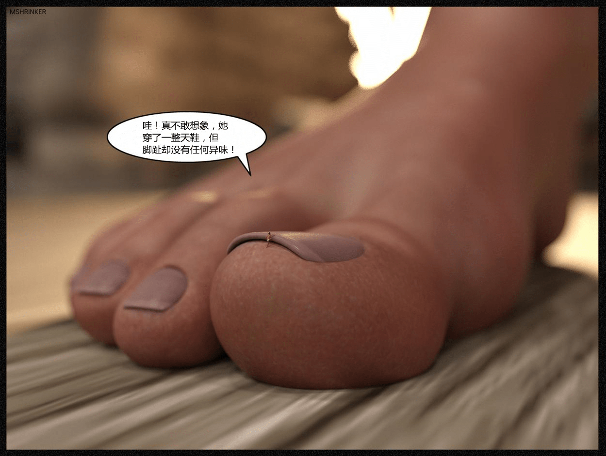

# THE CABIN 中文翻译 11.27更新完结！已补档

作者：18号

TID：29843

<title>1</title> <link href="../Styles/Style.css" type="text/css" rel="stylesheet">

# 1

*本帖最後由 18号 於 2020-11-28 15:34 編輯*

   全部剪裁成了单图，方便大家浏览。全篇翻译完毕，结合之前发布前150张又从新校对了一遍并合并成一个文件。下次会给大家带来此故事的前传，祝愉快！

       补档 [https://pan.baidu.com/s/1oOpOTLYWzqk1e6QKKSx47A](https://pan.baidu.com/s/1oOpOTLYWzqk1e6QKKSx47A) 提取码:9181 解压密码giantess

    作者d站主页[https://www.deviantart.com/mshrinker](https://www.deviantart.com/mshrinker)

<title>2</title> <link href="../Styles/Style.css" type="text/css" rel="stylesheet">

# 2

 <ignore_js_op>[147.jpg](forum.php?mod=attachment&aid=ODYwODJ8NjkzZTRjMmR8MTYzMjE4ODIxOXwxODIzMHwyOTg0Mw%3D%3D&nothumb=yes) *(903.99 KB, 下載次數: 18)*

[下載附件](forum.php?mod=attachment&aid=ODYwODJ8NjkzZTRjMmR8MTYzMjE4ODIxOXwxODIzMHwyOTg0Mw%3D%3D&nothumb=yes)

2020-11-21 20:16 上傳  

</ignore_js_op> <ignore_js_op>[2.jpg](forum.php?mod=attachment&aid=ODYwODF8MTVmZjkxZGR8MTYzMjE4ODIxOXwxODIzMHwyOTg0Mw%3D%3D&nothumb=yes) *(855.21 KB, 下載次數: 3)*

[下載附件](forum.php?mod=attachment&aid=ODYwODF8MTVmZjkxZGR8MTYzMjE4ODIxOXwxODIzMHwyOTg0Mw%3D%3D&nothumb=yes)

2020-11-21 20:16 上傳  

</ignore_js_op> <ignore_js_op>[193.jpg](forum.php?mod=attachment&aid=ODYxMzd8NWUxNmIzMTd8MTYzMjE4ODIxOXwxODIzMHwyOTg0Mw%3D%3D&nothumb=yes) *(585.9 KB, 下載次數: 1)*

[下載附件](forum.php?mod=attachment&aid=ODYxMzd8NWUxNmIzMTd8MTYzMjE4ODIxOXwxODIzMHwyOTg0Mw%3D%3D&nothumb=yes)

2020-11-27 19:13 上傳  

</ignore_js_op> <ignore_js_op>[250.jpg](forum.php?mod=attachment&aid=ODYxMzZ8MWIzYjBhNzN8MTYzMjE4ODIxOXwxODIzMHwyOTg0Mw%3D%3D&nothumb=yes) *(783.71 KB, 下載次數: 0)*

[下載附件](forum.php?mod=attachment&aid=ODYxMzZ8MWIzYjBhNzN8MTYzMjE4ODIxOXwxODIzMHwyOTg0Mw%3D%3D&nothumb=yes)

2020-11-27 19:12 上傳  

</ignore_js_op> <title>3</title> <link href="../Styles/Style.css" type="text/css" rel="stylesheet">

# 3

*本帖最後由 18号 於 2020-11-21 22:31 編輯*

> [斯佳摩妮 發表於 2020-11-21 21:33](https://giantessnight.com/gnforum2012/forum.php?mod=redirect&goto=findpost&pid=452369&ptid=29843)
> 么么哒，太喜欢MShrinker的作品了，18大辛苦

抬举了，倒是你，啥时候写文啊！<title>4</title> <link href="../Styles/Style.css" type="text/css" rel="stylesheet">

# 4

11月27号全篇翻译完毕！
<title>5</title> <link href="../Styles/Style.css" type="text/css" rel="stylesheet">

# 5

> [斯佳摩妮 發表於 2020-11-22 00:40](https://giantessnight.com/gnforum2012/forum.php?mod=redirect&goto=findpost&pid=452400&ptid=29843)
> 没精力啊，也不大懂大伙儿的兴奋点，自嗨还可以，写过几章也没什么亮点，嗯
> ...

可以尝试调戏与大小蔑视，呃……尽量放开些！
<title>6</title> <link href="../Styles/Style.css" type="text/css" rel="stylesheet">

# 6

这该死的百度云。。。。
<title>7</title> <link href="../Styles/Style.css" type="text/css" rel="stylesheet">

# 7

> [adsl47535090 發表於 2020-12-20 23:58](https://giantessnight.com/gnforum2012/forum.php?mod=redirect&goto=findpost&pid=454362&ptid=29843)
> 解压密码错误。。 不是giantess   额。。 尴尬了

怎么可能？               
<title>8</title> <link href="../Styles/Style.css" type="text/css" rel="stylesheet">

# 8

> [adsl47535090 發表於 2020-12-22 16:53](https://giantessnight.com/gnforum2012/forum.php?mod=redirect&goto=findpost&pid=454472&ptid=29843)
> 我终于知道是怎么回事了，我的网盘里面原来下载过这个漫画的英文版，名字和你用的名字是一样的，百度网盘 ...

啊···找到原因了啊···那就好！  下次我会注意一下文件的名字，给你造成困扰不好意思啦！！
<title>9</title> <link href="../Styles/Style.css" type="text/css" rel="stylesheet">

# 9

> [wiub 發表於 2020-12-27 10:15](https://giantessnight.com/gnforum2012/forum.php?mod=redirect&goto=findpost&pid=454731&ptid=29843)
> 之前接触过PS，脑补一下都感觉翻译是个艰巨的过程，大大辛苦了

呃···抛去工作之外，从决定到翻译完成大概一个半月左右，现在想来······