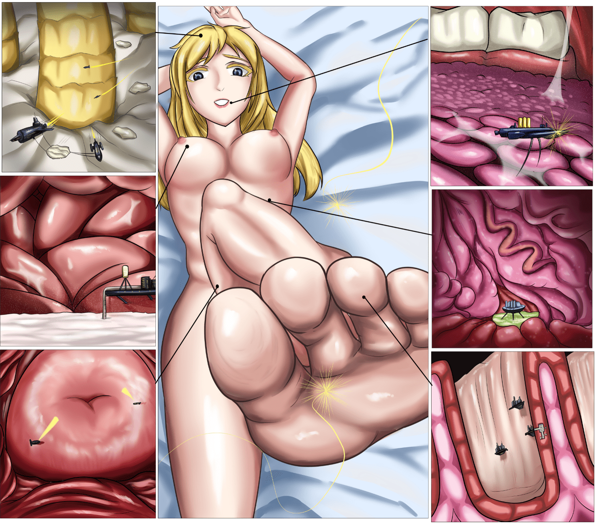

# 【单图】共存文明（微小，多元素）

作者：St2019

TID：30198

<title>1</title> <link href="../Styles/Style.css" type="text/css" rel="stylesheet">

# 1

一种微小的高级文明与普通人类女性达成共生关系。他们生活在宿主不同的部位并分配着不同的工作。
头皮的头屑被搬运用于建材，同时帮助宿主保养发质。
乳腺内的乳汁被用于食品加工和农业活动，同时监测乳汁分泌与营养情况并告知宿主。
私密的宫颈则被用于紧急避难，同时帮助检测宿主的妇科疾病。
舌头上的粘液被刮取制作粘合与溶解剂，同时分析并告知宿主其口腔卫生情况。
胃内的工厂负责利用气体产生能源，必要时可协助宿主修复粘膜损伤。
脚趾纹路的沟壑则被用于开拓新殖民地，将建筑建于皮肤内部。施工时向宿主皮肤注入强化结构液体，能让宿主的皮肤不易磨出水泡。
<title>2</title> <link href="../Styles/Style.css" type="text/css" rel="stylesheet">

# 2

 <ignore_js_op>[CV.PNG](forum.php?mod=attachment&aid=ODY5NjB8MWU2N2M1YmF8MTYzMjE4NTM4MXwxODIzMHwzMDE5OA%3D%3D&nothumb=yes) *(3.23 MB, 下載次數: 61)*

[下載附件](forum.php?mod=attachment&aid=ODY5NjB8MWU2N2M1YmF8MTYzMjE4NTM4MXwxODIzMHwzMDE5OA%3D%3D&nothumb=yes)

2021-1-23 22:09 上傳  

</ignore_js_op> <title>3</title> <link href="../Styles/Style.css" type="text/css" rel="stylesheet">

# 3

> [kale 發表於 2021-1-23 22:30](https://giantessnight.com/gnforum2012/forum.php?mod=redirect&goto=findpost&pid=457679&ptid=30198)
> 感觉这就和咱人体内的益生菌差不多啊……不知道这些微型文明会不会也帮忙杀杀菌之类的 ...

在我的设想里，这些小人与普通菌的最大区别就是高科技，所以他们不仅可以帮助杀菌，还能解决一些更进阶的问题，比如胃溃疡啊，跳蚤啥的。
<title>4</title> <link href="../Styles/Style.css" type="text/css" rel="stylesheet">

# 4

> [wayfarer123 發表於 2021-1-24 05:21](https://giantessnight.com/gnforum2012/forum.php?mod=redirect&goto=findpost&pid=457701&ptid=30198)
> 工。。工作细胞？？？目前工作细胞第二季以及工作细胞BLACK热映中。。
> 
> 还有一部工作细胞Lady，目前没有动 ...

B站看到了，等养肥了完结后一次性看个爽。
<title>5</title> <link href="../Styles/Style.css" type="text/css" rel="stylesheet">

# 5

> [libido 發表於 2021-1-25 00:54](https://giantessnight.com/gnforum2012/forum.php?mod=redirect&goto=findpost&pid=457775&ptid=30198)
> 草，lz画出了我多年一直以来的幻想(
> 
> 一点不成熟的小设想:

嗯，很好的想法。人身体上能利用的部分太多了，要不是时间和画工水平限制，我还想出一个巨娘全身“世界”概览图来着。
<title>6</title> <link href="../Styles/Style.css" type="text/css" rel="stylesheet">

# 6

> [焦冥小虫xxx 發表於 2021-1-25 03:25](https://giantessnight.com/gnforum2012/forum.php?mod=redirect&goto=findpost&pid=457780&ptid=30198)
> 兄弟真是越画越奈斯了啊!超赞的
> 或许外传里就有一个结局，D姐就和身上的远古h星人和平相处。就和老哥画的图 ...

谢谢~性高潮确实是一个进一步发展的好方法，感觉宿主在有需要的时候可以请求小人们帮她一把呢。在平等合作的关系下，只有请求了宿主的同意，小人们才能去刺激宿主的性器官。
不过已经做到这种程度的话，小人们想要黑化掌管身体也是轻而易举呢。毕竟这种大小和科技，人类女性想反抗都无力。也许有个别不守规矩的分支，就像你说的那样将宿主作为殖民地大肆散播改造，同时将宿主伪装成正常女性伺机控制她入侵其他分支的文明，进行侵略战争。这样就可以看到两个女生百合爱爱的时候一群微小的文明在她们体内外血战了。

<title>7</title> <link href="../Styles/Style.css" type="text/css" rel="stylesheet">

# 7

> [gw1990zzz 發表於 2021-1-26 17:20](https://giantessnight.com/gnforum2012/forum.php?mod=redirect&goto=findpost&pid=457910&ptid=30198)
> 其实人类也是地球的细菌没两样

差不多吧，要是细节拟人化的更多一点就更好了。
<title>8</title> <link href="../Styles/Style.css" type="text/css" rel="stylesheet">

# 8

> [jiko 發表於 2021-1-28 20:37](https://giantessnight.com/gnforum2012/forum.php?mod=redirect&goto=findpost&pid=458093&ptid=30198)
> 不知道作者玩过群星（Stellaris）吗？感觉可以就这个题材写一个星际文明和一些事件了。
> 
> 其实原本就想过写 ...

好像看到过但自己没玩过。如果把一个女人当作一个星球，那确实有宇宙的感觉了。不同星球交汇，冲突的可能性都有。