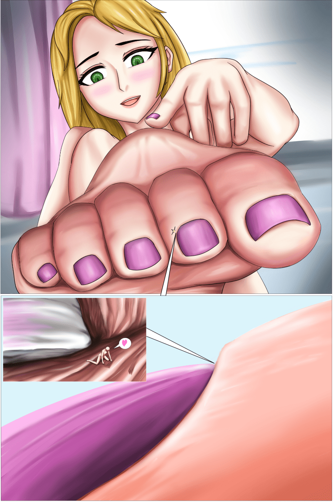

# 【缩小 足趾 】夹缝生存

作者：St2019

TID：30541

<title>1</title> <link href="../Styles/Style.css" type="text/css" rel="stylesheet">

# 1

[color=rgba(0, 0, 0, 0.88)]渺小的小人沉迷于巨娘脚趾甲缝隙的悠闲生活，吃着缝隙里脱落的皮屑，在趾缝里取暖，性致来了就摩擦着脚趾甲的肉缝发泄欲望。 

<title>2</title> <link href="../Styles/Style.css" type="text/css" rel="stylesheet">

# 2

 <ignore_js_op>[msnsf.PNG](forum.php?mod=attachment&aid=ODc5Mzh8N2M4NDk1N2R8MTYzMjE4MzgzNnwxODIzMHwzMDU0MQ%3D%3D&nothumb=yes) *(1.5 MB, 下載次數: 28)*

[下載附件](forum.php?mod=attachment&aid=ODc5Mzh8N2M4NDk1N2R8MTYzMjE4MzgzNnwxODIzMHwzMDU0MQ%3D%3D&nothumb=yes)

2021-3-17 04:53 上傳  

</ignore_js_op> <title>3</title> <link href="../Styles/Style.css" type="text/css" rel="stylesheet">

# 3

> [jiko 發表於 2021-3-17 05:04](https://giantessnight.com/gnforum2012/forum.php?mod=redirect&goto=findpost&pid=463046&ptid=30541)
> 突然想到从生物演化的角度说，小人没有天敌+食物充足+无复杂运动，没有选择压力，不知道会演化出什么奇怪的 ...

可能会具有更多为巨娘服务而存在的特性吧~
<title>4</title> <link href="../Styles/Style.css" type="text/css" rel="stylesheet">

# 4

> [咕咕的攸栗 發表於 2021-3-17 09:29](https://giantessnight.com/gnforum2012/forum.php?mod=redirect&goto=findpost&pid=463052&ptid=30541)
> 对于足控来说简直就是天堂啊，而且涂了指甲油更性感了

哈哈哈同感同感 平时除了脚趾也可以去其他部位逛逛
<title>5</title> <link href="../Styles/Style.css" type="text/css" rel="stylesheet">

# 5

> [kale 發表於 2021-3-17 23:35](https://giantessnight.com/gnforum2012/forum.php?mod=redirect&goto=findpost&pid=463092&ptid=30541)
> hhh看上去很不错呢，我也想生活在巨大妹子的脚趾缝里啊（趴）。
> 不过小人这样子在妹子平时跑步的时候会受到 ...

那就只能缩到更深处藏起来啦
<title>6</title> <link href="../Styles/Style.css" type="text/css" rel="stylesheet">

# 6

> [择一鞋终老 發表於 2021-3-18 11:27](https://giantessnight.com/gnforum2012/forum.php?mod=redirect&goto=findpost&pid=463114&ptid=30541)
> 这个大小爱了爱了，只有足够渺小才能生活嘛

缩的更小=生存空间更大，有效解决小人住房问题
<title>7</title> <link href="../Styles/Style.css" type="text/css" rel="stylesheet">

# 7

> [丿醉卧杀场 發表於 2021-3-25 08:16](https://giantessnight.com/gnforum2012/forum.php?mod=redirect&goto=findpost&pid=463614&ptid=30541)
> 楼主的老粉了 顶顶顶 ，画的是真心好

谢谢支持啦！你们的顶就是我的动力了