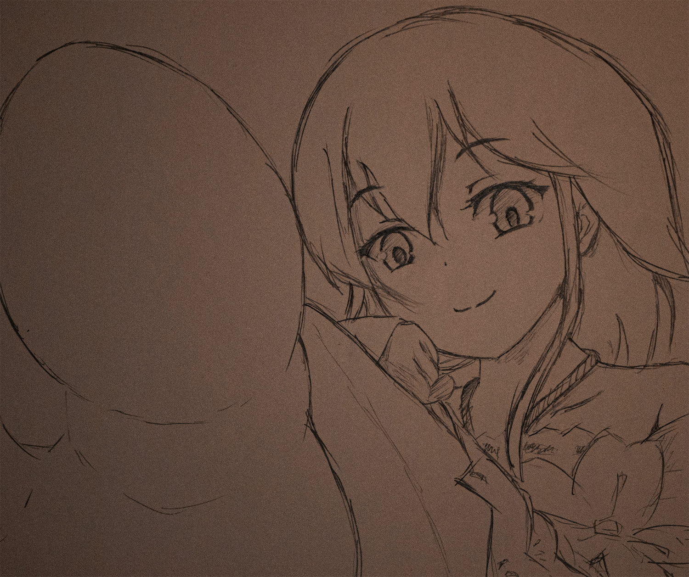
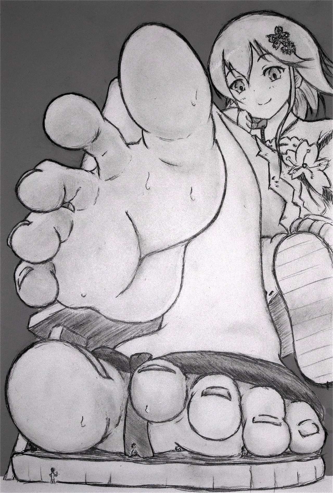
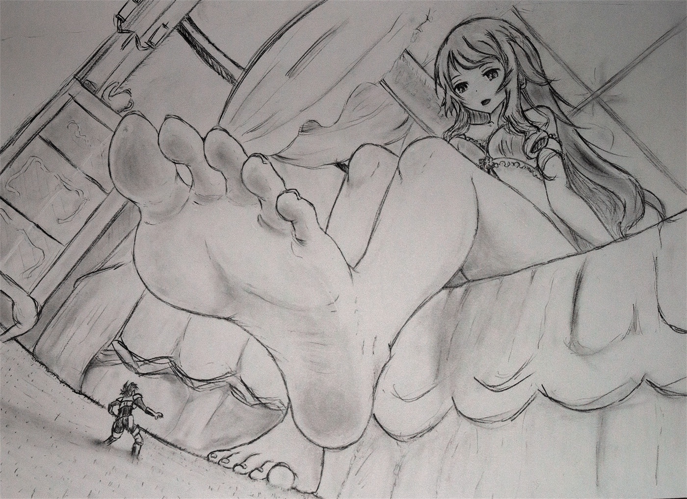
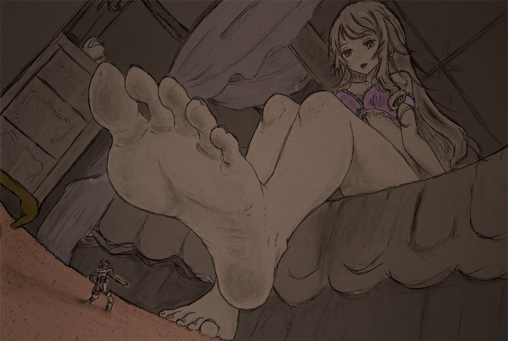
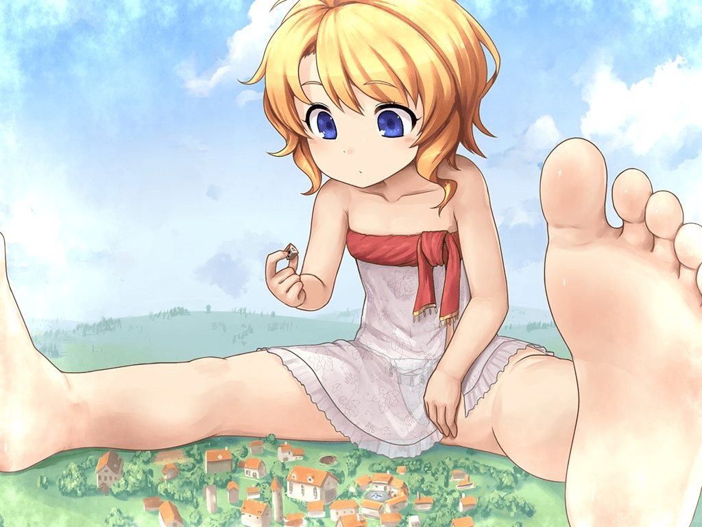

# 【雜談】嘗試臨摹GTS畫師的作品

作者：sidefx

TID：27821

<title>1</title> <link href="../Styles/Style.css" type="text/css" rel="stylesheet">

# 1

*本帖最後由 sidefx 於 2020-1-17 18:10 編輯*

"如果我先臨摹一下再發出來，是不是就可以分享版權物了"
と
思いました。 （ˊ_>ˋ）

實際卻變成了“必須是版權物，否則就沒有意義了”這種感覺。

所以還是改個標題，就是作爲類似絵日記這種形式，看到感覺不錯的作品就去試著臨摹一下。
這樣一來範圍會大一些。

先来两张试一下。用板子好像有點犯規，我就直接畫紙上好了。

這次就從CG哥([www.patreon.com/CG17](http://www.patreon.com/CG17))開始。

第一張(認識這個的人應該有吧)：

[原畫：[https://www.patreon.com/posts/xuanying-15795352](https://www.patreon.com/posts/xuanying-15795352)]

當年commission這張的也是我。
我其實很少去commission，因爲總覺得“會不會又讓畫師畫了不喜歡/不擅長的内容”，但是既然被抽中了那就來一張吧。
一大頁的要求發出去以後才想起“爲什麽不直接寫中文呢” (;^_^
結果還是非常滿意的，後來臨摹了不下20遍。

這次省略了不重要的細節。很多地方還想改，但是再擦的話紙就要擦爛了。
表情偏軟，臉上的陰影也省略了，和原畫有點微妙的不同。
(看過原畫的應該知道，原畫的表情是類似這樣的：)

要説爲什麽，應該是個人喜好吧。個人還是希望gts能看起來更開心一點。
"我們只是灰塵而已，你并沒有在做什麽壞事，爲什麽要擺出好像在做壞事的表情呢？"
"請不要有任何心理上的負擔，愉快地享受這個過程就好。"
大概就這種感覺。
我大约的确已經沒救了 (ˊ<_ˋ  )rz
另外就是試圖展示一種“小人小到幾乎看不清”的感覺，結果好像做得有點過了，但是也沒辦法改了。

再來一張, 同樣是CG哥的, 這張就和我沒有任何關係了。

[原畫：[https://www.patreon.com/posts/human-hunter-18156481](https://www.patreon.com/posts/human-hunter-18156481)]

畫完以後感覺還行，但是發現一個問題：

完全忘記小人的存在了 (;^_^
變成普通的足控圖了....

擦了再加比較麻煩，暫時就這樣吧。

以後會試著不定期更新。

<title>2</title> <link href="../Styles/Style.css" type="text/css" rel="stylesheet">

# 2

 <ignore_js_op>[face.png](forum.php?mod=attachment&aid=ODA4MjF8NmQyOTdiZjl8MTYzMjE4Mzk4NHwxODIzMHwyNzgyMQ%3D%3D&nothumb=yes) *(3.34 MB, 下載次數: 6)*

[下載附件](forum.php?mod=attachment&aid=ODA4MjF8NmQyOTdiZjl8MTYzMjE4Mzk4NHwxODIzMHwyNzgyMQ%3D%3D&nothumb=yes)

2020-1-8 06:32 上傳  

</ignore_js_op> <ignore_js_op>[1.png](forum.php?mod=attachment&aid=ODA4Mjl8ZjhiNDI4MWN8MTYzMjE4Mzk4NHwxODIzMHwyNzgyMQ%3D%3D&nothumb=yes) *(5.45 MB, 下載次數: 32)*

[下載附件](forum.php?mod=attachment&aid=ODA4Mjl8ZjhiNDI4MWN8MTYzMjE4Mzk4NHwxODIzMHwyNzgyMQ%3D%3D&nothumb=yes)

2020-1-9 06:35 上傳  

</ignore_js_op> <ignore_js_op>[2.jpg](forum.php?mod=attachment&aid=ODA4MzB8NDE2MWNmZDJ8MTYzMjE4Mzk4NHwxODIzMHwyNzgyMQ%3D%3D&nothumb=yes) *(2.13 MB, 下載次數: 1)*

[下載附件](forum.php?mod=attachment&aid=ODA4MzB8NDE2MWNmZDJ8MTYzMjE4Mzk4NHwxODIzMHwyNzgyMQ%3D%3D&nothumb=yes)

2020-1-9 06:35 上傳  

</ignore_js_op> <title>3</title> <link href="../Styles/Style.css" type="text/css" rel="stylesheet">

# 3

*本帖最後由 sidefx 於 2020-1-10 06:40 編輯*

再來張白兎的，重點以外的部分就隨便畫了：

試著通過簡單的後期處理製造點不一樣的感覺：

【原畫： **「ピンクの洞窟」**[https://www.melonbooks.co.jp/detail/detail.php?product_id=564738](https://www.melonbooks.co.jp/detail/detail.php?product_id=564738) 】
依舊是表情有些變化，而且這回不是有意的 (ˊ_>ˋ)。
這應該是這本裏個人最喜歡的一張的，非常有魄力的curvilinear。
地毯也是我最喜歡的元素之一，相當於在不同距離加入了大量的參照物，對於表現大小的反差很有效。
第一眼還以爲是ななかぐら（我這張不像，原圖比較像）。

(現在MelonBooks.co.jp上也有電子書了，不需要日本IP了)
(MelonBooksDL其實也只需要跳一下，比如用SoftEther)

<title>4</title> <link href="../Styles/Style.css" type="text/css" rel="stylesheet">

# 4

 <ignore_js_op>[3.png](forum.php?mod=attachment&aid=ODA4Mjh8Yjg2MmFlNDR8MTYzMjE4Mzk4NHwxODIzMHwyNzgyMQ%3D%3D&nothumb=yes) *(2.95 MB, 下載次數: 7)*

[下載附件](forum.php?mod=attachment&aid=ODA4Mjh8Yjg2MmFlNDR8MTYzMjE4Mzk4NHwxODIzMHwyNzgyMQ%3D%3D&nothumb=yes)

2020-1-9 06:28 上傳  

</ignore_js_op> <ignore_js_op>[4.png](forum.php?mod=attachment&aid=ODA4MzF8YzdkNzNhYjh8MTYzMjE4Mzk4NHwxODIzMHwyNzgyMQ%3D%3D&nothumb=yes) *(1.84 MB, 下載次數: 16)*

[下載附件](forum.php?mod=attachment&aid=ODA4MzF8YzdkNzNhYjh8MTYzMjE4Mzk4NHwxODIzMHwyNzgyMQ%3D%3D&nothumb=yes)

2020-1-9 06:40 上傳  

</ignore_js_op> <title>5</title> <link href="../Styles/Style.css" type="text/css" rel="stylesheet">

# 5

*本帖最後由 sidefx 於 2020-1-9 02:27 編輯*

> [轩辕剑 發表於 2020-1-9 01:43](https://giantessnight.com/gnforum2012/forum.php?mod=redirect&goto=findpost&pid=422217&ptid=27821)
> 白兔这张无限加载。看不到哇
> 楼主画的非常符合我的胃口

看來imgur外鏈好像用不成，我都改成附件吧 。(測試了一下，會無限加載的browser還不少)

不好意思只能等上傳限制重置以後再傳了。

<title>6</title> <link href="../Styles/Style.css" type="text/css" rel="stylesheet">

# 6

> [轩辕剑 發表於 2020-1-9 01:43](https://giantessnight.com/gnforum2012/forum.php?mod=redirect&goto=findpost&pid=422217&ptid=27821)
> 白兔这张无限加载。看不到哇
> 楼主画的非常符合我的胃口

久等了，現在應該好了。
<title>7</title> <link href="../Styles/Style.css" type="text/css" rel="stylesheet">

# 7

*本帖最後由 sidefx 於 2020-1-17 19:23 編輯*

更新一下吧。

前幾天看到這個感覺不錯：

[來源：[https://twitter.com/tokinokogiri/status/1216684557803458560](https://twitter.com/tokinokogiri/status/1216684557803458560)]

另外，存在一個小問題：
對本人來説最重要的部分有一半不在畫面内。
足看不全感覺很残念啊，試著順便補一下：

水平有限，盡力了 (｡ŏ_ŏ)
鉛筆上色也比較無力，這回直接中途就放棄了，下回還是上板子好了。

另外想做的一件事是試著去改變一下透視效果，看怎樣可以拉近觀察點和gts的距離，不同的透視效果量產幾張之類的，等以後有時間再來吧。
<title>8</title> <link href="../Styles/Style.css" type="text/css" rel="stylesheet">

# 8

 <ignore_js_op>[__.jpg](forum.php?mod=attachment&aid=ODA4Njh8MDgzMTU3OWF8MTYzMjE4Mzk4NHwxODIzMHwyNzgyMQ%3D%3D&nothumb=yes) *(1.77 MB, 下載次數: 2)*

[下載附件](forum.php?mod=attachment&aid=ODA4Njh8MDgzMTU3OWF8MTYzMjE4Mzk4NHwxODIzMHwyNzgyMQ%3D%3D&nothumb=yes)

2020-1-17 19:16 上傳  

</ignore_js_op> <ignore_js_op>[image-web.jpg](forum.php?mod=attachment&aid=ODA4NjZ8MmViOGIxMTl8MTYzMjE4Mzk4NHwxODIzMHwyNzgyMQ%3D%3D&nothumb=yes) *(139.34 KB, 下載次數: 0)*

[下載附件](forum.php?mod=attachment&aid=ODA4NjZ8MmViOGIxMTl8MTYzMjE4Mzk4NHwxODIzMHwyNzgyMQ%3D%3D&nothumb=yes)

2020-1-17 18:16 上傳  

</ignore_js_op> <title>9</title> <link href="../Styles/Style.css" type="text/css" rel="stylesheet">

# 9

> [wyh9284908 發表於 2020-1-18 17:57](https://giantessnight.com/gnforum2012/forum.php?mod=redirect&goto=findpost&pid=422868&ptid=27821)
> 楼主的脸画的已经很可爱了，有一种跟原画相同的感觉了。不过足稍微还有些欠缺，不够那么饱满，可以试试多临 ...

之前就一直有 “足真的是怎麽畫都會崩啊” 這種感覺 (*￣□￣)
有時以爲是照著白兎那個感覺走的，但是畫出來就完全不對了。

後來買了個模型，先用那個練一段時間吧。(*•ω•)

<title>10</title> <link href="../Styles/Style.css" type="text/css" rel="stylesheet">

# 10

突然想起來，這邊好久沒更新了 

其實後來在twitter也貼了一些，不過原圖的選擇比較單一，只有我自己commission的圖 xD

很多都是半成品或者局部，或者就是gts元素不是很强的。

整個搬過來感覺怪怪的，貼個link+preview好了 xD

[https://twitter.com/bibun_kanou/media](https://twitter.com/bibun_kanou/media)