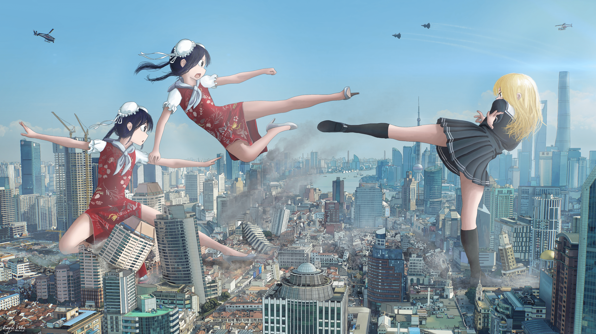
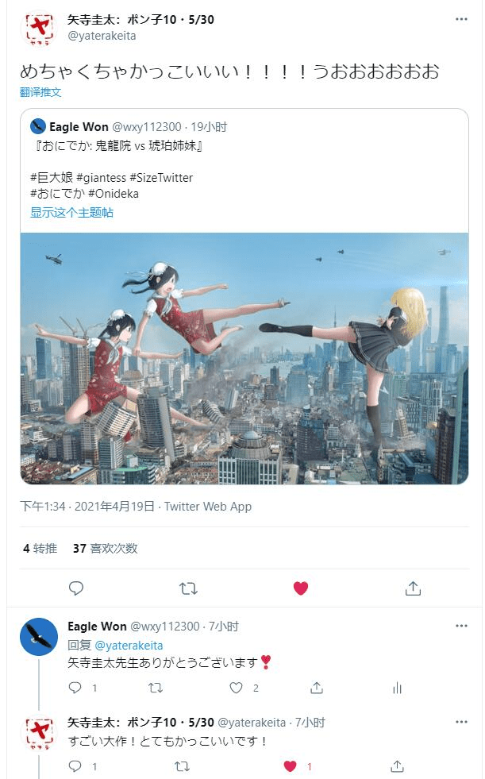
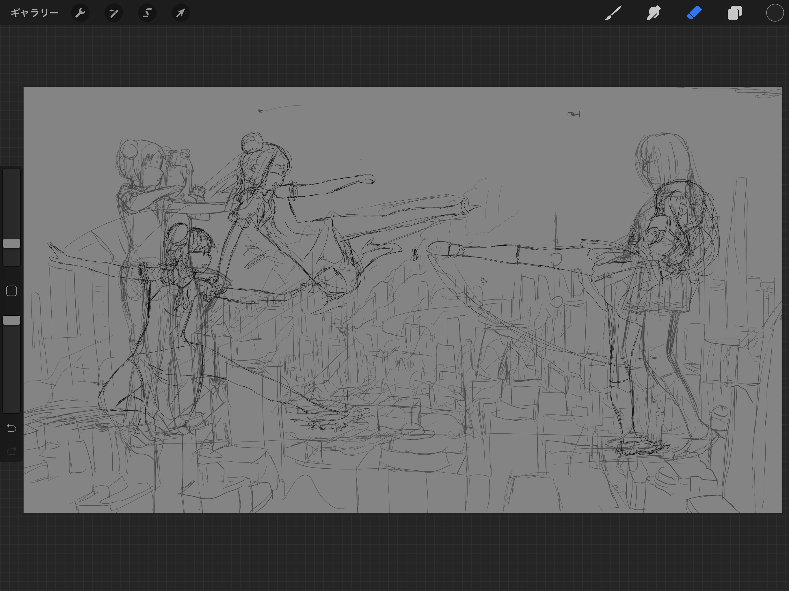
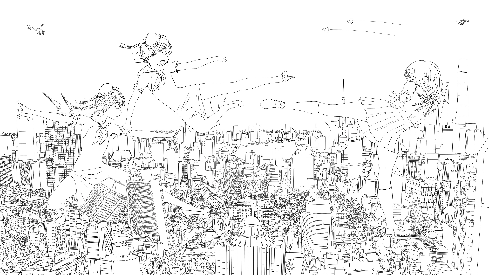
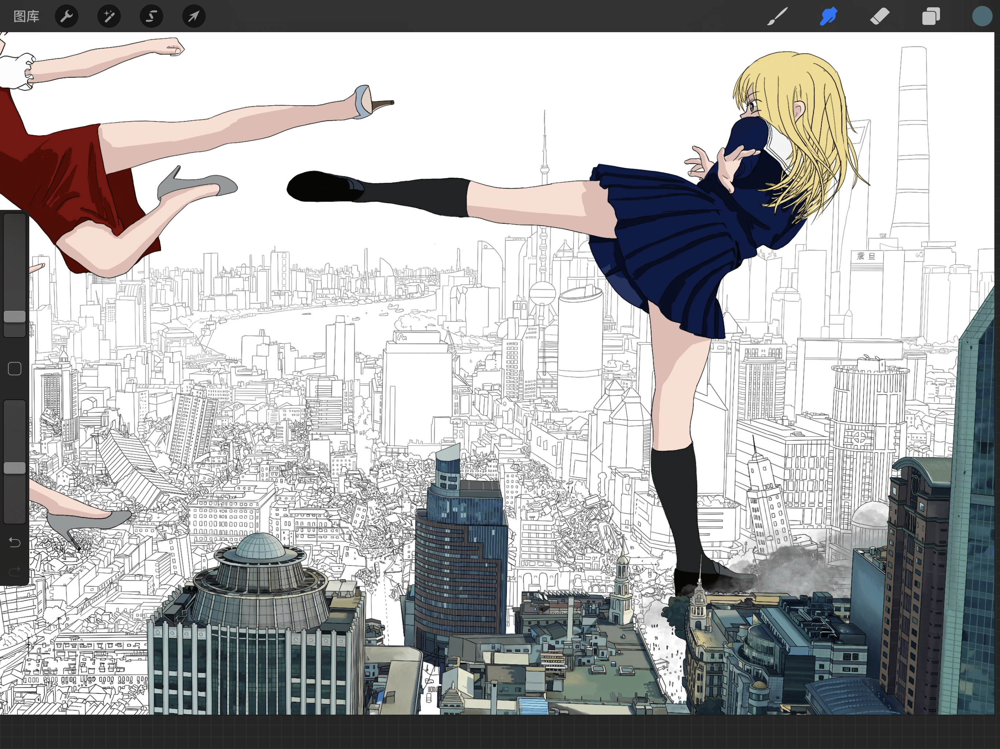
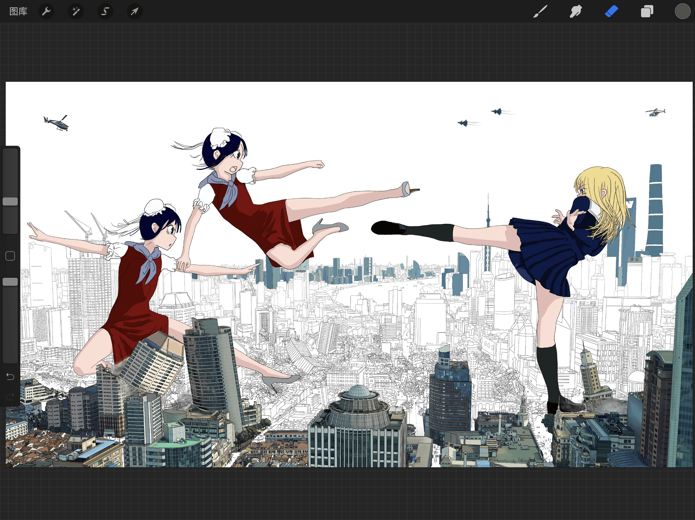
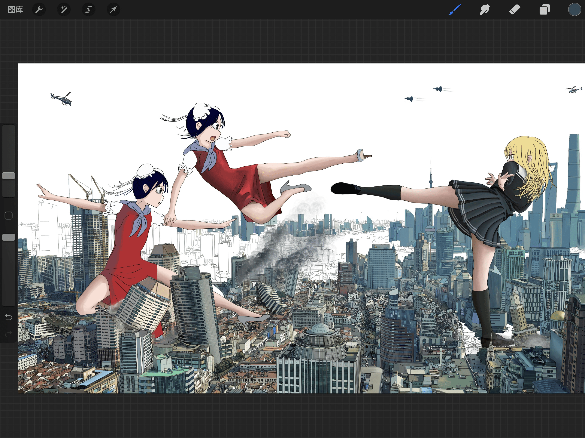
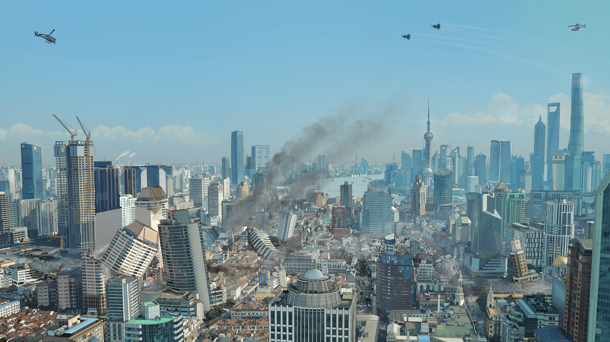

# おにでか： 鬼龍院 vs 琥珀姉妹

作者：wxy112300

TID：30733

<title>1</title> <link href="../Styles/Style.css" type="text/css" rel="stylesheet">

# 1

距离上一次画初音已经过去了五个月了，是时候发下一张图了
这次的题材是『おにでか』，国内大部分都翻译成《巨大的她》，也算是少有的能出完系列的GTS作品了，之前去日本的时候直接买了一套漫画作为收藏。
直接上图吧：
<ignore_js_op></ignore_js_op> **Onideka.PNG** *(11.69 MB, 下載次數: 3)*

[下載附件](forum.php?mod=attachment&aid=ODgzNzF8NjVkNWRiNGR8MTYzMjE4MDMzMnwxODIzMHwzMDczMw%3D%3D&nothumb=yes)

2021-4-19 21:37 上傳 
推特：[https://twitter.com/wxy112300/status/1383852407914844165](https://twitter.com/wxy112300/status/1383852407914844165)
P站：[https://www.pixiv.net/artworks/89249880](https://www.pixiv.net/artworks/89249880)
这次确实是彻底的偏离了巨大娘图的重点
画巨大娘❌
画背景⭕️
结果还是把背景画的细致过头了，不过这次得到了原作者的翻牌子，还是开心的不行（诶嘿
<ignore_js_op></ignore_js_op> **Twitter.jpg** *(73.3 KB, 下載次數: 0)*

[下載附件](forum.php?mod=attachment&aid=ODgzNzJ8OWFhMDE4YjJ8MTYzMjE4MDMzMnwxODIzMHwzMDczMw%3D%3D&nothumb=yes)

2021-4-19 21:43 上傳 
年初去上海玩的时候，狠心定了个非常壕的酒店，不得不说窗外的风景真的非常不错，然后看着外面就想到了Onideka在上海大战的这段剧情，不如把上海烧成灰吧（不是
然后，所以就干脆画出来好了，结果就这么画了81个小时...
和以前一样放一下过程稿吧：
<ignore_js_op></ignore_js_op> **01.PNG** *(2.31 MB, 下載次數: 0)*

[下載附件](forum.php?mod=attachment&aid=ODgzNzN8YjZmNjkyYWF8MTYzMjE4MDMzMnwxODIzMHwzMDczMw%3D%3D&nothumb=yes)

2021-4-19 21:50 上傳 
线稿改了几次，第一次感觉动作太死板太僵硬了，然后就又画出了另一版的稿子，也就是现在这版了；
<ignore_js_op></ignore_js_op> **02.PNG** *(2.3 MB, 下載次數: 0)*

[下載附件](forum.php?mod=attachment&aid=ODgzNzR8ODY1MDlmNzN8MTYzMjE4MDMzMnwxODIzMHwzMDczMw%3D%3D&nothumb=yes)

2021-4-19 21:51 上傳 
这是最终线稿，也是花了相当长的时间；
<ignore_js_op></ignore_js_op> **03.PNG** *(1.36 MB, 下載次數: 0)*

[下載附件](forum.php?mod=attachment&aid=ODgzNzV8Y2FhODYxM2F8MTYzMjE4MDMzMnwxODIzMHwzMDczMw%3D%3D&nothumb=yes)

2021-4-19 21:51 上傳 
然后就是上色了
<ignore_js_op></ignore_js_op> **04.PNG** *(1.29 MB, 下載次數: 0)*

[下載附件](forum.php?mod=attachment&aid=ODgzNzZ8MDkwMzM1Njd8MTYzMjE4MDMzMnwxODIzMHwzMDczMw%3D%3D&nothumb=yes)

2021-4-19 21:51 上傳 
再加上一点点的细节
<ignore_js_op></ignore_js_op> **05.PNG** *(1.32 MB, 下載次數: 0)*

[下載附件](forum.php?mod=attachment&aid=ODgzNzd8Y2IyM2FhNjV8MTYzMjE4MDMzMnwxODIzMHwzMDczMw%3D%3D&nothumb=yes)

2021-4-19 21:51 上傳 
背景的细节确实相当的多（我不会告诉你们左上角的直升机上面写着CCAV的）
<ignore_js_op></ignore_js_op> **06.JPG** *(2.51 MB, 下載次數: 4)*

[下載附件](forum.php?mod=attachment&aid=ODgzNzh8NWI4YzdhZjR8MTYzMjE4MDMzMnwxODIzMHwzMDczMw%3D%3D&nothumb=yes)

2021-4-19 21:51 上傳 
完成的背景，可以看出来有一小块区域因为被人挡着所以其实没画（摸了
然后就是画人的细节了，接下来是打了一堆气氛雾和光影（我是真的喜欢用镜头光晕，似乎每一张里都会有）
最后终于画完了~

跑了 <title>2</title> <link href="../Styles/Style.css" type="text/css" rel="stylesheet">

# 2

> [xnr 發表於 2021-4-20 00:40](https://giantessnight.com/gnforum2012/forum.php?mod=redirect&goto=findpost&pid=465680&ptid=30733)
> 厉害！我还以为你的背景是照片PS的，没想到是一笔一笔画出来的

谢谢XNR大！因为破坏场景比较多吧，靠PS的话可能还是会不自然吧
不过确实这样太耗时了
<title>3</title> <link href="../Styles/Style.css" type="text/css" rel="stylesheet">

# 3

> [64787264 發表於 2021-4-20 11:13](https://giantessnight.com/gnforum2012/forum.php?mod=redirect&goto=findpost&pid=465705&ptid=30733)
> 太强了....实在是太强了....画画人流下了不甘的泪水

还是要靠广大画画人ghs
我这里的产量实在太低了
<title>4</title> <link href="../Styles/Style.css" type="text/css" rel="stylesheet">

# 4

> [null 發表於 2021-4-20 13:33](https://giantessnight.com/gnforum2012/forum.php?mod=redirect&goto=findpost&pid=465717&ptid=30733)
> 身为上海人看到这背景真的，太厉害了。虽然黄浦江被拆了哈哈哈哈

原漫画里还有一段，两边打起来的时候一个人大喊“国际问题！”，还有说租界时代的宝贵建筑遗产都被毁掉了~
可能上海人会更有代入感（笑

<title>5</title> <link href="../Styles/Style.css" type="text/css" rel="stylesheet">

# 5

> [黒茶鯖虎 發表於 2021-4-20 17:39](https://giantessnight.com/gnforum2012/forum.php?mod=redirect&goto=findpost&pid=465731&ptid=30733)
> 主要是这漫画后面涉及到了计划生育事件，有影射的嫌疑，所以涉嫌辱华，还有后面还涉及一位敏感人物的画像 ...

所以一直都受不了这些网络二极管，整天戴着有色眼镜去找全世界每一个乳化的点然后去疯狂出征。
Onideka里的中国元素基本都是善意的，里面中国的形象也并不负面，而且计划生育也确实是一个现实问题，甚至到2021年了还没被取消，并不是被一个外国漫画家画出来了这个问题就不存在了；伟人画像也并没什么问题，只是为了阻止对方继续打下去的而已，甚至还可以算是搞笑元素之一。

现在的网络变得真敏感啊，还是10多年的时候那个包容开放的互联网更好一些
<title>6</title> <link href="../Styles/Style.css" type="text/css" rel="stylesheet">

# 6

> [Dante 發表於 2021-5-5 22:03](https://giantessnight.com/gnforum2012/forum.php?mod=redirect&goto=findpost&pid=467420&ptid=30733)
> .
> 強到不知該如何形容，只能跪了。

野生的但大又出现了！捕捉成功
