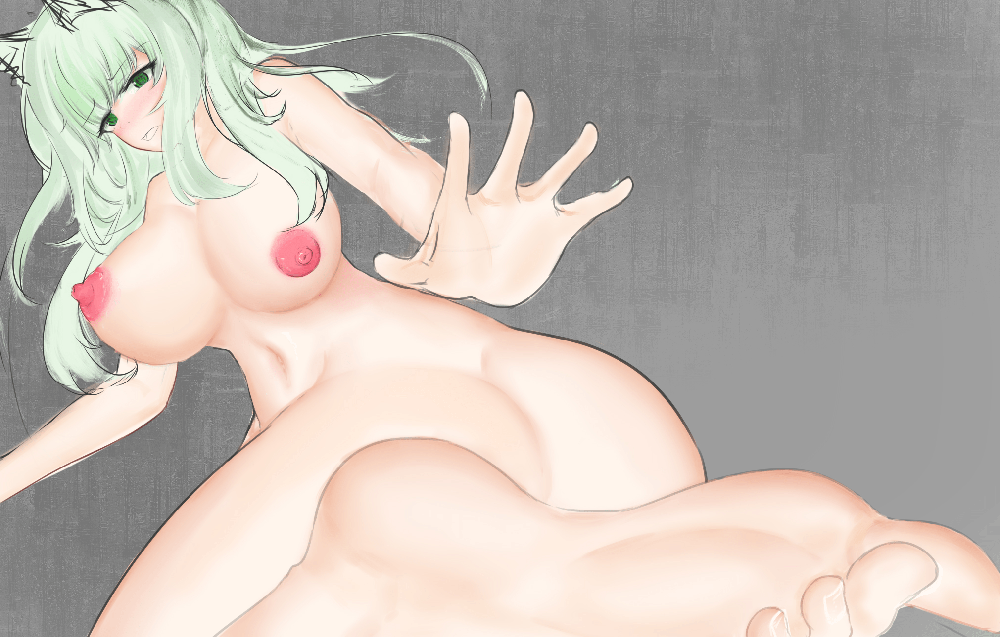
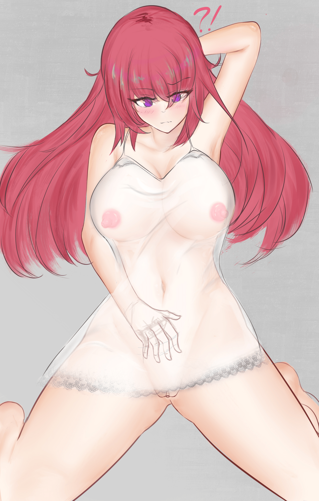
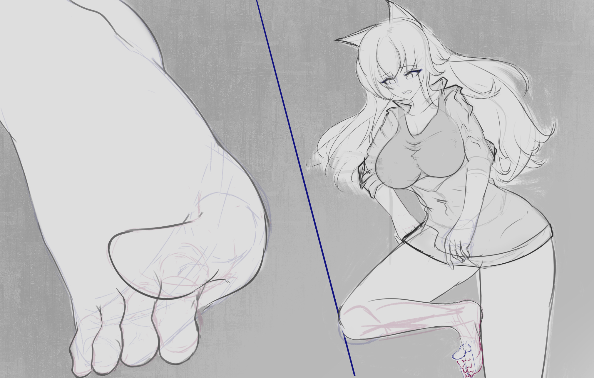

# 一些摸鱼

作者：回收站站员

TID：30768

<title>1</title> <link href="../Styles/Style.css" type="text/css" rel="stylesheet">

# 1

*本帖最後由 回收站站员 於 2021-5-12 02:55 編輯*

Restless                                                                                 <title>2</title> <link href="../Styles/Style.css" type="text/css" rel="stylesheet">

# 2

*本帖最後由 回收站站员 於 2021-5-12 02:50 編輯*

十分潦草的一张摸鱼，没有细节，（如果推特上有喜欢就会重置一下，跟之前的凯太后那个图一样hhh

其实这张，本来是不太打算发出来的，，，<title>3</title> <link href="../Styles/Style.css" type="text/css" rel="stylesheet">

# 3

*本帖最後由 回收站站员 於 2021-5-12 02:50 編輯*

其中一张在制品，喝醉了酒的产物。
回过神来猛然感觉——这不跟以前自己画过的一个构图差不多嘛，
于是就开始纠结要不要把它画完（摊手<title>4</title> <link href="../Styles/Style.css" type="text/css" rel="stylesheet">

# 4

> 焦冥小虫xxx 發表於 2021-4-25 11:15
> 站长加油(ง •̀_•́)ง，技术力越发地成熟了呢

耶(›´ω`‹ )                              <title>5</title> <link href="../Styles/Style.css" type="text/css" rel="stylesheet">

# 5

> scale君 發表於 2021-4-25 14:00
> 别说了，开冲就没错，对吧？（咕啾咕啾）

少废话，多画画，嗷嗷(›´ω`‹ )                        <title>6</title> <link href="../Styles/Style.css" type="text/css" rel="stylesheet">

# 6

考完试了，大体感觉还行。
三张图，弃了。
发点牢骚，我现在有点弄不明白为啥自己要怎么徒劳了，在绘画的最根本上什么都不明白，难道我就是为了那么一丁点可怜的认同感而把身子累垮、耽误我自己本身？
对V姐的追忆现在差不多是全部的动力了，但我这技术，在怎么使劲我始终感觉——自己终归就是一可有可无的人，也许专业画画的事情就该交给专业的人来干，而且v姐技术上、主题上的继承者已经有了，我越发的感觉自己在绘画上的奋斗是完全没用的。
我确实很爱这个圈子、很爱绘画，我想倾尽全力，想进一切办法投入并提高自己的技术。但现在我只希望从来没有与ACG相遇。
或许我需要再努力很长一段时间，又或我应该选择永远离开。
不需要有什么安慰的话，只是一个声明，帖子过两天就删。<title>7</title> <link href="../Styles/Style.css" type="text/css" rel="stylesheet">

# 7

 <ignore_js_op>[temp17.jpg](forum.php?mod=attachment&aid=ODg3MzR8MmI0OWIxMDl8MTYzMjE4MDYzOXwxODIzMHwzMDc2OA%3D%3D&nothumb=yes) *(1.2 MB, 下載次數: 2)*

[下載附件](forum.php?mod=attachment&aid=ODg3MzR8MmI0OWIxMDl8MTYzMjE4MDYzOXwxODIzMHwzMDc2OA%3D%3D&nothumb=yes)

2021-5-11 00:48 上傳  

</ignore_js_op> <ignore_js_op>[temp18.jpg](forum.php?mod=attachment&aid=ODg3MzV8MzU5YzMzZmJ8MTYzMjE4MDYzOXwxODIzMHwzMDc2OA%3D%3D&nothumb=yes) *(1.28 MB, 下載次數: 2)*

[下載附件](forum.php?mod=attachment&aid=ODg3MzV8MzU5YzMzZmJ8MTYzMjE4MDYzOXwxODIzMHwzMDc2OA%3D%3D&nothumb=yes)

2021-5-11 00:49 上傳  

</ignore_js_op> <ignore_js_op>[temp19.jpg](forum.php?mod=attachment&aid=ODg3MzZ8ZDI0ZmJiYTJ8MTYzMjE4MDYzOXwxODIzMHwzMDc2OA%3D%3D&nothumb=yes) *(974.36 KB, 下載次數: 2)*

[下載附件](forum.php?mod=attachment&aid=ODg3MzZ8ZDI0ZmJiYTJ8MTYzMjE4MDYzOXwxODIzMHwzMDc2OA%3D%3D&nothumb=yes)

2021-5-11 00:49 上傳  

</ignore_js_op> <title>8</title> <link href="../Styles/Style.css" type="text/css" rel="stylesheet">

# 8

> [St2019 發表於 2021-5-11 02:32](https://giantessnight.com/gnforum2012/forum.php?mod=redirect&goto=findpost&pid=468146&ptid=30768)
> 画画嘛不必一定要追求满足别人的想法，或者要达到很专业的水平，或者继承谁谁的风格，重要的是可以作为表达 ...

从很久前就感觉，自己可能已经不再喜欢这个题材了。逐渐对所谓动漫、二次元的兴趣，也再慢慢丧失。也没有什么特别想要表达的，我只想一心提高硬技术，而现在却感到徒劳。一边练习练习，一边等等看看俺月底考试成绩如何吧，不行我就退圈找个班上。