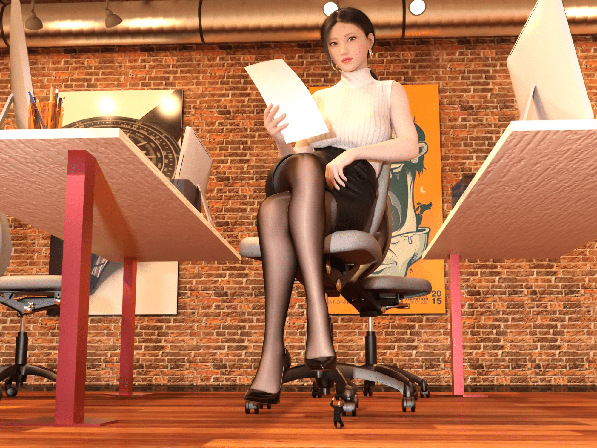

# 不好好工作的后果（劳动节单图）

作者：nhbnfn

TID：30828

 

# 1

**OL new.png** *(3.86 MB, 下載次數: 12)*

[下載附件](forum.php?mod=attachment&aid=ODg2MzV8NWM0OGRmMzl8MTYzMjE4MDY4M3wxODIzMHwzMDgyOA%3D%3D&nothumb=yes)

2021-5-4 15:51 上傳

五一照着别的大佬的图摸了一张这玩意出来。。那位大佬可以做成海报一样的效果 相较下我这就有点low了 大概意思是 OL看着手上的报表 发现某位员工消极怠工导致业绩下滑 缩小他以示惩罚

 

# 2

> [vipergtr 發表於 2021-5-4 18:53](https://giantessnight.com/gnforum2012/forum.php?mod=redirect&goto=findpost&pid=467239&ptid=30828)

> 像这样的海报化吗

卧槽 大佬好厉害 可以询问下这是怎么做的嘛

 

# 3

> [vipergtr 發表於 2021-5-4 21:03](https://giantessnight.com/gnforum2012/forum.php?mod=redirect&goto=findpost&pid=467256&ptid=30828)

> 还有个事，脚是刻意悬空的吗，还是后跟担在转椅腿上了

说来也挺尴尬的 她的这个姿势原来和这个椅子不相配的 所以看起来高跟鞋没有找地 看着很怪。。姿势的问题，没有调整好。并非刻意悬空，选中姿势之后移到椅子上发现椅子高了。然后就没有去管这个事。。

 

# 4

> [咕咕的攸栗 發表於 2021-5-4 20:33](https://giantessnight.com/gnforum2012/forum.php?mod=redirect&goto=findpost&pid=467254&ptid=30828)

> 真的太赞了，我都希望自己是那位被缩小的员工

谢谢捧场俺也这么想的 这个场景也是在我想象中构思了挺久的，还好做出来效果还行

 

# 5

> 咕咕的攸栗 發表於 2021-5-4 20:33

> 真的太赞了，我都希望自己是那位被缩小的员工

非常感谢您的回复和支持！我也这么想的hhhh 

# 6

> [丿醉卧杀场 發表於 2021-5-8 23:17](https://giantessnight.com/gnforum2012/forum.php?mod=redirect&goto=findpost&pid=467872&ptid=30828)

> 大哥太厉害了作品真的非常不错啊哈哈哈哈

感谢您的回复!希望您能喜欢!

 

# 7

> [awds713 發表於 2021-5-9 15:54](https://giantessnight.com/gnforum2012/forum.php?mod=redirect&goto=findpost&pid=467954&ptid=30828)

> 介黑丝质感太顶了，冲了冲了￣▽￣)

谢谢!下次换个更顶的还有您头像的画师也是本人非常钦慕的一位大佬，假若可以做成这样的效果就好了

 

# 8

> [kraistain 發表於 2021-5-9 22:12](https://giantessnight.com/gnforum2012/forum.php?mod=redirect&goto=findpost&pid=467998&ptid=30828)

> 上班摸鱼的全部给我缩小等踩！！！

您说的很对XD就是想要营造这样的氛围，同时您也给我提供了很好的灵感!感谢您的回复!</ignore_js_op>