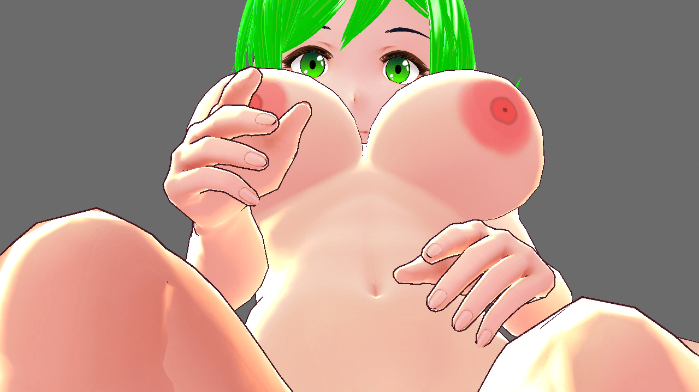
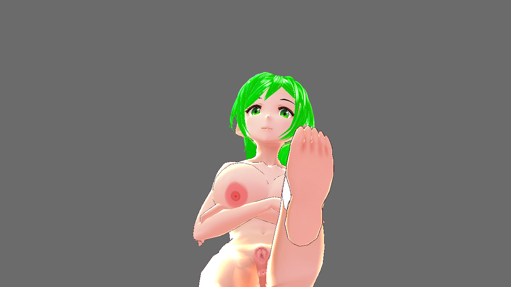
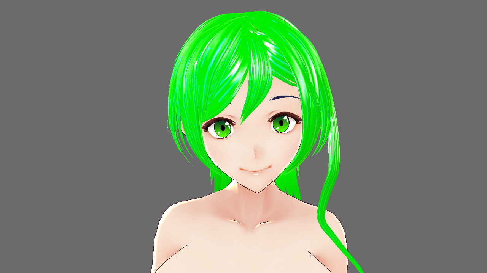
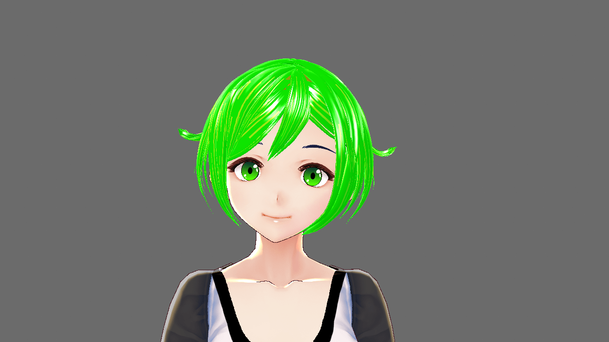
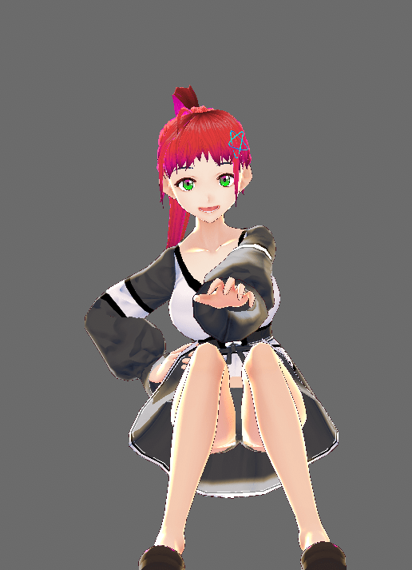
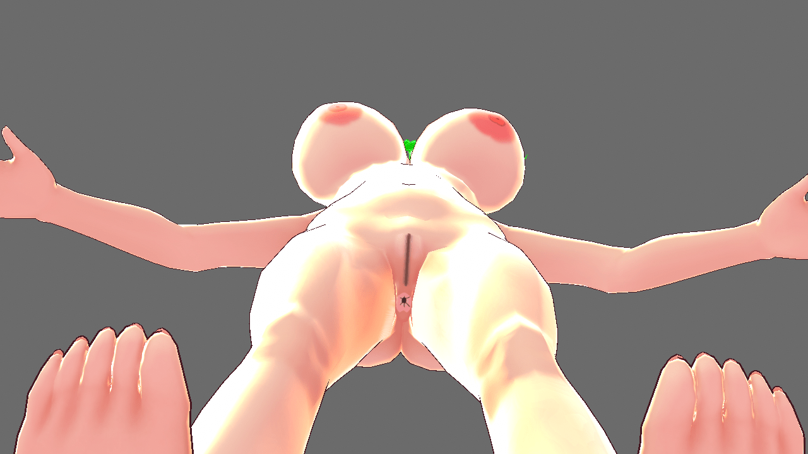
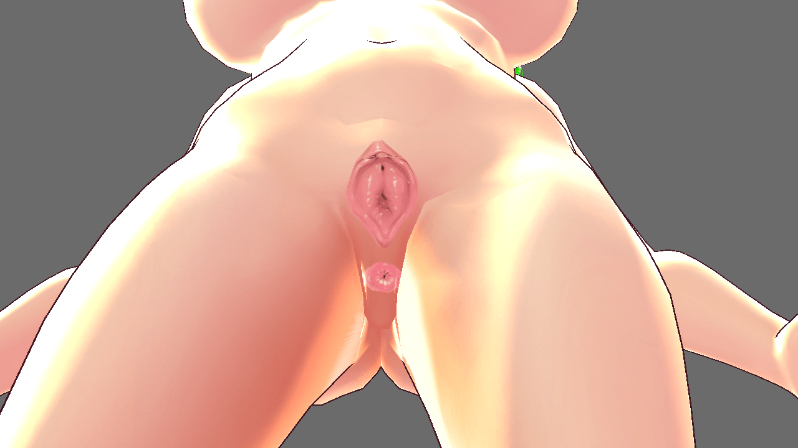
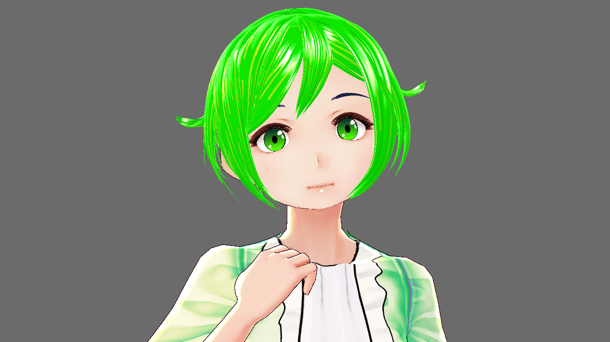

# 做圖新手 Vroid建模 想求點意見

作者：(别）看我的

TID：31049

<title>1</title> <link href="../Styles/Style.css" type="text/css" rel="stylesheet">

# 1

*本帖最後由 (别）看我的 於 2021-6-27 21:15 編輯*

最近心血來潮想學做GTS圖 可惜我是個畫渣 只能捏捏臉做做頭髮之類的 繪畫都是靠paint.net這種羸弱軟件在畫
想求點意見
<ignore_js_op>

**GTS scene modelling.png** *(942.92 KB, 下載次數: 0)*

[下載附件](forum.php?mod=attachment&aid=ODkxMDR8YjQ0ODM4MmZ8MTYzMjE3OTI5OHwxODIzMHwzMTA0OQ%3D%3D&nothumb=yes)

2021-6-6 14:52 上傳

<ignore_js_op>

**Step.png** *(503.31 KB, 下載次數: 0)*

[下載附件](forum.php?mod=attachment&aid=ODkxMDZ8YzUyYTk0ODh8MTYzMjE3OTI5OHwxODIzMHwzMTA0OQ%3D%3D&nothumb=yes)

2021-6-6 14:52 上傳

先問問視覺效果吧 Vroid捏出來的 晚點會丟進PMXeditor 和 MMD
1）這模型還行不？ 能接受嗎？
<ignore_js_op>

**Face.png** *(705.14 KB, 下載次數: 0)*

[下載附件](forum.php?mod=attachment&aid=ODkxMDV8MDM3Y2E5Y2Z8MTYzMjE3OTI5OHwxODIzMHwzMTA0OQ%3D%3D&nothumb=yes)

2021-6-6 14:52 上傳

<ignore_js_op>

**New Hair texture.png** *(584.71 KB, 下載次數: 0)*

[下載附件](forum.php?mod=attachment&aid=ODkxMTB8YzFkMzE0MDl8MTYzMjE3OTI5OHwxODIzMHwzMTA0OQ%3D%3D&nothumb=yes)

2021-6-6 15:00 上傳

<ignore_js_op>

**Catch.png** *(298.76 KB, 下載次數: 0)*

[下載附件](forum.php?mod=attachment&aid=ODkxMDl8MDk2NjUyOWF8MTYzMjE3OTI5OHwxODIzMHwzMTA0OQ%3D%3D&nothumb=yes)

2021-6-6 14:56 上傳

2）然後問問頭髮和臉 頭髮，眼睛和衣服都是自己拉/畫出來的 綠色的髮質是自己畫的 紅色的髮質是原廠的 比較喜歡哪一個？眼睛是靠羸弱的paint.net畫出來的，還行不？

<ignore_js_op>

**texture self drawn.png** *(682.67 KB, 下載次數: 0)*

[下載附件](forum.php?mod=attachment&aid=ODkxMDd8M2IzNWZiNmZ8MTYzMjE3OTI5OHwxODIzMHwzMTA0OQ%3D%3D&nothumb=yes)

2021-6-6 14:52 上傳

<ignore_js_op>

**Texture.png** *(884.86 KB, 下載次數: 0)*

[下載附件](forum.php?mod=attachment&aid=ODkxMDh8MjNiYWY1YzN8MTYzMjE3OTI5OHwxODIzMHwzMTA0OQ%3D%3D&nothumb=yes)

2021-6-6 14:52 上傳

3）陰道款式喜歡哪一個？ 左邊是自己畫的 右邊是從漫畫裏剪出來的
4）陰道和屁眼有沒有放錯地方...沒看過實物不清楚 自己總覺得擺位怪怪的
5）能接受這種沒開洞的性器官嗎？Vroid官方聲明不能外帶性器官的 而且做起來感覺很困難...

6）喜歡這種風格的建模嗎？

拜托給點方向 新人做圖真的沒經驗 謝謝了
<title>2</title> <link href="../Styles/Style.css" type="text/css" rel="stylesheet">

# 2

> [田园组织u90 發表於 2021-6-6 16:00](https://giantessnight.com/gnforum2012/forum.php?mod=redirect&goto=findpost&pid=470518&ptid=31049)
> 感覺模型雖然看起來有點早 但是還不錯 頭髮覺得綠的有層次感 不知道是不是錯覺 陰道 第二種感覺可以特定情 ...

感謝回復 我也是打算正常用第一種陰道 要把人塞進去才用第二個

頭髮那裏 紅色是早期練手的時候拉的 綠色是做熟了之後拉的 有層次感真的太好了

<title>3</title> <link href="../Styles/Style.css" type="text/css" rel="stylesheet">

# 3

> [AlexYuan 發表於 2021-6-6 21:38](https://giantessnight.com/gnforum2012/forum.php?mod=redirect&goto=findpost&pid=470531&ptid=31049)
> 嗯。。总体来说挺好的呀！
> 第二张图的头发看起来感觉有点怪怪的
> 其他都还好！ 然后就是这种风格也蛮可爱的  ...

頭髮好難弄... 努力練習中！
你喜歡這種風格我其實挺開心的 不然到時候成品做了出來卻沒人喜歡就真的挺尷尬
<title>4</title> <link href="../Styles/Style.css" type="text/css" rel="stylesheet">

# 4

> [gtsssssssssssss 發表於 2021-6-7 08:06](https://giantessnight.com/gnforum2012/forum.php?mod=redirect&goto=findpost&pid=470560&ptid=31049)
> 外行人看起来大部分都超赞~只是下巴能不能改圆润一点，尖下巴总让我想起小时候玩的炸弹人里面的萝卜头:dctg ...

額 你説得對 下吧可能有點尖 這樣行不 <ignore_js_op>

**Round face.png** *(715.71 KB, 下載次數: 0)*

[下載附件](forum.php?mod=attachment&aid=ODkxMTd8NTZlMzA5NTZ8MTYzMjE3OTI5OHwxODIzMHwzMTA0OQ%3D%3D&nothumb=yes)

2021-6-7 09:25 上傳

<title>5</title> <link href="../Styles/Style.css" type="text/css" rel="stylesheet">

# 5

> [gtsssssssssssss 發表於 2021-6-7 12:40](https://giantessnight.com/gnforum2012/forum.php?mod=redirect&goto=findpost&pid=470574&ptid=31049)
> 这样感觉更别扭……但是我也提不出啥建设性的意见，不好意思QAQ
> 
> 也许只是角度的问题？1L的第二章仰视视角 ...

可能是角度問題 Vroid用黑綫描邊導致不同角度看過去會有不同輪廓 搬到MMD之後應該就沒事了
<title>6</title> <link href="../Styles/Style.css" type="text/css" rel="stylesheet">

# 6

> [大帅哥 發表於 2021-6-10 16:36](https://giantessnight.com/gnforum2012/forum.php?mod=redirect&goto=findpost&pid=470771&ptid=31049)
> 总体看上去挺不错的，不知道楼主是打算做单图还是类似k大那种一个系列的

我野心有點大 想做RPGmaker（動態戰鬥畫面） 老實説我做RPGmaker那一邊比這裏建模更有信心
然而我時間不夠用...
<title>7</title> <link href="../Styles/Style.css" type="text/css" rel="stylesheet">

# 7

> [ak3223459 發表於 2021-6-11 00:23](https://giantessnight.com/gnforum2012/forum.php?mod=redirect&goto=findpost&pid=470809&ptid=31049)
> 外行说两句 感觉下巴没啥问题原版就行 眼睛可以在微调下

眼睛是小畫家畫出來的ww 而且我是個畫渣 不太知道怎麽畫
微調眼睛大概是哪個方向？是指眼睛反光，還是眼底顔色，還是瞳孔大小？</ignore_js_op></ignore_js_op></ignore_js_op></ignore_js_op></ignore_js_op></ignore_js_op></ignore_js_op></ignore_js_op>