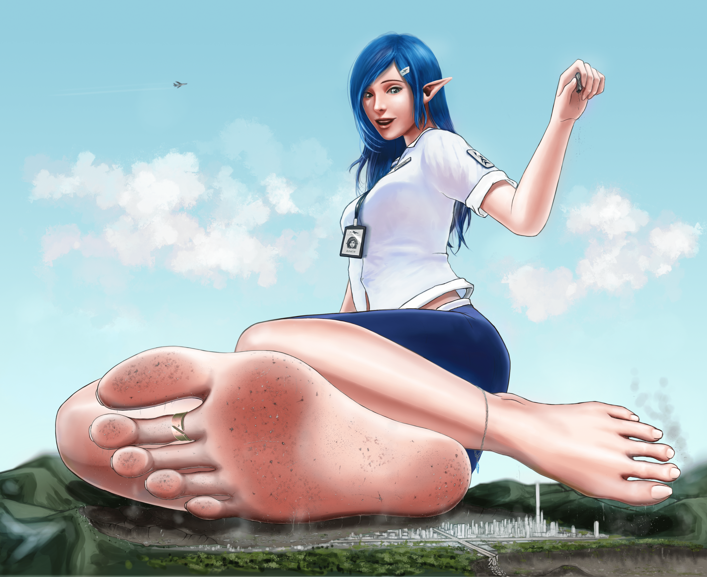

# 先鋒探查隊 Vanguards

作者：u571x15

TID：31025

 

# 1

**beach copy.png** *(9.49 MB, 下載次數: 12)*

[下載附件](forum.php?mod=attachment&aid=ODkwNTR8YzFkYWYyMzR8MTYzMjE3OTQ0OHwxODIzMHwzMTAyNQ%3D%3D&nothumb=yes)

2021-6-3 01:16 上傳

一拖就是3個月=D=....

第一次毛起來ˊ畫完上色，除了上次腳的線搞，其他根本全部重畫了...

還有很多該加油的部分...這次先這樣吧

應該出一下Live2D版本...不過要多久我就不知道啦uwu

Jimmy 祝各位健康平安

==========================================

先鋒調查隊 Vanguards

剛升上星際開發部先鋒調查小隊長的Amelie，進行了首次單人任務...

"模擬進行這麼多次了，會出什麼錯呢？"

"Teleportation Complete, good luck captain!"

"Hmmmm....有點像踩在沙灘上呢，懷念這種腳底舒服的觸感，但是說好的"人類"怎麼都沒看....咦？...咦咦咦咦！"

"呃...這...這我也沒辦法...誰...誰叫你們要這麼小...我沒有做錯什麼OHO"

"既然有這麼多個體...踩死一些應該沒什麼大不了吧.... wwww反倒有點有趣呢，今天我看就不當小隊長了...當個女神吧 :P"

"接下來，從哪開始踩呢？hmm，好像還有一部份完好的城市... 那就讓我用雙足好好的跟你們問好吧uwu"</ignore_js_op>