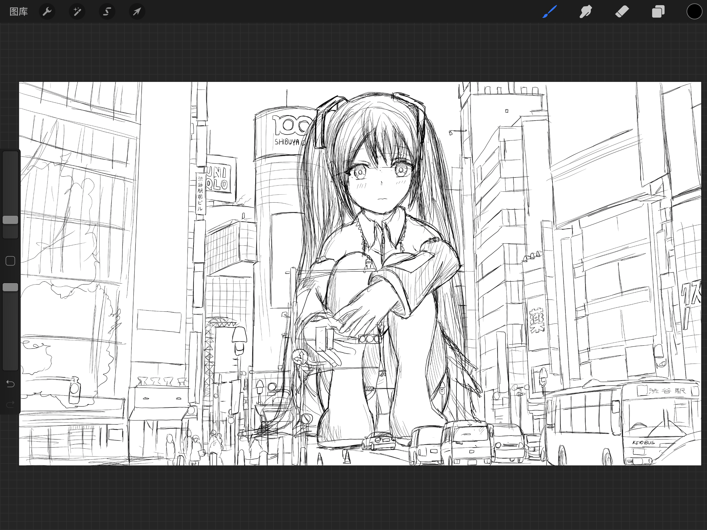
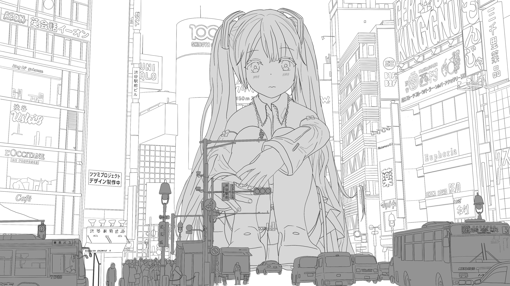
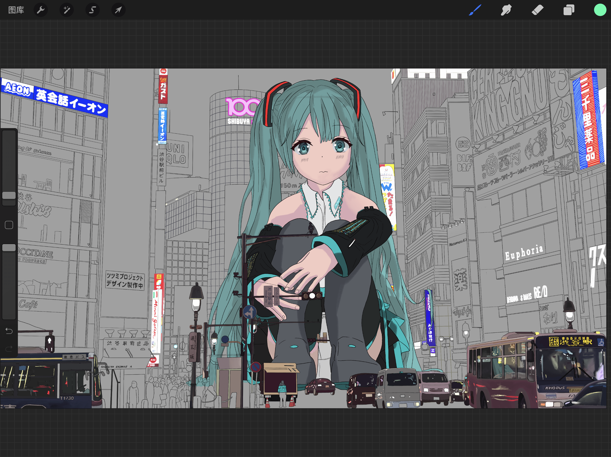
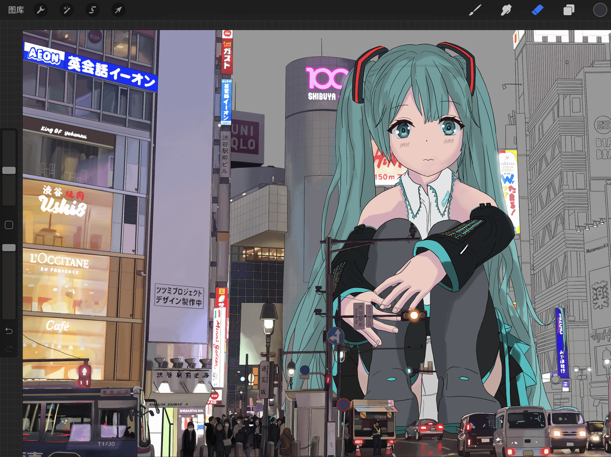
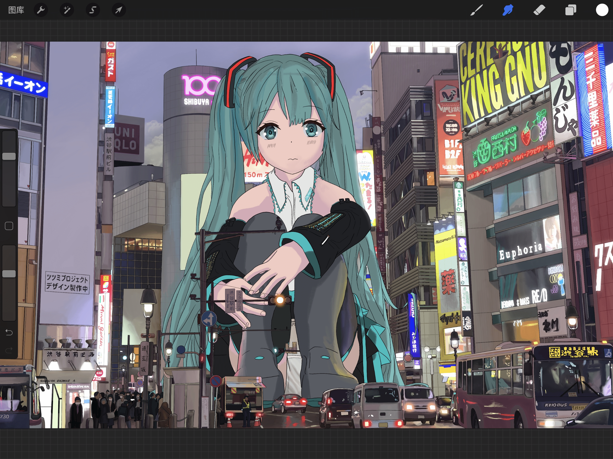
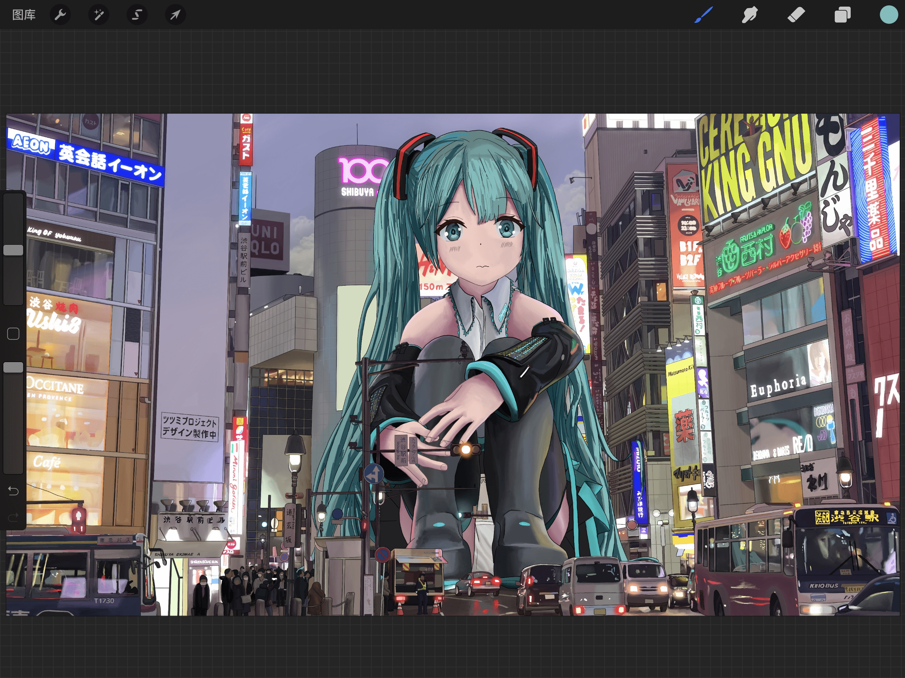
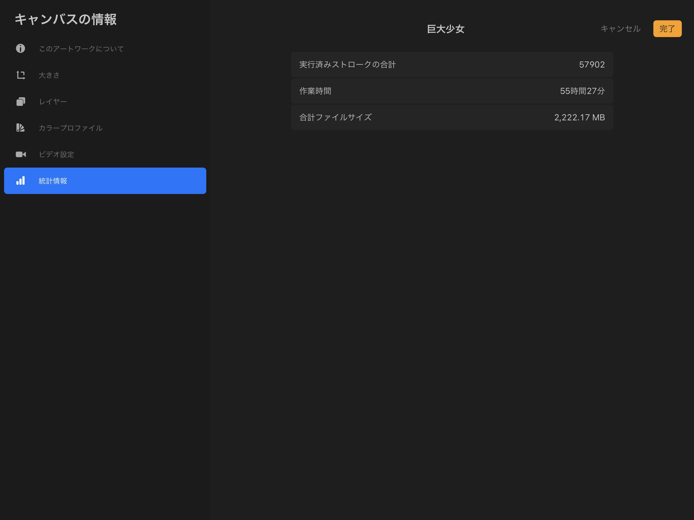

# 初音未来-巨大少女在涉谷

作者：wxy112300

TID：29916

 

# 1

*本帖最後由 wxy112300 於 2020-12-6 22:51 編輯*

突然想起居然忘记发GN了。

梦回2009，回到40m的巨大少女时代

**巨大少女.png** *(10.73 MB, 下載次數: 3)*

[下載附件](forum.php?mod=attachment&aid=ODYyODJ8YmM5OGRkZDJ8MTYzMjE4NDU3OHwxODIzMHwyOTkxNg%3D%3D&nothumb=yes)

2020-12-6 22:29 上傳

P站链接：[https://www.pixiv.net/artworks/86097337](https://www.pixiv.net/artworks/86097337)

推特链接：[https://twitter.com/wxy112300/status/1334925131504705537](https://twitter.com/wxy112300/status/1334925131504705537)

推上第一次被点赞破千，惊到了。

不过不得不说好久没有花这么久去画一张画了，从起稿到完成用了55个小时多才搞定，摸了两个月才出来。

一开始只是想画个Miku，结果开始沉迷画背景了。。。

然后细节就越堆越多了，不过有些描线并没有被处理好，放大看还是很有瑕疵的。。。

再记录下过程好了：

**7616564B-D864-4B3B-A698-C0A514A10DF4.PNG** *(4.22 MB, 下載次數: 0)*

[下載附件](forum.php?mod=attachment&aid=ODYyODN8OGIyZjAyMjB8MTYzMjE4NDU3OHwxODIzMHwyOTkxNg%3D%3D&nothumb=yes)

2020-12-6 22:38 上傳

**8EEC456C-2DB7-446D-80E5-0C26237C3374(20201127-170.JPG** *(1.99 MB, 下載次數: 0)*

[下載附件](forum.php?mod=attachment&aid=ODYyODV8YjljM2E4YmN8MTYzMjE4NDU3OHwxODIzMHwyOTkxNg%3D%3D&nothumb=yes)

2020-12-6 22:38 上傳

**9B553D4F-DC02-40D1-AC33-B7C586ECF326.PNG** *(5.59 MB, 下載次數: 0)*

[下載附件](forum.php?mod=attachment&aid=ODYyODZ8ZTQxZGM3Zjl8MTYzMjE4NDU3OHwxODIzMHwyOTkxNg%3D%3D&nothumb=yes)

2020-12-6 22:39 上傳

**72D76DD4-C36E-43D9-98CF-BFEC471833CE.PNG** *(11.55 MB, 下載次數: 0)*

[下載附件](forum.php?mod=attachment&aid=ODYyODd8MjE4YTliNDF8MTYzMjE4NDU3OHwxODIzMHwyOTkxNg%3D%3D&nothumb=yes)

2020-12-6 22:40 上傳

**739DC0BF-BB7E-4E4B-93BE-46F98A804DCF(20201127-170.PNG** *(1.23 MB, 下載次數: 0)*

[下載附件](forum.php?mod=attachment&aid=ODYyODh8NmYxNjk1MTR8MTYzMjE4NDU3OHwxODIzMHwyOTkxNg%3D%3D&nothumb=yes)

2020-12-6 22:40 上傳

**385AEB0D-8C83-41DE-A0D1-371C2B473EB2(20201201-154.PNG** *(1.24 MB, 下載次數: 0)*

[下載附件](forum.php?mod=attachment&aid=ODYyODl8N2E1YmE2MzF8MTYzMjE4NDU3OHwxODIzMHwyOTkxNg%3D%3D&nothumb=yes)

2020-12-6 22:40 上傳

出图率奇低，真就摸了这么久...

**1E081607-4724-457C-A3CA-41513BB27B02(20201205-034.PNG** *(149.17 KB, 下載次數: 0)*

[下載附件](forum.php?mod=attachment&aid=ODYyOTB8MzExMGRhMWF8MTYzMjE4NDU3OHwxODIzMHwyOTkxNg%3D%3D&nothumb=yes)

2020-12-6 22:42 上傳

（跑了

 

# 2

> [feiyangfy 發表於 2020-12-7 11:53](https://giantessnight.com/gnforum2012/forum.php?mod=redirect&goto=findpost&pid=453491&ptid=29916)

> 看得出来画背景真的花了很多功夫，给大佬点赞

> 就是初音的表情有些呆呆的 ...

确实....我最不擅长就是画人物表情了...

还得继续练习啊w

 

# 3

> [Dante 發表於 2020-12-8 19:43](https://giantessnight.com/gnforum2012/forum.php?mod=redirect&goto=findpost&pid=453601&ptid=29916)

> .

> 經過原作者同意，這張圖片目前是GN手機版的首頁形象圖了。

誒嘿

感謝但大~

 

# 4

> [scale君 發表於 2020-12-8 00:41](https://giantessnight.com/gnforum2012/forum.php?mod=redirect&goto=findpost&pid=453546&ptid=29916)

> 想要更多更多受到关注~

> 巨大少女这首歌真是40mP的宝藏！

是啊，真的很好听的一首w

巨大少女到1640m，也许40m也算圈内?（不是

 

# 5

> [phone2345 發表於 2020-12-9 08:31](https://giantessnight.com/gnforum2012/forum.php?mod=redirect&goto=findpost&pid=453643&ptid=29916)

> 恭喜大佬的圖成為手機版首頁圖了！

> 

> 巨大娘 + 夜景 = giantess night

这么说还真是.....点题了啊</ignore_js_op></ignore_js_op></ignore_js_op></ignore_js_op></ignore_js_op></ignore_js_op></ignore_js_op></ignore_js_op>