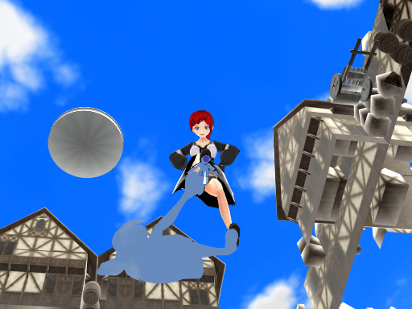

# 新手MMD練手的作品出爐 求指點~

作者：(别）看我的

TID：31074

<title>1</title> <link href="../Styles/Style.css" type="text/css" rel="stylesheet">

# 1

之前問多壇友都説VROID建模能接受 那我下一步就開始學MMD了（Mmd 好難...要不是我稍微有一點點Maya底子感覺自學會崩潰）第一次上手MMD，感覺還行，不過動作可能不太自然 還請見諒
總地來説，對於我這個畫渣來説 已經挺滿意的了 至少比我畫的火柴人好看 就是建模轉換(VRM to PMX, PMXeditor)那裏比較花時間

現在上圖~

跪坐
<ignore_js_op>

**Sit2.bmp** *(768.05 KB, 下載次數: 0)*

[下載附件](forum.php?mod=attachment&aid=ODkxNDB8ZWRjNWRmYzF8MTYzMjE3ODk1NnwxODIzMHwzMTA3NA%3D%3D&nothumb=yes)

2021-6-11 01:31 上傳

<ignore_js_op>

**Stare.bmp** *(768.05 KB, 下載次數: 0)*

[下載附件](forum.php?mod=attachment&aid=ODkxNDR8ZjQ4NDQyZTR8MTYzMjE3ODk1NnwxODIzMHwzMTA3NA%3D%3D&nothumb=yes)

2021-6-11 01:31 上傳

跪坐-小人視角
<ignore_js_op>

**POV.bmp** *(768.05 KB, 下載次數: 0)*

[下載附件](forum.php?mod=attachment&aid=ODkxNDF8MTFjYjliMWN8MTYzMjE3ODk1NnwxODIzMHwzMTA3NA%3D%3D&nothumb=yes)

2021-6-11 01:31 上傳

俯視
<ignore_js_op>

**Stand.bmp** *(768.05 KB, 下載次數: 0)*

[下載附件](forum.php?mod=attachment&aid=ODkxNDJ8OTNkZTZhMWZ8MTYzMjE3ODk1NnwxODIzMHwzMTA3NA%3D%3D&nothumb=yes)

2021-6-11 01:31 上傳

<ignore_js_op>

**Stand2.bmp** *(768.05 KB, 下載次數: 0)*

[下載附件](forum.php?mod=attachment&aid=ODkxNDN8MTQ4OTdjZTB8MTYzMjE3ODk1NnwxODIzMHwzMTA3NA%3D%3D&nothumb=yes)

2021-6-11 01:31 上傳

踩踏
<ignore_js_op>

**stomp.bmp** *(768.05 KB, 下載次數: 0)*

[下載附件](forum.php?mod=attachment&aid=ODkxNDV8MGYwNmI3ZmJ8MTYzMjE3ODk1NnwxODIzMHwzMTA3NA%3D%3D&nothumb=yes)

2021-6-11 01:31 上傳

<ignore_js_op>

**stomp2.bmp** *(768.05 KB, 下載次數: 0)*

[下載附件](forum.php?mod=attachment&aid=ODkxNDZ8NzRmMzYxZDF8MTYzMjE3ODk1NnwxODIzMHwzMTA3NA%3D%3D&nothumb=yes)

2021-6-11 01:31 上傳

<ignore_js_op>

**stomp3.bmp** *(768.05 KB, 下載次數: 0)*

[下載附件](forum.php?mod=attachment&aid=ODkxNDd8NjhjYzYwMmZ8MTYzMjE3ODk1NnwxODIzMHwzMTA3NA%3D%3D&nothumb=yes)

2021-6-11 01:31 上傳

<ignore_js_op>

**stomp4.bmp** *(768.05 KB, 下載次數: 0)*

[下載附件](forum.php?mod=attachment&aid=ODkxNDh8ZTdhMjQxYzR8MTYzMjE3ODk1NnwxODIzMHwzMTA3NA%3D%3D&nothumb=yes)

2021-6-11 01:31 上傳

腿那裏的質量顯然不夠絲滑，應該是因爲模型放大的原因，下次應該是縮小場景而非放大人物，那樣人物的腿就不會一塊塊的了
然後裙子的物理...還沒摸熟...
覺得好看吱一聲 覺得不好看説一下哪裏感覺不對吧
我還是在新手階段 學習中 很需要反饋~
<title>2</title> <link href="../Styles/Style.css" type="text/css" rel="stylesheet">

# 2

> [花丸一生推 發表於 2021-6-11 03:43](https://giantessnight.com/gnforum2012/forum.php?mod=redirect&goto=findpost&pid=470827&ptid=31074)
> 可以研究一下攝影構圖和運鏡之類的，也可參考怪獸電影的構圖及運鏡

構圖摸索中 可是這次我模型好像沒怪獸破壞城市那麽大然後背景那裏 我好像用了Skydome就顯示不了背景了 是這樣的嗎？
<title>3</title> <link href="../Styles/Style.css" type="text/css" rel="stylesheet">

# 3

> [琳姐 發表於 2021-6-11 14:52](https://giantessnight.com/gnforum2012/forum.php?mod=redirect&goto=findpost&pid=470845&ptid=31074)
> 啊！又一个新大佬，来来来交流方式发一个

我只是个画渣 画不了画只好弄MMD的画渣...谢谢你能喜欢这些图哦~
<title>4</title> <link href="../Styles/Style.css" type="text/css" rel="stylesheet">

# 4

游戏做出来的哦 也去那边给点意见吧ww <title>5</title> <link href="../Styles/Style.css" type="text/css" rel="stylesheet">

# 5

> [Cocytus 發表於 2021-6-12 20:36](https://giantessnight.com/gnforum2012/forum.php?mod=redirect&goto=findpost&pid=470931&ptid=31074)
> 就新手來說，已經很不錯了
> 雖然我經驗也沒有很多，但是還是給一些建議，看看是否能幫到你
> 大部分人開始學3D ...

说来惭愧，我第一个学的3D是Maya不过因为太难了没有学下去</ignore_js_op></ignore_js_op></ignore_js_op></ignore_js_op></ignore_js_op></ignore_js_op></ignore_js_op></ignore_js_op></ignore_js_op>