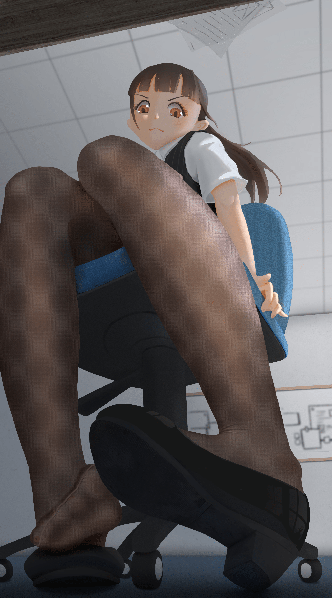

# 画了张丝袜OL小姐姐 (＊´﹃`)

作者：marycat

TID：29396

<title>1</title> <link href="../Styles/Style.css" type="text/css" rel="stylesheet">

# 1

<ignore_js_op>

**OL.jpg** *(1.5 MB, 下載次數: 35)*

[下載附件](forum.php?mod=attachment&aid=ODQ4OTN8MTExZTFkNWZ8MTYzMjE4OTM1MXwxODIzMHwyOTM5Ng%3D%3D&nothumb=yes)

2020-8-31 18:28 上傳

000000000000000000000000000000000000000000000000000000000000000000000000000000000
<title>2</title> <link href="../Styles/Style.css" type="text/css" rel="stylesheet">

# 2

> [gw1990zzz 發表於 2020-9-1 10:30](https://giantessnight.com/gnforum2012/forum.php?mod=redirect&goto=findpost&pid=446678&ptid=29396)
> 材质边缘和头发脸擦除的有点硬，如果是分层画的话可以柔滑下边缘，更圆润一些，脸，身体，皮肤结构明暗再强 ...

感谢大佬指点，边缘一般该怎么处理呢，用高斯模糊1~2个像素行吗？
结构这块一直是我弱项，不敢在脸上画结构
<title>3</title> <link href="../Styles/Style.css" type="text/css" rel="stylesheet">

# 3

> [gw1990zzz 發表於 2020-9-2 12:37](https://giantessnight.com/gnforum2012/forum.php?mod=redirect&goto=findpost&pid=446740&ptid=29396)
> 帮你改了改，如果不喜见谅

再次感谢！改了之后一下子就比原本我画的精致好多
我得好好研究一下了</ignore_js_op>