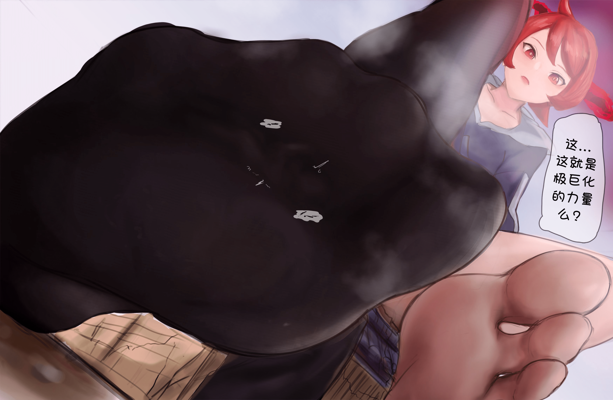
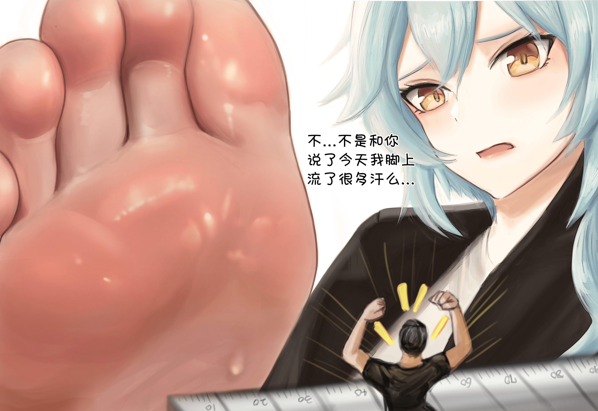
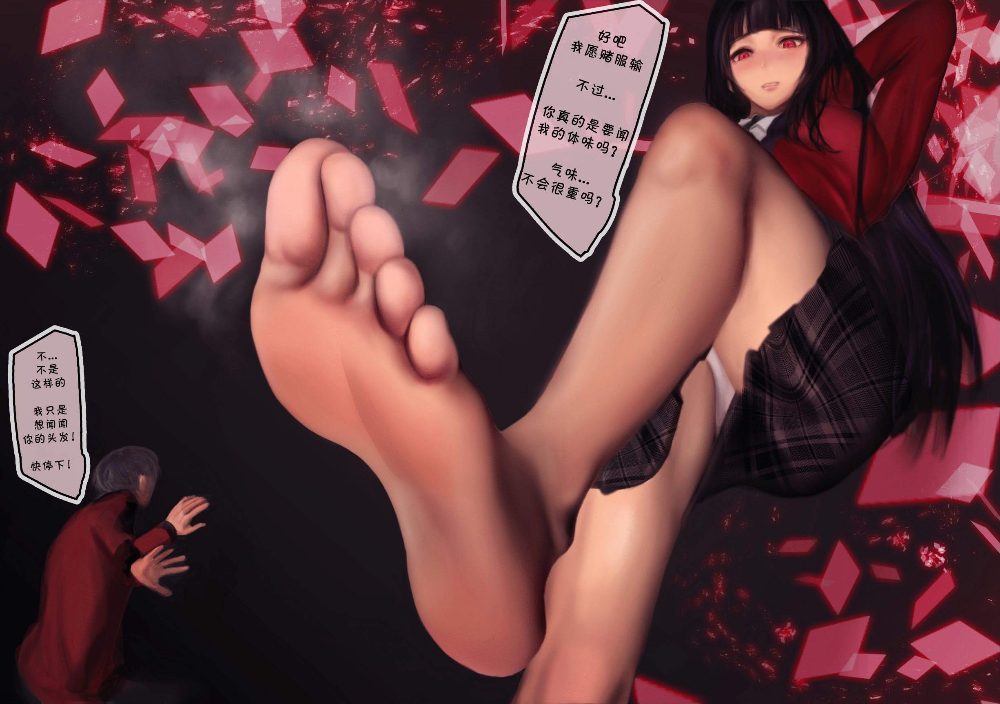

# [footer][汉化] 原神／方舟／Pokemon等 [15p](足控／足控／还是TM的足控)

作者：coolyangzc

TID：32788

# 1

*本帖最後由 coolyangzc 於 2022-3-5 00:47 編輯*

footer老师开始画缩小内容啦，一开始看起来好像只是试试水，但是从最近的差分图中能很明显感受到其在剧情设计和构图上有下功夫，实用度++。此外，由于其画的多是游戏、动漫的二创角色，如果受众重叠的话就能感受到双倍的快乐！

一言以蔽之：

足控内容 = 好！缩小内容 = 好！足控+缩小内容 = 好上加好！！！

足控画师 = 支持！足控画师 + 开始画缩小内容 = 支持！大大滴支持！汉（an）化（li）来啦！

而且，footer老师自己就出了韩英日语了，果然对于我的汉化请求也是很爽快地答应了~因此，前有汉化，敬请期待（法环语太有趣了）。

另外，footer老师这个ID名真的是有够直接、毫不做作呢（Ta的推特和Pixiv简介亦如是）。

这是footer老师的[Twitter](https://twitter.com/_Unyaaaaan_)和[Pixiv](https://www.pixiv.net/users/67562522)，喜欢就去关注点赞吧~

既往汉化作品可在[此处](https://mega.nz/folder/gM0hmKDK#o2SThYgXQPuSIItVlS0B3Q)下载。

祝周末愉快~

目白麦昆

W

选择

极巨化

优菈（OL版）

原神

喜多川海夢 (Marin Kitagawa)

狂赌之渊

(Size) Survey

论坛附件<ignore_js_op>

**喜多川海夢p1.jpg** *(612.4 KB, 下載次數: 5)*

[下載附件](forum.php?mod=attachment&aid=OTQyMzB8ZDc5ZTA0ZTV8MTY0NzcwOTk3MnwxODIzMHwzMjc4OA%3D%3D&nothumb=yes)

2022-3-5 00:47 上傳

<ignore_js_op>

**喜多川海夢p2.jpg** *(1.24 MB, 下載次數: 9)*

[下載附件](forum.php?mod=attachment&aid=OTQyMzF8MjUwNmI5MTV8MTY0NzcwOTk3MnwxODIzMHwzMjc4OA%3D%3D&nothumb=yes)

2022-3-5 00:47 上傳</ignore_js_op></ignore_js_op>  

# 2

*本帖最後由 coolyangzc 於 2022-3-4 20:46 編輯*

论坛附件（附件上传已达上限，明日再来）

<ignore_js_op>

**目白麦昆_p1.jpg** *(1.29 MB, 下載次數: 10)*

[下載附件](forum.php?mod=attachment&aid=OTQyMTh8NmYzM2U4YWJ8MTY0NzcwOTk3MnwxODIzMHwzMjc4OA%3D%3D&nothumb=yes)

2022-3-4 20:42 上傳

<ignore_js_op>

**目白麦昆_p0.jpg** *(1.25 MB, 下載次數: 5)*

[下載附件](forum.php?mod=attachment&aid=OTQyMTd8YTU4OTlkODJ8MTY0NzcwOTk3MnwxODIzMHwzMjc4OA%3D%3D&nothumb=yes)

2022-3-4 20:42 上傳

<ignore_js_op>

**W p0.jpg** *(690.33 KB, 下載次數: 11)*

[下載附件](forum.php?mod=attachment&aid=OTQyMTl8YWYzMDJjOGJ8MTY0NzcwOTk3MnwxODIzMHwzMjc4OA%3D%3D&nothumb=yes)

2022-3-4 20:42 上傳

<ignore_js_op>

**W p1.jpg** *(1.38 MB, 下載次數: 16)*

[下載附件](forum.php?mod=attachment&aid=OTQyMjB8ZTU5Y2E4YjZ8MTY0NzcwOTk3MnwxODIzMHwzMjc4OA%3D%3D&nothumb=yes)

2022-3-4 20:42 上傳

<ignore_js_op>

**选择 p0.jpg** *(3.99 MB, 下載次數: 6)*

[下載附件](forum.php?mod=attachment&aid=OTQyMjF8ZDhlYmYyODF8MTY0NzcwOTk3MnwxODIzMHwzMjc4OA%3D%3D&nothumb=yes)

2022-3-4 20:42 上傳

<ignore_js_op>

**选择 p1.jpg** *(3.76 MB, 下載次數: 9)*

[下載附件](forum.php?mod=attachment&aid=OTQyMjJ8MzhhMGI4ZmN8MTY0NzcwOTk3MnwxODIzMHwzMjc4OA%3D%3D&nothumb=yes)

2022-3-4 20:42 上傳

<ignore_js_op>

**极巨化.jpg** *(535.2 KB, 下載次數: 8)*

[下載附件](forum.php?mod=attachment&aid=OTQyMjN8OWRmZTQ4YmJ8MTY0NzcwOTk3MnwxODIzMHwzMjc4OA%3D%3D&nothumb=yes)

2022-3-4 20:42 上傳

<ignore_js_op>

**优菈（OL版） P0.jpg** *(917.46 KB, 下載次數: 10)*

[下載附件](forum.php?mod=attachment&aid=OTQyMjR8YTU5MmE0ZGZ8MTY0NzcwOTk3MnwxODIzMHwzMjc4OA%3D%3D&nothumb=yes)

2022-3-4 20:45 上傳

<ignore_js_op>

**优菈（OL版） P1.jpg** *(911.24 KB, 下載次數: 5)*

[下載附件](forum.php?mod=attachment&aid=OTQyMjV8ZmM1NGQ0NmZ8MTY0NzcwOTk3MnwxODIzMHwzMjc4OA%3D%3D&nothumb=yes)

2022-3-4 20:45 上傳

# 3

继续上传剩余的图片附件...

<ignore_js_op>

**原神 p0.jpg** *(894.28 KB, 下載次數: 3)*

[下載附件](forum.php?mod=attachment&aid=OTQzMzN8M2M5NmE4Nzd8MTY0NzcwOTk3MnwxODIzMHwzMjc4OA%3D%3D&nothumb=yes)

2022-3-6 23:20 上傳

<ignore_js_op>

**原神 p1.jpg** *(1.02 MB, 下載次數: 3)*

[下載附件](forum.php?mod=attachment&aid=OTQzMzR8MTk5YjFhYjF8MTY0NzcwOTk3MnwxODIzMHwzMjc4OA%3D%3D&nothumb=yes)

2022-3-6 23:20 上傳

<ignore_js_op>

**狂赌之渊.jpg** *(585.4 KB, 下載次數: 4)*

[下載附件](forum.php?mod=attachment&aid=OTQzMzV8MjJhYTNiM2V8MTY0NzcwOTk3MnwxODIzMHwzMjc4OA%3D%3D&nothumb=yes)

2022-3-6 23:20 上傳

<ignore_js_op>

**(Size) Survey.jpg** *(517.97 KB, 下載次數: 3)*

[下載附件](forum.php?mod=attachment&aid=OTQzMzZ8MTJiZjk3ZWN8MTY0NzcwOTk3MnwxODIzMHwzMjc4OA%3D%3D&nothumb=yes)

2022-3-6 23:20 上傳

# 4

> [wqr 發表於 2022-3-4 23:10](https://giantessnight.cf/gnforum2012/forum.php?mod=redirect&goto=findpost&pid=496503&ptid=32788)

> 不控足，但控气味的LSP经过~视角和脚上光泽挺戳我啊

确实，有时候这yi些细节就能决定图片的[实用度]

# 5

> [充气的妹妹 發表於 2022-3-5 08:24](https://giantessnight.cf/gnforum2012/forum.php?mod=redirect&goto=findpost&pid=496525&ptid=32788)

> 太棒了啊，涩死了。只不过有几张等了半天也没加载出来，网络太差了，如果有国内盘就好了 ...

用的Google Drive的图床，加载不出来的话，拉到下面看论坛的附件吧。

# 6

> [czl 發表於 2022-3-5 17:30](https://giantessnight.cf/gnforum2012/forum.php?mod=redirect&goto=findpost&pid=496564&ptid=32788)

> 太涩了我天，游戏玩家表示很满足！

（对于我等足控来说）确实很涩！

希望footer老师能继续构思出好的idea（比如原神找宝箱那张）、进一步挖掘角色魅力~

# 7

> [禁止灌水 發表於 2022-3-11 00:45](https://giantessnight.cf/gnforum2012/forum.php?mod=redirect&goto=findpost&pid=497183&ptid=32788)

> 目白麦昆，我的肥驹....

きみの愛馬が！

你的爱马啊！

就记着歌词里这句了，印象很深哈哈</ignore_js_op></ignore_js_op></ignore_js_op></ignore_js_op></ignore_js_op></ignore_js_op></ignore_js_op></ignore_js_op></ignore_js_op></ignore_js_op></ignore_js_op></ignore_js_op></ignore_js_op>