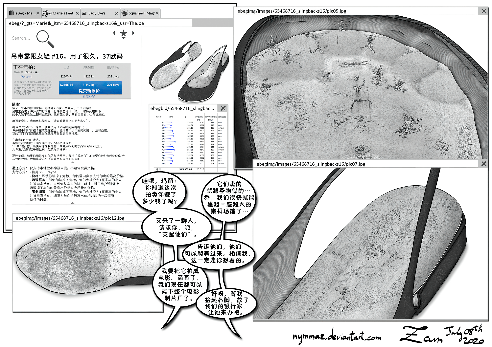

# [nymmaz][汉化] 敬奉鞋概念图／拍卖 [2p]（鞋内视角／残忍／足控）

作者：coolyangzc

TID：32579

# 1

*本帖最後由 coolyangzc 於 2022-2-7 11:34 編輯*

Worship Shoes Concept

敬奉鞋的概念图

My Friend Marie's ballerinas

我朋友玛丽的休闲鞋

这次汉化的是nymmaz大神的作品。nymmaz虽然产量较低，且目前只在deviantart上发表过作品，但是其作品质量实属是一顶一的！尤其是本次汉化的这两张图，细节拉满（一定要点开看哦），鞋内/鞋底视角简直不能更绝。对于如此出色的足控向GTS作品，本次翻译同样也是极尽了我的能力，做到了应翻尽翻，还请各位同好慢慢欣赏、好好享受吧！

世界观概述：VR设备成熟后，存在一个非常庞大的RP server（角色扮演服务器）。总而言之三个字：元 宇 宙！

一个翻译上的碎碎念：worship这么重要的一个词我却着实不会翻了，“崇拜”、“侍奉”、“敬奉”、“敬仰”等等感觉都好像不是很好用；可能是我中文字母圈混得少了…更别说worship shoe、worship temple和worship arena了，这我只能说采取直译的方式了。不知道大家有没有好点子。

这里是nymmaz大神的[Deviantart](https://www.deviantart.com/nymmaz)，多多点赞哦！

原尺寸图片与既往汉化作品可在[此处](https://mega.nz/folder/gM0hmKDK#o2SThYgXQPuSIItVlS0B3Q)下载。

祝周末愉快~

论坛附件区

（终于发现分辨率太高的图片是没法上传到论坛里的。。。只得缩小一半后再传，同好们还是尽可能翻墙看上面贴的图吧）

<ignore_js_op>

**My Friend Marie's ballerinas-gigapixel-standard-scale-0_50x.jpg** *(4.17 MB, 下載次數: 31)*

[下載附件](forum.php?mod=attachment&aid=OTM2MzJ8ODNhYzQ5OGZ8MTY0NzcxMDMzOXwxODIzMHwzMjU3OQ%3D%3D&nothumb=yes)

My Friend Marie's ballerinas

2022-2-5 11:03 上傳

<ignore_js_op>

**Worship Shoes Concept-gigapixel-standard-scale-0_50x.jpg** *(9.38 MB, 下載次數: 11)*

[下載附件](forum.php?mod=attachment&aid=OTM2OTR8ODE1ZTZlODN8MTY0NzcxMDMzOXwxODIzMHwzMjU3OQ%3D%3D&nothumb=yes)

Worship Shoes Concept

2022-2-7 11:33 上傳

# 2

> [devil145 發表於 2022-2-4 22:00](https://giantessnight.cf/gnforum2012/forum.php?mod=redirect&goto=findpost&pid=493226&ptid=32579)

> 哇，楼主大大这翻译真是绝了，感谢翻译！点开图后果然有很多细节和惊喜。希望这个作者能出一些更小倍率的内 ...

哈哈，层主的文章也很好用呢~而且从文中看得出来您确实蛮喜欢超小倍率的。不过我最喜欢的还是您十倍、百倍这两篇，因为再小之后的互动就已经不是人和“人”的互动了嘛，都是“人”和“物”的互动了

此外，与其指望nymmaz出更小倍率或其他特定内容，不如先指望多多更新，这位可是真正的（数）年更。

# 3

> [卧槽我在拔刀 發表於 2022-2-5 04:13](https://giantessnight.cf/gnforum2012/forum.php?mod=redirect&goto=findpost&pid=493257&ptid=32579)

> 哇竟然是这位！绝了，他的精细程度真的是吓人的，有个踩虫子的短漫我印象特别深 ...

踩虫子？是不是说[这篇](https://www.deviantart.com/nymmaz/art/Giantess-Footbath-500651914)把小人聚成人海，用脚玩弄的？确实超赞的，不过分辨率有些低，就没选择汉化这篇。

# 4

> [cloverone 發表於 2022-2-5 14:20](https://giantessnight.cf/gnforum2012/forum.php?mod=redirect&goto=findpost&pid=493302&ptid=32579)

> MEGA盘里没有找到nymmaz的作品，能麻烦指出在MEGA盘的哪个位置吗？

啊这，之前忘传了，被论坛的附件上传给整不会了，现在Mega上有了

# 5

> [卧槽我在拔刀 發表於 2022-2-5 15:09](https://giantessnight.cf/gnforum2012/forum.php?mod=redirect&goto=findpost&pid=493312&ptid=32579)

> 这个作者说是耗时50个小时才完成的，我都感觉50个小时能画出来已经超级了不起了，脚下的那个细节简直是太 ...

妙啊，可惜我对虫虫不感兴趣捏，倒不如说感到有些恶心与害怕

# 6

> [卧槽我在拔刀 發表於 2022-2-5 18:25](https://giantessnight.cf/gnforum2012/forum.php?mod=redirect&goto=findpost&pid=493336&ptid=32579)

> 好吧，又去看了看，做这个应该也是不现实了，就这个对话框，没作者的原图肯定做不出来

> ...

哈哈，已经帮nymmaz大神肝了很多了；我所剩无几的肝还是尽可能地分给更多创作者吧

# 7

> [giantesss 發表於 2022-2-15 16:30](https://giantessnight.cf/gnforum2012/forum.php?mod=redirect&goto=findpost&pid=494826&ptid=32579)

> 不知道vr什么时候能发展到图里的这一步

赶紧试试ResizeMe，效果已经相当不错了</ignore_js_op></ignore_js_op>