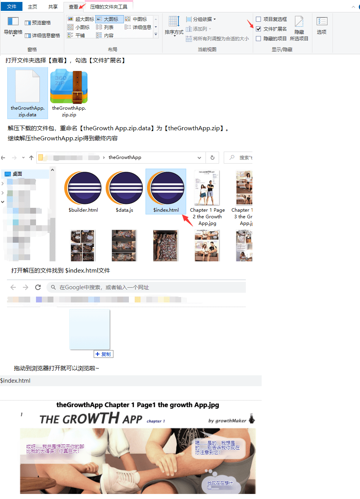

# [漫画翻译][musclegrowth]TheGrowthApp

作者：bug4916

TID：31957

# 1

*本帖最後由 bug4916 於 2021-10-30 07:42 編輯*

原文链接：[https://www.deviantart.com/growthmaker/gallery?q=chapter](https://www.deviantart.com/growthmaker/gallery?q=chapter)

<ignore_js_op>

**cover.png** *(199.87 KB, 下載次數: 1)*

[下載附件](forum.php?mod=attachment&aid=OTE5MzZ8ZWRiZTQ3Njh8MTY0NzcxMTc0MXwxODIzMHwzMTk1Nw%3D%3D&nothumb=yes)

2021-10-28 15:40 上傳

链接：[https://pan.baidu.com/s/1ASqEsQ-D2Jqr24CpsSrrAA](https://pan.baidu.com/s/1ASqEsQ-D2Jqr24CpsSrrAA)

提取码：rdnj

解压密码：123

使用方式：

1.用浏览器打开$index.html，W、A切换显示模式，A、D左右翻页

2.默认识别浏览器语言，无法识别时使用text

3.如需其他语言可直接在$data.js中添加对应语言即可

4.手动语言选择：可在地址栏上增加参数?lang=xxx，xxx为你要选择的对应语言

例：file:///D:/theGrowthApp/$index.html?lang=zh-TW

5.手动指定$data.js路径：可在地址栏上增加参数?path=xxx，xxx为$data.js的路径

例：file:///D:/$index.html?path=theGrowthApp/

6.$builder.html用来制作$data.js数据，有兴趣可以看看

注：翻译的比较渣。。。凑合看吧

# 2

> [153264 發表於 2021-10-30 07:27](https://giantessnight.cf/gnforum2012/forum.php?mod=redirect&goto=findpost&pid=483446&ptid=31957)

> emmmm， 链接裂开了 感觉mega链接没那么容易裂

更新了一下链接，双层加密不知道能撑多久....  

# 3

> [lin449242756 發表於 2021-10-31 10:28](https://giantessnight.cf/gnforum2012/forum.php?mod=redirect&goto=findpost&pid=483504&ptid=31957)

> 我能说没看懂怎么看么- -！电脑盲的我一脸懵。。。

来个简单操作说明

<ignore_js_op>

**readme.png** *(407.07 KB, 下載次數: 0)*

[下載附件](forum.php?mod=attachment&aid=OTIwMDJ8ZTdmZDE2NDd8MTY0NzcxMTc0MXwxODIzMHwzMTk1Nw%3D%3D&nothumb=yes)

2021-11-1 09:38 上傳</ignore_js_op></ignore_js_op>