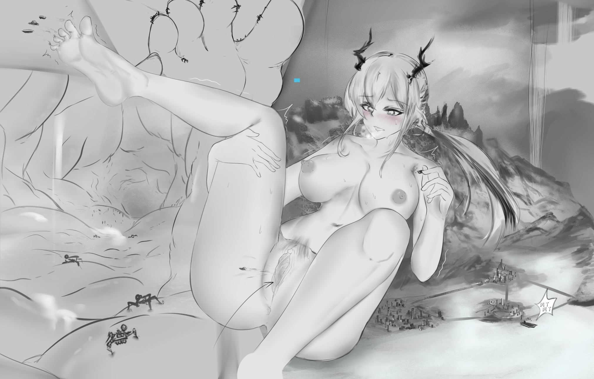
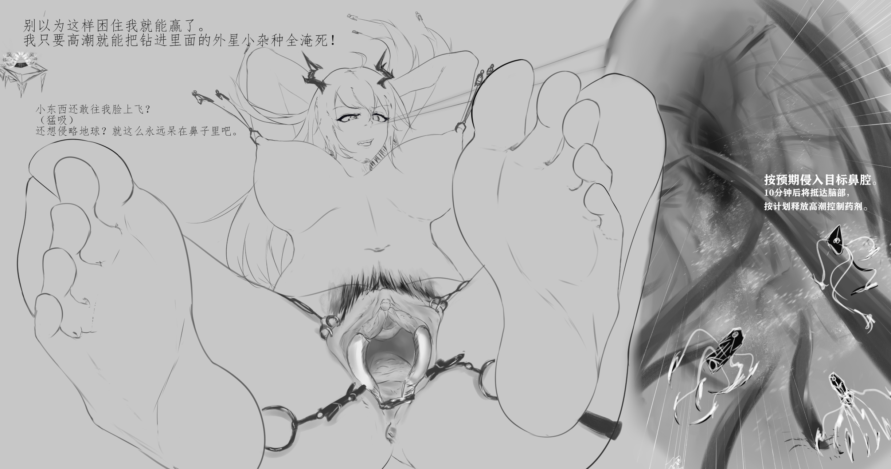
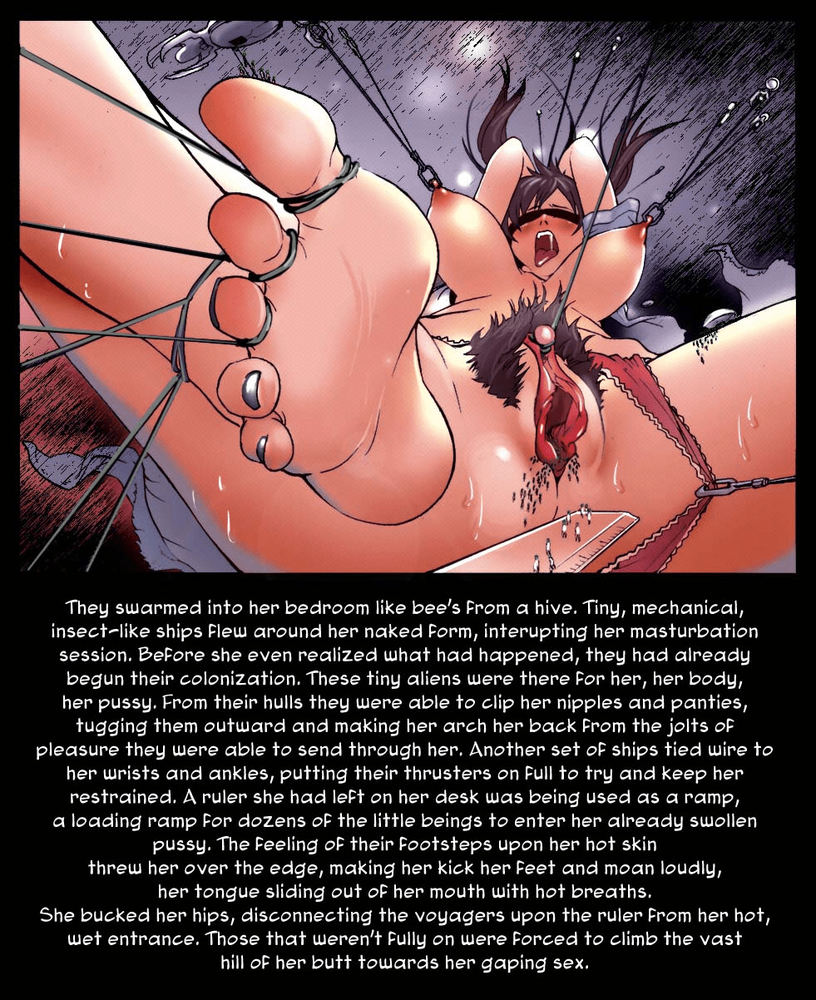
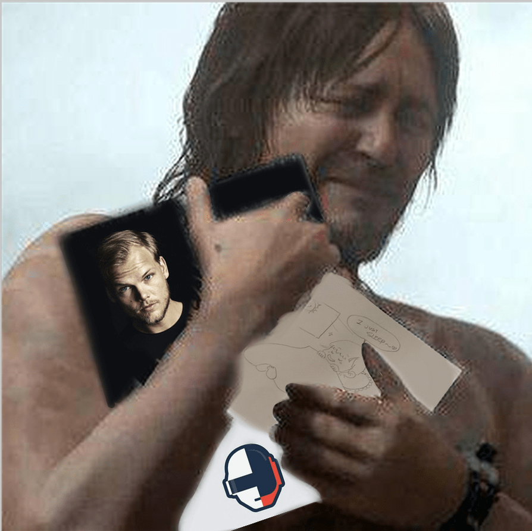

# 【粥游】拿捏&被拿捏／9.10 update

作者：回收站站员

TID：31624

# 1

*本帖最後由 回收站站员 於 2021-9-10 18:49 編輯*

Ch'en sir, resisting aliens.

"莫怕，外星人已经被陈sir拿捏住了"

Music: Superheroes --by Daft Punk.

本来写了个千来字小配文，回头一看太魔怔了，算了8.

姿势参考了照片，背景属于半贴照片半画的:P，上色给我整自闭了，黑白真爽，耶

# 2

<ignore_js_op>[Superheroes.png](forum.php?mod=attachment&aid=OTA4MDR8YmMyNjcxMDN8MTY0NzcxMjA0N3wxODIzMHwzMTYyNA%3D%3D&nothumb=yes) *(1.52 MB, 下載次數: 17)*

[下載附件](forum.php?mod=attachment&aid=OTA4MDR8YmMyNjcxMDN8MTY0NzcxMjA0N3wxODIzMHwzMTYyNA%3D%3D&nothumb=yes)

2021-9-5 03:16 上傳  

图片标题是daft punk的歌，快去听快去听

</ignore_js_op>  

# 3

弃图一张，贴照片没耐心画下去了

一看就是老快递员了，我还想和大鲸鱼穿越一遍焦油带hhh  

# 4

<ignore_js_op>[Hands Up to the Sky(ab.jpg](forum.php?mod=attachment&aid=OTA4MDV8NzhiM2VjZjV8MTY0NzcxMjA0N3wxODIzMHwzMTYyNA%3D%3D&nothumb=yes) *(1.2 MB, 下載次數: 11)*

[下載附件](forum.php?mod=attachment&aid=OTA4MDV8NzhiM2VjZjV8MTY0NzcxMjA0N3wxODIzMHwzMTYyNA%3D%3D&nothumb=yes)

2021-9-5 03:24 上傳  

</ignore_js_op>  

# 5

> [Lcxzyr 發表於 2021-9-6 12:25](https://giantessnight.cf/gnforum2012/forum.php?mod=redirect&goto=findpost&pid=478815&ptid=31624)

> 好耶！

> 大佬的图看起来挺社保（

喜欢就好hhh                                                                              

# 6

> [libido 發表於 2021-9-7 03:55](https://giantessnight.cf/gnforum2012/forum.php?mod=redirect&goto=findpost&pid=478906&ptid=31624)

> 润了那块实在是过于草生，以至于整张图的谐度超过了瑟度(重点错)

可以说是“灾难般”的幽默感了www                                      

# 7

> [libido 發表於 2021-9-8 22:58](https://giantessnight.cf/gnforum2012/forum.php?mod=redirect&goto=findpost&pid=479042&ptid=31624)

> 话说图一中上部有个淡蓝色的色块没有处理(小声)

那个其实是故意留的一个梗，爱死亡机器人动画里我特别喜欢的一集“齐马的蓝”

其实在之前合作画中也有一个，我还指望着有人能发现这个梗呢:P

# 8

开 穴 了

但不推荐真的这样玩，会很痛

这次推荐的歌是:

Superheroes / Human After All / Rock'n Roll--by daft punk--from Alive 2007

很神的一首现场，令人惊叹音乐还能这样做

# 9

<ignore_js_op>[BLUE DRAGON_01.png](forum.php?mod=attachment&aid=OTA5NDB8ZjRkYzBlMGV8MTY0NzcxMjA0N3wxODIzMHwzMTYyNA%3D%3D&nothumb=yes) *(1.25 MB, 下載次數: 4)*

[下載附件](forum.php?mod=attachment&aid=OTA5NDB8ZjRkYzBlMGV8MTY0NzcxMjA0N3wxODIzMHwzMTYyNA%3D%3D&nothumb=yes)

2021-9-10 18:49 上傳  

</ignore_js_op> <ignore_js_op>[BLUE DRAGON_02.png](forum.php?mod=attachment&aid=OTA5NDF8ZDg1Zjk1YTh8MTY0NzcxMjA0N3wxODIzMHwzMTYyNA%3D%3D&nothumb=yes) *(1.46 MB, 下載次數: 4)*

[下載附件](forum.php?mod=attachment&aid=OTA5NDF8ZDg1Zjk1YTh8MTY0NzcxMjA0N3wxODIzMHwzMTYyNA%3D%3D&nothumb=yes)

2021-9-10 18:49 上傳  

</ignore_js_op>  

# 10

这张的构思，源自V姐的一张老图。这张也是我入圈不久时候有幸看到的，陪伴了我好几年好了又好。这次算是以自己的方式小小纪念一下最喜欢的V姐。总在经历喜欢的作者突然的离别，我会逐渐学着从悲伤到起舞。也许很难达到大师的高度，我也会尽力追赶。(幸好DP只是解散了,人还好好的，呜呜

# 11

<ignore_js_op>[C2.jpg](forum.php?mod=attachment&aid=OTA5NDJ8MTI1MmEzODF8MTY0NzcxMjA0N3wxODIzMHwzMTYyNA%3D%3D&nothumb=yes) *(283.23 KB, 下載次數: 2)*

[下載附件](forum.php?mod=attachment&aid=OTA5NDJ8MTI1MmEzODF8MTY0NzcxMjA0N3wxODIzMHwzMTYyNA%3D%3D&nothumb=yes)

2021-9-10 18:50 上傳  

</ignore_js_op> <ignore_js_op>[cry.jpg](forum.php?mod=attachment&aid=OTA5NDN8YTUyODUxMWR8MTY0NzcxMjA0N3wxODIzMHwzMTYyNA%3D%3D&nothumb=yes) *(313.64 KB, 下載次數: 0)*

[下載附件](forum.php?mod=attachment&aid=OTA5NDN8YTUyODUxMWR8MTY0NzcxMjA0N3wxODIzMHwzMTYyNA%3D%3D&nothumb=yes)

2021-9-10 18:50 上傳  

</ignore_js_op>  

# 12

> [禁止灌水 發表於 2021-9-9 05:34](https://giantessnight.cf/gnforum2012/forum.php?mod=redirect&goto=findpost&pid=479097&ptid=31624)

> 太好看了，想看能天使的????‍♂️

不太想画粥游了哇，最近忙这忙那也没啥特别的想法