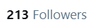

# 【翻译】ばいおーぶ图楼

作者：妈的智障

TID：29029

# 1

*本帖最後由 妈的智障 於 2021-7-2 02:50 編輯*

最近开始在推特上找免费放出的图翻译（主要是比较喜欢的[ばいおーぶ](https://twitter.com/vaioomaru)和其他只有一两张的散图）

推特大概会压图，所以来源一般是从pixiv和skeb那里，上传主要是Mega文件夹（可以按上传时间排列找到最新的）

鉴于之前的[投票](https://twitter.com/MDZZ_Pic/status/1338523762275147777)，大概率不处理背景和捏他

Mega文件夹链接：[https://mega.nz/folder/R8M2GYyB#tKw09eySmai2Ggz9PDQ6uA](https://mega.nz/folder/R8M2GYyB#tKw09eySmai2Ggz9PDQ6uA)

更新的时候图床会发提醒的新图，图床推：[https://twitter.com/MDZZ_Pic](https://twitter.com/MDZZ_Pic)

转载随意~更新的话，估计要咕了（虽然已经咕了很长时间了）

# 2

> [迷途小喵 發表於 2020-7-6 23:34](https://giantessnight.cf/gnforum2012/forum.php?mod=redirect&goto=findpost&pid=441178&ptid=29029)

> 翻譯感謝

> ばいおーぶ的作品真的很多都欲罷不能

> 尤其是足部克畫得很細膩

你坛dalao出现了

比起翻嵌什么的，还是直接产出文章和图片工作量大啊

什么时候我也行就好了

# 3

> [大的大 發表於 2020-7-9 23:42](https://giantessnight.cf/gnforum2012/forum.php?mod=redirect&goto=findpost&pid=441401&ptid=29029)

> 楼主厉害(ง •̀_•́)ง，但这个网盘新手不会用啊

mega其实很好用啊

墙内我在这个Q群里发了742075558（虽然是隔壁的游戏测试群）

# 4

> [sidefx 發表於 2020-7-11 20:05](https://giantessnight.cf/gnforum2012/forum.php?mod=redirect&goto=findpost&pid=441552&ptid=29029)

> 一寸法师那篇正好在别的地方看到过原版的，有一个小细节

> "しぶとさだけは一丁前たから"

> 我觉得这里更准确的 ...

哦哦 是这样，感谢指正了

# 5

最近的更新：

在E站上看到ばいおーぶ的英翻更新了不少，所以这边大概就是散图了

# 6

*本帖最後由 妈的智障 於 2020-7-15 01:36 編輯*

最近的更新（以后为了方便手机保存，除了mega，所有图也在推上放一遍吧）：

冗杂的感觉

最近开始有时会把作者在图外的说明加到图里~

# 7

> [伊邪纳岐 發表於 2020-7-21 23:48](https://giantessnight.cf/gnforum2012/forum.php?mod=redirect&goto=findpost&pid=442492&ptid=29029)

> 非常赞!感谢楼主无私翻译分享，这个画师关注了蛮久了，真的很不错，就是可惜mega不知道怎么关注其他人，想 ...

mega我也不知道怎么关注别人，用Twitter吧（来自重度SNS中毒者的发言）

# 8

ばいおーぶ这阵子老是在画一些奇奇怪怪的（应该说是正常的）无size要素的SM图

于是就翻译了まるしゃも之前没人翻译过的一些

这篇大概有人已经在E站上看到了

怎么...感觉这楼已经歪到和ばいおーぶ没有什么关系了（

# 9

*本帖最後由 妈的智障 於 2020-7-27 01:21 編輯*

> [伊邪纳岐 發表於 2020-7-26 14:00](https://giantessnight.cf/gnforum2012/forum.php?mod=redirect&goto=findpost&pid=442854&ptid=29029)

> 我也想，然而推特一直卡电话验证(悲)

好像一开始我也给卡过，后来用Google voices注册了第一个号之后就再没卡过我  

# 10

*本帖最後由 妈的智障 於 2020-8-8 23:06 編輯*

过来捞一捞我的贴子已经忘记上次在这里更到哪里了

以下是预览（因为感觉全部贴过来帖子太乱了，载点在1楼Mega上，本楼对应7月25日~8月8日的4个zip）：

这回终于没离题

# 11

> [titiwong 發表於 2020-8-9 00:21](https://giantessnight.cf/gnforum2012/forum.php?mod=redirect&goto=findpost&pid=444360&ptid=29029)

> 那个被妹妹缩小还有后续挺棒的，不知道作者有没有续集的打算

诶 还有后续的吗之前稍微在E站上搜了一下没找到

# 12

*本帖最後由 妈的智障 於 2020-8-9 11:34 編輯*

> [titiwong 發表於 2020-8-9 11:10](https://giantessnight.cf/gnforum2012/forum.php?mod=redirect&goto=findpost&pid=444407&ptid=29029)

> [https://www.pixiv.net/artworks/81086451](https://www.pixiv.net/artworks/81086451)

> 我是在pixiv上看见的

哦哦 楼上那个帖子只是预览来着，我那里4张图都有

# 13

> [chuilaba1122 發表於 2020-8-9 08:24](https://giantessnight.cf/gnforum2012/forum.php?mod=redirect&goto=findpost&pid=444386&ptid=29029)

> 啊我觉得原作者要是能比例再大一点就更爽了

再大一点大概就是巨大系的范畴了（好像也不能这么说，但是高倍的的确是巨大化居多吧）

# 14

再次捞帖子

前几周因为各种考试一直没更，之后大概可以保持周更吧

# 15

> [leo1223 發表於 2020-9-23 18:42](https://giantessnight.cf/gnforum2012/forum.php?mod=redirect&goto=findpost&pid=448242&ptid=29029)

> 楼主，我的超人……你太强了！！

wwwww过奖了~~ 褒められてとても嬉しいです！

# 16

> [gfktxds 發表於 2020-9-24 12:29](https://giantessnight.cf/gnforum2012/forum.php?mod=redirect&goto=findpost&pid=448287&ptid=29029)

> 翻译marusyamo的就很赞，感谢楼主付出

感谢支持~~ marushamo的因为有别人也在翻译，所以避免撞车就也放E站了

# 17

> [呵呵呵还07 發表於 2020-9-26 22:51](https://giantessnight.cf/gnforum2012/forum.php?mod=redirect&goto=findpost&pid=448487&ptid=29029)

> 咦.......为啥加载不出来，明明是不久以前的贴子

哦 一直没人提忘记说了，就是改host上GN的话，这上面的图是加载不出来的。要翻墙或者改推特host（这我就不知道了）

# 18

总算是更新了这回是migi_33的旧图（大鳳那个P站好像不全就没翻）

# 19

> [camellia 發表於 2020-9-29 01:07](https://giantessnight.cf/gnforum2012/forum.php?mod=redirect&goto=findpost&pid=448622&ptid=29029)

> 楼主真的真的真的太棒了，好多图的翻译啊

感谢支持www，什么时候上推的话给我点几个赞吧

# 20

这周的更新~

# 21

> [Vanmilos 發表於 2020-10-12 18:50](https://giantessnight.cf/gnforum2012/forum.php?mod=redirect&goto=findpost&pid=449848&ptid=29029)

> 楼主永远的神！

> 

> 好多推特上看过的图你这边都翻译了 太满足了啊

感谢~~

（好眼熟啊，我是不是还在什么地方看到过你的感觉）

# 22

まるしゃも老师的比例好像越来越大了？

刚刚还在想翻个什么好，就有新作了，试一波光速(不是)翻译

# 23

最近稍微有点忙  实际上是摸鱼摸多了

# 24

> [〃恋·妹¨ 發表於 2020-11-23 21:46](https://giantessnight.cf/gnforum2012/forum.php?mod=redirect&goto=findpost&pid=452550&ptid=29029)

> 辛苦，不知道楼楼还打算更新吗_(:з」∠)_，最近ばいおーぶ更了些图奈何看不懂 ...

在更了在更了（逃

# 25

*本帖最後由 妈的智障 於 2020-11-24 16:30 編輯*

今天也是写不完作业的一天但是有人来Among us吗

之前还翻了个P站**怪物新人**的图一直存着没发也一起了（总共是有十来张的，在M盘里）

# 26

> [〃恋·妹¨ 發表於 2020-11-26 00:11](https://giantessnight.cf/gnforum2012/forum.php?mod=redirect&goto=findpost&pid=452703&ptid=29029)

> 更新了耶，感谢楼楼的更新！辛苦了

感谢催更

下周准备去混个N1试试

# 27

趁着游戏区4个游戏更新的时候更一波

# 28

> [闲青山 發表於 2020-12-2 23:57](https://giantessnight.cf/gnforum2012/forum.php?mod=redirect&goto=findpost&pid=453191&ptid=29029)

> 大佬MGEA解密密钥是多少啊

我这边打开是没问题哦，建议开无痕模式或者换个浏览器试试

# 29

*本帖最後由 妈的智障 於 2020-12-13 19:06 編輯*

考完3场考试来更新了

(edit:发现分辨率不知道为什么调错了) 

# 30

> [紫色欧石楠 發表於 2020-12-13 14:44](https://giantessnight.cf/gnforum2012/forum.php?mod=redirect&goto=findpost&pid=453932&ptid=29029)

> 说实话巨大之梦的原作画风。。。真是是个同人画的都比它好的不是一点半点，但是互动还挺吸引人，忍了

> ...

的确是互动内行，CG的那个脸就...emmmm

# 31

> [coolyangzc 發表於 2020-12-14 19:06](https://giantessnight.cf/gnforum2012/forum.php?mod=redirect&goto=findpost&pid=454001&ptid=29029)

> LZ翻译的真不错（尤其是嵌图），给点赞！

> 已经Twitter加关注了

嵌图吗

大概是我也对应相近的字体翻译了一下拟声词，

不过文本上感觉我要恶补一下小黄文了

在推特上顺便试了一下投票功能：

<ignore_js_op>

**Screenshot_20201215-005807~2.png** *(109.69 KB, 下載次數: 0)*

[下載附件](forum.php?mod=attachment&aid=ODYzODd8YjUzZDQ0ZDB8MTY0NzcxMTI0M3wxODIzMHwyOTAyOQ%3D%3D&nothumb=yes)

2020-12-15 01:03 上傳

[https://twitter.com/MDZZ_Pic/status/1338523762275147777](https://twitter.com/MDZZ_Pic/status/1338523762275147777)

# 32

瀬尾老师的图我能好一万次

# 33

> [chmb55 發表於 2020-12-18 15:12](https://giantessnight.cf/gnforum2012/forum.php?mod=redirect&goto=findpost&pid=454225&ptid=29029)

> 看来看去还是marushamo老师的有感觉，赛高

画风挺好，而且长度基本都会有4张图以上

没有汉化 好像翻译了挺多的

# 34

不知道这个新的字体会不会太粗了

# 35

100 fo+圣诞节的特别更新

# 36

> [wiub 發表於 2020-12-27 11:11](https://giantessnight.cf/gnforum2012/forum.php?mod=redirect&goto=findpost&pid=454739&ptid=29029)

> 不好意思问一下，楼主会同步上传到e站吗，如果会的话叫什么名字，mega上面有些下载不了 ...

试了一下，应该都能下载吧

可以试一下浏览器无痕模式（不知道为什么有时候通常打不开的网页这样就能打开了）

E站的话按这个频率可能会刷屏（在这也在降低频率），所以感觉算了

而且发完不能改是什么操作

# 37

收下吧！JOJO，这是我今年最后的更新了！

l

# 38

*本帖最後由 妈的智障 於 2020-12-31 19:42 編輯*

> [咯咯 發表於 2020-12-31 17:40](https://giantessnight.cf/gnforum2012/forum.php?mod=redirect&goto=findpost&pid=455094&ptid=29029)

> 草，我才发现这个图楼，绝了，立刻加入收藏

啊 感谢支持~

虽然在一年的最后一天抢到了第100楼 艹原来是100回复不是100楼

推上的fo数也刚好达到了有纪念意义的新高 <ignore_js_op>

**213.png** *(995 Bytes, 下載次數: 0)*

[下載附件](forum.php?mod=attachment&aid=ODY2MjB8NDRlMTQ4NTd8MTY0NzcxMTI0M3wxODIzMHwyOTAyOQ%3D%3D&nothumb=yes)

2020-12-31 19:30 上傳

但是更新是没有的XD

就给大家拜个早年吧

# 39

*本帖最後由 妈的智障 於 2021-3-2 01:24 編輯*

唐突更新！

# 40

> [kale 發表於 2021-3-2 21:45](https://giantessnight.cf/gnforum2012/forum.php?mod=redirect&goto=findpost&pid=461912&ptid=29029)

> 哇我也是才发现这个图楼辛苦楼主翻译了，这么多图片一次性看下来实在是太爽了 ...

感谢支持XDD 推上更新会更频繁一点

# 41

> [咕咕的攸栗 發表於 2021-3-6 09:00](https://giantessnight.cf/gnforum2012/forum.php?mod=redirect&goto=findpost&pid=462157&ptid=29029)

> 真心感谢大佬，很多图虽然以前看过，但是翻译过后的更有一番风味

感谢支持~ 你的游戏我也玩过 真的比其他的RPG游戏精致不少XD

# 42

*本帖最後由 妈的智障 於 2021-3-11 00:55 編輯*

> [leo1223 發表於 2021-3-10 20:47](https://giantessnight.cf/gnforum2012/forum.php?mod=redirect&goto=findpost&pid=462560&ptid=29029)

> 才注意到推上是中英文都有，nb啊

> 

> 感谢翻译

感谢支持~ 图都改了 就顺便了XD

突然发现赞我的人有一半以上都是锁推

-------------------------------------------

好像并不是，只是我统计的有问题

# 43

*本帖最後由 妈的智障 於 2021-4-2 21:19 編輯*

愚人节的第二天快乐！

话说泥潭好像没有人提到，Lilith in Nightmare的作者出了个免费的小游戏✨Attack on LILITH！✨

下载链接：

[https://ci-en.dlsite.com/creator/939/article/445546](https://ci-en.dlsite.com/creator/939/article/445546)

# 44

> [RKDWEX 發表於 2021-4-2 23:35](https://giantessnight.cf/gnforum2012/forum.php?mod=redirect&goto=findpost&pid=464424&ptid=29029)

> 好欸，又更新了，话说有些图好像不完整，是不是一起放进整合包的文件里了 ...

最近我应该没有这么干过...可能是没有文字的差分吧

# 45

冒泡

# 46

> [gtmmmm 發表於 2021-12-1 14:03](https://giantessnight.cf/gnforum2012/forum.php?mod=redirect&goto=findpost&pid=486625&ptid=29029)

> 厉害，等哪天更那个扶她的，被射在套套里那个

感谢支持~ 不过最近有点想从正常的翻译上撤下来，创一个翻译组试试了

如果对汉化或者中翻英感兴趣的话欢迎私信我，有点基础的话上手会更快

# 47

> [RUM 發表於 2021-12-8 05:34](https://giantessnight.cf/gnforum2012/forum.php?mod=redirect&goto=findpost&pid=487333&ptid=29029)

> 楼主大大太强了，这翻译得真好。

感谢支持

如果对汉化或者中翻英感兴趣的话欢迎私信我~</ignore_js_op></ignore_js_op>