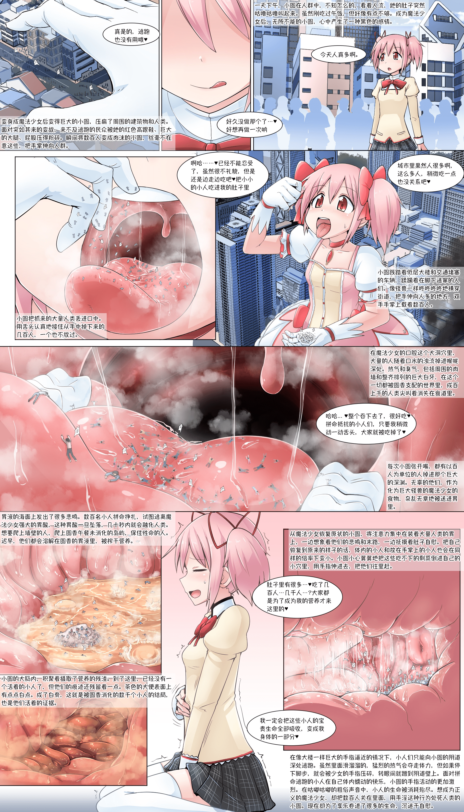

# 【翻译】【寺田落子】小圆的休日

作者：cloverone

TID：32576

# 1

这次继续翻译寺田老师的作品，共1P

小圆系列好棒！

惯例的声明如下：（摘自@coolyangzc）

喜欢寺田落子(Terada Ochiko)老师的作品的话，请在ta的[Fanbox](https://teradaochiko.fanbox.cc/)、[Fantia](https://fantia.jp/fanclubs/1492)、[Patreon](https://www.patreon.com/OchikoTerada)（有英译）上多多支持。你也可以在他的[Pixiv](https://www.pixiv.net/users/277281)、[Twitter](https://twitter.com/teradaochiko)欣赏公开作品，以及在[gs-uploader](https://gs-uploader.jinja-modoki.com/upld-index.php?uname=ydnkm)上看到由ydnkm英译的部分作品。

注：此图系寺田落子老师在Patreon上发表的作品，请勿转载，请勿用于商业用途。

<ignore_js_op>

**madoka.jpg** *(2.27 MB, 下載次數: 139)*

[下載附件](forum.php?mod=attachment&aid=OTM1ODd8MmEzYzc3Mzd8MTY0NzcxMDQ1OHwxODIzMHwzMjU3Ng%3D%3D&nothumb=yes)

2022-2-4 15:44 上傳</ignore_js_op>