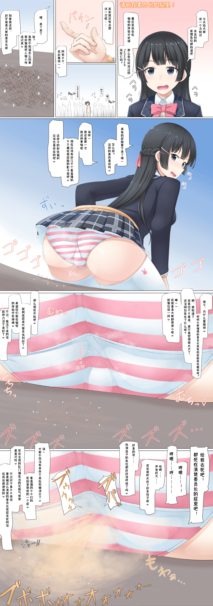

# 【翻译】【寺田落子】请死在清楚委员长的屁里！

作者：cloverone

TID：32585

# 1

各位好，新年爆肝还在继续

这篇没有无字图，尝试了用PS抠图，一开始很费时间，不过逐渐熟练起来就好了

这篇文章的主角名叫月之美兔<月ノ美兎> <Tsukino Mito>，是日本虚拟YouTuber。别号, 次文化垃圾杂鱼、委员长. 杂草Eater、阿委、兔头

注释：

※「TechnoBreak」原文是『テクノブレイク』

为网络用语，简单来说就是过度的自慰行为，导致突然死亡

字面上的意思估计是

「Techno」：用手去做某件事

「Break」：破坏

两者合起来

来源：[https://home.gamer.com.tw/creationDetail.php?sn=4263509](https://home.gamer.com.tw/creationDetail.php?sn=4263509)

惯例的声明如下：（摘自@coolyangzc）

喜欢寺田落子(Terada Ochiko)老师的作品的话，请在ta的[Fanbox](https://teradaochiko.fanbox.cc/)、[Fantia](https://fantia.jp/fanclubs/1492)、[Patreon](https://www.patreon.com/OchikoTerada)（有英译）上多多支持。你也可以在他的[Pixiv](https://www.pixiv.net/users/277281)、[Twitter](https://twitter.com/teradaochiko)欣赏公开作品，以及在[gs-uploader](https://gs-uploader.jinja-modoki.com/upld-index.php?uname=ydnkm)上看到由ydnkm英译的部分作品。

注：此图系寺田落子老师在Patreon上发表的作品，请勿转载，请勿用于商业用途。

<ignore_js_op>

**mitsuki.jpg** *(1.6 MB, 下載次數: 103)*

[下載附件](forum.php?mod=attachment&aid=OTM2Mzh8ZjY1NmI4ZmR8MTY0NzcxMDE1N3wxODIzMHwzMjU4NQ%3D%3D&nothumb=yes)

2022-2-5 14:08 上傳</ignore_js_op>