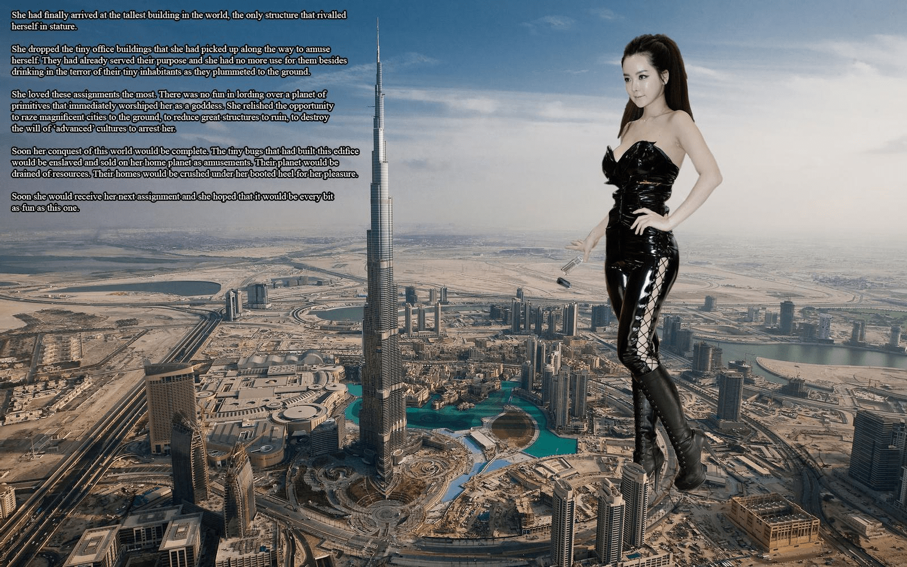
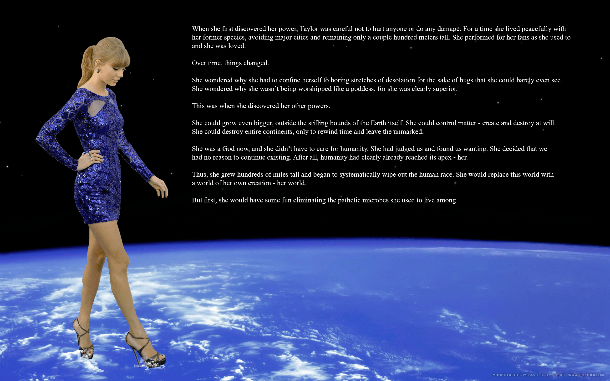
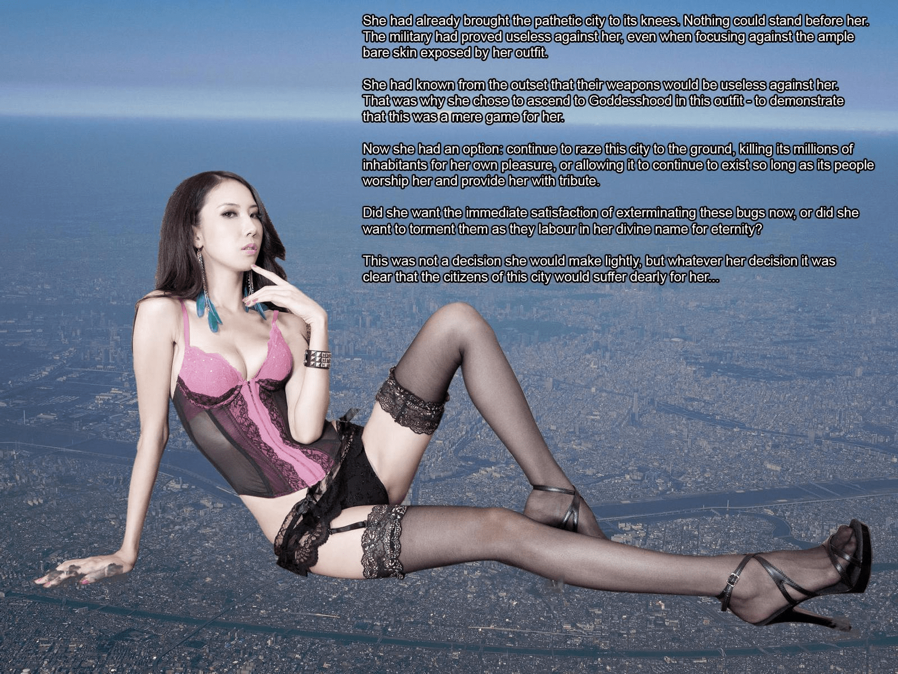
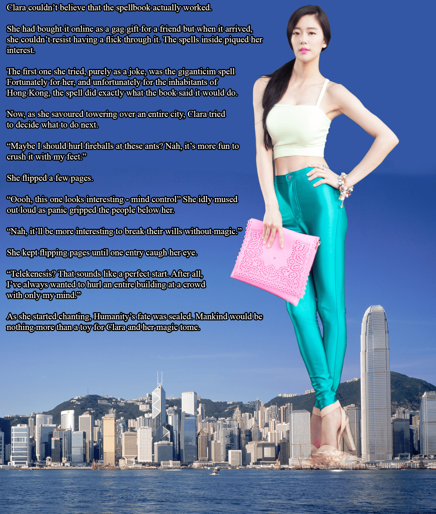
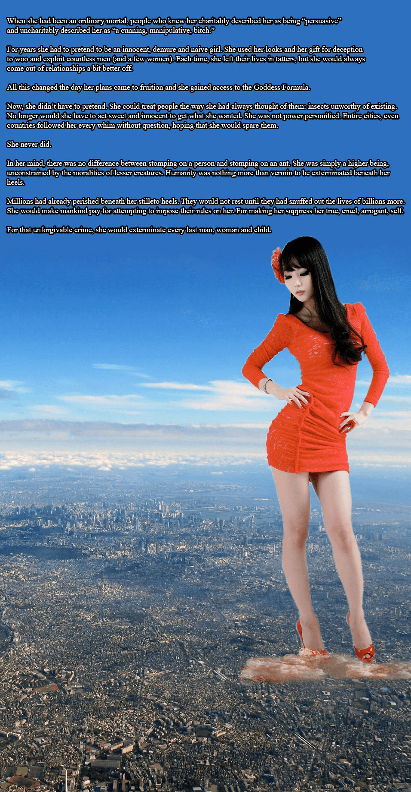
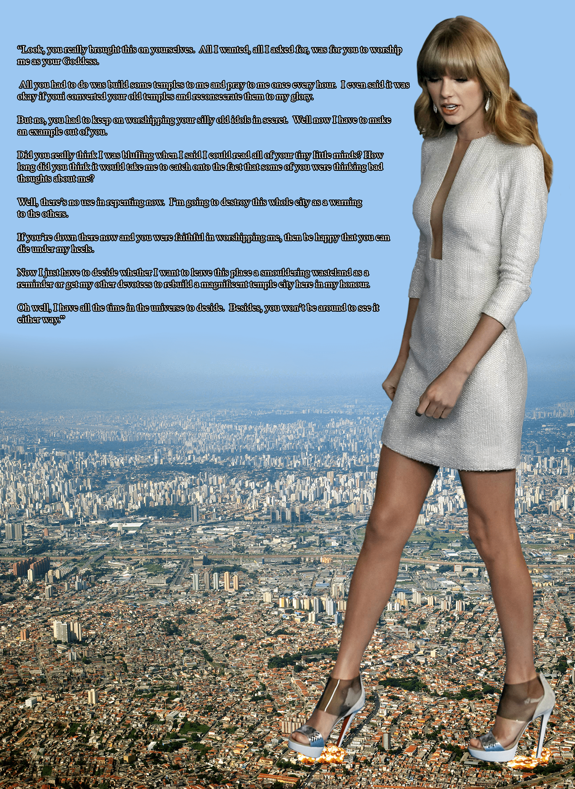
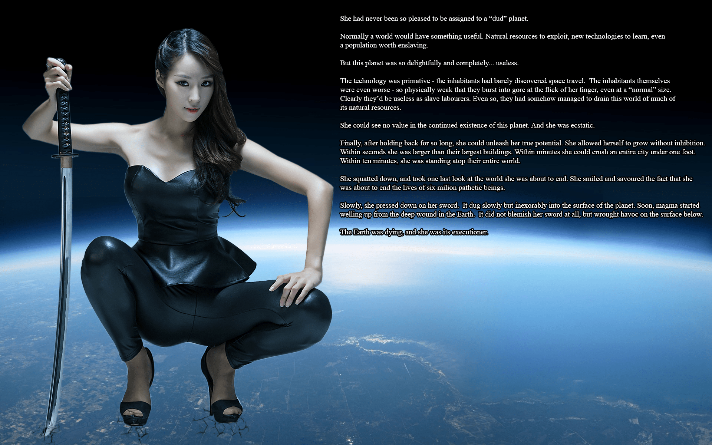
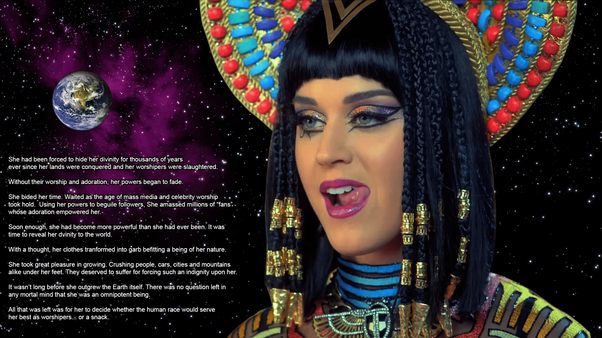
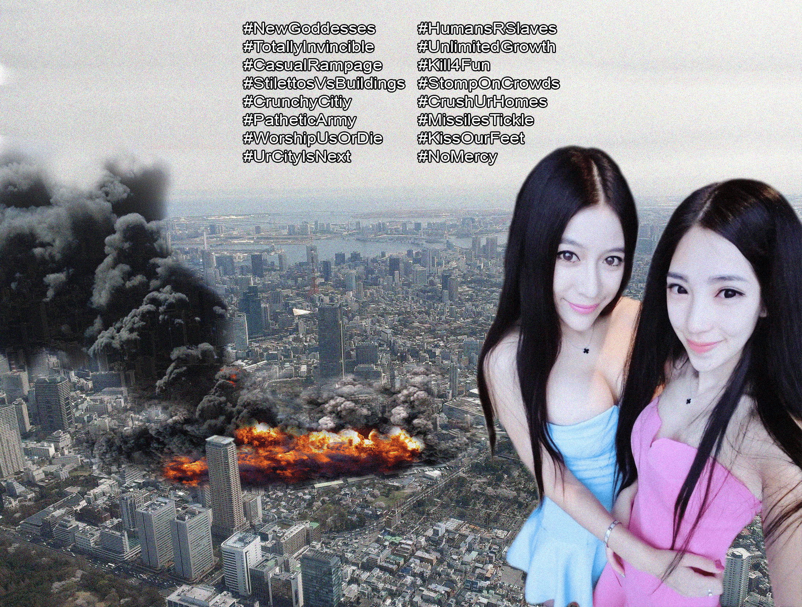

# 【首楼重要通知必看】【2021年04月28日更新】DeviantArt作品... - pt2

作者：孤翼寡言的白鹭

TID：29544

# 1

图名：Im Ji Hye Dubai作者：big-n-evil<ignore_js_op>

**Im Ji Hye Dubai.jpg** *(326.38 KB, 下載次數: 4)*

[下載附件](forum.php?mod=attachment&aid=ODUyOTV8YTU0ZTAzMTJ8MTY0Nzc5Mjg4M3wxODIzMHwyOTU0NA%3D%3D&nothumb=yes)

2020-9-26 18:59 上傳

她终于到达了世界上最高的建筑，那是唯一能与她匹敌的建筑。她将随手捡起用来把玩的小办公楼扔掉了。它们的使命已经结束了，除了当它们摔在地面时将附近的居民吓得惊恐万分以外，它们对她来说没有任何用途了。她喜欢这些工作。没什么比在一颗原始的星球上发号施令更有趣的了，上面的居民立刻就会把她当做女神崇拜。她很享受这些机会，可以把迷人的城市夷为平地，把宏伟的建筑彻底抹除，摧毁这些“先进”文明逮捕她的幻想。她很快就会彻底征服这个世界。建造这座建筑的小虫子们将在她的母星上作为供人娱乐的奴隶贩卖，而他们星球上的资源将被彻底榨干。只要她高兴，就可以将他们的家用靴跟碾碎。她很快又接到了下一份工作，她希望这次还会一样有趣。

# 2

图名：Taylor Swift - Omnigoddess作者：big-n-evil<ignore_js_op>

**Taylor Swift - Omnigoddess.jpg** *(688.56 KB, 下載次數: 4)*

[下載附件](forum.php?mod=attachment&aid=ODUyOTZ8YTY2YTk2MGZ8MTY0Nzc5Mjg4M3wxODIzMHwyOTU0NA%3D%3D&nothumb=yes)

2020-9-26 19:49 上傳

当泰勒第一次发现自己的能力时，她小心翼翼地不让自己伤害任何人或是产生任何破坏。很长一段时间，她和她同样的生物平静地生活在一起，远离都市，最多只变成几百米高。她因她的粉丝而活跃，就和她过去的生活那样，因为她被爱着。但随着时间流逝，情况发生了改变。她不明白为什么自己要为了虫子着想而将自己限制在这无聊的旷野荒郊。她不明白为什么自己没有被其他人当做女神一样崇拜，因为自己明显要比其他人优越很多。就在这时，她发现了自己的其他能力。她可以变得更大，甚至超越地球的大气层。她可以随意创造或毁灭物质。她可以摧毁整块大陆，然后逆转时间，不留下任何痕迹。就这样，她变成了几百千米高，开始按部就班地消灭人类。她将用她的能力创造一个新世界——属于她掌控下的世界。但在那之前，她得先清除那些曾经和她一起生活的微生物们。

# 3

图名：Decisions, decisions作者：big-n-evil<ignore_js_op>

**Decisions, decisions.jpg** *(339.45 KB, 下載次數: 3)*

[下載附件](forum.php?mod=attachment&aid=ODUzMjV8ODkyOGExZGJ8MTY0Nzc5Mjg4M3wxODIzMHwyOTU0NA%3D%3D&nothumb=yes)

2020-9-27 09:35 上傳

她已经让这个可怜的城市屈服了，没有任何东西可以在她面前站立。事实证明，军队对她毫无办法，甚至无法伤害到她从暴露的衣服里裸露出的皮肤。她一开始就知道他们的武器对她毫无用处，这也是她为什么会选择这样的穿着晋升为女神——为了证明这对她来说只是一场游戏。现在，她面临着一个选择：继续把这座城市夷为平地，为了满足自己而杀死数百万的居民；或是允许它继续存在，只要那些居民崇拜她、臣服她。她是想马上消灭这些虫子而得到满足呢？还是想让它们在她神圣的旨意下永远痛苦地为她工作呢？这不是个简单的决定，但无论结果如何，这座城市的居民都将会为此而痛苦。

# 4

图名：Clara's Spellbook作者：big-n-evil<ignore_js_op>

**Clara's Spellbook.jpg** *(677.03 KB, 下載次數: 4)*

[下載附件](forum.php?mod=attachment&aid=ODUzMjd8YTNjZDI1NTl8MTY0Nzc5Mjg4M3wxODIzMHwyOTU0NA%3D%3D&nothumb=yes)

2020-9-27 10:28 上傳

克拉拉简直不敢相信这本魔法书竟然是真的。这本书是她在网上买的，本来准备当做恶搞礼物送给朋友。但当她收到物品后，忍不住翻看了一下，里面的咒语引起了她的兴趣。她开玩笑地尝试了其中的巨大化魔咒。她很幸运地成功了，但对于香港的居民来说就很不幸了。现在，她一边在最高处欣赏着这座城市，一边思考着下一步该做什么。“也许我该向那些蚂蚁扔些火球？不，还是用脚踩死他们更有趣。”她翻了翻手中的书。“嗯，这条看起来很有趣——思维控制。”当她漫不经心地大声读出来时，脚下的人陷入了一片恐慌中。“不，如果不用魔法就能摧毁他们的意志将会更有趣。”她不断地翻着手中的书，直到其中一条吸引了她的双眼。“心灵传动？这听起来是个完美的开始，我一直很想靠自己的想象力就把整栋大楼砸向人群。”当她开始吟唱咒语时，人类的命运就已经被确定了。对于克拉拉和她那本魔法百科全书来说，人类只不过是玩具而已。

# 5

图名：Im Seo Yeon extermination作者：big-n-evil<ignore_js_op>

**Im Seo Yeon extermination.jpg** *(597.88 KB, 下載次數: 4)*

[下載附件](forum.php?mod=attachment&aid=ODUzMjh8MjU0NWU5MmR8MTY0Nzc5Mjg4M3wxODIzMHwyOTU0NA%3D%3D&nothumb=yes)

2020-9-27 11:08 上傳

当她还是一个普通人时，认识她的好友会说她是“很有说服力的人”，而对她有敌意的人则会说她是“一个狡猾、控制欲强的婊子”。许多年来，她都不得不装成一个天真、端庄、潇洒的少女。她利用自己的外表和欺骗的天赋对无数男性（和少数女性）进行利用和压榨。每一次，她都会让那些人的生活变得支离破碎，然后迈向一段更好的关系。当她的目标达成时，一切都改变了：她获得了成为女神的方法。现在，她不必伪装自己了。她可以用她真正的想法对待其他人：虫子根本没必要存在。她再也没必要为了得到她想要的东西而装出天真可爱的样子了。她追寻的不是权力，即便整个城市甚至整个国家都会毫无疑问地执行她的每一个命令，只求她能放过他们。她拒绝了。在她看来，踩死人和踩死蚂蚁没什么区别。她是高贵的人类，不会被低等生物的道德观念所束缚。人类只不过是她脚下即将被消灭的害虫而已。数百万人死在了她的鞋底，而它们不会因此而休息，直到它们将数十亿人全部消灭。她会让人类为将他们的规则与她而付出代价——让她压抑真正的、残忍的、高傲的自我。为了这不可饶恕的罪行，她会处刑每个男人、女人和孩子。

# 6

> [我记不起来了啊 發表於 2020-9-27 16:55](https://giantessnight.cf/gnforum2012/forum.php?mod=redirect&goto=findpost&pid=448538&ptid=29544)

> 楼主知道一个叫giantessnation的作者吗，特别喜欢搞政治图的。

其实我主要想说的就是这货

简直不可理喻的一直在做政治相关图，甚至还有乳化内容，我看都得挑着看

# 7

图名：Worship Goddess Swift作者：big-n-evil<ignore_js_op>

**Worship Goddess Swift.jpg** *(3.88 MB, 下載次數: 3)*

[下載附件](forum.php?mod=attachment&aid=ODUzNTF8OGVlNGY4M2R8MTY0Nzc5Mjg4M3wxODIzMHwyOTU0NA%3D%3D&nothumb=yes)

2020-9-28 10:04 上傳

“看吧，这可真的是你们自找的。我想要的、想让你们做的只不过是让你们把我当做女神来崇拜。你们需要做的只是为我建些教堂，每个小时向我祈祷一次。甚至你们只要把那些旧神的教堂改成崇拜我的教堂我也不会介意。但事实是，你们仍在偷偷信仰着你们那些愚蠢的旧神。现在，我要拿你们杀鸡儆猴。我告诉过你们我能看透你们的小心思，难道你们以为我在虚张声势吗？你们以为我会不知道你们中有不少人对我心存不屑吗？现在后悔也没用了，我要摧毁这个城市，作为对其他信徒的警告。如果你们在我的脚下，而且虔诚地崇拜我，那么能死在我的脚下应该很荣幸吧。现在我得做出决定：是留下一片焦土作为警醒，还是让其他信徒在这里重建一座更加宏伟的教会之城来纪念我。嗯，好吧，我又无尽的时间可以思考，而且你们也没法活着看到任何一种结果出现了。”

# 8

图名：Eun Ji Ye executioner作者：big-n-evil<ignore_js_op>

**Eun Ji Ye executioner.jpg** *(1.03 MB, 下載次數: 3)*

[下載附件](forum.php?mod=attachment&aid=ODUzNTJ8ZDNjZmI4NmN8MTY0Nzc5Mjg4M3wxODIzMHwyOTU0NA%3D%3D&nothumb=yes)

2020-9-28 10:59 上傳

她从来没有因为自己被分配到一颗“无用”的星球而如此高兴过。一般来说，一个星球会有些有用的东西，比如需要开发的自然资源、需要学习的新技术，甚至是值得奴役的原住民。但是这颗星球是如此令人愉悦、如此完美无瑕……如此毫无用处。这里的科技是如此原始——原住民们几乎没进行过太空旅行。原住民本身的情况则更糟——他们的身体非常弱小，即使她在“普通”的体型挥一挥手指，就可以让他们变成一团血雾。显然，作为奴隶他们同样毫无价值。而即便如此，他们还是想方设法地将这颗星球的大部分自然资源挥霍殆尽了。她看不出这个星球还有什么价值，反而对此欣喜若狂。在压抑了这么久之后，她终于可以释放出自己真正的力量了。她让自己不受限制地变大。几秒钟之内，她就变得比原住民所建造的最高的建筑物还要高；几分钟之内，她变大到了可以一脚就夷平整座城市；不到十分钟，她就成为了这个世界的顶点。她蹲下来，最后看了一眼这个她即将毁灭的世界。她微微一笑，因自己即将结束十几亿可怜生命而愉悦。她将手中的剑缓缓地插下，剑刃缓慢且不可阻挡地刺进了地球表面。很快，岩浆开始从大地的裂痕中涌出，虽然对剑没有造成丝毫影响，却破坏了附近地表上的一切。地球很快就要死了，而她就是刽子手。

# 9

图名：Goddess Perry作者：big-n-evil<ignore_js_op>

**Goddess Perry.jpg** *(1.18 MB, 下載次數: 3)*

[下載附件](forum.php?mod=attachment&aid=ODUzNTN8YzNhNmI2ZTd8MTY0Nzc5Mjg4M3wxODIzMHwyOTU0NA%3D%3D&nothumb=yes)

2020-9-28 11:41 上傳

自从她的土地被征服、信徒被屠杀后，她就被迫隐藏了神性数千年。没有了他们的信仰和崇拜，她的力量不断地衰退。她在等待时机，直到大众媒体和名人崇拜的时代到来。她利用自己的力量诱惑着追随者，积累了数百万“粉丝”，他们的崇拜令她重获力量。很快，她就变得比以往的任何时候都强大。是时候向这个世界展示她的真身了。只要想一想，她穿的衣服就变成了适合她真身的装束。她愉悦地长大着。她把人类、汽车、城市和山峦踩在脚下。他们将屈辱强加给她，活该落得如此下场。不需多久，她就大过了地球本身。在所有凡人的心里，她毫无疑问是一位无所不能的人。现在她即将做出一个决定：人类将成为她的崇拜者……还是美味的零食。

# 10

图名：Giantess Selfie作者：big-n-evil<ignore_js_op>

**Giantess Selfie.jpg** *(2.02 MB, 下載次數: 3)*

[下載附件](forum.php?mod=attachment&aid=ODUzNTR8OTkxY2JlYzB8MTY0Nzc5Mjg4M3wxODIzMHwyOTU0NA%3D%3D&nothumb=yes)

2020-9-28 12:41 上傳

#新晋的女神们#无法战胜#随意散步#高跟鞋vs建筑物#脆弱的城市#可怜的军队#崇拜我们否则去死#下一个是你在的城市#人类只是奴隶#无限制地增长#为了乐趣杀戮#踩扁脚下的人群#碾碎你的家#导弹只能瘙痒#亲吻我们的脚#没有任何怜悯#</ignore_js_op></ignore_js_op></ignore_js_op></ignore_js_op></ignore_js_op></ignore_js_op></ignore_js_op></ignore_js_op></ignore_js_op>