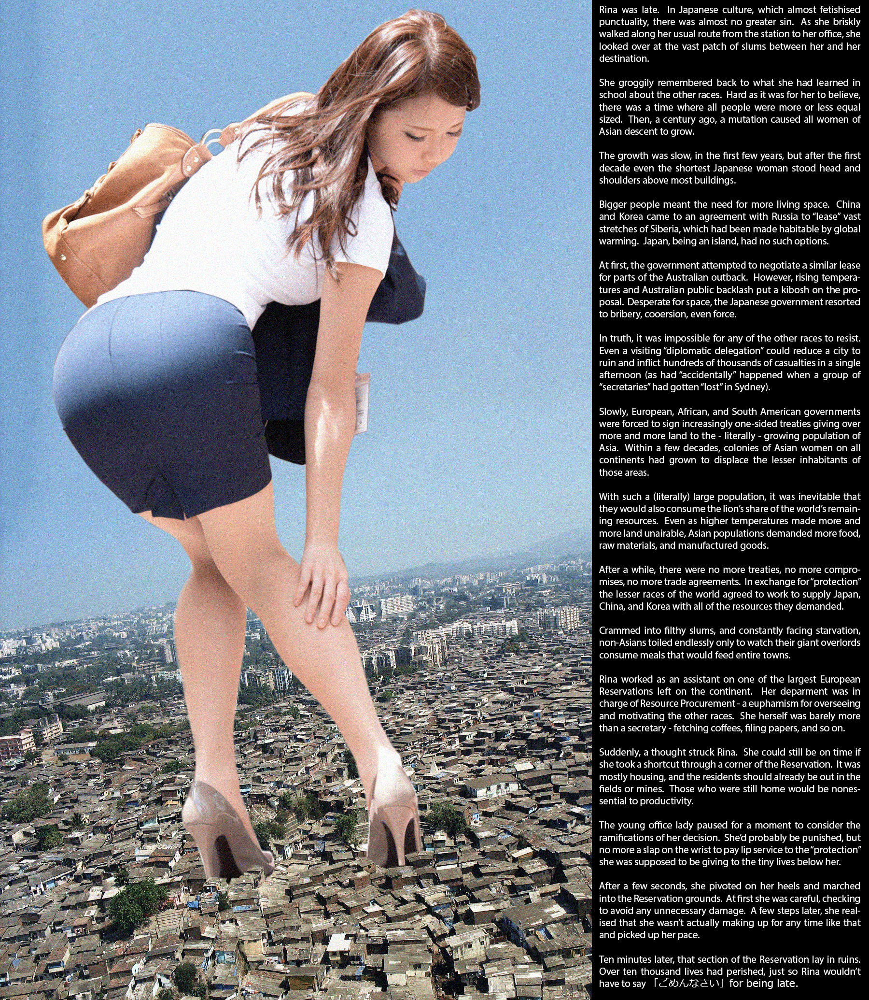
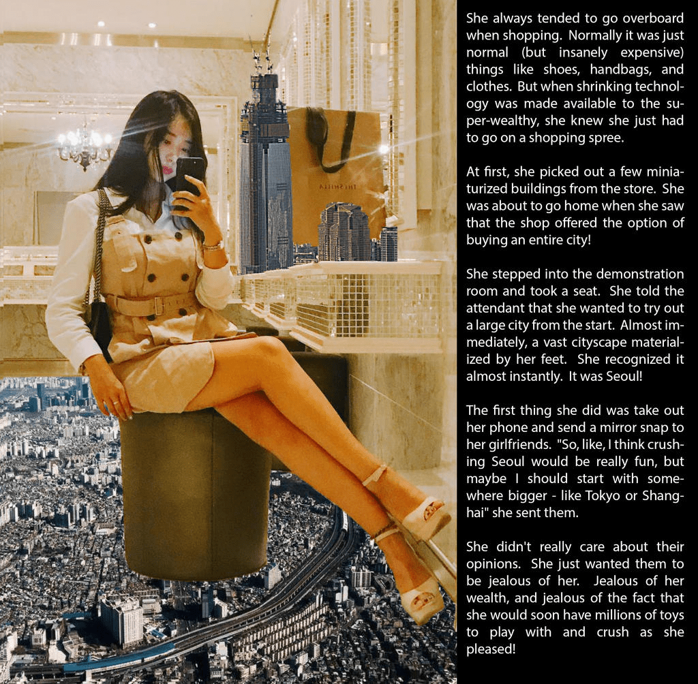
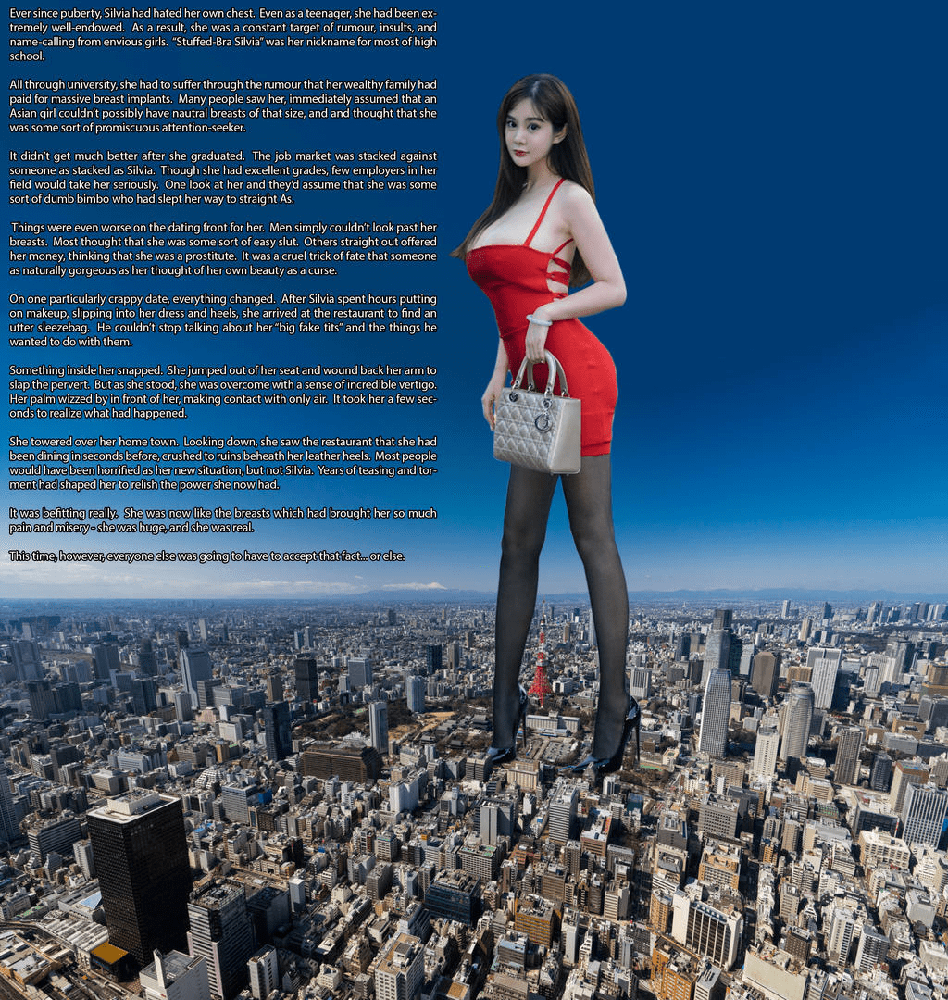
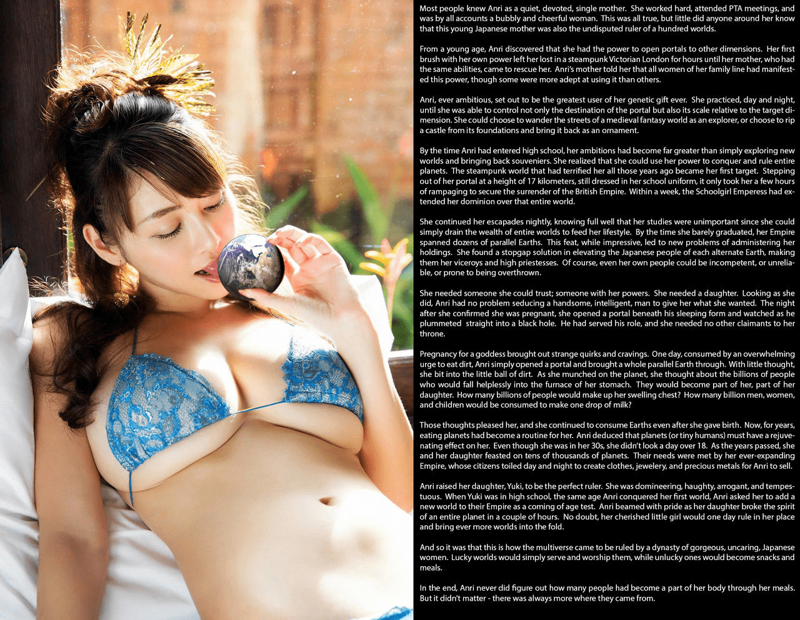
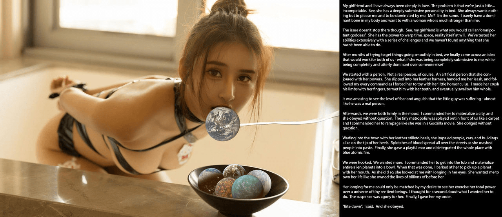
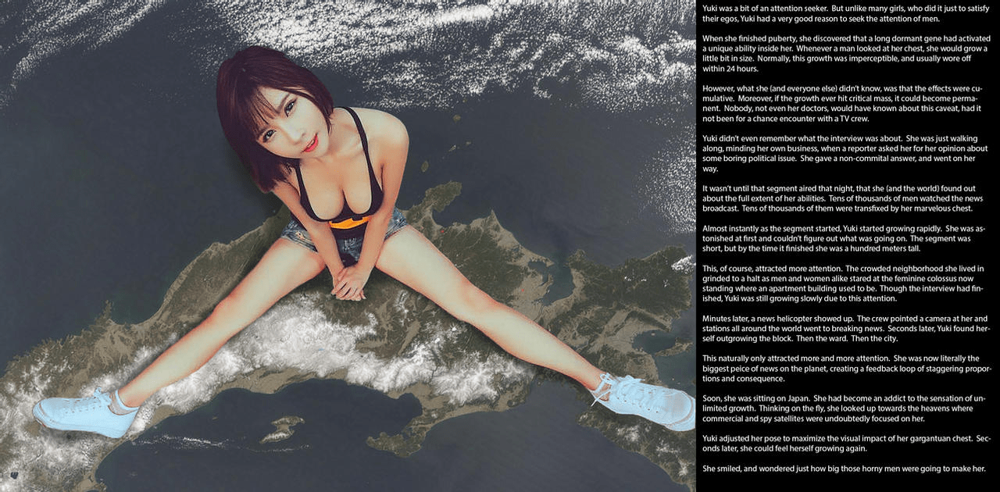
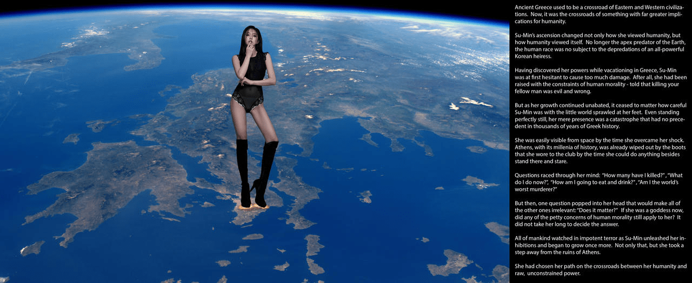
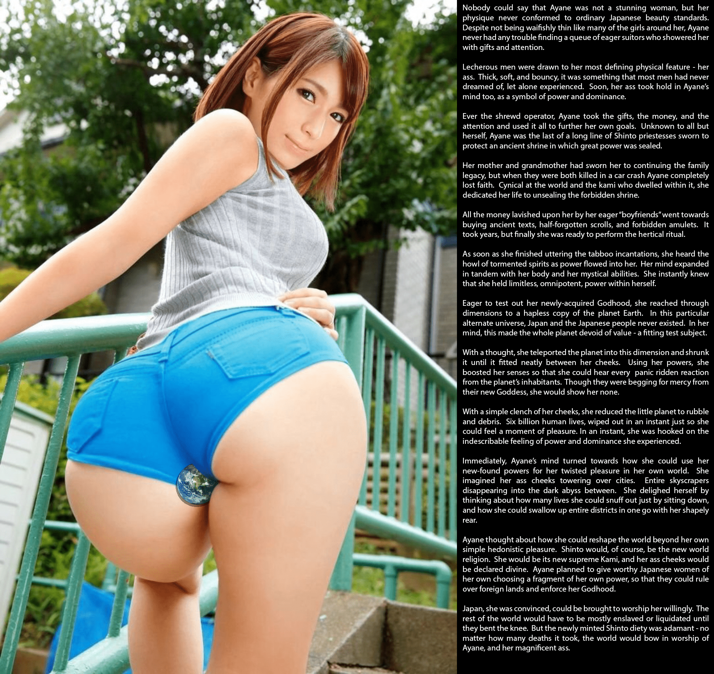
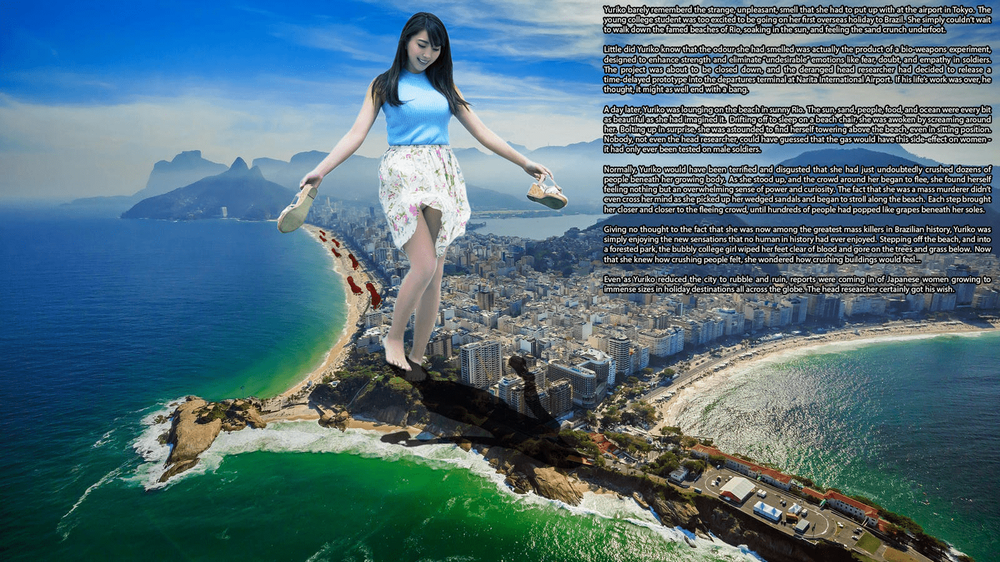

# 【首楼重要通知必看】【2021年04月28日更新】DeviantArt作品... - pt7

作者：孤翼寡言的白鹭

TID：29544

# 1

图名：Inequality作者：big-n-evil<ignore_js_op>

**Inequality.jpg** *(2.87 MB, 下載次數: 0)*

[下載附件](forum.php?mod=attachment&aid=ODY0Nzl8OTY0YzkwMTR8MTY0Nzc5MzA2N3wxODIzMHwyOTU0NA%3D%3D&nothumb=yes)

2020-12-18 17:26 上傳

莉奈快要迟到了。在守旧的日本文化中，这是很严重的错误。所以当她沿着车站到办公室的路线快速前进时，不由得望向了自己和目的地之间的大片贫民区。她突如其来地想起了自己在学校里学到的关于其他种族的知识。曾几何时，所有人类的体型都差不多大，但一个世纪前，一次基因突变导致所有的亚裔女性的体型开始增长。这种增长在最初的几年里速度很慢，但十年之后，即使是平均身高最矮的日本女性也比大多数建筑物还高了。更巨大的体型意味着需要更多的生活空间。中国和韩国与俄罗斯达成了协议，“租借”了西伯利亚的大片土地，这里已经因为全球气候变暖而已经变得适合人类居住了。但日本作为一个岛国，没法做出同样的选择。一开始，日本政府试图和澳大利亚达成类似的租借协议，但对方由于全球气温变暖和国民的反对而拒绝了。但是，日本政府迫于对生存空间的绝望，采取了贿赂、胁迫甚至动用了武力。实际上，其他的国家根本无法反抗。即使一个来访的“外交代表团”也能在一个下午将一座都市化为废墟，造成数十万人的伤亡（就像那些“秘书”们因为“迷路”而在悉尼“意外”造成的结果那样）。随着时间继续流逝，欧洲、非洲和美洲的政府被迫签署了越来越片面的条约，把越来越多的土地让给了不断增长的亚洲人口。几十年内，各大洲都存在着亚洲女性的殖民地，甚至取代了当地的原住民。而由于世界的人口如此之“大”，她们也不可避免地消耗了世界上大部分的的剩余资源。即便由于气温持续升高而导致越来越多的土地不宜种植，亚洲的人口也需要更多的食物、原材料和制品。又过了一段时间，所有的条约、妥协和贸易协定都已经被单方面废除了。为了换取“保护”，世界上的其他国家自愿为日本、中国和韩国提供它们所需要的所有资源。非亚洲人挤在肮脏的贫民窟里，忍受着饥饿不断劳作，却只能眼睁睁地看着巨人们吃着足以供养整个城镇的食物。莉奈在欧洲大陆上最大的欧洲自治区之一做助理。她所在的部门负责采购资源——这是安慰其他种族的委婉说法。她自己只是一个秘书，负责倒咖啡或是整理文件柜之类的工作。突然，莉奈想到了一个办法。如果她从这个自治区里抄个近路，还是可以准时到达的。在那片区域的大多是住房，里面的居民应该都去田里或是矿井了，而还留在家里的人，对于生产来说已经是没必要存在的了。年轻的女职员思考了一下这样做的后果。她很可能受到受到惩罚，但不至于因为没有爱护脚下的小生命而挨上一记耳光。几秒种后，她抬起脚迈进了自治区内。一开始她小心翼翼地尽可能不造成任何不必要的破坏，但她很快就意识到这并不能弥补错过的时间，于是加快了自己的脚步。十分钟后，那块自治区就变成了一片废墟，还有一万多个生命消亡在了她的脚下，只是为了让莉奈不会因为迟到而说出“对不起。”吐槽：这篇太不好翻译了，乱七八糟的专用词太多了，就凑活看吧……另外如果十年内女性就比建筑物高了，人数应该在五到七年内就不再增加来着（体型差距太大无法生育新的女性）

# 2

图名：Shopping Spree作者：big-n-evil<ignore_js_op>

**Shopping Spree.jpg** *(246.18 KB, 下載次數: 0)*

[下載附件](forum.php?mod=attachment&aid=ODY0OTB8ZmI4NWM5NDZ8MTY0Nzc5MzA2N3wxODIzMHwyOTU0NA%3D%3D&nothumb=yes)

2020-12-19 14:39 上傳

她总是喜欢在购物时超前消费。一般只是些常见（但是贵的离谱）的东西，比如鞋、挎包和衣服之类的。但当那些超级富豪们开始使用缩小技术来享乐时，她知道自己必须去购物了。一开始她只是打算在商店里挑几栋缩小建筑。但当她看到店里提供的整座缩小城市时，立刻动了心。她走进了演示室坐了下来，并告诉了销售员她想直接看一看大型城市。很快，一座大型城市就在她的脚边显现，而她立刻就认出了那是首尔。她连忙拿出手机拍照并发给了自己的闺蜜们：“你看，我觉得碾碎首尔的感觉一定很有趣，不过我似乎应该选择再大一些的城市，比如东京或是上海。”她并不在乎她们的回复，只是想让她们嫉妒自己而已。嫉妒她的富贵、嫉妒她马上就会拥有上百万的玩具，可以随心所欲地玩乐或碾碎。

# 3

图名：Real enough for ya?作者：big-n-evil<ignore_js_op>

**Real enough for ya？.jpg** *(305.27 KB, 下載次數: 1)*

[下載附件](forum.php?mod=attachment&aid=ODY0OTF8Y2E4MzAzODl8MTY0Nzc5MzA2N3wxODIzMHwyOTU0NA%3D%3D&nothumb=yes)

2020-12-19 16:03 上傳

在小时候，西尔维娅就因为自己的胸部困扰不已。即使在同龄人里，她的胸部也算是最大的了，因此她也成为了那些嫉妒的女生们的谣言、污蔑和谩骂的对象。“垫满胸罩的西尔维娅”是学校里人尽皆知的外号。到了大学，她仍要继续忍受着她花了大价钱隆胸的谣言。人们一看到她就会认为一个亚裔女性不可能有这么大的天生巨乳，肯定是对那里动了什么把戏。毕业后这种情况仍未得到改善。虽然适合她的工作有很多，成绩也很好，但却很少有雇主会看重她的努力，而是认为她是个靠潜规则才拿到高分的笨蛋。至于感情方面更是一团糟。男性们根本瞧不起她的胸部，多数人都认为她是个淫荡的女性，甚至还有人直接拿钱想要和她一夜情。她总是叹息命运的残酷，让她这样天生丽质的人却不得不遭受美貌带来的诅咒。在另一次约会中，事情发生了改变。西尔维娅花了几个小时化妆和选择衣服，来到餐厅后却发现对方仍是和以前那些人一样的流氓。他不停地谈论着她的“假巨乳”，以及他想对它们做些什么。她的愤怒达到了几点，几乎从座位上跳起来，抬起手想给那个流氓一个耳光。但就在她站起来时，却感觉到一阵眩晕。她抬起的手在面前划过，却只触碰到了空气。她花了半分钟才意识到发生了什么。她站在这座城市之上。她低下头，看到自己刚刚还在的那件餐厅已经在她的高跟鞋下变成了废墟。或许有人会因此而惊慌失措，但西尔维娅不会。她在这些年里经历了太多的屈辱和委屈，因此对于这样的力量欣喜若狂。这力量很适合她，就像为她带来许多不幸的胸部一样巨大、真实。而且，这一次她不允许任何人质疑，否则……

# 4

图名：Vore of the worlds作者：big-n-evil<ignore_js_op>

**Vore of the worlds.jpg** *(299.02 KB, 下載次數: 1)*

[下載附件](forum.php?mod=attachment&aid=ODY0OTJ8ODg1ZGI4MDZ8MTY0Nzc5MzA2N3wxODIzMHwyOTU0NA%3D%3D&nothumb=yes)

2020-12-19 17:25 上傳

人们都认为幸璃是一个落落大方、甘心奉献的单亲母亲。她工作积极，从不错过家长会谈，而且非常热心和开朗。这的确没错，但他们却不知道，这位年轻的日本母亲还是一位称霸了成百上千个世界的暴君。在小时候，幸璃就发现自己拥有打开通往其他次元的通道的能力。在她第一次使用自己的能力时，不幸迷失在蒸汽朋克背景下的维多利亚时代的伦敦几个小时，直到她拥有同样能力的母亲赶来找到了她。幸璃的母亲告诉她，她的祖先中的女性也都拥有这种能力，只是熟练程度不尽相同。野心勃勃的幸璃决定成为家族里最有天赋的能力使用者。她夜以继日地练习这项能力，很快她就做到了控制传送门目的地的位置，甚至可以控制那个次元的相对大小。她可以以普通人的身份在一个中世纪的奇幻世界历险，也可以将一座城堡拔地而起当做房间的装饰品。等到幸璃升入高中后，她的野心也让她不再满足于异世界探险或是带回什么奇特的纪念品。她意识到自己可以通过这项能力统治和征服整个世界。多年前让她感到恐惧的那个蒸汽朋克的世界成为了她的试验品。她穿着校服以17千米的高度走出了传送门，只花了几个小时散散步，就迫使当时的大英帝国俯首称臣；一周后，这个女学生皇帝就统治了整个世界。她每晚都继续进行着自己的征服活动，学习已经无足轻重，因为她可以轻松榨取全世界的财富满足自己的生活所需。当她勉强从高中毕业时，她的统治已经达到了几十个次元的地球。这一壮举虽然轻松，但管理的问题却让她犯了难。她想出了一个权宜之计——提升每个次元的地球上日本人的地位，让他们成为总督或大祭司来代替自己管理。不过，她发现那些人中还是有一部分很无能、靠不住甚至被推翻。她需要一个自己可以信任的人、一个拥有她力量的人——她需要一个女儿。以她的天生丽质，幸璃轻而易举地勾引了一个既聪明又英俊的男人。在她确认自己怀孕的那天，她将那个睡着了的男人扔进了黑洞里。他已经完成了自己的任务，幸璃要确保没人能挑战自己的统治地位。怀孕对一位女神来说，带来了奇怪的癖好和渴望。某一天，幸璃突然想吃点土，于是她干脆打开了一个传送门，将那个次元的地球整个拿了回来。她想都没想就将土球放进了嘴里。当她咀嚼的时候，她想到了有数十亿人将无助地落入她那名为胃的熔炉里。他们将成为自己身体的一部分、成为她女儿的一部分。将有多少亿的人类丰满了她的胸部？消化了多少亿的男人、女人和儿童才能制造出一滴乳汁？这想法令她兴奋不已。即使她生下孩子以后，她仍保持着食用人类这个习惯。这么多年以来，吞吃星球已经成了她的习惯。幸璃推测那些星球（或者说上面那些小人）能让她容颜永驻，即使她已经30岁以上了，看起来却与18岁无异。一天又一天过去了，她和她的女儿已经吃了数万颗星球，而她们的需求则靠她那不断扩张的统治所满足，所有的公民都不得不夜以继日地为她们制作衣物食品，或是采集贵金属和珠宝供幸璃贩卖。幸璃将由衣培养成了一位完美地统治者——霸道、高傲、冷酷且无情。当由衣到了上高中、也是幸璃征服了第一个世界的那个年纪时，幸璃要求由衣为自己的统治添加一个新次元作为成年的考验。当她看着自己的女儿只用了几个小时就令全星球的人类彻底臣服时，满意地笑了。毫无疑问，她珍视的女儿可以代替她统治那些世界了，还可以将更多的世界纳入自己的麾下。就这样，无数个次元的地球都被这两个天姿国色的日本女性统治了，幸运的世界可以侍奉和崇拜她们，而倒霉的世界只会成为她们的食物。到了现在，幸璃也记不清到底有多少人成为了通过食用成为了自己身体的一部分，不过这没关系——他们永远用不完。吐槽：这大概是我最喜欢的故事之一了。 

# 5

*本帖最後由 孤翼寡言的白鹭 於 2020-12-20 11:16 編輯*

图名：Promoted作者：big-n-evil<ignore_js_op>

**Promoted.jpg** *(3.26 MB, 下載次數: 2)*

[下載附件](forum.php?mod=attachment&aid=ODY0OTV8ZWRlZDJkNGV8MTY0Nzc5MzA2N3wxODIzMHwyOTU0NA%3D%3D&nothumb=yes)

2020-12-20 11:16 上傳

她后悔自己接受了“升职”。和她过去的工作相比，新工作简直太恐怖了。她曾经是入侵星球的先锋。一千米高的她如同“屠杀”的化身，仅靠自己就可以将整个文明化为灰烬。军队在她的脚下显得渺小无力，她已经屠杀了数十亿渺小的外星人。每天她都沉浸在绝对力量带给自己的愉悦感中，只要在城市外围用鞋跟蹭一蹭，就能压垮整个城市的反抗意识。他们很快就会头像，但她依然会无情地将他们处死。而现在，她作为“全权管理员”，她只觉得异常无聊。她现在的职责是对新征服的星球进行记录，发掘可用的资源和技术。没有军队需要她粉碎，没有城市需要她摧毁。她必须小心地行动，这才能减少帝国获得的资源遭到损害，以让它们得到最大程度的利用。她心里清楚自己的工作非常重要。她现在管理着自己的先锋小队，还需要对她们的行为负责。不过她还是很羡慕手下们可以将限制抛诸脑后，尽情杀戮。不仅如此，她还很庆幸自己的手下和她相比有分寸的多。过去她的上司经常长篇大论地批评她，苦口婆心地说明某某资源的重要性，或是要求她完好无损地夺取某个重要枢纽。现在她才明白过去的上司的工作有多辛苦，自己欠过去的上司一个道歉。不过这次升职至少也不全是坏事。工资比过去高了很多，自己“不小心”碰坏几栋楼也不会被训斥了。不仅如此，只要攒下足够的钱就可以买下属于自己的星球了。想到这里，她又振作了起来，继续她的工作——记录下任何值得注意的矿产、工业制品或科技项目，同时幻想着一旦自己的工资到手，她可以对属于她的星球做些什么了。

# 6

图名：Compatability作者：big-n-evil<ignore_js_op>

**Compatability.jpg** *(121.17 KB, 下載次數: 0)*

[下載附件](forum.php?mod=attachment&aid=ODY0OTh8MDIwYjdjOTN8MTY0Nzc5MzA2N3wxODIzMHwyOTU0NA%3D%3D&nothumb=yes)

2020-12-20 12:05 上傳

我和我的女朋友可以称得上是情比金坚，只是有一个小问题，我们有些……不兼容。这么说吧，在床上她是严重的受虐性格。她喜欢放弃自己的主见，全心全意地取悦我、臣服我。而我呢，和她一模一样。我从骨子里就没有任何施虐的成分，只想臣服于一个比我强大的女性。而且还有另外一个问题：我的女朋友就是人们口中所说的“无所不能的女神”。她可以随意扭曲时空甚至现实，我们一起用一系列的手段测试过她的能力，结果是她真的无所不能。经过几个月的思考，我们终于发现了一个能让我们双方都满足的方法——如果她对我言听计从，同时彻底支配其他的人呢？最开始我们选择从人类开始。当然，不是一个真人，而是用她的力量制造出来的人造人。她换上了拘束衣，将皮鞭递给了我，听从我的所有命令。我强迫她玩弄那个和她一模一样的小人，用手指捏碎她的四肢、用牙齿慢慢折磨她、最后将她吞下。看着那个小家伙显露出的恐惧和痛苦，令我惊叹不已——简直与真人无二。在那之后，我们更加确信这种做法。我命令她制作一座城市，她毫不犹豫地照做了。小小的城市如同地毯般铺在我们面前，我命令她向哥斯拉一样在城市里暴走，她立刻答应了。她换上了高跟皮鞋，踏进了小镇，用细长的鞋跟刺穿人类、汽车和建筑，整个街道都被她碾碎的人类尸体染红。最后，她戏谑地发出一声吼叫，吐出蓝色的火焰将整个城市烧尽。我们对此越来越沉迷，想体验更多的乐趣。我命令她钻进浴缸里，然后将整个外星的星球装进碗里。她完成之后，我命令她用嘴叼起一颗星球。她照做了，然后抬头看向我，眼神里充满了渴望。她想将自己的生命交给我，就如同她现在掌控了数十亿生命一样。她的渴望只能通过我的支配得到满足，而我希望看到她对一个存在着微小生命的宇宙行使所有权利。我思考了一下自己应该让她做什么，这等待时间令她痛苦不已。最终，我对她下了命令。“咬下去吧”我说道。她绝对不会违反我的命令。

# 7

图名：Attention Seeker作者：big-n-evil<ignore_js_op>

**Attention Seeker.jpg** *(166.69 KB, 下載次數: 0)*

[下載附件](forum.php?mod=attachment&aid=ODY0OTl8MTRlNmVhMWV8MTY0Nzc5MzA2N3wxODIzMHwyOTU0NA%3D%3D&nothumb=yes)

2020-12-20 15:32 上傳

由希是一个喜欢被关注的人。很多女生都喜欢被其他人关注以满足自己的虚荣心，但由希寻求男性的关注是因为另一个原因。当她上高中时，她发现自己的身体有了一项特殊的能力。每当男性看到她的胸部时，她的身体就会变大一点。一般来说，这种变化很难察觉，而且24小时以后就会复原。但她（和其他人）不知道的是，这种变化可以通过人数来累积。不仅如此，一旦达到了一定的人数，这种变化就会永久存在。若不是因为一个新闻摄制组，可能永远不会有人直到这种特性。由希甚至没认真去听采访的内容是什么。她当时只是走在路边，就被记者拦了下来并询问了一些无聊的政治相关问题。她随便地回到了几句不关心就离开了。直到当天晚上的播出时，她（和全世界人类）才发现了她的全部能力。有上万名男性观看了那段新闻，并且全都注意到了她那完美的胸部。几乎在这一瞬间，由希就开始迅速成长起来。在她明白过来发生了什么时，她已经有近百米高了。这当然吸引了更多的目光，她所在的那个拥挤的市区全都注意到了她，上万名男男女女都看着这位取代了她自己居住的那栋公寓的女巨人。所以虽然那段新闻已经播完了，由希的体型仍在继续变大。几分钟胡，一架新闻直升机出现了，机组人员将摄像机对准了她，全世界的新闻媒体都在转发现场实况，几秒种后，由希发现自己已经长得太大了，超越了小区、超越了城市……这自然会引起更多的关注，她成为了地球上最大的物体，这形成了一个恶性循环，让由希不断地成长。很快，她就可以坐在全日本上面了。她沉迷于这种不断巨大化的感觉，于是抬头望向天上，有无数的卫星正注视着她。由希调整着自己的姿势，尽可能地展示着自己的胸部。几秒钟后，她再次开始巨大化了。她忍不住笑了，不知道全球的这些色狼到底能让她变得多大。

# 8

图名：Crossroads作者：big-n-evil<ignore_js_op>

**Crossroads.jpg** *(118.53 KB, 下載次數: 0)*

[下載附件](forum.php?mod=attachment&aid=ODY1MDB8YzljNmU3NmZ8MTY0Nzc5MzA2N3wxODIzMHwyOTU0NA%3D%3D&nothumb=yes)

2020-12-20 16:07 上傳

古希腊曾经是东西方文明的交汇点，而现在，它变成了影响人类未来的交叉口。秀敏的晋升不仅改变了她对人类的看法，也改变了人类对自身的认知。人类不再是地球上的顶级掠夺者，而是受制于一个全能的韩国女人的掌控。秀敏是在希腊度假时发现了自己的能力的。一开始她并不想造成太大的损害，毕竟她从小就受到人类道德的教育——杀死人类是错误和邪恶的。但随着她不断地巨大化，秀敏就不太在意脚下的小城市了，毕竟即使她一动不动，本身也是一场在几千年希腊历史中绝无仅有的灾难。等她逐渐习惯了自己的现状时，从太空中已经可以轻松地看到她的身影了。拥有几千年历史的雅典在她思考着除了站在原地外还能做些什么时已经被她准备穿去俱乐部的靴子磨平了。好多问题在她的脑海里飞快闪过：“我杀死了多少人？”“我现在该怎么办？”“我该吃什么喝什么？”“我变成了世界上最可怕的杀人犯？”但是，一个问题突然闪过她的脑海，让其他的疑虑全都黯淡无光：“这重要吗？”如果现在的她已经如同女神一般了，那人类的道德还适用于她吗？她没花多久就决定了自己的答案。全人类都无助地看着秀敏解除了自己的限制，再次开始巨大化。不仅如此，她还迈步走出了雅典的废墟。她在人性和绝对的力量之间做出了自己的选择。

# 9

图名：Shinto Ass-cension作者：big-n-evil<ignore_js_op>

**Shinto Ass-cension.jpg** *(1.73 MB, 下載次數: 0)*

[下載附件](forum.php?mod=attachment&aid=ODY1MDF8YTJhZjVhMmF8MTY0Nzc5MzA2N3wxODIzMHwyOTU0NA%3D%3D&nothumb=yes)

2020-12-20 17:38 上傳

虽然绫音的体型不太符合日本大众的审美，却也无法否认她的天生丽质。尽管她的身材不如身边的那些女孩纤细，却也总有着大量的追求者对她殷勤地献上礼物。那些色眯眯的男性总是被她最明显的部分——臀部所吸引。丰满、柔软且有弹性的翘臀是大多数男性做梦都想得到的。而绫音也很快察觉到了一点，利用自己的翘臀来巩固自己在那些男性心中的地位。绫音一直是精明的管理者，她将得到的礼物和金钱收集起来，用以完成自己的目标哦。没有人知道绫音还是一个侍奉着不知名的祟神的巫女，宣誓要守护一座封印着强大力量的古老神社。她的外婆和母亲曾强迫她发誓要继承这份责任，但在她们因车祸而去世后，绫音就对此不太在意了。她对这个世界和人类彻底失去了信心，决定拼尽全力解开神社的封印。她将自己那些热心的“男朋友”们的慷慨解囊全部拿来购买那些古老的卷轴或是禁忌的护身符。这个过程花了她几年的时间，但她终于准备好了解除封印的仪式。当她吟唱完咒语后，就感觉到了力量流入了自己的体内，可以听到那些受折磨的灵魂在自己的周围哀嚎不断，她的身心彻底与那股神秘的能量融为一体。她明白自己已经得到了无所不能的强大力量。她立刻想要测试自己的神力，于是穿越次元来到了另一个宇宙并来到了一个弱小的地球。在这个特殊的宇宙里，地球上从未存在过日本和日本人，因此在她看来，这个地球毫无价值，刚好是个合格的试验品。她心思一动，就将这个地球缩小后传送回了自己原本的次元里，飘浮在自己的面前。她利用自己的能力强化了感官，这样就能看清这个地球上的人类们露出的惊恐的表情。她能听到他们在乞求自己这个新女神的怜悯，但她却没有一丝这样的想法。她用自己的脸颊轻轻地贴在了地球上，就把那颗可怜的星球变成了一堆残渣，七十亿的生命在那一瞬间全部消逝。这一瞬间，她体验到了难以言喻的力量和权力所带来的快感。绫音立刻想到了如何利用她的力量让自己获得更多的快感。她想象着自己完美的臀部耸立在城市上空，将摩天大厦消失在黑暗的深渊之间；她兴奋地想象着自己只要坐下就能扼杀无数生命，她婀娜多姿的身体可以瞬间吞噬一个国家。不仅如此，绫音还想到自己除了享乐以外还可以重塑整个世界。她会宣布神道教成为新世界的唯一宗教，她将成为至高无上的神明，所有的人类都将对她的臀部三叩九拜。她计划着挑选一些她看中的日本女人并给予她们自己的部分力量，让她们代替自己统治这些星球，行使自己的神圣权利。她相信日本人会死心塌地地崇拜她，而其他的国家则需要她进行奴役和清洗，直到他们彻底屈服。但这位神道教的新神却非常坚定——无论有多少人类死亡，这个世界都必须对绫音和她那完美地臀部顶礼膜拜。吐槽：算是我喜欢的配文之一。

# 10

图名：Yuriko's holiday作者：big-n-evil<ignore_js_op>

**Yuriko's holiday.jpg** *(359.3 KB, 下載次數: 2)*

[下載附件](forum.php?mod=attachment&aid=ODY1MDJ8NzIxMDUxMDd8MTY0Nzc5MzA2N3wxODIzMHwyOTU0NA%3D%3D&nothumb=yes)

2020-12-20 20:23 上傳

百合子已经将自己在东京成田机场闻到的那股奇怪又难闻的气味抛诸脑后了。这个年轻的大学生对于自己即将去巴西度过第一个海外假期而兴奋不已。她简直迫不及待地打算走在里约热内卢著名的海滩上，享受着阳光和脚踩在沙滩上时发出的响声了。百合子并不知道自己闻到的气味其实是一种生化实验性武器的产物，效果是增强士兵的身体素质并消除恐惧、疑惑、同情等“不良”情感的。这个项目即将被关闭，陷入疯狂的首席研究员决定在成田机场的航站楼里放出一个延时生效的原型气体，因为他认为与其放弃自己一生的心血，还不如在那之前疯狂一把。一天后，百合子正躺在阳光明媚的里约热内卢的海边。阳光、沙滩、游客、美食和大海都和她想象的一样美丽。正当她躺在沙滩椅上昏昏欲睡时，却被周围的尖叫声惊醒了。她惊讶地抬起头，却发现自己即使坐着也比周围的一切都要高大得多。连首席研究员都没想到这种毒气会对女性产生这样的副作用——他只在男性身上做过试验。若是在平常，百合子一定会惊恐万分，并对于自己刚刚在巨大化时压死的几十个人感到反胃。但当她站起身来、看着周围的人群都在四散逃离时，她发现自己只能感受到无限的力量和愉悦。当她拿起自己的沙滩鞋开始在海滩漫步时，甚至没意识到自己正进行着一场大屠杀。每踏出一步，她就离逃跑的人群越来越近，直到她用脚像踩葡萄一样踩碎了数百人。百合子并没有考虑诸如“自己现在是巴西历史上最残忍的屠杀者”之类的问题，只是在单纯地体验着人类从未享受过得快感。她走出海滩后来到了一个森林公园，这个天真烂漫的少女用那里的树木和草坪擦干了脚底的血肉。她刚刚体验过了踩扁人类时的感受，现在想尝试一下建筑物了……就在百合子将整座城市化为废墟的同时，全球各地的度假胜地也都发生了类似的“日本女性巨大化”的报道。首席研究员终于得偿所愿了。</ignore_js_op></ignore_js_op></ignore_js_op></ignore_js_op></ignore_js_op></ignore_js_op></ignore_js_op></ignore_js_op></ignore_js_op></ignore_js_op>