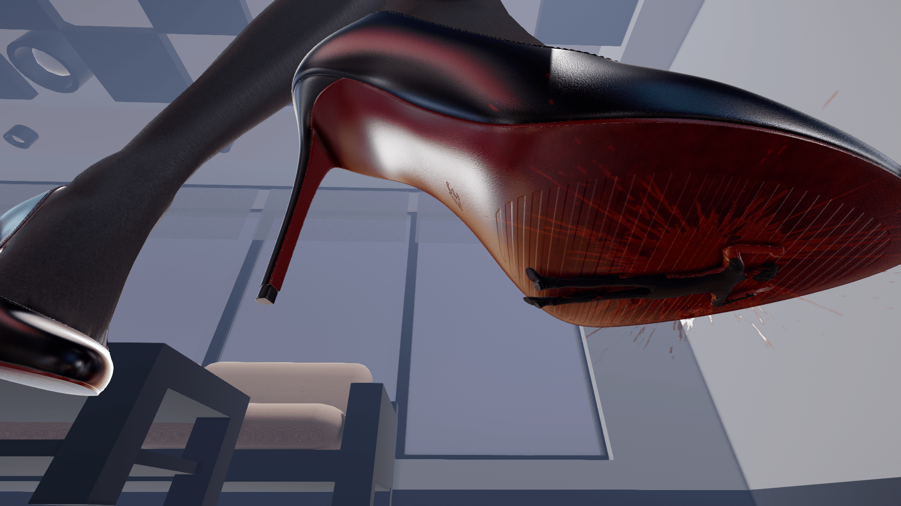

# MMD渲染

作者：d30111buff

TID：32147

# 1

沒關係一樣是紅色的不會有人發現。

<ignore_js_op>

**37.bmp** *(7.91 MB, 下載次數: 23)*

[下載附件](forum.php?mod=attachment&aid=OTI2NjF8NDRkNWRjYWF8MTY0NzcxMTIyM3wxODIzMHwzMjE0Nw%3D%3D&nothumb=yes)

2021-11-28 19:43 上傳

MMD 實驗犧牲者+1

製作鞋子

# 2

> [GA002 發表於 2021-11-29 09:41](https://giantessnight.cf/gnforum2012/forum.php?mod=redirect&goto=findpost&pid=486392&ptid=32147)

> 好欸，问一下楼主一直是用ｉｋ渲染吗，就比如说这张图

IK有用過，無奈當時不太會，現在是一直使用並研究RAY。

# 3

原來它應該要是影片呈現的，可是我總覺得時長不夠，且也沒找到特別中意的音源效果，只能以側斜角度來突出圖片，不然由正下方往上拍攝到面部的表情應該感覺更好。  

# 4

那不是屍體啦，只是壞壞…壞掉的番茄</ignore_js_op>