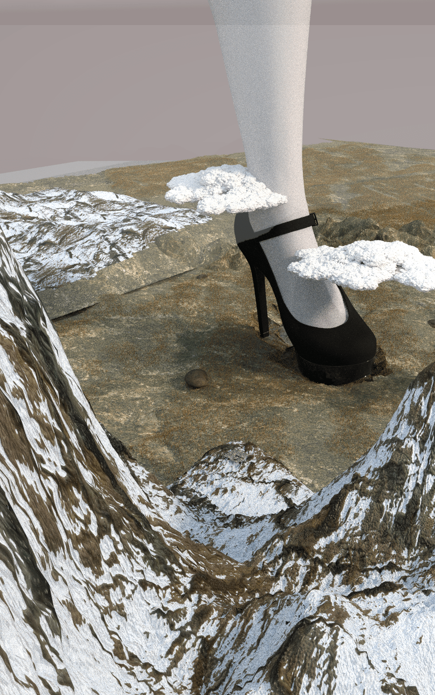
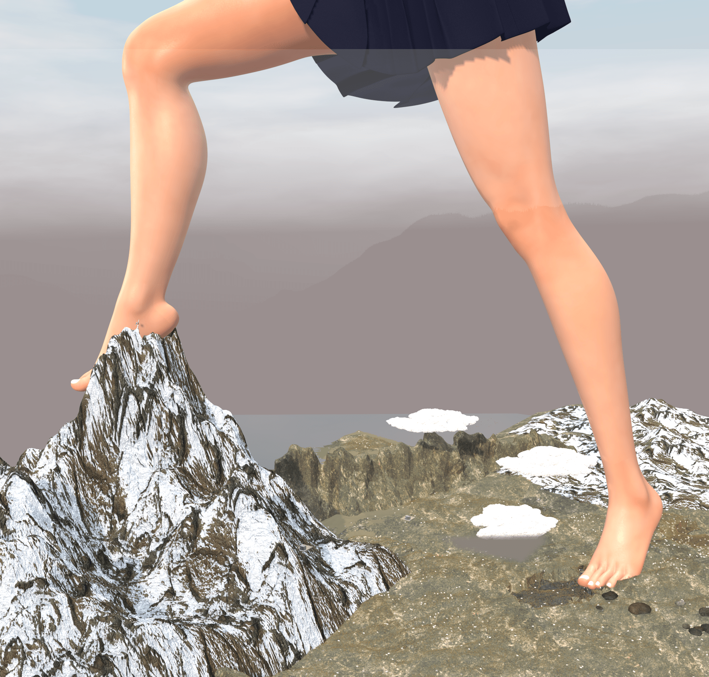
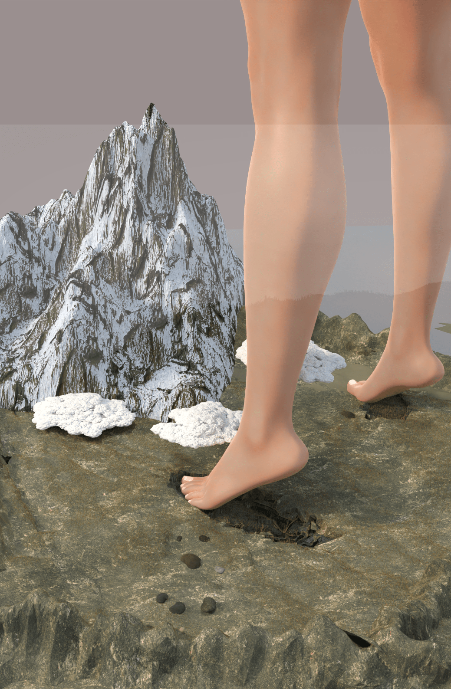

# giga少女和山脉

作者：wenjingzhi

TID：32825

# 1

给自己小说配图时顺便做的，有的图和原文没什么关系，就放到这里来了，希望大家喜欢。另外，还有两张图在原文那里。

# 2

<ignore_js_op>[高跟鞋.png](forum.php?mod=attachment&aid=OTQ0MTZ8YmI4ZmNmZDl8MTY0NzcxMDE3MXwxODIzMHwzMjgyNQ%3D%3D&nothumb=yes) *(3.12 MB, 下載次數: 7)*

[下載附件](forum.php?mod=attachment&aid=OTQ0MTZ8YmI4ZmNmZDl8MTY0NzcxMDE3MXwxODIzMHwzMjgyNQ%3D%3D&nothumb=yes)

2022-3-9 23:58 上傳  

</ignore_js_op> <ignore_js_op>[登山.png](forum.php?mod=attachment&aid=OTQ0MTd8MWYzNTI1YmF8MTY0NzcxMDE3MXwxODIzMHwzMjgyNQ%3D%3D&nothumb=yes) *(3.14 MB, 下載次數: 7)*

[下載附件](forum.php?mod=attachment&aid=OTQ0MTd8MWYzNTI1YmF8MTY0NzcxMDE3MXwxODIzMHwzMjgyNQ%3D%3D&nothumb=yes)

2022-3-9 23:58 上傳  

</ignore_js_op> <ignore_js_op>[3.png](forum.php?mod=attachment&aid=OTQ0MTh8ZGEyMzc3YmR8MTY0NzcxMDE3MXwxODIzMHwzMjgyNQ%3D%3D&nothumb=yes) *(2.58 MB, 下載次數: 6)*

[下載附件](forum.php?mod=attachment&aid=OTQ0MTh8ZGEyMzc3YmR8MTY0NzcxMDE3MXwxODIzMHwzMjgyNQ%3D%3D&nothumb=yes)

2022-3-9 23:58 上傳  

</ignore_js_op>  

# 3

> [juliazhu1978 發表於 2022-3-10 14:26](https://giantessnight.cf/gnforum2012/forum.php?mod=redirect&goto=findpost&pid=497121&ptid=32825)

> 感觉图1的噪点好重啊。。。。。。是错觉吗

这个图一是后面单做的，渲染比较低，再加上袜子材质，就这样了