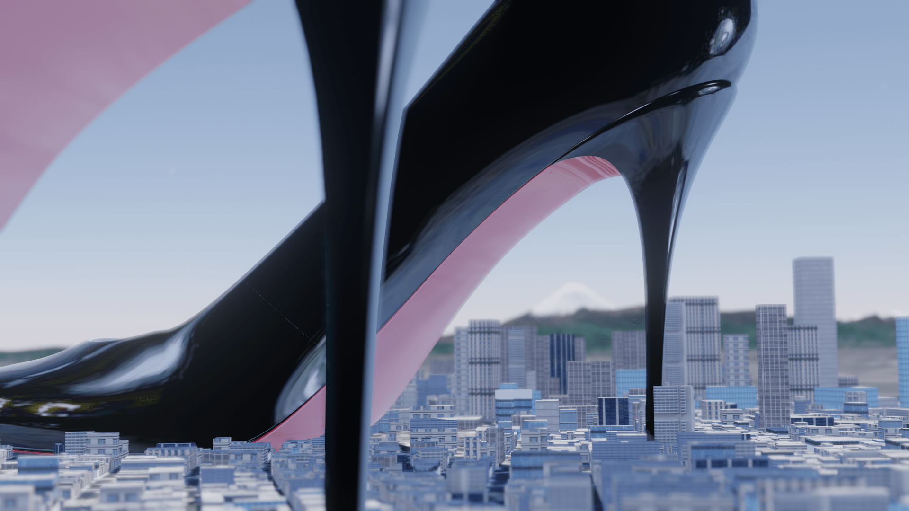
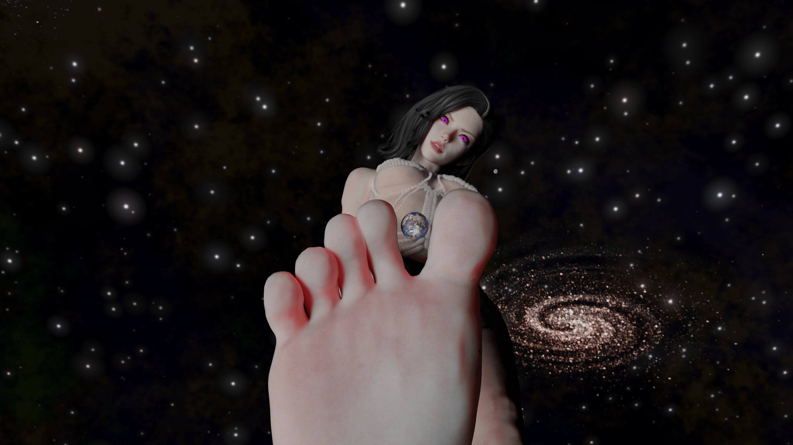
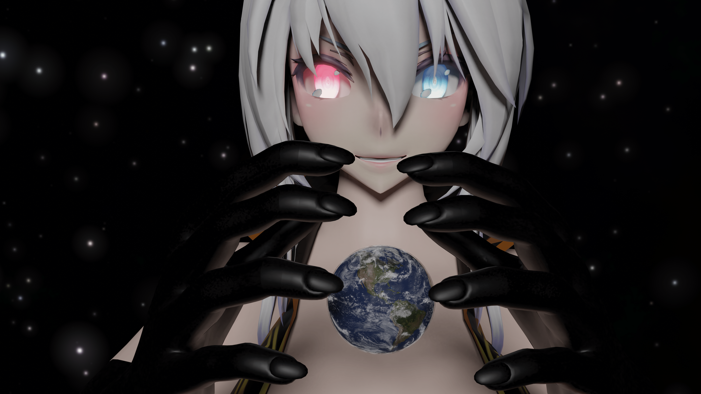
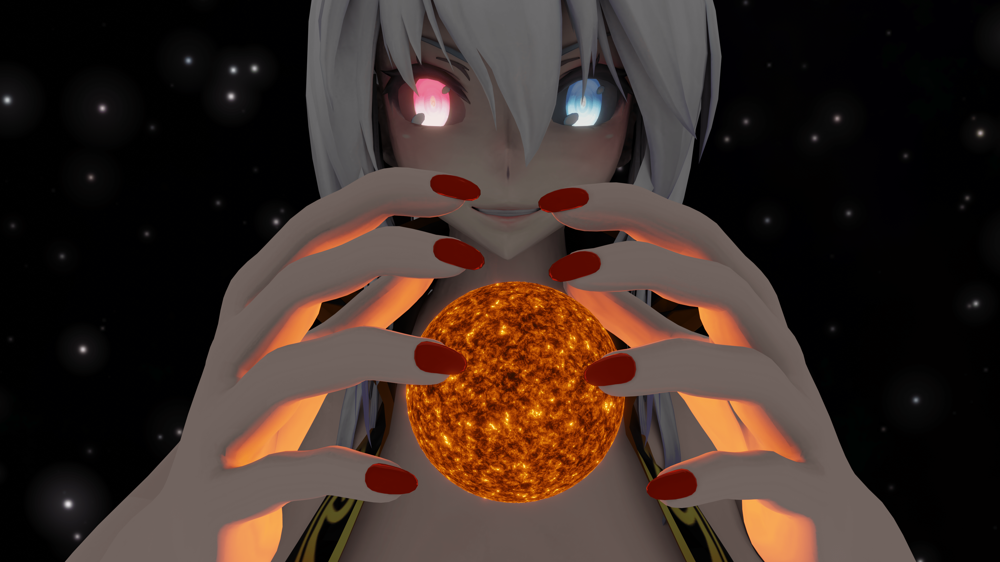
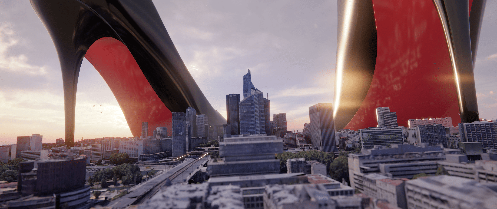

# 个人的散图图楼以及Q群宣传（10.12更新）

作者：mdzz233

TID：31738

# 1

*本帖最後由 mdzz233 於 2021-10-12 17:15 編輯*

呼鸭！这里是MDZZ233，我又来图片区了，这次打算建立我自己的图楼，把我之前和以后做的散图发在这里，方便大伙观看。请大伙多多回复鸭，我很需要你的反馈！如果有什么建议的，还请不吝赐教~

最后，我想宣传一下一个QQ群。这个群是我建立的一个交流群，旨在交流三维图像制作的技术和心得。

建这个群是考虑到可能有一些同好想要学习制作gts相关的三维图像，但奈何没有可以一起学习的朋友，遇到问题了不知该如何解决，百度或者谷歌也不一定得到解决方法；又或者磕磕碰碰地自学，想找个师傅却又不好找；亦或者想分享一下作品，快速得到建议和反馈（gn的图像制作交流板块很少人）……种种原因，我们的同好学着学着就动力大减，甚至是放弃。

基于以上原因，我想搞这块领域，让想加入三维图像制作的同好少走弯路，让大佬们得到更快更好的反馈。

如果您感兴趣的话，可以私聊我要群号，欢迎各位加入。同时我在这里先说明，此群不是资源群，而是交流群，单纯想拿资源的还请另找他群。

PS：不限软件，使用Maya，houdini，blender，daz，3dmax，MMD等软件的都可以加入，sizebox，hs2也很欢迎。总之，3d相关的都可。

# 2

那么，二楼开始就是图楼啦！

2021.9.24  11:25

美车配美人，兰博基尼毒刺与二倍大小的巨大娘

# 3

<ignore_js_op>[1(2).png](forum.php?mod=attachment&aid=OTE0MDh8OTU0MTNlY2R8MTY0NzcxMTEwMHwxODIzMHwzMTczOA%3D%3D&nothumb=yes) *(4.49 MB, 下載次數: 15)*

[下載附件](forum.php?mod=attachment&aid=OTE0MDh8OTU0MTNlY2R8MTY0NzcxMTEwMHwxODIzMHwzMTczOA%3D%3D&nothumb=yes)

2021-9-24 11:29 上傳  

[.png")](javascript:;)</ignore_js_op>  

# 4

*本帖最後由 mdzz233 於 2021-9-24 12:08 編輯*

2021.9.24 12:03

烈日当空，仁慈的女神为了给小人一个遮蔽太阳的地方，她把她的高跟鞋放在了城市当中

# 5

<ignore_js_op>[shoe.png](forum.php?mod=attachment&aid=OTE0MDl8NjYxMjMzYjF8MTY0NzcxMTEwMHwxODIzMHwzMTczOA%3D%3D&nothumb=yes) *(1.79 MB, 下載次數: 23)*

[下載附件](forum.php?mod=attachment&aid=OTE0MDl8NjYxMjMzYjF8MTY0NzcxMTEwMHwxODIzMHwzMTczOA%3D%3D&nothumb=yes)

2021-9-24 12:05 上傳  

</ignore_js_op>  

# 6

2021.9.24  18：55

关键词：地球，脚趾缝，女神

# 7

<ignore_js_op>[7x.png](forum.php?mod=attachment&aid=OTE0MTF8YzM0MTViYTJ8MTY0NzcxMTEwMHwxODIzMHwzMTczOA%3D%3D&nothumb=yes) *(4.17 MB, 下載次數: 6)*

[下載附件](forum.php?mod=attachment&aid=OTE0MTF8YzM0MTViYTJ8MTY0NzcxMTEwMHwxODIzMHwzMTczOA%3D%3D&nothumb=yes)

2021-9-24 18:54 上傳  

</ignore_js_op>  

# 8

2021.9.26  23:52

邪恶琳女神（bushi），一时兴起给琳姐做的图[@琳姐](https://giantessnight.cf/gnforum2012/home.php?mod=space&uid=23500)

# 9

<ignore_js_op>[earth.png](forum.php?mod=attachment&aid=OTE0NjR8NGQwODU2MzV8MTY0NzcxMTEwMHwxODIzMHwzMTczOA%3D%3D&nothumb=yes) *(5.74 MB, 下載次數: 12)*

[下載附件](forum.php?mod=attachment&aid=OTE0NjR8NGQwODU2MzV8MTY0NzcxMTEwMHwxODIzMHwzMTczOA%3D%3D&nothumb=yes)

2021-9-26 23:58 上傳  

</ignore_js_op>  

# 10

2021.9.27  12：21

邪恶琳姐姐，第二弹

# 11

<ignore_js_op>[sun.png](forum.php?mod=attachment&aid=OTE0NzJ8MTNhYWU5MGR8MTY0NzcxMTEwMHwxODIzMHwzMTczOA%3D%3D&nothumb=yes) *(7.81 MB, 下載次數: 9)*

[下載附件](forum.php?mod=attachment&aid=OTE0NzJ8MTNhYWU5MGR8MTY0NzcxMTEwMHwxODIzMHwzMTczOA%3D%3D&nothumb=yes)

2021-9-27 12:21 上傳  

</ignore_js_op>  

# 12

2021.9.27  13:49

邪恶琳姐姐，第三弹

主要是把手套去掉，指甲油也涂上了（bushi），还提高了AO的值，看得更清楚一些

# 13

<ignore_js_op>[sun1.png](forum.php?mod=attachment&aid=OTE0NzN8ODFhNjJhOTV8MTY0NzcxMTEwMHwxODIzMHwzMTczOA%3D%3D&nothumb=yes) *(6.17 MB, 下載次數: 0)*

[下載附件](forum.php?mod=attachment&aid=OTE0NzN8ODFhNjJhOTV8MTY0NzcxMTEwMHwxODIzMHwzMTczOA%3D%3D&nothumb=yes)

2021-9-27 13:50 上傳  

</ignore_js_op>  

# 14

更新了这次是使用了琳姐给的模型中的高跟鞋，城市模型用的是playgrounds的模型

最近学习了如何做有宏伟规模感的场景，我感觉那些技巧和原则很适合做巨大娘相关的作品

老规矩，可以去我pivix上获取最佳品质的图像

# 15

<ignore_js_op>[123xx.jpg](forum.php?mod=attachment&aid=OTE3MTd8MjNmODBjYzl8MTY0NzcxMTEwMHwxODIzMHwzMTczOA%3D%3D&nothumb=yes) *(769.16 KB, 下載次數: 1)*

[下載附件](forum.php?mod=attachment&aid=OTE3MTd8MjNmODBjYzl8MTY0NzcxMTEwMHwxODIzMHwzMTczOA%3D%3D&nothumb=yes)

2021-10-12 17:14 上傳  

</ignore_js_op>