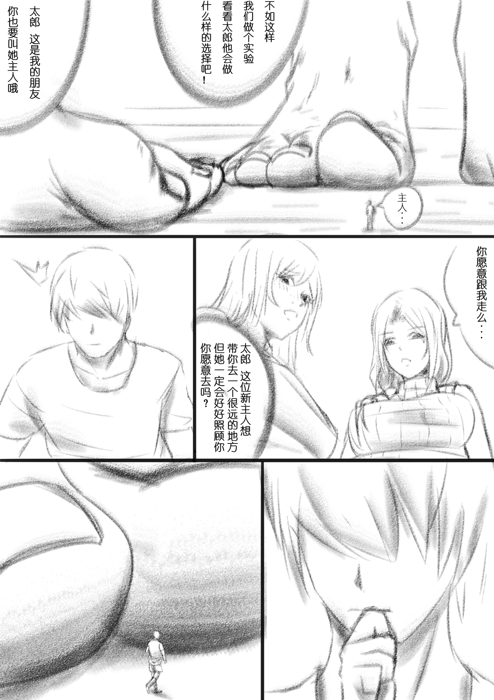
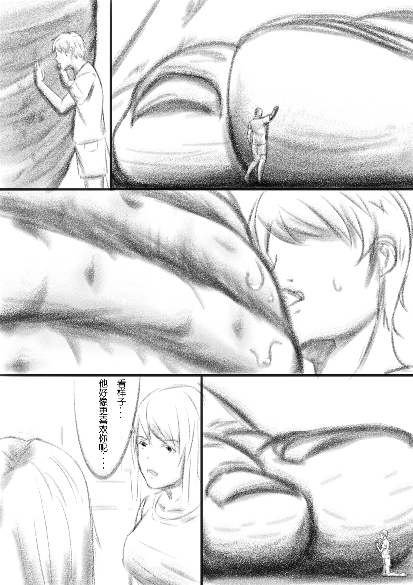

# 人的价值 母系if版

作者：GhostButterfly

TID：30050

# 1

**看到abc11 的那个文章有感，就随便摸了个鱼，这货居然不选择妈妈真是弱爆了.jpg**

不过话说回来，喜欢母系的人我一直以为没几个......但是最近看了两个文的评论，好像喜欢母系的人还不少......不知道是不是我的错觉

<ignore_js_op>

**2021.1.3.png** *(1.34 MB, 下載次數: 48)*

[下載附件](forum.php?mod=attachment&aid=ODY2NzF8MmQxYjZkOTd8MTY0NzcxMjE5MXwxODIzMHwzMDA1MA%3D%3D&nothumb=yes)

2021-1-3 18:28 上傳

<ignore_js_op>

**2021.1.4.png** *(1.77 MB, 下載次數: 57)*

[下載附件](forum.php?mod=attachment&aid=ODY2NzJ8MzlkOGQ3Nzl8MTY0NzcxMjE5MXwxODIzMHwzMDA1MA%3D%3D&nothumb=yes)

2021-1-3 18:28 上傳

# 2

> [vvawd234567 發表於 2021-1-5 14:04](https://giantessnight.cf/gnforum2012/forum.php?mod=redirect&goto=findpost&pid=455867&ptid=30050)

> 其实母系对我来说...只要不让我写，我一般不会联系到我妈...所以光是看的话，不是老阿姨，我都行 ...

一般来说都是主角的妈妈啊.......又不是三次元自己的妈妈

# 3

> [vvawd234567 發表於 2021-1-5 14:38](https://giantessnight.cf/gnforum2012/forum.php?mod=redirect&goto=findpost&pid=455873&ptid=30050)

> 但是写的时候就容易胡乱联想然后就接受不能了啊

啊这 那就像本子里面的继母或者女朋友的妈妈，感觉大部分人这个还是可以接受的。我个人其实是是年上人妻啥的都还可以，只不过更喜欢母系而已......</ignore_js_op></ignore_js_op>