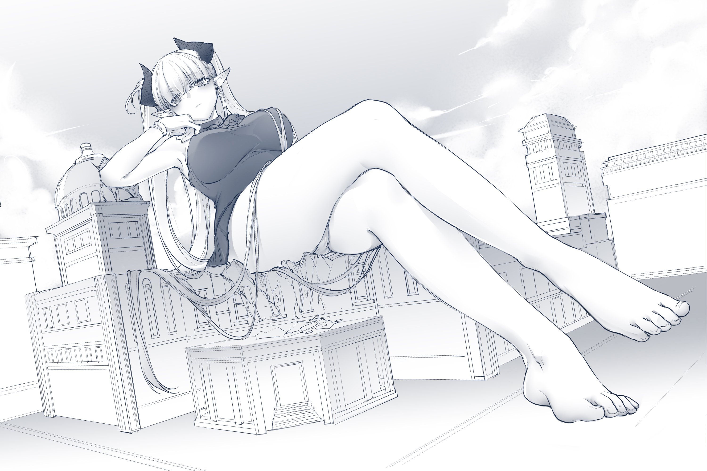
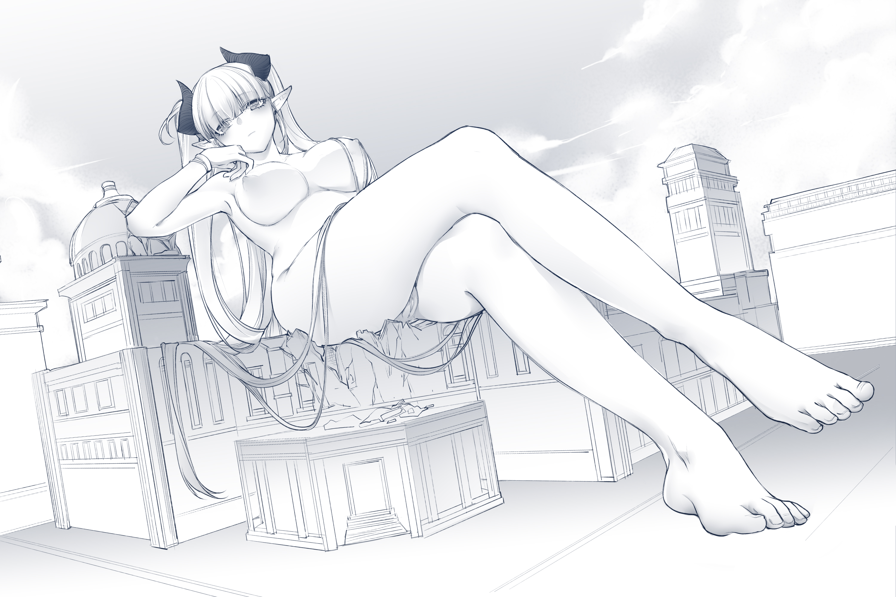

# 更新艾尼·卡莲娜人设，画师——@ahri

作者：Arik

TID：32473

# 1

*本帖最後由 Arik 於 2022-3-18 20:18 編輯*

本来没想到这么快，以为要画很久，对我来说也算是一个惊喜了。

人设是参赛文中的薇尔莎·伊德海拉，卡莲娜以及众多角色的亲妈（误）

至于那个头戴纸袋还能喝酒的A先生请不要在意，毕竟是靠在薇尔莎的jio上都只顾着喝酒的家伙（为什么不去舔！）

顺便一提，薇尔莎看的书大概是阿卜杜拉所著的死灵之书，算是夹带私货了hh

原文链接如下：[https://giantessnight.com/gnforu ... iewthread&tid=32126](https://giantessnight.com/gnforum2012/forum.php?mod=viewthread&tid=32126)

估计是完结不了了，但是即使文赛结束也会慢慢填坑。

感谢混沌呆呆兽的画作让我又燃起了创作欲，也请大家多多关注。

[@ahri](https://giantessnight.cf/gnforum2012/home.php?mod=space&uid=33117)

蓝鸟主页：[https://mobile.twitter.com/liu98396134](https://mobile.twitter.com/liu98396134)

P站主页：[https://www.pixiv.net/artworks/95713801](https://www.pixiv.net/artworks/95713801)

也请支持呆呆的亲女儿狐狸，还有个清秀蘑菇。

新的一年加油。

感谢呆呆兽再次为卡莲娜画了图，回想起当时写文的时候完全没有想过一定要写出什么名头来，只想着把这个故事尽量讲好，把创作欲一股脑的抒发出来，毕竟在刚入圈的时候最让我眼前一亮的还是但大的dgu，给年幼的我造成了极大的心灵冲击（正面意义），所以现在写东西总会借鉴些但大的行文和叙事，尽管都是些拙劣的模仿，但过程还是蛮开心的。

但不得不说的是，我对《立于骸山，直面诸神》也确实很不满意，本来有机会让卡莲娜和莱斯特的形象更加丰富，让故事剧情更加动人，可最后还是颇有些烂尾的味道。

不过，过去了就过去了，就像我在结尾写的一样，我不会再狗尾续貂，一个故事讲完了就是讲完了，感谢喜欢这篇文章的圈友们，感谢Vicky的灵感提供，让我得以迈出写作的重要一步。

也希望混沌呆呆兽的考试成功，好运连连，希望圈友们都能找到属于自己的“巨大娘”

原文链接如下：[https://giantessnight.com/gnforu ... id=28826&extra=](https://giantessnight.com/gnforum2012/forum.php?mod=viewthread&tid=28826&extra=)

# 2

<ignore_js_op>[-2347108f0410c6c3.jpg](forum.php?mod=attachment&aid=OTMzOTl8OGJhMDM2MjV8MTY0NzcwNzE3OXwxODIzMHwzMjQ3Mw%3D%3D&nothumb=yes) *(112.17 KB, 下載次數: 6)*

[下載附件](forum.php?mod=attachment&aid=OTMzOTl8OGJhMDM2MjV8MTY0NzcwNzE3OXwxODIzMHwzMjQ3Mw%3D%3D&nothumb=yes)

2022-1-23 15:48 上傳  

</ignore_js_op> <ignore_js_op>[4016199ec89e45a1.jpg](forum.php?mod=attachment&aid=OTMzOTh8ZWIyMTI4NTd8MTY0NzcwNzE3OXwxODIzMHwzMjQ3Mw%3D%3D&nothumb=yes) *(127.21 KB, 下載次數: 3)*

[下載附件](forum.php?mod=attachment&aid=OTMzOTh8ZWIyMTI4NTd8MTY0NzcwNzE3OXwxODIzMHwzMjQ3Mw%3D%3D&nothumb=yes)

2022-1-23 15:48 上傳  

</ignore_js_op> <ignore_js_op>[7b4bd72cda5d4653.jpg](forum.php?mod=attachment&aid=OTQ2MTR8ZmMxMTI1NDd8MTY0NzcwNzE3OXwxODIzMHwzMjQ3Mw%3D%3D&nothumb=yes) *(2.34 MB, 下載次數: 0)*

[下載附件](forum.php?mod=attachment&aid=OTQ2MTR8ZmMxMTI1NDd8MTY0NzcwNzE3OXwxODIzMHwzMjQ3Mw%3D%3D&nothumb=yes)

前天 19:49 上傳  

王都之上

</ignore_js_op>  <ignore_js_op>[4de9a114f9f88f9e.jpg](forum.php?mod=attachment&aid=OTQ2MTN8YmVkZjU2YTJ8MTY0NzcwNzE3OXwxODIzMHwzMjQ3Mw%3D%3D&nothumb=yes) *(2.3 MB, 下載次數: 4)*

[下載附件](forum.php?mod=attachment&aid=OTQ2MTN8YmVkZjU2YTJ8MTY0NzcwNzE3OXwxODIzMHwzMjQ3Mw%3D%3D&nothumb=yes)

前天 19:49 上傳  

王都之上

</ignore_js_op>  

# 3

3.18日更新

一直在忙就没想起来，其实呆呆兽很早就画完了，呜呜呜