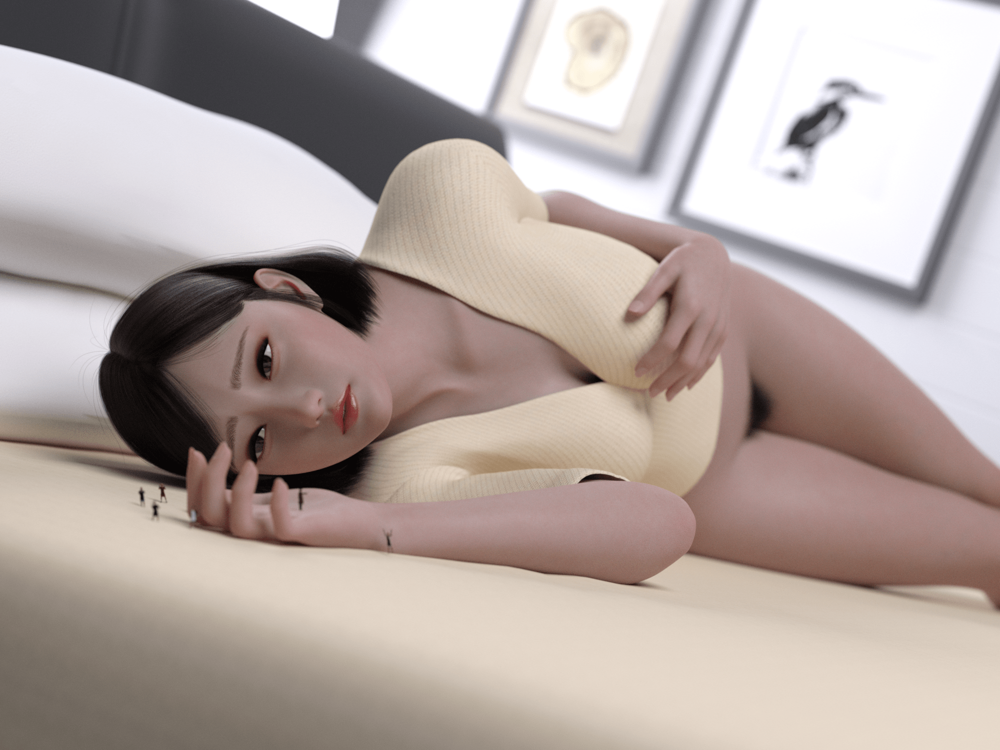
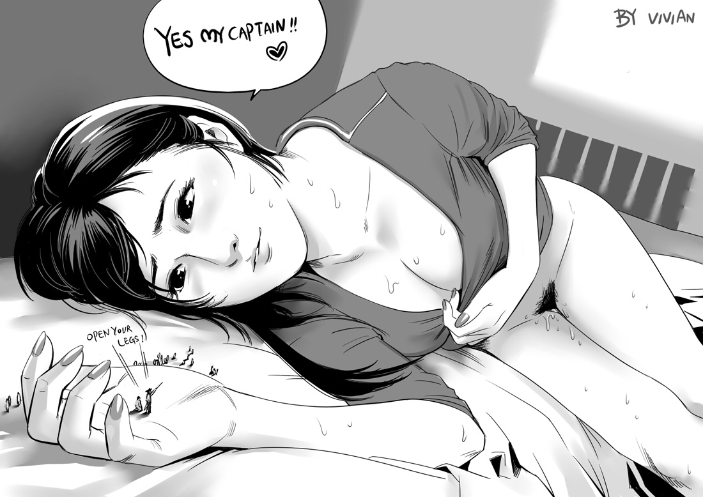

# 纪念V姐所做（单图）

作者：nhbnfn

TID：31391

# 1

<ignore_js_op>

**vivian-1.png** *(3.66 MB, 下載次數: 10)*

[下載附件](forum.php?mod=attachment&aid=OTAwODZ8NTE4ZDk4OTZ8MTY0NzcxMjIyNXwxODIzMHwzMTM5MQ%3D%3D&nothumb=yes)

2021-8-2 08:27 上傳

<ignore_js_op>

**the girl.jpg** *(212.02 KB, 下載次數: 6)*

[下載附件](forum.php?mod=attachment&aid=OTAwODd8Y2M3ZmNkZmN8MTY0NzcxMjIyNXwxODIzMHwzMTM5MQ%3D%3D&nothumb=yes)

2021-8-2 08:28 上傳

V姐是很多人的启蒙导师，我也感到很荣幸忝列其中。她的作品经久不衰，几年前的画风现在看来依然极佳，草图也极富细节。

自从开始作图就有了这样的想法，终于可以付诸实践了。 实属班门弄斧，献丑了。

# 2

> [jimqiu1986 發表於 2021-8-2 19:25](https://giantessnight.cf/gnforum2012/forum.php?mod=redirect&goto=findpost&pid=475445&ptid=31391)

> 建模很好，头部的比例稍微有点小

谢谢您的指导。个人认为是相机的位置没有调整好，导致整个图看着拉远了。

# 3

> [747417 發表於 2021-8-3 08:49](https://giantessnight.cf/gnforum2012/forum.php?mod=redirect&goto=findpost&pid=475485&ptid=31391)

> 这组图片 也是daz做的吗建模很好看

是daz所做，谢谢您的回复。模型角色尽量找了符合大众美的女性。

# 4

> [咕咕的攸栗 發表於 2021-8-3 10:09](https://giantessnight.cf/gnforum2012/forum.php?mod=redirect&goto=findpost&pid=475490&ptid=31391)

> 不知道为什么，我感觉黑白的原画反而比建模的人物更有感觉

确实如此。建模挺难完全还原一幅黑白画作，进而增添了许多不确定因素，加上拍摄角度，光线等原因，所以看着还是原画更舒服一些。

# 5

> [大理三道茶 發表於 2021-8-3 20:13](https://giantessnight.cf/gnforum2012/forum.php?mod=redirect&goto=findpost&pid=475521&ptid=31391)

> V姐  我心目中的女巨人

谢谢，她同样是很多人内心的女神。</ignore_js_op></ignore_js_op>