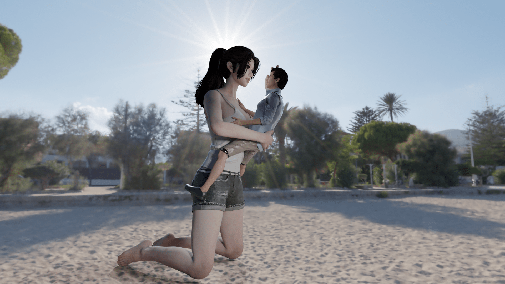
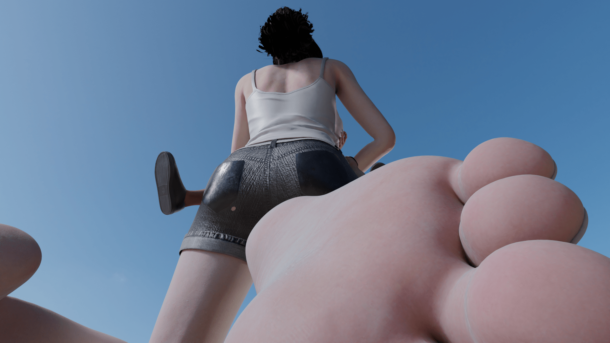
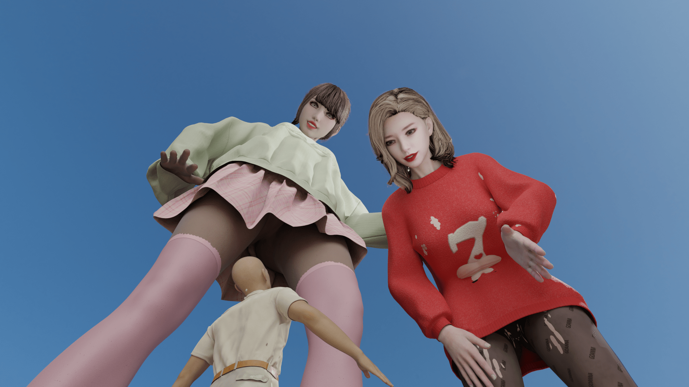

# 萌新blender作图，持续更新

作者：wcx20020529

TID：31792

# 1

最近开始尝试使用Blender作图，hs2弃坑了，还在不断摸索，先发几张图试水。  

# 2

<ignore_js_op>[2.png](forum.php?mod=attachment&aid=OTE1OTN8NDc1ZTI2NWZ8MTY0NzcxMTkxOXwxODIzMHwzMTc5Mg%3D%3D&nothumb=yes) *(2.65 MB, 下載次數: 1)*

[下載附件](forum.php?mod=attachment&aid=OTE1OTN8NDc1ZTI2NWZ8MTY0NzcxMTkxOXwxODIzMHwzMTc5Mg%3D%3D&nothumb=yes)

2021-10-5 19:19 上傳  

</ignore_js_op> <ignore_js_op>[1.png](forum.php?mod=attachment&aid=OTE1OTR8N2YxZjBkNmJ8MTY0NzcxMTkxOXwxODIzMHwzMTc5Mg%3D%3D&nothumb=yes) *(2.48 MB, 下載次數: 4)*

[下載附件](forum.php?mod=attachment&aid=OTE1OTR8N2YxZjBkNmJ8MTY0NzcxMTkxOXwxODIzMHwzMTc5Mg%3D%3D&nothumb=yes)

2021-10-5 19:20 上傳  

</ignore_js_op> <ignore_js_op>[3.png](forum.php?mod=attachment&aid=OTE1OTV8OTdhNDBhNzJ8MTY0NzcxMTkxOXwxODIzMHwzMTc5Mg%3D%3D&nothumb=yes) *(2.63 MB, 下載次數: 2)*

[下載附件](forum.php?mod=attachment&aid=OTE1OTV8OTdhNDBhNzJ8MTY0NzcxMTkxOXwxODIzMHwzMTc5Mg%3D%3D&nothumb=yes)

2021-10-5 19:20 上傳  

</ignore_js_op>  

# 3

> (别）看我的 發表於 2021-10-5 20:13

> 另外第三章的左邊的女孩 視覺好像不對勁 好像在看其他東西一樣

嗯嗯，那个模型的眼镜瞳孔颜色太浅了，所以看起来很怪异  

# 4

谢谢大家提出的建议做了一些调整

# 5

<ignore_js_op>[unz座.2png.png](forum.php?mod=attachment&aid=OTE2MTB8MWI2YzUwYTF8MTY0NzcxMTkxOXwxODIzMHwzMTc5Mg%3D%3D&nothumb=yes) *(3.11 MB, 下載次數: 0)*

[下載附件](forum.php?mod=attachment&aid=OTE2MTB8MWI2YzUwYTF8MTY0NzcxMTkxOXwxODIzMHwzMTc5Mg%3D%3D&nothumb=yes)

2021-10-7 12:51 上傳  

</ignore_js_op>  

# 6

> 3213213210 發表於 2021-10-9 10:37

> 1.手指不要偷懶，手勢給出的肢體語言跟四肢有的比，跟表情一樣是決定人物生動程度的關鍵

> 

> 2.背景太亮了， ...

受教了，会慢慢学习的????????????????????  

# 7

> 十一= 發表於 2021-10-9 12:53

> 更好看了，支持楼主！！！！！！！！！

谢谢支持！！！(இωஇ )(இωஇ )(இωஇ