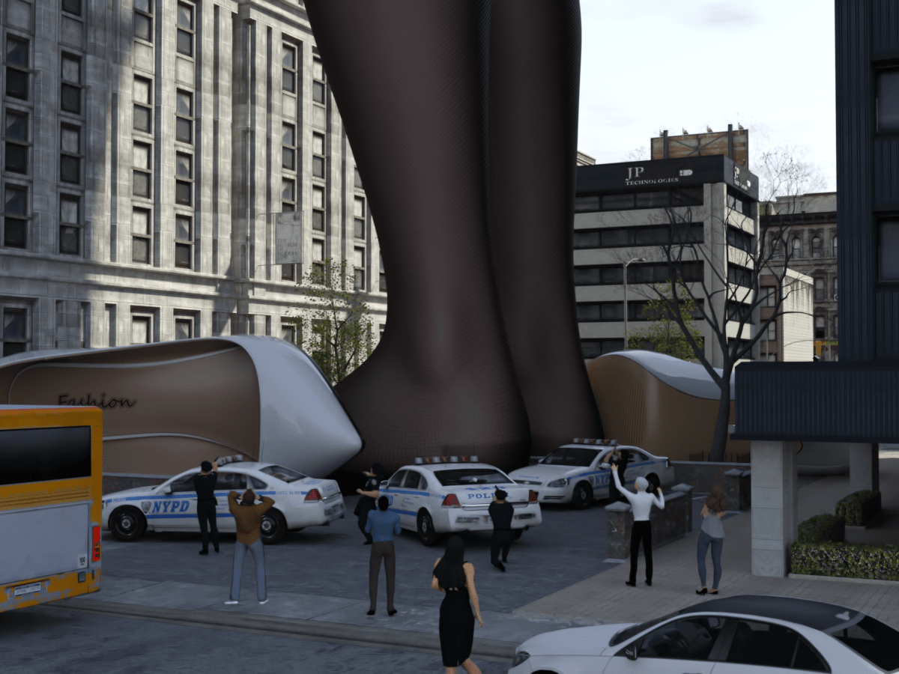

# 近期渲染图片&新年贺图

作者：nhbnfn

TID：32572

# 1

近些时候的作品和新年贺图。。看个乐呵就行，新年开心快乐就完事了 <ignore_js_op>

**streetgrowing.png** *(3.59 MB, 下載次數: 10)*

[下載附件](forum.php?mod=attachment&aid=OTM1ODJ8NjljNDRiODh8MTY0NzcxMDYzNHwxODIzMHwzMjU3Mg%3D%3D&nothumb=yes)

上学路上的巨大化

2022-2-3 20:45 上傳

<ignore_js_op>

**outgrowing.png** *(5.66 MB, 下載次數: 9)*

[下載附件](forum.php?mod=attachment&aid=OTM1ODF8YTFlOTY3NGN8MTY0NzcxMDYzNHwxODIzMHwzMjU3Mg%3D%3D&nothumb=yes)

巨大化2

2022-2-3 20:45 上傳

<ignore_js_op>

**hetu1.png** *(3.2 MB, 下載次數: 7)*

[下載附件](forum.php?mod=attachment&aid=OTM1Nzd8NjdkYmY2ZDd8MTY0NzcxMDYzNHwxODIzMHwzMjU3Mg%3D%3D&nothumb=yes)

春节贺图

2022-2-3 20:45 上傳

<ignore_js_op>

**OL-1.png** *(1.05 MB, 下載次數: 5)*

[下載附件](forum.php?mod=attachment&aid=OTM1Nzh8OGZlODcxYmN8MTY0NzcxMDYzNHwxODIzMHwzMjU3Mg%3D%3D&nothumb=yes)

OL在小人城市1

2022-2-3 20:45 上傳

<ignore_js_op>

**OL-2.png** *(1.26 MB, 下載次數: 3)*

[下載附件](forum.php?mod=attachment&aid=OTM1Nzl8Yjk1ZWI2OTh8MTY0NzcxMDYzNHwxODIzMHwzMjU3Mg%3D%3D&nothumb=yes)

OL第二张

2022-2-3 20:45 上傳

<ignore_js_op>

**OL-3.png** *(1.24 MB, 下載次數: 6)*

[下載附件](forum.php?mod=attachment&aid=OTM1ODB8MGFlNjdmNjV8MTY0NzcxMDYzNHwxODIzMHwzMjU3Mg%3D%3D&nothumb=yes)

OL第三张

2022-2-3 20:45 上傳

# 2

> [coolyangzc 發表於 2022-2-3 22:44](https://giantessnight.cf/gnforum2012/forum.php?mod=redirect&goto=findpost&pid=493095&ptid=32572)

> 在推和DA上都关注大佬惹，高质量东方[大]美女真不戳~

谢谢谢谢，非常感谢关注XD，高质量还真算不上，也就是普通作图，感谢支持！

# 3

> [Carweirdo 發表於 2022-2-3 22:54](https://giantessnight.cf/gnforum2012/forum.php?mod=redirect&goto=findpost&pid=493096&ptid=32572)

> 渲染的很性感孩子很喜欢，也祝楼主新年快乐！

谢谢谢谢，喜欢看的开心就好，水平实在有限，做图难免有局限，还望各位看官海涵。

# 4

> [libido 發表於 2022-2-4 00:23](https://giantessnight.cf/gnforum2012/forum.php?mod=redirect&goto=findpost&pid=493109&ptid=32572)

> 新年快乐，图片太戳了

> 好久不见楼主，原来是主战da，已经关注了

啊 是大佬 感谢大佬的点评！确实是好久没发帖，主要还是平常没有空做图，一直都在论坛潜水看文，不怎么活跃XD

# 5

> [wwwnwy 發表於 2022-2-4 02:18](https://giantessnight.cf/gnforum2012/forum.php?mod=redirect&goto=findpost&pid=493137&ptid=32572)

> 非常不错 3D妹子的给人的感官非常好！新年快乐~

感谢您的评论和鼓励！同乐同乐！

# 6

> [cloverone 發表於 2022-2-4 08:59](https://giantessnight.cf/gnforum2012/forum.php?mod=redirect&goto=findpost&pid=493148&ptid=32572)

> 已关注~请问是用Blender制作的吗，能介绍一下你平时使用的工具吗，比如用了什么插件和材质包之类的，想入坑 ...

感谢回复！那我详细说一下吧。使用的制作软件是DAZ3D，目前来说最基础也最容易上手的3D制作软件(相较于c4d和blender来说)，图片制作完成后偶尔用一点ps来降噪处理(ps还是建议学的，技多不压身，ps做得好很多东西都可以实现)

gn内有很多用DAZ3d制图的大佬( k佬和蘑茹茹大佬)，我也是看了他们的作品之后才萌生了学习daz的想法，目前到现在还是处于一般水平的创作状态，还在学习当中。

插件和材质方面一般不需要特别去找，玩daz的一大乐趣在于不停收集可以制图的素材，比如好看的人物，发型，服装，环境等，看着自己的素材库逐渐变得充实确实非常有成就感。毕竟不是c4d或者blender需要找材质，daz素材里面自己就有texture，直接双击就都有了，比较方便。

入坑的话建议在b站上搜索一些基础教程，比如RoboNeko大佬的一系列教学视频，对于新人非常有帮助。一蹴而就是不现实的，好的图都需要自己慢慢琢磨和构造，经过不断调整和修改才能更符合预期。总而言之，这是一个比较漫长的过程，需要不断学习和慢慢钻研。

# 7

> [chuilaba1122 發表於 2022-2-4 09:59](https://giantessnight.cf/gnforum2012/forum.php?mod=redirect&goto=findpost&pid=493151&ptid=32572)

> 图六也太有感觉了吧爱了爱了！！！

谢谢谢谢，图六也是我比较喜欢的一张，但做出第一张之后我就比较喜欢图一了

# 8

> [尼玛s 發表於 2022-2-4 12:54](https://giantessnight.cf/gnforum2012/forum.php?mod=redirect&goto=findpost&pid=493163&ptid=32572)

> 真不错啊，黑丝太棒了！！                                                                             ...

非常感谢！！本身也是黑白丝控 当然要做些符合xp的图  

# 9

> [里海漂流瓶 發表於 2022-2-4 13:10](https://giantessnight.cf/gnforum2012/forum.php?mod=redirect&goto=findpost&pid=493168&ptid=32572)

> 哇楼主做得太好看了，感谢楼主还有无数辛勤付出的大佬！

非常感谢！！谢谢！好看就行！

# 10

> [geyifan 發表於 2022-2-4 22:10](https://giantessnight.cf/gnforum2012/forum.php?mod=redirect&goto=findpost&pid=493227&ptid=32572)

> 一颗新星正在冉冉升起，好像见到了一个大佬的崛起，这黑丝脚，好想舔

感谢回复！谢谢您能喜欢 XD，黑丝reoreoreo</ignore_js_op></ignore_js_op></ignore_js_op></ignore_js_op></ignore_js_op></ignore_js_op>